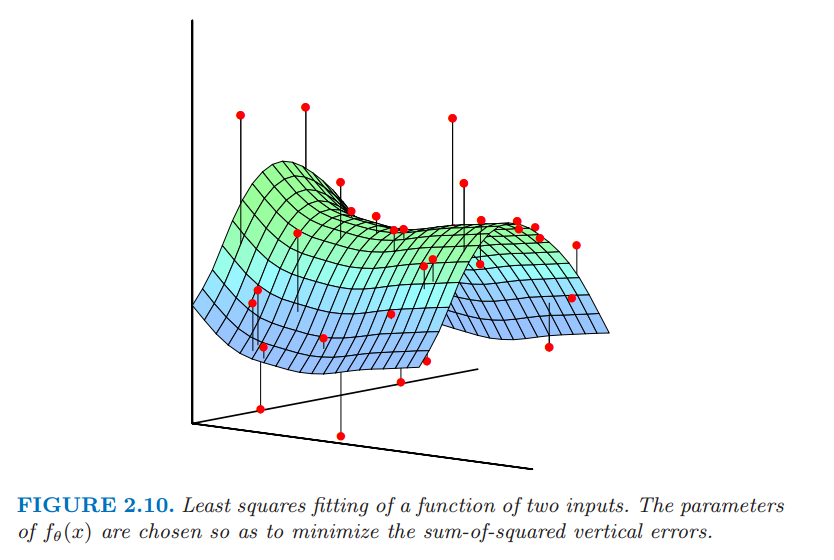

# 2.6 统计模型，监督学习和函数逼近

原文     | [The Elements of Statistical Learning](../book/The Elements of Statistical Learning.pdf)
      ---|---
翻译     | szcf-weiya
时间     | 2016-08-01
更新 | 2018-02-14
状态 | Done

我们的目标是寻找函数 $f(x)$ 的一个有用的近似 $\hat{f}(x)$，函数 $f(x)$ 蕴含着输入与输出之间的预测关系。在前面统计判别理论的章节的理论准备中，对于定量的响应，我们看到平方误差损失引导我们得到了回归函数 $f(X)=\E(Y\mid X=x)$。最近邻方法的类别可以看成是对条件期望的直接估计，但是我们可以看到至少在两个方面它们不起作用

- 如果输入空间的维数高，则最近邻不必离目标点近，而且可能导致大的误差
- 如果知道存在特殊的结构，可以用来降低估计的偏差与方差。

我们预先用了关于 $f(X)$ 的其它类别的模型，在很多情形下是为了解决维数问题而特别设计的，现在我们讨论把它们合并进去一个预测问题的框架。

## 联合分布 $\Pr(X,Y)$ 的统计模型

假设事实上我们的数据是从统计模型

$$
Y=f(X)+\epsilon\tag{2.29}
$$

中产生的,其中随机误差 $\epsilon$ 有 $E(\epsilon)=0$ 且与 $X$ 独立。注意到这个模型 $f(x)=\E(Y\mid X=x)$，而且事实上条件分布$\Pr(Y\mid X)$ 只有通过条件均值 $f(X)$ 才依赖于 $X$

可加误差模型是一个对真实情况的有用近似。对于大多数系统输入输出对 $(X,Y)$ 没有一个确定的关系 $Y=f(X)$。一般地，存在不可测量的变量对 $Y$ 起作用，包括测量误差。可加模型假设我们可以通过误差 $\epsilon$ 从确定关系中捕捉所有的偏移量。

对于这些问题一个确定的关系确实存在。许多在机器学习中学习的分类问题都是这个形式，其中，响应表面可以认为是定义在 $\IR^p$ 的彩色地图。这些训练数据包括从图 $\\{x_i,g_i\\}$ 的彩色样本，目标是对每一点着色。这里函数是确定的，并且随机量进入到训练数据的 $x$ 处。现在我们不去追究这个问题，但是会看到这个可以通过合适的基于误差的模型技巧解决。

在式 $(2.29)$ 的假设中误差是独立同分布不是严格必要的，但是当我们在EPE准则下对均匀分布的平方误差进行平均时似乎出现在我们脑海后面。对于这样的一个模型，用最小二乘作为模型估计的数据准则变得很自然正如在式 $(2.1)$ 一样。一些简单的修改可以避免独立性的假设；举个例子，我们有 $\Var(Y\mid X=x)=\sigma(x)$，并且均值和方差都依赖于 $X$。一般地，条件分布 $\Pr(Y\mid X)$ 可以以复杂的方式依赖 $X$，但是可加误差模型排除了这些。

至今为止我们集中考虑定量的响应变量。可加误差模型一般不用于定性的输出 $G$；这种情形下目标函数 $p(X)$ 是条件密度 $\Pr(G\mid X)$，这是直接建模的。举个例子，对于两个类别的数据，假设数据来自独立的二元试验总是合理的，特定的一个输出的概率是 $p(X)$，另一个为 $1-p(X)$。因此，如果 $Y$ 是 $0$-$1$ 编码的 $G$,然后 $\E(Y\mid X=x)=p(x)$，但是方差同样依赖 $x$：$\Var(Y\mid X=x)=p(x)[1-p(x)]$

## 监督学习

在我们推出更多的统计导向的术语之前，从机器学习的观点我们提出函数拟合的范例。为了简化假设误差可加，而且模型为 $Y=f(X)+\epsilon$ 是合理的假设。监督学习试图通过 **老师 (teacher)** 从样本中来学习$f$。在观测系统中，无论输入还是输出，装配观测值为 ${\cal T}=(x_i,y_i),i=1,\ldots,N$ 的 **训练集 (training)**。对系统  $x_i$ 的观测输入馈送到人工系统，被称作学习算法（通常是计算机程序），同时针对输入变量产生输出 $\hat{f}(x_i)$。学习算法有根据原始输出和产生的输出之间的差异 $y_i-\hat{f}(x_i)$ 可以修改输入和输出的关系 $\hat{f}$ 的特点。这一过程被称作 **样本学习(learning by example)**。完成学习过程的希望是，人工输出与实际输出足够地接近，这样对所有实际可能会出现的输入是有帮助的。

## 函数逼近

上一部分的学习范例已经成为了机器学习领域（类比人类思考）和神经网络（生物类比大脑）领域中监督学习研究的动力。应用数学和统计学的方法已从函数逼近和估计的角度。数据对$\\{x_i,y_i\\}$被看成是$(p+1)$维欧几里得空间的点。函数$f(X)$的定义域为$p$-维输入子空间，通过一个模型如$y_i=f(x_i)+\epsilon_i$关联这些数据。为了方便，本章中假设定义域为$p$维的欧几里得空间$\mathbf{R}^p$，尽管输入可能是混合类型。给定$\cal T$的表示，目标是对于$\mathbf{R}^p$的某些区域里面的所有$x$得到一个对$f(x)$有用的近似。尽管相比较学习的范例不是那么优美，但把监督学习看成函数逼近的问题可以将欧式空间里面的几何概念以及概率推断中的数学概念应用到问题中。这也是本书的方式。

我们将要遇到的许多近似都与一系列系数$\theta$有关，可以修改这些系数去适应手头上数据。举个例子，线性模型$f(x)=x^T\beta$有$\theta=\beta$。另外一种有用的近似可以表示为基本线性展开(*linear basis expansions*)

$$
f_{\theta}(x)=\sum\limits_{k=1}^{K}h_k(x)\theta_k\tag{2.30}
$$

其中，$h_k$是适合输入向量$x$的一系列函数或转换关系。传统的例子都是多项式或者三角函数，其中$h_k$可能是$x_1^2,x_1x_2^2,cos(x_1)$以及其它。我们也会遇到非线性的情况，比如说普遍的转换为神经网络模型的S型转换关系

$$
h_k(x)=\dfrac{1}{1+exp(-x^T\beta_k)}\tag{2.31}
$$

当我们处理线性模型，可以用最小二乘来估计$f_{\theta}$中的参数$\theta$，通过最小化下面关于$\theta$的残差平方和得到。
\begin{equation}
RSS(\theta)=\sum\limits_{i=1}^N(y_i-f_{\theta}(x_i))^2
\label{2.32}
\end{equation}
这似乎也是一个可加性误差模型的合理的准则。就函数逼近而言，我们想象我们的含参函数是$p+1$维空间里面的一个平面，而且我们的观测是它的噪声实现。当$p=2$时是很容易可视化的而且此时垂直坐标为输出$y$,正如在图2.10中显示的那样。噪声是在输出的坐标，所以我们徐照一组参数使得拟合后的曲面尽可能接近观测点，其中近是用$RSS(\theta)$中的垂直平方误差来衡量。

两个输入的函数的最小二乘拟合。选择$f_{\theta}(x)$的系数使得垂直误差平方和最小。

对于线性模型我们得到该最小化问题的一个简单的近似形式（*closed???*）的解决方法。如果基本函数本身没有任何隐藏的参数，这种方法也适用。否则这种解决方法不是需要迭代的方法就是需要数值优化。

尽管最小二乘一般情况下非常方便，但并不是唯一的准则，而且在一些情形下没有意义。一个更一般的估计准则是极大似然估计(*maximum likelihood estimation*)。假设我们有一个指标为$\theta$的密度为$Pr_{\theta}(y)$的随机样本$y_i,i=1,\ldots,N$。观测样本的概率的对数值为
\begin{equation}
L(\theta) = \sum\limits_{i=1}^NlogPr_{\theta}(y_i)
\end{equation}
极大似然的原则是假设最合理的$\theta$值是使得观测样本的概率为最大。可加误差模型$Y=f_{\theta}(X)+\epsilon$的最小二乘，其中$\epsilon \sim N(0,\sigma^2)$,是等价于使用下面条件概率的极大似然
\begin{equation}
Pr(Y\mid X,\theta) = N(f_{\theta}(X),\sigma^2)
\end{equation}
所以尽管正态的附加假设似乎更加限制，但结果是一样的。数据的对数概率值是
\begin{equation}
L(\theta)=-\dfrac{N}{2}log(2\pi)-Nlog\sigma-\dfrac{1}{2\sigma^2}\sum\limits_{i=1}^{N}(y_i-f_{\theta}(x_i))^2
\end{equation}
涉及$\theta$的项是最后一项，是$RSS(\theta)$乘以一个非负标量乘子。

一个更有趣的例子是对于定性输出$G$的回归函数$Pr(G\mid X)$的多项式概率。假设我们有一个模型，给定$X$，每一类的条件概率为$Pr(G={\cal G}\mid X=x)=p_{k,\theta}(x),k=1,\ldots,K$，指标是参数向量$\theta$。然后对数概率（也被称作互熵）为
\begin{equation}
L(\theta)=\sum\limits_{i=1}^Nlogp_{g_i,\theta}(x_i)
\end{equation}
当最大化时对应的$\theta$与在可能性情境中的数据一致。
