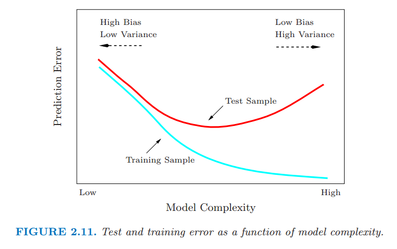

# 2.9 模型选择和偏差-方差的权衡

原文     | [The Elements of Statistical Learning](../The Elements of Statistical Learning.pdf)
      ---|---
翻译     | szcf-weiya
时间     | 2016-08-01
更新 | 2018-02-14; 2018-02-21
状态 | Done

上面讨论的所有模型以及其他将要在后面章节讨论的模型都有一个光滑(smoothing)或复杂性(complexity)参数需要确定：

- 惩罚项的乘子
- 核的宽度
- 基函数的个数

在光滑样条的情形下，参数$\lambda$表示了从直线拟合到插值的各种模型。类似地，局部degree为$m$的多项式模型从窗宽(window size)无限大时阶为$m$的全局多项式到窗宽(window size)至零时的插值拟合模型。这意味着我们不能用训练数据的残差平方和来确定这些参数，因为我们总是选择插值拟合，因为能达到零残差。这样的一个模型不可能用来预测未来的数据。

$k$最近邻回归的拟合值$\hat{f}_k(x_0)$有效地说明了其有与上述近似方法的竞争力。假设数据来自模型$Y=f(X)+\epsilon, E(\epsilon)=0,Var(\epsilon)=\sigma^2$。为了简化，我们假设样本中的值$x_i$提前修正好（不是随机）。在$x_0$处的期望预测误差，也被称为测试(*test*)或泛化(*generalization*)误差，可按如下方式分解：
$$
\begin{align}
EPE_k(x_0)&=E[(Y-\hat{f}_k(x_0))^2\mid X=x_0]\notag\\
&=\sigma^2+[Bias^2(\hat{f}_k(x_0))+Var_{\cal T}(\hat{f}_k(x_0))]\\
&=\sigma^2+[f(x_0)-\frac{1}{k}\sum\limits_{\ell=1}^kf(x_{(\ell)})]^2+\frac{\sigma^2}{k}
\end{align}
$$
带括号的下标$(\ell)$表示$x_0$的最近邻的顺序。

在展开式中有三项。第一项$\sigma^2$是不可约减的(*irreducible*)误差——是新测试目标点的方差——而且我们不能够控制，即使我们知道真值$f(x_0)$

第二项和第三项在我们的控制范围内，并且构成了估计$f(x_0)$时$\hat f_k(x_0)$的均方误差(*mean squared error*)，均方误差经常被分解成偏差部分和方差部分。偏差项是真值均值$f(x_0)$与估计的期望值之间差异的平方——$[E_{\cal T}(\hat{f}\_k(x_0))-f(x_0)]^2$——其中期望平均了训练数据中的随机量。如果真实的函数相当地光滑，这一项很可能随着$k$的增加而增加。对于较小的$k$值和较少的近邻点会导致值$f(x_{(\ell)})$与$f(x_0)$很接近，所以它们的平均应该距离$f(x_0)$很近。当$k$值增加，邻域远离，然后任何事情都可能发生。

这里的方差项是方差的简单平均，因为$k$的倒数关系，随$k$变大而变小。所以当$k$变化，会有偏差——误差的权衡(*bias-variance tradeoff*)。

更一般地，随着我们过程的模型复杂度(*model complexity*)增加，方差趋于上升，偏差趋于下降。当模型复杂度下降时会发生相反的行为。对于$k$-最近邻，模型复杂度由$k$来控制。

一般地，我们选择模型复杂度使偏差与方差达到均衡从而使测试误差最小。测试误差的一个明显的估计是训练误差(*training error*)$\frac{1}{N}\sum_i(y_i-\hat{y}_i)^2$。不幸的是，训练误差不是测试误差的良好估计，因为这不能解释模型复杂度。

> 图2.11：测试和训练错误随模型复杂度变化

图2.11显示了不同模型复杂度下测试和训练误差的一般表现。无论何时增加模型复杂度（换句话说，无论何时更精细地(harder)拟合数据），训练误差都趋于下降。然而过度的拟合，模型会自适应使得更加接近训练数据，但不能很好地进行推广（比如说，测试误差很大）。正如式(2.46)的最后一项，在这种情形下，预测值$\hat{f}(x_0)$的方差较大。相反地，如果模型不是特别的复杂，会欠拟合(*underfit*)且有较大的偏差，也导致不能很好地泛化。在第7章中，我们考虑估计预测方法的测试误差的各种方式，并因此在给定的预测方法和训练集下，估计出最优的模型复杂度。
