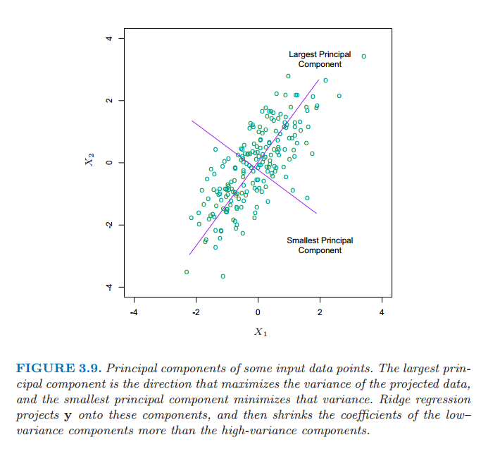
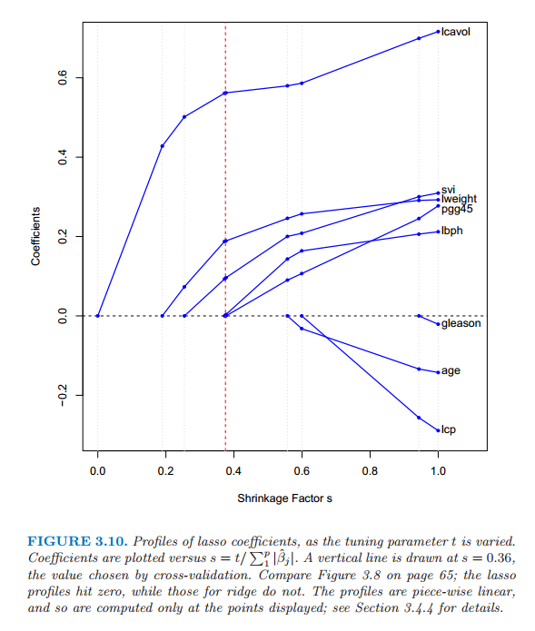
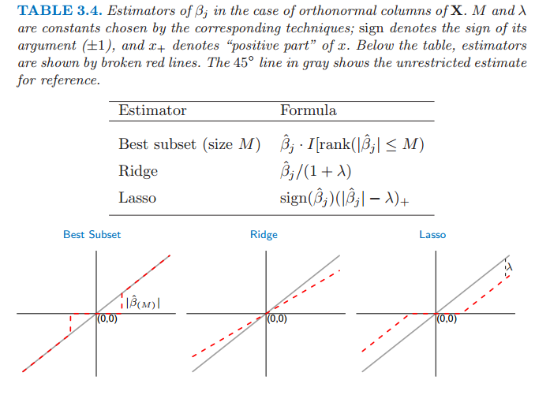
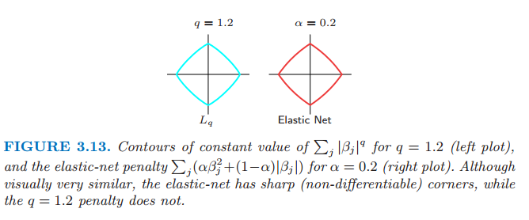

## 收缩的方法

原文     | [The Elements of Statistical Learning](../book/The Elements of Statistical Learning.pdf)
      ---|---
翻译     | szcf-weiya
时间     | 2016-08-26

通过保留预测变量的子集并且丢弃剩余的，子集的选择得到一个可解释的且预测误差可能比全模型低的模型。然而，因为是一个离散的过程——变量不是保留就是丢弃——经常保留高方差，因此不会降低全模型的预测误差。收缩方法更加连续，而且不会遭受高易变。

## 岭回归

岭回归通过对规模加上惩罚因子收缩回归的系数。岭回归的系数使得惩罚的残差平方和最小

$$
\hat{\beta}^{ridge}=\underset{\beta}{argmin}\Big\{\sum\limits_{i=1}^N(y_i-\beta_0-\sum\limits_{j=1}^px_{ij}\beta_j)^2+\lambda\sum\limits_{j=1}^p\beta_j^2\Big\}\qquad (3.41)
$$

这里$\lambda\ge 0 $是控制收缩数量的参数：$\lambda$值越大，收缩的数量越大。系数向零收缩（以及彼此）。通过参数的平方和来惩罚也用于神经网络，也被称作加权衰退（第11章）。

岭回归问题可以等价地写成

$$
\begin{align}
\hat{\beta}^{ridge}&=\underset{\beta}{argmin}\sum\limits_{i=1}^N(y_i-\beta_0-\sum\limits_{j=1}^px_{ij}\beta_j)^2\\\
& \text{subject to }\sum\limits_{j=1}^p\beta_j^2 \le t
\end{align}
\qquad (3.42)
$$

上式用参数显式表达了规模的限制。(3.41)中的$\lambda$和(3.42)中的$t$一一对应。当在线性回归模型中有许多相关变量，它们的系数可能不充分确定且有高方差。某个变量上比较大的正系数可以同相关性强的变量上差不多大的负系数相互抵消。通过对系数加入规模限制，如（3.42），这个问题得以减轻。

岭回归在输入的不同尺度下解不相等，因此求解（3.41）前我们需要对输入进行正规地标准化。另外，注意到惩罚项不包含截距$\beta_0$。截距地惩罚会使得过程依赖于$\mathbf{Y}$的初始选择；也就是，对目标$y_i$加上常数$c$不是简单地导致预测会偏离同样的量$c$。可以证明（练习3.5）经过中心化输入的再参量化，每个$x_{ij}$用$x_{ij}-\bar{x}_j$来替换，(3.41)的解可以分成两部分。我们用$\bar{y}=\frac{1}{N}\sum_1^Ny_i$来估计$\beta_0$。剩余的参数利用中心化的$x_{ij}$通过无截距的岭回归来估计。今后我们假设中心化已经完成，则输入矩阵$\mathbf{X}$有$p$（不是$p+1$）列。

(3.41)的准则写成矩阵形式

$$
RSS(\lambda)=(\mathbf{y}-\mathbf{X}\beta)^T(\mathbf{y}-\mathbf{X}\beta)+\lambda\beta^T\beta \qquad (3.43)
$$

岭回归的解可以简单地看出来为
$$
\hat{\beta}^{ridge}=(\mathbf{X^TX}+\lambda \mathbf{I})^{-1}\mathbf{X}^T\mathbf{y}\qquad (3.44)
$$

其中$\mathbf{I}$为$p\times p$单位矩阵。注意到选择二次函数惩罚$\beta^T\beta$,岭回归的姐再一次是$\mathbf{y}$的线性函数。解在求逆之前向对焦矩阵$\mathbf{X^TX}$中加入正的常数值。这样使得问题非奇异，即使$\mathbf{X^TX}$不是满秩，而且当第一次引入统计学中（Hoerl and Kennard,1970）这是岭回归的主要动力。传统的岭回归的描述从定义（3.44）开始。我们选择通过(3.41)和(3.42)来阐述，因为这两式让我们看清楚了它是怎样实现的。

图3.8展示了前列腺癌例子的岭回归系数估计，绘制成关于$df(\lambda)$的函数，$df(\lambda)$为由惩罚$\lambda$得到的有效自由度（effective degrees of freedom）（在p68的式(3.50)中定义）。在正规化输入的情形下，岭回归估计仅仅是最小二乘估计的缩小版本，也就是$\hat{\beta}^{ridge}=\hat{\beta}/(1+\lambda)$

图3.8 当校正参数$\lambda$不同时，前列腺癌例子岭回归的轮廓。画出系数关于有效自由度$df(\lambda)$的曲线。垂直直线画在$df=5.0$处，由交叉验证选择出来的。

当有一个合适的给定的先验分布，岭回归也可以从后验分布的均值或众数得到。具体地，假设$y_i \sim N(\beta_0+x^T_i\beta,\sigma^2)$,参数$\beta_j$的分布均为$N(0,\tau^2)$,每个都相互独立。则当$\tau^2$和$\sigma^2$值已知时，$\beta$后验分布密度函数的对数值(的负数)等于（3.41）中花括号里面的表达式，且$\lambda=\sigma^2/\tau^2$(练习3.6[^Ex3.7])。因此岭回归估计是后验分布的众数；又分布为高斯分布，则也是后验分布的均值。

中心化输入矩阵$\mathbf{X}$的奇异值分解（SVD）[^Thin SVD]让我们进一步了解岭回归的本质。这个分解在许多统计方法分析中非常有用。$N\times p$阶矩阵$\mathbf{X}$的SVD分解有如下形式
$$
\mathbf{X=UDV^T}\qquad (3.45)
$$

这里$\mathbf{U}$和$\mathbf{V}$分别是$N\times p$和$p\times p$的正交矩阵，$\mathbf{U}$的列张成$X$的列空间，$\mathbf{V}$的列张成列空间。$\mathbf{D}$为$p\times p$的对角矩阵，对角元$d_1\ge d_2 \ge \cdots \ge d_p \ge 0$称作$\mathbf{X}$的奇异值。如果一个或多个$d_j=0$,则$\mathbf{X}$为奇异的。

利用奇异值分解经过一些简化我们可以最小二乘拟合向量写成

$$
\begin{align}
\mathbf{X}\hat{\beta}^{ls}&=\mathbf{X(X^TX)^{-1}X^Ty}\\\
&=\mathbf{UU^Ty}\qquad (3.46)
\end{align}
$$

注意到$\mathbf{U}^Ty$是$\mathbf{y}$关于正交基$\mathbf{U}$的坐标。同时注意同(3.33)的相似性；$\mathbf{Q}$和$\mathbf{U}$是$\mathbf{X}$列空间两个不同的正交基（练习3.8）。

> Now the ridge solutions are

$$
\begin{align}
\mathbf{X}\hat{\beta}^{ridge}&=\mathbf{X}(\mathbf{X^TX}+\lambda \mathbf{I})^{-1}\mathbf{X^Ty}\\\
&= \mathbf{UD}(\mathbf{D^2}+\lambda \mathbf{I})^{-1}\mathbf{DU^Ty}\\\
&= \sum\limits_{j=1}^p\mathbf{u}_j\dfrac{d_j^2}{d_j^2+\lambda}\mathbf{u_j^Ty}\qquad (3.47)
\end{align}
$$

其中$\mathbf{u}_j$为$\mathbf{U}$的列向量。注意到因为$\lambda \ge 0$,我们有$d_j^2/(d^2_j+\lambda)\le 1$.类似线性回归，岭回归计算$\mathbf{y}$关于正规基$\mathbf{U}$的坐标。通过因子$d^2_j/(d^2_j+\lambda)$来收缩这些坐标。这意味着更大程度的收缩应用到有更小$d_j^2$的基向量坐标上。

$d_j^2$值小意味着什么？中心化矩阵$\mathbf{X}$的奇异值分解是表达$\mathbf{X}$中主成分变量的另一种方式。样本协方差矩阵为$\mathbf{S={\color{red} E(X^T-E(X^T))(X^T-E(X^T))^T=}X^TX}/N$,并且从(3.45)式我们得到

$$
\mathbf{X^T X = VD^2V^T} \qquad (3.48)
$$

上式是$\mathbf{X^TX}$(也是$S$,取决于因子$N$)的特征值分解(eigen decomposition)。特征向量$v_j$($\mathbf{V}$的列向量)也称作$\mathbf{X}$的主成分（或Karhunen-Loeve）方向。第一主成分方向$v_1$有下面性质：$\mathbf{z}_1=\mathbf{X}v_1$在$\mathbf{X}$列中所有标准化线性组合中有最大的样本方差。样本方差很容易看出来是
$$
Var(\mathbf{z}_1)=Var(\mathbf{X}v_1)=\dfrac{d_1^2}{N}\qquad (3.49)
$$

事实上$\mathbf{z}_1=\mathbf{X}v_1=\mathbf{u}_1d_1$。引申变量$\mathbf{z_1}$称作$\mathbf{X}$的第一主成分，并且因此$\mathbf{u_1}$是标准化的第一主成分。后面的主成分$z_j$有最大的方差$d_j^2/N$,与前一个保持正交[^subject to]。相反地，最后一个主成分有最小的方差。因此最小的奇异值$d_j$对应$\mathbf{X}$列空间有最小方差的方向，并且岭回归对这些方向收缩的最厉害。

[^Ex3.7]: 应为练习3.7(weiya 注)
[^Thin SVD]: 此处所做的SVD称之为Thin SVD(from wiki) (weiya 注)
[^subject to]: 怎么翻译？？

图3.9图示了两个维度下一些数据点的主成分。如果我们考虑在这个区域（Y轴垂直纸面）内拟合线性曲面，数据的结构形态允许我们确定在长方向下的梯度比短方向更精确。岭回归防止在短方向上估计梯度可能存在的高方差。隐含的假设是响应变量在输入变量高方差的方向上往往有很大不同。这往往是个合理的假设，因为预测变量经常是选来研究的，因为他们区别于响应变量，但是不需要保持一般。[^Qp67]

图3.9 一些输入数据点的主成分。最大主成分是使得投影数据方差最大的方向，最小主成分是使得方差最小的方向。岭回归将$\mathbf{y}$投射到这些成分上，然后将低方差成分的系数比高方差收缩得更厉害。

在图3.7中我们已经画了预测误差估计值关于$df(\lambda)$的曲线

$$
\begin{align}
df(\lambda)&=tr[\mathbf{X}(\mathbf{X^TX}+\lambda\mathbf{I})^{-1}\mathbf{X}^T]\\\
&=tr(\mathbf{H}_{\lambda})\\\
&=\sum\limits_{j=1}^p\dfrac{d_j^2}{d_j^2+\lambda}\qquad (3.50)
\end{align}
$$

$\lambda$的单调递减函数是岭回归拟合的有效自由度。通常在有$p$个变量的线性回归拟合中，拟合的自由度为$p$,也就是无约束参数的个数。想法是尽管岭回归拟合中所有的$p$个系数都不为0，但是它们在由$\lambda$控制的约束方式中拟合。注意到当$\lambda=0$（没有规范化）时$df(\lambda)=p$，并且当$\lambda\rightarrow \infty$时$df(\lambda)\rightarrow 0$。当然总是为了截距多一个自由度，在前面已经去掉了。这个定义将在3.4.4节和7.4-7.6节中详细介绍。图3.7中最小值在$df(\lambda)=5.0$处。表3.3显示了岭回归将全最小二乘估计的测试误差减少了一小部分。

[^Qp67]: 怎么翻译？？
## Lasso[^Lasso]
[^Lasso]: Least absolute shrinkage and seleetion operator)

lasso像岭回归一样是个收缩方法，有微妙但很重要的区别。lasso估计定义如下

$$
\begin{align}
\hat{\beta}^{lasso}&=\underset{\beta}{argmin}\sum\limits_{i=1}^N(y_i-\beta_0-\sum\limits_{j=1}^px_{ij}\beta_j)^2\\\
&\text{subject to }\sum\limits_{j=1}^p\vert\beta_j\vert\le t \qquad (3.51)
\end{align}
$$

正如在岭回归中一样，我们可以通过标准化预测变量对常数$\beta_0$在参量化；$\hat{\beta}_0$的解为$\bar{y}$,并且后面我们拟合无截距的模型（练习3.5）.在信号处理中，lasso也被称作基本追求（basis pursuit）(Chen et al., 1998)

我们也可以把lasso问题等价地写成拉格朗日形式

$$
\hat{\beta}^{lasso}=\underset{\beta}{argmin}\Big\{\sum\limits_{i=1}^N(y_i-\beta_0-\sum\limits_{j=1}^px_{ij}\beta_j)^2+\lambda\sum\limits_{j=1}^p\vert\beta_j\vert\Big\}\qquad (3.52)
$$

注意到与岭回归问题（3.42）或（3.41）的相似性：$L_2$的岭回归惩罚$\sum_1^p\beta^2_j$被$L_1$的lasso惩罚$\sum_1^p\vert\beta_j\vert$代替。后一约束使得解在$y_i$处非线性，并且在岭回归中没有相近的形式表达。计算lasso的解是一个二次编程问题，尽管我们在3.4.4节看到当$\lambda$不同时计算解的整个路径存在有效的算法。由于该约束的本质，令$t$充分小会造成一些参数恰恰等于0。因此lasso完成一个温和的连续子集选择。如果所选的$t$大于$t_0=\sum_1^p\vert\hat{\beta}_j\vert$(其中$\hat{\beta}_j=\hat{\beta}_j^{ls}$,$\hat{\beta}_j^{ls}$为最小二乘估计)，则lasso估计为$\hat{\beta}_j$。另一方面，当$t=t_0/2$，最小二乘系数平均收缩$50\%$。然而，收缩的本质不是很显然，我们将在3.4.4节进一步研究。类似在变量子集选择中子集的规模，或者岭回归的惩罚参数，应该自适应地选择$t$使得预测误差期望值的估计最小化。

图3.7中，为了方便解释，我们已经画出lasso的预测误差估计关于标准化参数$s=t/\sum^p_1\vert\hat{\beta}_j\vert$的曲线。通过10-折交叉验证选择$s\approx 0.36$;这导致4个系数设为0（表3.3的第5列）。最终模型有第二低的测试误差，比全最小二乘模型略低，但是测试误差估计的标准误差（表3.3的最后一行）相当大。

图3.10显示了当惩罚参数$s=t/\sum_1^p\vert\hat{\beta}_j\vert$不同时的lasso系数。当$s=1.0$时为最小二乘估计；当$s\rightarrow 0$时下降为0.该下降不总是严格单调的，尽管例子中确实是。在$s=0.36$处画了垂直直线，该值通过交叉验证来选择。

图3.10 当惩罚参数$t$变化时的lasso系数曲线。图中画了系数关于$s=t/\sum^p_1\vert\hat{\beta}_j\vert$的曲线。垂直直线画在$s=0.36$处，该值通过交叉验证来选择。比较65页的图3.8，lasso曲线会达到0，然而岭回归不会。曲线是分段线性的，所以只计算显示点处的值；详见3.4.4节。

## 讨论：子集的选择，岭回归，Lasso

这部分我们讨论并且比较至今为止约束线性回归模型的三种方法：子集选择、岭回归和lasso。

在正规输入矩阵的情况下，三种过程都有显式解。每种方法对最小二乘估计$\hat{\beta}_j$应用简单的转换，详见表3.4。

表3.4 在$\mathbf{X}$为正规列情形下$\beta_j$的估计值。$M$和$\lambda$是通过对应的手段选择的常数；符号标记变量的符号（$\pe 1$）,而且$x_+$记$x$的正数部分。下面的表格中，估计值有红色虚线来显示。灰色的$45^{\circ}$直线作为参照显示了无约束的估计。

岭回归做等比例的收缩。lasso通过常数因子$\lambda$转换每个系数，在0处截去。这也称作“软阈限”，而且用在5.9节中基于小波光滑的内容中。最优子集选择删掉所有系数小于第$M$大系数的变量；这是“硬阈限”的一种形式。

回到非正交的情形，一些图片帮助了解它们之间的关系。当只有两个参数时图3.11描绘了lasso（左）和岭回归（右）。残差平方和有椭圆形的等高线，以全最小二乘估计为中心。岭回归的约束区域为圆盘$\beta_1^2+\beta_2^2\le t$,lasso的约束区域为菱形$\vert\beta_1\vert+\vert\beta_2\vert\le t$。两种方式都寻找当椭圆等高线到达约束区域的第一个点。与圆盘不同，菱形有角；如果解出现在角上，则有一个参数$\beta_j$等于0。当$p>2$,菱形变成了偏菱形，而且有许多交，平坦的边和面；对于参数估计有更多的可能为0.

图3.11 lasso(左)和岭回归（右）的估计图片。图中显示了误差的等高线和约束函数。实心蓝色区域分别为约束区域$\vert\beta_1\vert+\vert\beta_2\vert\le t$以及$\beta^2_1+\beta_2^2\le t^2$，红色椭圆为最小二乘误差函数的等高线。

我们可以把岭回归和lasso一般化，并且可以看成是贝叶斯估计。考虑下面准则
$$
\tilde{\beta}=\underset{\beta}\Big\{\sum\limits_{i=1}^N(y_i-\beta_0-\sum\limits_{j=1}^px_{ij}\beta_j)^2+\lambda\sum\limits_{j=1}^p\vert\beta_j\vert^q\Big\}\qquad (3.53)
$$

其中$q\ge 0$。图3.12显示了两个输入情形下常数值$\sum_j\vert\beta_j\vert^q$的等高线。

图3.12 给定值$q$下常数值$\sum_j\vert\beta_j\vert^q$的等高线。

考虑$\vert\beta_j\vert^q$作为$\beta_j$的先验概率密度的对数值，同样有参数先验分布的等高线。$q=0$对应变量子集选择，惩罚项简单地统计非零参数的个数；$q=1$对应lasso，$q=2$对应岭回归。注意到$q\le 1$，先验在方向上不是均匀的，而是更多地集中在坐标方向上。对应$q=1$情形的先验分布是关于每个输入变量是的独立二重指数分布（或者Laplace分布），概率密度为$(1/2\tau)exp(-\vert\beta\vert)/\tau$并且$\tau=1/\lambda$。$q=1$的情形（lasso）是使得约束区域为凸的最小$q$值；非凸约束区域使得优化问题很困难。

从这点看，lasso、岭回归和最优子集选择是有着不同先验分布的贝叶斯估计。然而，注意到它们取自后验分布的众数，即最大化后验分布。在贝叶斯故技重使用后验分布的均值更加常见。岭回归同样是后验分布的均值，但是lasso和最优子集选择不是。

再一次观察准则（3.53），我们可能尝试除0，1，2外的其它$q$值。尽管有人可能从数据中估计$q$,我们的经验是为了多余的方差不值得。$q\in (1,2)$表明lasso和岭回归之间存在平衡。当$q>1$时尽管$\vert\beta_j\vert^q$在0处可导，但是并没有lasso（$q=1$）的令系数恰巧为零的性质。部分由于这个原因并且考虑计算易处理，Zou和Hastie在2005年引入弹性惩罚
$$
\lambda \sum\limits_{j=1}^p(\alpha\beta_j^2+(1-\alpha)\vert\beta_j\vert)\qquad (3.54)
$$

一种岭回归和lasso之间的不同的平衡。图3.13比较了$q=1.2$下的$L_q$惩罚以及$\alpha=0.2$的弹性网惩罚；很难从肉眼来观察出差异。弹性网像lasso一样选择变量，同时像岭回归一样收缩相关变量的系数。同时考虑了$L_q$惩罚的计算优势。我们将在18.4节介绍弹性网惩罚。

图3.13 $q=1.2$时$\sum_j\vert\beta_j\vert^q$为常数值的轮廓线（左图）以及$\alpha=0.2$时弹性网惩罚$\sum_j(\alpha\beta_j^2+(1-\alpha)\vert\beta_j\vert)$为常数值的轮廓线（右图）。尽管看起来很相似，弹性网有尖角（不可导），而$q=1.2$的惩罚不会有尖角。

## 最小角度回归

> Least angle regression (LAR) is a relative newcomer (Efron et al., 2004), and can be viewed as a kind of “democratic” version of forward stepwise regression (Section 3.3.2). As we will see, LAR is intimately connected with the lasso, and in fact provides an extremely efficient algorithm for computing the entire lasso path as in Figure 3.10.

> Forward stepwise regression builds a model sequentially, adding one variable at a time. At each step, it identifies the best variable to include in the active set, and then updates the least squares fit to include all the active variables.

> Least angle regression uses a similar strategy, but only enters “as much” of a predictor as it deserves. At the first step it identifies the variable most correlated with the response. Rather than fit this variable completely, LAR moves the coefficient of this variable continuously toward its least-squares value (causing its correlation with the evolving residual to decrease in absolute value). As soon as another variable “catches up” in terms of correlation with the residual, the process is paused. The second variable then joins the active set, and their coefficients are moved together in a way that keeps their correlations tied and decreasing. This process is continued until all the variables are in the model, and ends at the full least-squares fit. Algorithm 3.2 provides the details. The termination condition in step 5 requires some explanation. If $p > N − 1$, the LAR algorithm reaches a zero residual solution after $N − 1$ steps (the −1 is because we have centered the data).

****
**Algorithm 3.2** Least Angle Regression
****
1. Standardize the predictors to have mean zero and unit norm. Start
   with the residual $\mathbf{r = y − \bar{y}}, \beta_1,\beta_2,\ldots,\beta_p = 0$.
****

1. Find the predictor $\mathbf{x}_j$ most correlated with $\mathbf{r}$.

2. Move $\beta_j$ from 0 towards its least-squares coefficient $\langle \mathbf{x_j,r}\rangle$, until some other competitor $\mathbf{x}_k$ has as much correlation with the current residual as does $\mathbf{x}_j$.
3. Move $\beta_j$ and $\beta_k$ in the direction defined by their joint least squares coefficient of the current residual on $(\mathbf{x}_j,\mathbf{x}_k)$, until some other competitor xl has as much correlation with the current residual.
4. Continue in this way until all $p$ predictors have been entered. After
   $min(N − 1,p)$ steps, we arrive at the full least-squares solution.
****

假设${\cal A}_k$是第$k$步开始的活跃集变量，$\beta_{{\cal A}_k}$为这一步中变量的系数向量；其中有$k-1$个非零值，刚刚进入的变量系数值为0.如果当前残差为$\mathbf{r}_k=\mathbf{y}-\mathbf{X}_{{\cal A}_k}\beta_{{\cal A}_k}$,则当前步的方向为

$$
\delta_k=(\mathbf{X}^T_{{\cal A}_k}\mathbf{X}_{{\cal A}_k})^{-1}\mathbf{X}^T_{\cal A}_k\mathbf{r}_k\qquad (3.55)
$$

系数然后迭代为 $\beta_{{\cal A}_k} (\alpha) = \beta_{{\cal A}_k} + \alpha · \delta_k$.练习3.23证明这种方式下选择的方向满足断言：保证相关系数结合和递减（tied and decreasing）。如果该步的开始拟合向量为$\hat{\mathbf{f}}_k$,则迭代为$\hat{\mathbf{f}}_k(\alpha)=\mathbf{f}_k+\alpha\cdot\mathbf{u}_k$,其中$\mathbf{u}_k=\mathbf{X}_{{\cal A}_k}\delta_k$是新的拟合方向。“最小角”由该过程的几何解释得到；$\mathbf{u}_k$使得活跃集${\cal A}_k$中的预测变量间的角度最小（练习3.24）。图3.14使用模拟数据显示了相关系数的绝对值下降以及每一步LAR算法的加入行列。

通过构造LAR的系数以一种分段线性的方式进行改变。图3.15（左图）显示了LAR系数曲线作为$L_1$弧长[^L1 arc length]的函数曲线。注意到我们不需要采取很小的步以及重新检查步骤3的相关系数；应用预测变量的协方差和算法的分段线性性质，我们可以在每一步开始计算出确切的步长（练习3.25）。

> The right panel of Figure 3.15 shows the lasso coefficient profiles on the same data. They are almost identical to those in the left panel, and differ for the first time when the blue coefficient passes back through zero. For the prostate data, the LAR coefficient profile turns out to be identical to the lasso profile in Figure 3.10, which never crosses zero. These observations lead to a simple modification of the LAR algorithm that gives the entire lasso path, which is also piecewise-linear.

图3.15的右图展示了对同样数据的lasso系数曲线。几乎与左图相同，当绿色曲线通过0时首次出现不同。对于前列腺癌数据，LAR系数曲线显示与图3.10的lasso曲线相同，该曲线从不经过0。这些观测值导致对LAR算法的一个简单修改，给出了整个lasso路径，它同样也是分段线性的。

****
**Algorithm 3.2a** Least Angle Regression: Lasso Modification
****
4a. If a non-zero coefficient hits zero, drop its variable from the active set
of variables and recompute the current joint least squares direction.
****

****
**算法3.2a** 最小角回归：Lasso修正
****
4a.
****

[^L1 arc length]: 可导曲线$\beta(s), s \in [0,S]$的$L_1$弧长为$TV(\beta,S)=\int_0^S\Vert\dot{\beta}(s)\Vert_1ds$,其中$\dot{\beta}(s)=\partial\beta(s)/\partial s$.对于分段LAR函数曲线，这相当于从这一步到下一步系数的$L_1$范数变化之和。
