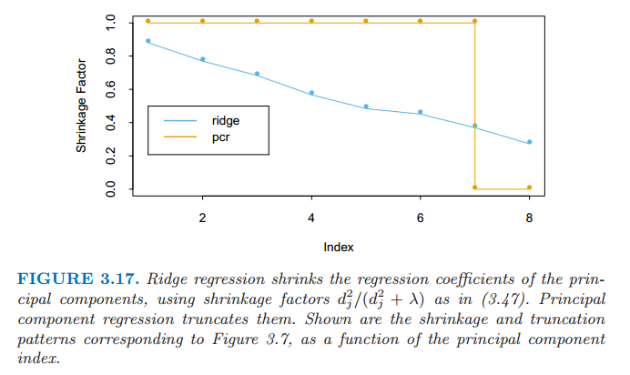

# 3.5 运用派生输入方向（Derived Input Directions）的方法

| 原文   | [The Elements of Statistical Learning](../book/The Elements of Statistical Learning.pdf) |
| ---- | ---------------------------------------- |
| 翻译   | szcf-weiya                               |
| 时间   | 2016-10-14:2016-10-21                    |

在很多情形下我们有很多输入，这些输入相关性经常是非常强的。这一小节中的方法得到较少的原输入变量$X_j$的线性组合$Z_m,m=1,2,\ldots,M$，然后$Z_m$用来代替$X_j$来作为回归的输入。这些方法区别于怎样构造线性组合。

## 主成分回归

在这种方法下，使用的线性组合$Z_m$是在前面3.4.1节中定义的主成分。

主成分回归构造派生的输入列$\mathbf z_m=\mathbf Xv_m$，然后在$\mathbf z_1,\mathbf z_2,\ldots,\mathbf z_M,\; M\le p$上回归$\mathbf y$.因为$\mathbf z_m$是正交的，这个回归仅仅是一个单变量回归的和
$$
\hat{\mathbf y}^{pcr}_{(M)}=\bar y\mathbf 1+\sum\limits_{m=1}^M\hat{\theta}_m\mathbf z_m\qquad (3.61)
$$
其中，$\hat\theta_m=\langle \mathbf z_m,\mathbf y\rangle/\langle\mathbf z_m,\mathbf z_m\rangle$. 因为$\mathbf z_m$是原输入变量$\mathbf x_j$的每个线性组合，我们可以将解（3.61）表达成关于$\mathbf x_j$的函数（练习3.13）
$$
\hat\beta^{pcr}(M)=\sum\limits_{m=1}^M\hat\theta_mv_m\qquad (3.62)
$$

岭回归下，主成分依赖输入$\mathbf x_j$的放缩尺度，所以一般地我们首先对它们进行标准化。注意到如果$M=p$，我们就会回到通常的最小二乘估计，因为列$\mathbf Z=\mathbf U\mathbf D$张成了$\mathbf X$的列空间。对于$M<p$我们得到一个降维的回归问题。我们看到主成分回归与岭回归非常相似：都是通过输入矩阵的主成分来操作的。岭回归对主成分系数进行了收缩，收缩更多地依赖对应特征值的大小；主成分回归丢掉$p-M$个最小的特征值分量。图3.17说明了这一点

图3.17 岭回归运用(3.47)中的收缩因子$d_j^2/(d_j^2+\lambda)$来收缩主成分回归的系数。主成分回归截断了它们。 图中显示了图3.7对应的收缩和截断模式作为主成分指标的函数。

在图3.7中我们看到交叉验证表明有7项；最终模型在表3.3中有最低的测试误差。

## 偏最小二乘

这个技巧也构造了一系列用于回归的输入变量的线性组合，但是与主成分回归不同的是它采用$\mathbf y$（以及$\mathbf X$）来构造。和主成分回归相同的是，偏最小二乘(PLS)不是尺度不变的，所以我们假设每个$\mathbf x_j$标准化使得均值为0和方差为1。PLS通过对每个$j$计算$\hat \psi_{1j}=\langle \mathbf x_j, \mathbf y\rangle$。从这里我们构造了新的输入变量$\mathbf z_1=\sum_j\hat \psi_{1j}\mathbf x_j$, 这是第一偏最小二乘方向。因此在每个$\mathbf z_m$的构造中，输入变量通过判断其在$\mathbf y$上的单变量影响强度来加权。输出变量**$\mathbf y$在$\mathbf z_1$上回归**便得到系数$\hat \theta_1$, 然后我们对$\mathbf x_1,\mathbf x_2,\ldots,\mathbf x_p$进行关于$\mathbf z_1$的正交化。我们继续这个过程，直到$M\le p$。在这种方式下，偏最小二乘得到一系列派生出的、正交化的输入或者方向$\mathbf z_1,\mathbf z_2,\ldots, \mathbf z_p$。至于主成分回归，如果我们构造所有$M=p$个方向，我们会得到一个等价于普通最小二乘估计的解；如果使用$M< p$个方向会得到一个低维的回归。这个过程将在算法3.3中详细描述。

> **weiya 注：**在$\mathbf a$上回归$\mathbf b$(或者称作$\mathbf b$在$\mathbf a$上回归)指的是
>
> $\mathbf b$在$\mathbf a$上的无截距的简单单变量回归，回归系数为
> $$
> \hat \gamma = \dfrac{\langle \mathbf a,\mathbf b\rangle}{\langle \mathbf a,\mathbf a\rangle}
> $$
> 同时这一过程也称作$\mathbf b$关于$\mathbf a$正交化

****
算法 3.3 偏最小二乘
****

1. 对$\mathbf x_j$标准化使得均值为0、方差为1.令$\hat{\mathbf y}^{(0)}=\bar y\mathbf 1$, 并且$\mathbf x_j^{(0)}=\mathbf x_j,\;j=1,\ldots,p$.
2. 对于$m=1,2,\ldots,p$
   1. $\mathbf z_m=\sum_{j=1}^p\hat \varphi_{mj}\mathbf x_j^{(m-1)}$, 其中$\hat \varphi_{mj}=\langle\mathbf x_j^{(m-1)},\mathbf y\rangle$
   2. $\hat \theta_m=\langle \mathbf z_m, \mathbf y\rangle/\langle \mathbf z_m,\mathbf z_m\rangle$
   3. $\hat{\mathbf y}^{(m)}=\hat{\mathbf y}^{(m-1)}+\hat\theta_m\mathbf z_m$
   4. 对每个$\mathbf x_j^{(m-1)}$关于$\mathbf z_m$正交化：$\mathbf x_j^{(m)}=\mathbf x_j^{(m-1)}-\dfrac{\langle \mathbf z_m,\mathbf x_j\rangle}{\langle \mathbf z_m,\mathbf z_m\rangle}\mathbf z_m,\; j=1,2,\ldots,p.$
3. 输出拟合向量序列$\{\hat{\mathbf y^{(m)}}\}^p_1$。因为$\{\mathbf z_\ell\}^m_1$关于原输入变量$\mathbf x_j$为线性的，所以是$\hat {\mathbf y}^{(m)}=\mathbf X \hat \beta^{pls}(m)$.这些线性系数可以通过PLS转换的序列重新得到。
****

在前列腺癌的例子中，交叉验证在图3.7中选择$M=2$个PLS方向。这得到了表3.3最右边的列的模型。

什么优化问题是偏最小二乘？因为它使用响应变量$\mathbf y$去构造它的方向，它的解的路径是$\mathbf y$的非线性函数。可以证明（练习3.15）偏最小二乘寻找有高方差以及和响应变量有高相关性的方向，而与之相对的主成分分析回归只重视高方差（Stone和Brooks, 1990; Frank和Friedman, 1993）。特别地，第$m$个主成分方向$v_m$是下面的解：
$$
max_{\alpha} \;Var(\mathbf X\alpha)\\
s.t.\;\Vert \alpha\Vert=1,\alpha^T\mathbf Sv_\ell=0,\;\ell=1,\ldots,m-1
$$
其中，$\mathbf S$为$\mathbf x_j$的样本协方差矩阵。$\alpha^T\mathbf Sv_\ell=0$保证了$\mathbf z_m=\mathbf X\alpha$与之前所有的线性组合$\mathbf z_\ell=\mathbf v_\ell$都不相关。第$m$个PLS方向$\hat \varphi_m$是下面的解：
$$
max_\alpha\; Corr^2(\mathbf y,\mathbf X\alpha)Var(\mathbf X\alpha)\\
s.t.\; \Vert\alpha\Vert=1,\alpha^T\mathbf S\hat \varphi_\ell=0,\ell=1,\ldots,m-1
$$
更多的分析揭示了，方差项趋向于主导地位，而且偏最小二乘表现得很像岭回归和主成分回归。我们将在下一部分讨论这些。

如果输入矩阵$\mathbf X$是正交的，则偏最小二乘会经过$m=1$步找到最小二乘估计。后续的步骤不起作用，因为$m>1\text{时}，\hat \varphi_{mj}=0$（练习3.14）.也可以证明$m=1,2,\ldots,p$时的PLS系数序列表示计算最小二乘解时的共轭梯度（练习3.18）。
