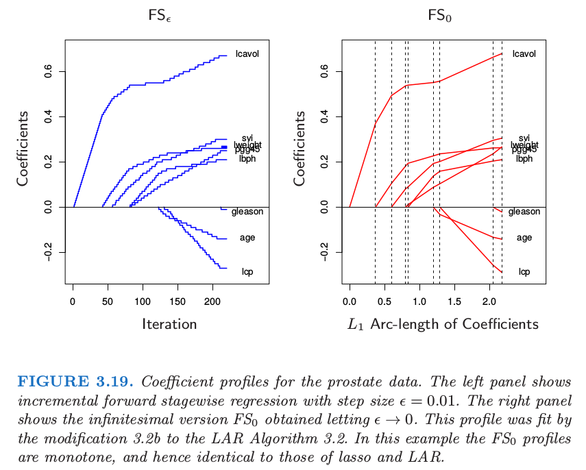
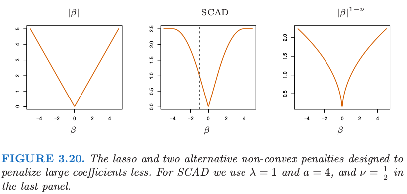

# Lasso和相关路径算法的补充

| 原文   | [The Elements of Statistical Learning](../book/The Elements of Statistical Learning.pdf) |
| ---- | ---------------------------------------- |
| 翻译   | szcf-weiya                               |
| 时间   | 2016-10-21:2016-10-21                    |
|更新|2017-12-05|

自从LAR算法（Efron et al., 2004[^1]）的提出，许多研究都在发展对于不同问题的正则化拟合算法。另外，$L_1$正则有它自己的用处，它引领了信号处理领域的压缩传感(compressed sensing).（Donoho, 2006a[^2]; Candes, 2006[^3]）在这部分我们讨论一些相关的想法和以LAR算法为先驱的其它路径算法。

## 增长的向前逐渐回归

这里我们提出另外一种类似LAR的算法，这次集中在向前逐渐回归。有趣地是，理解一个灵活的非线性回归过程的努力导出了线性模型的一个新算法（LAR）。在阅读本书的第一版时，第16章的向前逐渐算法16.1，Brad Efron意识到对于线性模型，可以明确地构造出如图3.10所示的分段线性的lasso路径。这促使他提出3.4.4节介绍的LAR过程，以及这里提到的向前逐渐回归(forward-stagewise regression)的增长版本。

<!--
****
**算法 3.4** 增长的向前逐渐回归——$FS_\epsilon$
****
1. 从残差向量$\mathbf r$等于$\mathbf y$开始，$\beta_1,\beta_2,\ldots,\beta_p=0$. 所有的预测变量进行标准化使得均值为0、方差为1.
2. 寻找与残差向量$\mathbf r$最相关的预测变量$\mathbf x_j$
3. 更新$\beta_j\leftarrow\beta_j+\delta_j$, 其中$\delta_j=\epsilon\cdot sign[\langle \mathbf x_j,\mathbf r\rangle]$并且$\epsilon>0$是一个很小的步长，然后令$\mathbf r=\mathbf r-\delta_j\mathbf x_j$
4. 重复步骤2和步骤3，直到所有的残差向量与所有的预测变量都不相关。

****
-->

考虑16.1节提出的向前逐渐boosting(forward-stagewise boosting)算法16.1的线性版本。它通过重复更新与当前残差最相关的变量的系数（乘以一个小量$\epsilon$）得到系数曲线。算法3.4给出了具体的细节。图3.19（左边）展示了前列腺癌数据中步长$\epsilon=0.01$的过程。如果$\delta_j=\langle \mathbf x_j,\mathbf r\rangle$（残差在第$j$个预测变量的最小二乘系数），则这恰恰是3.3节中介绍的一般向前逐渐过程（FS）。

这里我们主要对小的$\epsilon$值感兴趣。令$\epsilon\rightarrow0$则有图3.19的右图，在这种情形下与图3.10的lasso路径相同。我们称这个极限过程为无穷小的向前逐渐回归(infinitesimal forward stagewise regression)或者$FS_0$。这个过程在非线性、自适应方法中有着很重要的作用，比如boosting（第10和16章），并且是增长的向前逐渐回归的，这是最能禁得起理论分析的版本。由于它与boosting的关系，Buhlmann and Hothorn (2007)[^4]称这个过程为"L2boost"

Efron最初认为LAR算法3.2是$FS_0$的一个实现，允许每个连结变量(tied predictor)以一种平衡的方式更新他们的系数，并且在相关性方面保持连结。然而，他接着意识到LAR在这些连结预测变量中的最小二乘拟合可以导致系数向相反的方向移动到它们的相关系数，这在算法3.4中是不可能发生的。下面对LAR算法的修正实现了$FS_0$：

!!! note "weiya注"
    直观上看，在算法3.2的第4步中，系数朝着联合最小二乘方向移动，注意此时方向与最小二乘方向可能一致或者相反。然而算法3.4中的移动方向始终与最小二乘方向保持一致。因此需要算法3.2b的修改。

<!--
****
**算法 3.2b** 最小角回归：$FS_0$修正
****
4.通过求解下面的约束最小二乘问题找到新的方向
$$
\underset{b}{min}\Vert\mathbf r-\mathbf X_{\cal A}b\Vert^2_2 \;s.t.\; b_js_j\ge 0,\;j\in\cal A
$$
其中，$s_j$是$\langle\mathbf x_j,\mathbf r \rangle$的方向。
****
-->

这个修正相当于一个非负的最小二乘拟合, 保持系数的符号与相关系数的符号一致。可以证明它实现了对于最大相关性的连结变量的无限小"更新"的最优平衡。（Hastie et al.，2007[^5]）。类似lasso，全$FS_0$路径可以通过LAR算法非常有效地计算出来。

作为这些事实的结果，如果LAR图象是单调不减或者单调不增，如3.19所示，则LAR，lasso，以及$FS_0$这三种算法给出了相同的图象。如果图象不是单调的但是不穿过0，则LAR和lasso是一样的。

因为$FS_0$与lasso不同，很自然地问它是否优化了准则。答案比lasso更加的复杂；$FS_0$系数曲线是微分方程的一个解。尽管lasso在降低系数向量$\beta$的$L_1$范数的单位残差平方和增长方面实现了最优化，但$FS_0$在沿着系数路径的$L_1$弧长的单位增长是最优的。因此它的系数曲线不会经常改变方向。

$FS_0$比lasso的约束更强，事实上也可以看成是lasso的单调版本；见图16.3生动的例子。$FS_0$可能在$p>>N$情形下很有用，它的系数曲线会更加的光滑，因此比lasso有更小的方差。更多关于$FS_0$的细节将在16.2.3节以及给出以及Hastie et al. (2007)[^5]。图3.16包含了$FS_0$, 它的表现非常类似于lasso。

## 分段线性路径算法

最小角回归过程探索了lasso解的路径分段线性的本质。这导出了其他正则化问题类似的“路径算法”。假设我们求解

$$
\hat \beta(\lambda)=\mathrm{argmin}_\beta[R(\beta)+\lambda J(\beta)]\qquad (3.76)
$$

$$
R(\beta)=\sum\limits_{i=1}^NL(y_i,\beta_0+\sum_{j=1}^px_{ij}\beta_j)\qquad (3.77)
$$

其中损失函数$L$和惩罚函数$J$都是凸函数。则下面是解的路径$\hat\beta(\lambda)$为分段线性的充分条件(Rosset and Zhu, 2007)[^6]

1. $R$作为$\beta$的函数是二次的或者是分段二次
2. $J$关于$\beta$分段线性

这也意味着（原则上）解的路径可以有效地计算出来。例子包括平方损失和绝对误差损失，“Huberized”损失，以及关于$\beta$的$L_1, L_\infinity$ 惩罚。另一个例子是支持向量机中的“hinge loss”。那里损失是分段线性，惩罚是二次的。有趣的是，这导出了对偶空间的分段线性路径算法；更多的细节在12.3.5节给出。

## Dantzig选择器

Candes and Tao (2007)[^7] 提出下面的准则：

$$
\mathrm{min}_\beta\Vert\beta\Vert_1\text{ subject to }\Vert \mathbf X^T(\mathbf y-\mathbf X\beta)\Vert_\infinity\le s\qquad (3.78)
$$

他们称这个解为Dantzig选择器(DS)。可以等价地写成

$$
\mathrm{min}_\infinity \Vert \mathbf X^T(\mathbf y-\mathbf X\beta)\Vert_\infinity\text{ subject to } \Vert\beta\Vert\le t\qquad (3.79)
$$

这里$\Vert\cdot\Vert_\infinity$为$L_\infinity$范数，也就是该向量中绝对值最大的组分。这种形式类似lasso，用梯度绝对值的最大值替换平方误差损失。注意到当$t$变大，如果$N<p$两个过程都得到最小二乘解。如果$p\ge N$，它们都得到最小的$L_1$范数的最小二乘解。然而，对于较小的$t$，DS过程得到与lasso不同的解的路径。

Candes and Tao (2007)证明了求解DS是线性规划问题；因此称为Dantzig，来纪念Bakin (1999)[^8]，Lin and Zhang (2006)[^9]的提出，以及Yuan and Lin (2007)[^10]的研究和推广。推广包括更一般的$L_2$范数$\Vert \eta\Vert=(\eta^TK\eta)^{1/2}$，并且允许重复的预测变量(Zhao et al., 2008[^11])。拟合离散的可加模型的方法之间也有联系（Lin and Zhang, 2006[^9]; Ravikumar et al., 2008[^12]）

## The Grouped Lasso

## lasso的更多性质

## Pathwise Coordinate Optimization

[^1]: Efron, B., Hastie, T., Johnstone, I. and Tibshirani, R. (2004). Least angle regression (with discussion), Annals of Statistics 32(2): 407–499.
[^2]: Donoho, D. (2006a). Compressed sensing, IEEE Transactions on Information Theory 52(4): 1289–1306.
[^3]: Candes, E. (2006). Compressive sampling, Proceedings of the International Congress of Mathematicians, European Mathematical Society, Madrid, Spain.
[^4]: Bühlmann, P. and Hothorn, T. (2007). Boosting algorithms: regularization, prediction and model fitting (with discussion), Statistical Science 22(4): 477–505.
[^5]: Hastie, T., Taylor, J., Tibshirani, R. and Walther, G. (2007). Forward stagewise regression and the monotone lasso, Electronic Journal of Statistics 1: 1–29.
[^6]: Rosset, S. and Zhu, J. (2007). Piecewise linear regularized solution paths, Annals of Statistics 35(3): 1012–1030.
[^7]: Candes, E. and Tao, T. (2007). The Dantzig selector: Statistical estimation when p is much larger than n, Annals of Statistics 35(6): 2313–2351.
[^8]: Bakin, S. (1999). Adaptive regression and model selection in data mining problems, Technical report, PhD. thesis, Australian National University, Canberra.
[^9]: Lin, Y. and Zhang, H. (2006). Component selection and smoothing in smoothing spline analysis of variance models, Annals of Statistics 34: 2272–2297.
[^10]: Yuan, M. and Lin, Y. (2007). Model selection and estimation in regression with grouped variables, Journal of the Royal Statistical Society, Series B 68(1): 49–67.
[^11]: Zhao, P., Rocha, G. and Yu, B. (2008). The composite absolute penalties for grouped and hierarchichal variable selection, Annals of Statistics. (to appear).
[^12]: Ravikumar, P., Liu, H., Lafferty, J. and Wasserman, L. (2008). Spam: Sparse additive models, in J. Platt, D. Koller, Y. Singer and S. Roweis (eds), Advances in Neural Information Processing Systems 20, MIT Press, Cambridge, MA, pp. 1201–1208.
