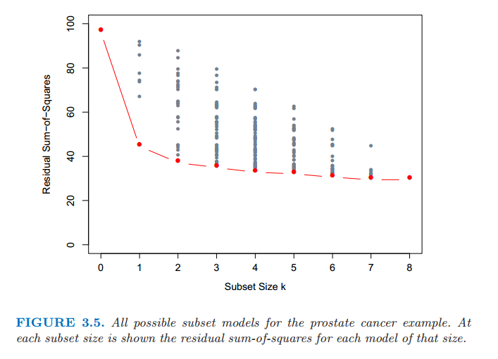
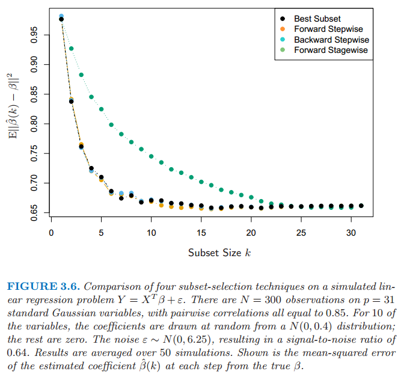
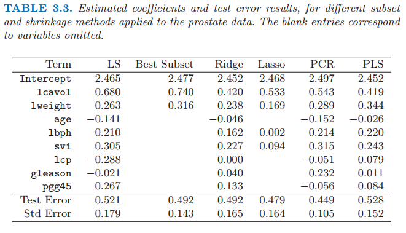
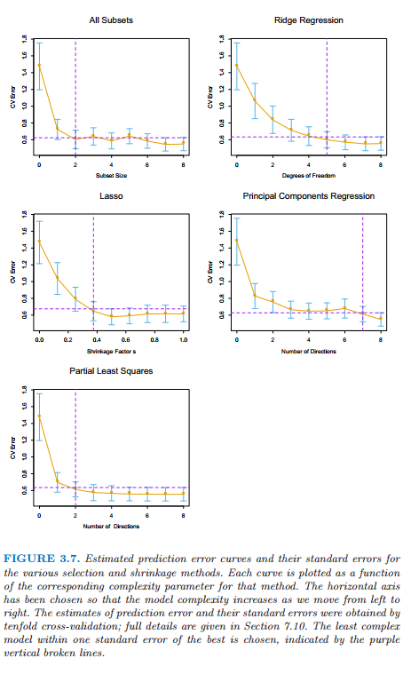

# 3.3 子集的选择

原文     | [The Elements of Statistical Learning](../book/The Elements of Statistical Learning.pdf)
      ---|---
翻译     | szcf-weiya
时间     | 2016-08-05
更新 | 2017-10-31

两个原因使得我们经常不满足最小二乘估计（3.6）

- 第一个是预测的 **精确性 (prediction accuracy)**：最小二乘估计经常有小偏差大方差。预测精确性有时可以通过收缩或者令某些系数为 0 来提高。通过这些方法我们牺牲一点偏差来降低预测值的方差，因此可能提高整个预测的精确性。
- 第二个原因是 **可解释性 (interpretation)**：有大量的预测变量，我们经常去确定一个小的子集来保持最强的影响。为了得到“big picture”，我们愿意牺牲一些小的细节。

这部分我们描述一些线性回归选择变量子集的方法。在后面的部分中我们讨论控制方差的收缩和混合的方法，以及其它降维的策略。这些都属于一个一般的方向——**模型选择 (model selection)**。模型选择不局限于线性模型；第 7 章将详细介绍这个主题。

子集选择我们只保留变量的一个子集，并且除去模型中的剩余部分。最小二乘回归用来预测保留下来的输入的系数。这里有一系列不同的选择子集的策略。

## 最优集的选择

对于每个 $k\in \\{0,1,2,\ldots,p\\}$，最优子集回归要找出残差平方和（3.2）最小的规模为 $k$ 的子集。一个有效的算法——leaps and bounds 过程(Furnival and Wilson, 1974)——当 $p$ 达到 30 或 40 是可行的。图 3.5 展示了前列腺癌例子中所有的子集模型。下界代表通过最优子集方法选择的符合条件的模型。举个例子，注意到规模为 2 的最优子集不需要包含规模为 1 最优子集中的变量（这个例子中所有的子集是嵌套的）。最优子集曲线（图 3.5 中的红色下边界）必然地下降，所以不能用来选择子集的规模 $k$。怎样选择 $k$ 涉及偏差和方差之间的平衡，以及追求简洁的主观要求。有许多可能会使用的准则，一般地，我们选择最小的模型使得预测误差期望值的估计最小。

> 图 3.5：前列腺癌例子中所有可能的子集模型。在每个子集规模下显示了该规模下每个模型的残差平方和。

本章中我们讨论的许多方法都是相似的，因为它们使用训练数据去得到区别于复杂度和由单参数编码的模型序列。下一节我们采用交叉验证去估计预测误差并选择$k$；AIC 准则是一个受欢迎的选择。我们将更多的细节讨论和其他方法推迟到第 7 章讨论。

## 向前和向后逐步选择

与其搜索所有可能的子集（当 $p$ 大于 40 不可行），我们可以利用它们寻找一个很好的途径。向前逐步选择从截距开始，然后向模型中依次添加最大程度提升拟合效果的预测变量。有大量的备选预测变量时，会需要大量的计算；然而，聪明地更新算法可以由 QR 分解从当前拟合快速得到下一步的备选预测变量（[练习 3.9](https://github.com/szcf-weiya/ESL-CN/issues/179)）。类似最优子集回归，向前逐步产生由 $k$ 编码的模型序列，$k$ 为子集规模，必须确定 $k$ 值。

向前逐步选择是贪心算法，产生一个嵌套的模型序列。从这点来看与最优子集选择相比似乎是次优的。然而，有许多原因显示向前逐步可能是更好的：

- 计算（computational）；对于大的$p$值，我们不能计算最优子集序列，但是我们总是可以计算向前逐步序列（即使 $p>>N$）
- 统计（statistical）；在每个规模下选择最优子集需要在方差上付出代价；向前逐步是一种有更多约束的搜索，而且将会有更低的方差，但是可能更大的偏差。

向后逐步选择从整个模型开始，并且逐步删掉对拟合影响最低的预测变量。要删掉的候选变量是Z分数最低的变量（练习3.10）。向后只能用于$N>p$时，而向前逐步总是可以使用。

图 3.6 展示了一个用于比较最优子集回归和简单的向前向后选择的小型仿真研究的结果。它们的表现非常相似，而且总是这样的结果。图中也包含了向前 Stagewise 回归（下一节），它需要更长时间达到最小误差。

> 图 3.6 在一个仿真的线性回归问题$Y=X^T\beta+\varepsilon$中四种子集选择的比较。在$p=31$个标准高斯变量有$N=300$个观测，pairwise相关系数都等于0.85。其中10个变量的系数是从$N(0,0.4)$分布中随机选取的，其它为0。噪声$\varepsilon \sim N(0,6.25)$,信噪比为0.64。结果取自50次仿真的平均值。图中展示了每一步系数$\hat{\beta}(k)$估计值与真值$\beta$的均方误差

在前列腺癌例子中，最优子集、向前和向后选择都给出了完全相同的项的序列。

一些软件包实现混合的逐步选择策略，在每一步同时考虑向前和向后的移动，然后选择两者中最好的一个。举个例子，在R包中step函数使用AIC准则来加权选择，能够合理考虑到拟合参数的个数；在每一步执行添加或删除来最小化AIC分数。

其它传统的包中的选择基于$F$统计量，加入“显著性”的项，然后删掉“非显著性”的项。这些不再流行，因为它们没有合理考虑到多重检验的问题。模型搜索后打印出所选择的模型的摘要是很吸引人的，如表3.2所示；然而，标准误差不是有效的，因为它们不考虑搜索的过程。自助法（8.2节）在这些设定下是有用的。

最后，我们注意到变量经常成群出现（比如用来编码多层次类别型预测变量的虚拟变量）。智能逐步过程（比如R中的step函数）会合理考虑到它们的自由度会一次添加或删除整个群体。

## 向前逐渐(Forward-Stagewis)回归

!!! note "weiya 注"
    考虑到 Forward-Stagewise 可能需要比Forward-Stepwise花更多的步骤完成拟合，也就表明其跨度小，所以我翻译为“逐渐回归”。

Forward-Stagewise 回归比向前逐步回归有更多限制。开始类似向前逐步回归，由等于$\bar{y}$的截距开始，中心化后的预测变量系数都初始化为0。每一步算法鉴别出与当前残差最相关的变量。然后计算所选择变量的残差的简单线性回归系数，并且添加到该变量的当前系数。这个过程一直继续直到没有变量与残差有相关性——比如，当$N>p$时的最小二乘拟合。

不同于向前逐步回归，当一项添加到模型中没有其他的变量需要调整。结果是，向前stage需要多采取$p$步达到最小二乘拟合，之前被反驳效率很低。但这种“慢拟合”高维问题中会有很好的结果。我们在 3.8.1 节看到向前 stage 以及变体，该变体很有竞争力，它能够更加放慢拟合速度，特别是在维度非常高的空间中。

向前 stage 回归包含在图 3.6 中。在这个例子中花了 1000 步使得所有相关系数低于 $10^{-4}$。对于规模为 $k$ 的子集，我们画出最后一步的误差，此时有 $k$ 个非零系数。尽管能够追上最优拟合，但需要花更长的时间。

## 前列腺癌例子（继续）

表 3.3 展示了一系列不同选择和收缩方法的系数。它们是使用所有子集搜索的最优子集选择，岭回归，lasso，主成分回归和最小二偏差。每种方法有一个复杂度参数，并且基于 10 折交叉验证最小化预测误差来选择模型；7.10节中给出了全部细节。简短地说，交叉验证通过将训练数据随机分成10等份。该学习方法是在复杂度参数的取值范围内对十分之九的数据进行拟合，然后用剩下的十分之一的数据计算预测误差。依次对每个十分之一的数据进行上述计算，然后对10个预测误差的估计进行平均。最后我们可以得到预测误差估计作为复杂度函数的曲线。

注意到我们已经把这些数据分成了规模为67的训练集和规模为30的测试集。对训练集进行交叉验证，因为选择收缩参数是训练过程的一部分。测试集是用来判断所选择的模型的表现。

图 3.7 展示了估计的预测误差曲线。在它们最小值附近的比较大的范围内许多曲线都是非常平坦的。图中包括每个估计的误差率时的标准误差带，它是根据由交叉验证计算得到的十个误差估计计算的。我们已经使用“一个标准误差”规则——在最小值的一个标准误差范围内我们选取最简洁的模型（p244,7.10节）。这个规则承认权衡曲线估计存在误差这一事实，并且因此采取一个保守的方式。

最优子集的选择决定使用两个预测变量lcvol和lcweight。表格的最后两行给出了测试集上预测误差的平均值（和它的标准误差估计）

> 图3.7 不同选择和收缩方法的预测误差的估计值曲线和它们的标准误差。每条曲线绘制成关于该方法对应的复杂度参数的函数。选定水平坐标轴则当我们从左侧移动到右侧模型复杂度增加。预测误差的估计和它们的标准误差由10折交叉验证得到；全部的细节在7.10节给出。在一个标准误差范围内的复杂度最低的模型选定，用紫色的垂直虚线表示。
