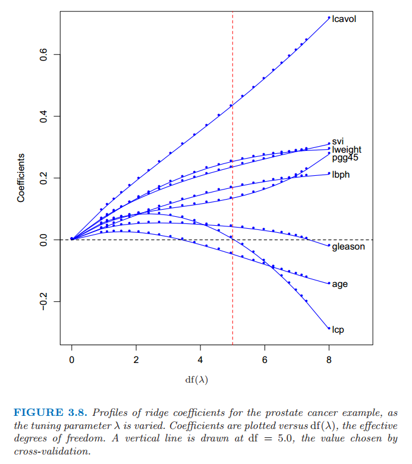
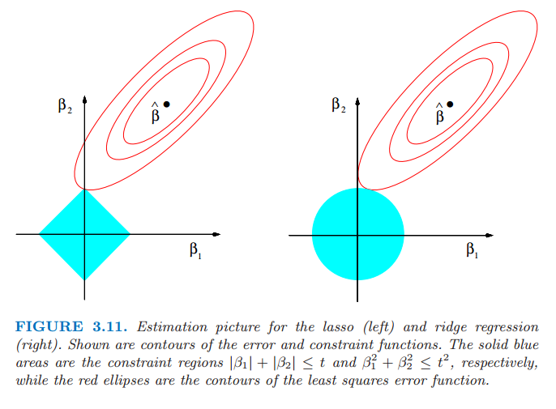
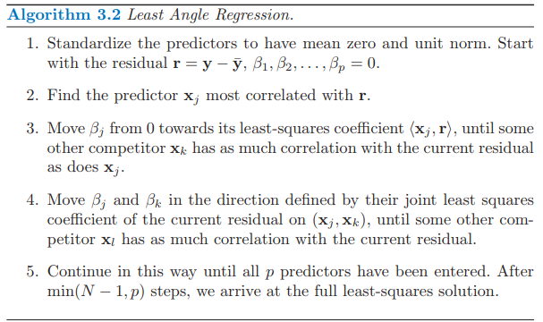
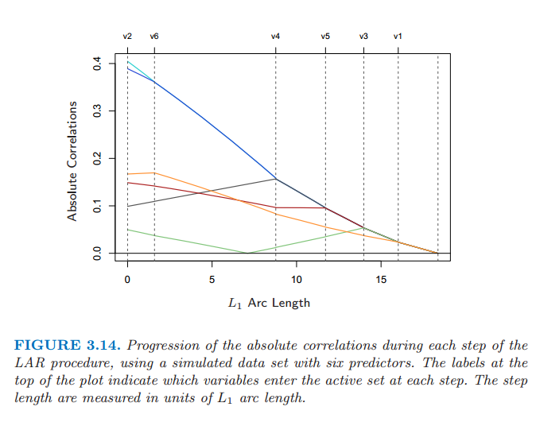
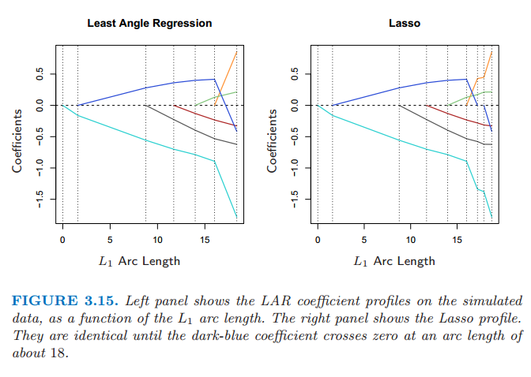
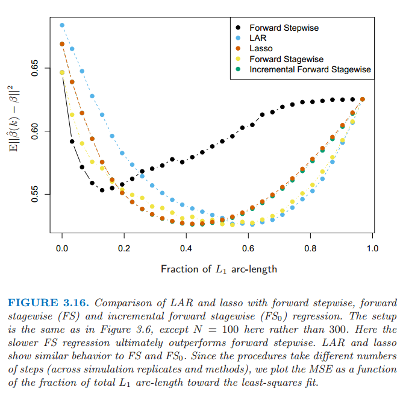

# 3.4 收缩的方法

| 原文   | [The Elements of Statistical Learning](../book/The Elements of Statistical Learning.pdf) |
| ---- | ---------------------------------------- |
| 翻译   | szcf-weiya                               |
| 时间   | 2016-09-30:2016-10-14                    |
|更新| 2018-03-22, 2018-03-23, 2018-03-24|
|状态|Done|

通过保留一部分预测变量而丢弃剩余的变量，**子集选择 (subset selection)** 可得到一个可解释的、预测误差可能比全模型低的模型。然而，因为这是一个离散的过程（变量不是保留就是丢弃），所以经常表现为高方差，因此不会降低全模型的预测误差。而**收缩方法 (shrinkage methods)** 更加连续，因此不会受**高易变性 (high variability)** 太大的影响。

## 岭回归

**岭回归 (Ridge regression)** 根据回归系数的大小加上惩罚因子对它们进行收缩。岭回归的系数使得带惩罚的残差平方和最小

$$
\hat{\beta}^{ridge}=\underset{\beta}{\arg\min}\Big\{\sum\limits_{i=1}^N(y_i-\beta_0-\sum\limits_{j=1}^px_{ij}\beta_j)^2+\lambda\sum\limits_{j=1}^p\beta_j^2\Big\}\tag{3.41}
$$

这里$\lambda\ge 0 $是控制收缩程度的参数：$\lambda$值越大，收缩的程度越大。每个系数都向零收缩。<!--系数向零收缩（并且彼此收缩到一起）。-->通过参数的平方和来惩罚的想法也用在了神经网络，也被称作**权重衰减 (weight decay)**（[第 11 章](../11-Neural-Networks/11.3-Neural-Networks/index.html)）。

岭回归问题可以等价地写成

$$
\begin{align*}
\hat{\beta}^{ridge}&=\underset{\beta}{\arg\min}\sum\limits_{i=1}^N(y_i-\beta_0-\sum\limits_{j=1}^px_{ij}\beta_j)^2\\\
& \text{subject to }\sum\limits_{j=1}^p\beta_j^2 \le t
\end{align*}
\tag{3.42}
$$

上式用参数显式表达了对回归参数大小的约束。

!!! note "weiya 注："
    式 $(3.41)$ 其实是对式 $(3.42)$ 应用 Lagrange 乘子法得到的。

$(3.41)$ 中的 $\lambda$ 和 $(3.42)$ 中的 $t$ 存在一一对应。当在线性回归模型中有许多相关变量，它们的系数可能很难确定且有高方差。某个变量的较大的正系数可以与相关性强的变量的差不多大的负系数相互抵消。通过对系数加入大小限制，如 $(3.42)$，这个问题能得以减轻。

!!! note "weiya 注："
    这里说的是，在没有对参数大小进行限制前，会存在一对相关性强的变量，它们系数取值符号相反，但绝对值差不多大，会大大增加方差，这也就是高方差的体现，但其实它们的合作用效果近似为 $0$，所以考虑引进对参数大小的惩罚。

对输入按比例进行缩放时，岭回归的解不相等，因此求解 $(3.41)$ 前我们需要对输入进行标准化。另外，注意到惩罚项不包含截距 $\beta_0$。对截距的惩罚会使得过程依赖于 $\mathbf{Y}$ 的初始选择；也就是，对每个 $y_i$ 加上常数 $c$ 不是简单地导致预测值会偏离同样的量 $c$。可以证明（[练习 3.5](https://github.com/szcf-weiya/ESL-CN/issues/95)）经过对输入进行中心化（每个 $x_{ij}$ 替换为 $x_{ij}-\bar x_j$）后，$(3.41)$ 的解可以分成两部分。我们用 $\bar y=\frac{1}{N}\sum_1^Ny_i$ 来估计 $\beta_0$。剩余的参数利用中心化的 $x_{ij}$ 通过无截距的岭回归来估计。今后我们假设中心化已经完成，则输入矩阵 $\mathbf X$ 有 $p$（不是 $p+1$）列。

!!! info "weiya 注：Ex. 3.5"
    已解答，详细证明过程见 [Issue 95: Ex. 3.5](https://github.com/szcf-weiya/ESL-CN/issues/95)

将 $(3.41)$ 的准则写成矩阵形式

$$
\RSS(\lambda)=(\mathbf{y}-\mathbf{X}\beta)^T(\mathbf{y}-\mathbf{X}\beta)+\lambda\beta^T\beta \tag{3.43}
$$

可以简单地看出岭回归的解为

$$
\hat{\beta}^{ridge}=(\mathbf{X^TX}+\lambda \mathbf{I})^{-1}\mathbf{X}^T\mathbf{y}\tag{3.44}
$$

其中 $\mathbf{I}$ 为 $p\times p$ 的单位矩阵。注意到选择二次函数惩罚 $\beta^T\beta$，岭回归的解仍是 $\mathbf{y}$ 的线性函数。解在求逆之前向矩阵 $\mathbf{X^TX}$ 的对角元上加入正的常数值。即使 $\mathbf{X^TX}$ 不是满秩，这样会使得问题非奇异，而且这是第一次将岭回归引入统计学中 (Hoerl and Kennard, 1970[^1]）的主要动力。传统的岭回归的描述从定义 (3.44) 开始。我们选择通过 (3.41) 和 (3.42) 来阐述，因为这两式让我们看清楚了它是怎样实现的。

图 3.8 展示了前列腺癌例子的岭回归系数估计，绘制成关于 $\df(\lambda)$ 的函数图象，$\df(\lambda)$ 为由惩罚 $\lambda$ 得到的**有效自由度 (effective degrees of freedom)**（由式 (3.50) 中定义）。在正交输入的情形下，岭回归估计仅仅是最小二乘估计的缩小版本，也就是 $\hat{\beta}^{ridge}=\hat{\beta}/(1+\lambda)$。

> 图 3.8 当惩罚参数 $\lambda$ 不同时，前列腺癌例子岭回归的变化曲线。画出系数关于有效自由度 $\df(\lambda)$ 的曲线。垂直直线画在 $\df=5.0$ 处，这是由交叉验证选择出来的。

当给定一个合适的先验分布，岭回归也可以从后验分布的均值或众数得到。具体地，假设 $y_i \sim N(\beta_0+x^T_i\beta,\sigma^2)$，参数 $\beta_j$ 的分布均为 $N(0,\tau^2)$，每个都相互独立。则当 $\tau^2$ 和 $\sigma^2$ 值已知时，$\beta$ 后验分布密度函数的对数值（的负数）与 (3.41) 中花括号里面的表达式成比例**(weiya 注：原文直接说与花括号的表达式相等，但应该是常数倍)**，且 $\lambda=\sigma^2/\tau^2$（[练习 3.6](https://github.com/szcf-weiya/ESL-CN/issues/96))。因此岭回归估计是后验分布的众数；又因分布为高斯分布，则也是后验分布的均值。

!!! info "weiya 注：Ex. 3.6"
    将解答过程移至[Issue 96: Ex. 3.6](https://github.com/szcf-weiya/ESL-CN/issues/96)。

<!--
> **weiya注：**
>
>
> $$
> \begin{align}
> f(\beta\mid y)&=\dfrac{f(\beta, y)}{f(y)}\\\
> &=\dfrac{f(\beta,y)}{\int f(y\mid\beta)f(\beta)}\\\
> &\sim f(y\mid\beta)f(\beta)\\\
> &=Cexp\Big\{-\frac{1}{2\sigma^2}\Big[(y-\beta_0-X\beta)'(y-\beta_0-X\beta)+\frac{\sigma^2}{\tau^2}\beta'\beta\Big]\Big\}
> \end{align}
> $$
>
> $\color{red} 疑问：C是多少？$
> 通过
> $$
> \int Cf(\beta\mid y)d\beta=1
> $$
> 来确定C
> $$
> C = \dfrac{1}{(2\pi)^N\tau\sigma \Vert XX'\Vert^{1/2}}
> $$
>
>
> 取对数，有
> $$
> log(f(\beta\mid y))=-\frac{1}{2\sigma^2}[(y-\beta_0-X\beta)'(y-\beta_0-X\beta)+\frac{\sigma^2}{\tau^2}\beta'\beta]+log(C)
> $$
>
> 则$\lambda=\frac{\sigma^2}{\tau^2}$,且岭回归估计是后验分布的众数。
-->

中心化输入矩阵 $\mathbf{X}$ 的**奇异值分解 (SVD)** 让我们进一步了解了岭回归的本质。这个分解在许多统计方法分析中非常有用。$N\times p$ 阶矩阵 $\mathbf{X}$ 的 SVD 分解有如下形式

$$
\mathbf{X=UDV^T}\tag{3.45}
$$

这里 $\mathbf{U}$ 和 $\mathbf{V}$ 分别是 $N\times p$ 和 $p\times p$ 的正交矩阵，$\mathbf{U}$的列张成 $X$ 的列空间，$\mathbf{V}$ 的列张成 $X$ 的行空间。$\mathbf{D}$ 为 $p\times p$ 的对角矩阵，对角元 $d_1\ge d_2 \ge \cdots \ge d_p \ge 0$ 称作 $\mathbf{X}$ 的奇异值。如果一个或多个 $d_j=0$，则 $\mathbf{X}$ 为奇异的。

> **weiya 注：（以下关于奇异值分解内容来自张贤达的《矩阵分析与应用》）**
>
> 奇异值分解最早由Beltrami在1873年对实正方矩阵提出来的。Beltrami从双线性函数
> $$
> f(x,y)=x^TAy,\qquad A\in R^{n\times m}
> $$
> 出发，通过引入线性变换
> $$
> x=U\xi,\qquad y=V\eta
> $$
> 将双线性函数变为
> $$
> f(x,y)=\xi^TS\eta
> $$
> 式中
> $$
> S=U^TV
> $$
> 若选择$U$和$V$为正交矩阵，则他们的选择各存在$n^2-n$个自由度。他提出利用这些自由度使矩阵$S$的非对角元为0，即矩阵$S=\Sigma=diag(\sigma_1,\sigma_2,\ldots,\sigma_n)$为对角矩阵。则
> $$
> A=U\Sigma V^T
> $$
> 这是Beltrami于1873年得到的实正方矩阵的奇异值分解。后来，Autonne于1902年把奇异值分解推广到复正方矩阵；Eckart与Young于1939年又进一步把它推广到一般的长方形矩阵。因此，现在常将任意复长方矩阵奇异值分解定理称为Autonee-Eckart-Young定理，详见下述
>
>
> **令$A\in R^{m\times n}$(或$C^{m\times n}$),则存在正交（或酉）矩阵$U\in R^{m\times m}$(或$C^{m\times m}$)和$V\in R^{n\times n}$(或$C^{n\times n}$)使得**
> $$
> A=U\Sigma V^T(or\quad U\Sigma V^H)
> $$
> 式中
> $$
> \Sigma=
> \left[
> \begin{array}{cc}
> \Sigma_1&O\\
> O&O
> \end{array}
> \right]
> $$
> 且$\Sigma_1=diag(\sigma_1,\sigma_2,\ldots,\sigma_r)$,其对角元素按照顺序
> $$
> \sigma_1\gt \sigma_2\cdots\ge\sigma_r>0,\qquad r=rank(A)
> $$
> 排列
>
>  **以下说明来自wiki:**
> 这里的奇异值分解称作Thin SVD
> $$
> M=U_n\Sigma_nV^T
> $$
> 只有$U$中对应$V^T$中行向量的$n$个列向量被计算，$U$的其它列不被计算。$U_n$为$m\times n$,$\Sigma_n$为$n\times n$的对角矩阵，$V$是$n\times n$

利用奇异值分解，通过简化我们可以把最小二乘拟合向量写成

$$
\begin{align}
\mathbf{X}\hat{\beta}^{ls}&=\mathbf{X(X^TX)^{-1}X^Ty}\notag\\
&=\mathbf{UU^Ty}\tag{3.46}
\end{align}
$$

注意到 $\mathbf{U}^T\mathbf y$ 是 $\mathbf{y}$ 正交基 $\mathbf{U}$ 下的坐标。同时注意其与 (3.33) 的相似性；$\mathbf{Q}$ 和 $\mathbf{U}$ 是 $\mathbf{X}$ 列空间的两个不同的正交基（[练习 3.8](https://github.com/szcf-weiya/ESL-CN/issues/97)）。

!!! info "weiya 注：Ex. 3.8"
    已解答，具体证明过程见 [Issue 97: Ex. 3.8](https://github.com/szcf-weiya/ESL-CN/issues/97)

现在岭回归的解为

$$
\begin{align}
\mathbf{X}\hat{\beta}^{ridge}&=\mathbf{X}(\mathbf{X^TX}+\lambda \mathbf{I})^{-1}\mathbf{X^Ty}\notag\\
&= \mathbf{UD}(\mathbf{D^2}+\lambda \mathbf{I})^{-1}\mathbf{DU^Ty}\notag\\
&= \sum\limits_{j=1}^p\mathbf{u}_j\dfrac{d_j^2}{d_j^2+\lambda}\mathbf{u_j^Ty}\tag{3.47}
\end{align}
$$

其中 $\mathbf{u}_j$ 是 $\mathbf{U}$ 的列向量。注意到因为 $\lambda \ge 0$，我们有 $d_j^2/(d^2_j+\lambda)\le 1$。类似线性回归，岭回归计算 $\mathbf{y}$ 关于正规基 $\mathbf{U}$ 的坐标。通过因子 $d^2_j/(d^2_j+\lambda)$ 来收缩这些坐标。这意味着更小的 $d_j^2$ 会在更大程度上收缩基向量的坐标。

$d_j^2$ 值小意味着什么？中心化后的矩阵 $\mathbf{X}$ 的奇异值分解是表示 $\mathbf{X}$ 中主成分变量的另一种方式。样本协方差矩阵为 $\mathbf{S=X^TX}/N$<!--$\mathbf{S={\color{red} E((X-EX)^T(X-EX))=}X^TX}/N$-->，并且从 (3.45) 式我们得到

$$
\mathbf{X^T X = VD^2V^T} \tag{3.48}
$$

上式是 $\mathbf{X^TX}$（也是 $S$，取决于因子 $N$）的**特征值分解 (eigen decomposition)**。特征向量 $v_j$（$\mathbf{V}$ 的列向量）也称作 $\mathbf{X}$ 的**主成分**（或 Karhunen-Loeve）方向。第一主成分方向 $v_1$ 有下面性质：$\mathbf{z}_1=\mathbf{X}v_1$ 在所有 $\mathbf{X}$ 列的标准化线性组合中有最大的样本方差。样本方差很容易看出来是

$$
\Var(\mathbf{z}_1)=\Var(\mathbf{X}v_1)=\dfrac{d_1^2}{N}\tag{3.49}
$$

事实上 $\mathbf{z}_1=\mathbf{X}v_1=\mathbf{u}_1d_1$。导出变量 $\mathbf{z_1}$ 称作 $\mathbf{X}$ 的第一主成分，因此 $\mathbf{u_1}$ 是标准化的第一主成分。后面的主成分 $z_j$ 在与前一个保持正交的前提下有最大的方差 $d_j^2/N$。所以，最后一个主成分有最小的方差。因此最小的奇异值 $d_j$ 对应 $\mathbf{X}$ 列空间的最小方差的方向，并且岭回归在这些方向上收缩得最厉害。

图 3.9 展示了两个维度下部分数据点的主成分。如果我们考虑在这个区域（$Y$ 轴垂直纸面）内拟合线性曲面，数据的结构形态使得确定梯度时长方向会比短方向更精确。岭回归防止在短方向上估计梯度可能存在的高方差。隐含的假设是响应变量往往在高方差的输入方向上变化。这往往是个合理的假设，因为我们所研究的预测变量随响应变量变化而变化，而不需要保持不变。

> 图 3.9 部分输入数据点的主成分。最大主成分是使得投影数据方差最大的方向，最小主成分是使得方差最小的方向。岭回归将 $\mathbf{y}$ 投射到这些成分上，然后对低方差成分的系数比高方差收缩得更厉害。

在图 3.7 中我们已经画了预测误差估计值关于 $\df(\lambda)$ 的曲线

$$
\begin{align}
\df(\lambda)&=\tr[\mathbf{X}(\mathbf{X^TX}+\lambda\mathbf{I})^{-1}\mathbf{X}^T]\notag\\
&=\tr(\mathbf{H}_{\lambda})\notag\\
&=\sum\limits_{j=1}^p\dfrac{d_j^2}{d_j^2+\lambda}\tag{3.50}
\end{align}
$$

上面 $\lambda$ 的单调递减函数是岭回归拟合的**有效自由度 (effective degrees of freedom)**。通常在含 $p$ 个变量的线性回归拟合中，拟合的自由度为 $p$，也就是无约束参数的个数。这里想法是尽管岭回归拟合中所有的 $p$ 个系数都不为 0，但是它们在由 $\lambda$ 控制的约束下拟合。注意到当 $\lambda=0$（没有正则化）时 $\df(\lambda)=p$，并且当 $\lambda\rightarrow \infty$ 时 $df(\lambda)\rightarrow 0$。当然总是对于截距总有一个额外的自由度，事先 (apriori) 已经去掉了。这个定义将在 [3.4.4 节](#_2)和 [7.4-7.6 节](../07-Model-Assessment-and-Selection/7.4-Optimism-of-the-Training-Error-Rate/index.html)中详细介绍。图 3.7 中最小值在 $\df(\lambda)=5.0$ 处。表 3.3 表明岭回归将全最小二乘估计的测试误差降低了一小部分。

## Lasso

!!! note "weiya 注："
    lasso 是 “Least absolute shrinkage and seleetion operator” 的首字母缩写。

lasso 像岭回归一样是个收缩方法，有微妙但很重要的区别。lasso 估计定义如下

$$
\begin{align}
\hat{\beta}^{lasso}&=\underset{\beta}{\arg\min}\sum\limits_{i=1}^N(y_i-\beta_0-\sum\limits_{j=1}^px_{ij}\beta_j)^2\notag\\
&\text{subject to }\sum\limits_{j=1}^p\vert\beta_j\vert\le t \tag{3.51}
\end{align}
$$

正如在岭回归中一样，我们可以通过标准化预测变量来对常数 $\beta_0$ 再参量化；$\hat{\beta}_0$ 的解为 $\bar{y}$，并且后面我们拟合无截距的模型（[练习 3.5](https://github.com/szcf-weiya/ESL-CN/issues/95)）。

!!! info "weiya 注：Ex. 3.5"
    已解答，详细证明过程见 [Issue 95: Ex. 3.5](https://github.com/szcf-weiya/ESL-CN/issues/95)

在信号处理中，lasso 也被称作 basis pursuit (Chen et al., 1998[^2])

我们也可以把 lasso 问题等价地写成**拉格朗日形式 (Lagrangian form)**

$$
\hat{\beta}^{lasso}=\underset{\beta}{\arg\min}\Big\{\sum\limits_{i=1}^N(y_i-\beta_0-\sum\limits_{j=1}^px_{ij}\beta_j)^2+\lambda\sum\limits_{j=1}^p\vert\beta_j\vert\Big\}\tag{3.52}
$$

注意到这与岭回归问题 (3.42) 或 (3.41) 的相似性：$L_2$ 的岭回归惩罚 $\sum_1^p\beta^2_j$ 替换为 $L_1$ 的 lasso 惩罚$\sum_1^p\vert\beta_j\vert$。后一约束使得解在 $y_i$ 处非线性，并且在岭回归中没有相近的表达式。计算 lasso 的解是一个二次规划问题，尽管我们在 3.4.4 节看到当 $\lambda$ 不同时计算解的整个路径存在与岭回归同样计算量的有效算法。由于该约束的本质，令 $t$ 充分小会造成一些参数恰恰等于 0。因此 lasso 完成一个温和的连续子集选择。如果所选的 $t$ 大于$t_0=\sum_1^p\vert\hat{\beta}_j\vert$（其中 $\hat{\beta}_j=\hat{\beta}_j^{ls}$，$\hat{\beta}_j^{ls}$ 为最小二乘估计），则 lasso 估计为 $\hat{\beta}_j$。另一方面，当 $t=t_0/2$，最小二乘系数平均收缩 $50\%$。然而，收缩的本质不是很显然，我们将在 3.4.4 节进一步研究。类似在变量子集选择中子集的大小，或者岭回归的惩罚参数，应该自适应地选择 $t$ 使预测误差期望值的估计最小化。

图 3.7 中，为了方便解释，我们已经画出 lasso 的预测误差估计关于标准化参数 $s=t/\sum^p_1\vert\hat{\beta}_j\vert$ 的曲线。通过 10 折交叉验证选择 $s\approx 0.36$；这使得 4 个系数为 0（表 3.3 的第 5 列）。最终模型有第二低的测试误差，比全最小二乘模型略低，但是测试误差估计的标准误差（表 3.3 的最后一行）相当大。

图 3.10 显示了当惩罚参数 $s=t/\sum_1^p\vert\hat{\beta}_j\vert$ 不同时的 lasso 系数。当 $s=1.0$ 时为最小二乘估计；当 $s\rightarrow 0$ 时下降为 0。该下降不总是严格单调的，尽管例子中确实是。在 $s=0.36$ 处画了垂直直线，该值通过交叉验证来选择。

> 图 3.10 当惩罚参数 $t$ 变化时的 lasso 系数曲线。图中画了系数关于 $s=t/\sum^p_1\vert\hat{\beta}_j\vert$ 的曲线。垂直直线画在 $s=0.36$ 处，该值通过交叉验证来选择。比较 65 页的图 3.8，lasso 曲线会达到 0，然而岭回归不会。曲线是分段线性的，所以只计算显示点处的值；详见 3.4.4 节。

## 讨论：子集的选择，岭回归，Lasso

这部分我们讨论并且比较至今为止有约束的线性回归模型的三种方法：子集选择、岭回归和 lasso。

在正交输入矩阵的情况下，三种过程都有显式解。每种方法对最小二乘估计 $\hat{\beta}_j$ 应用简单的变换，详见表 3.4。

> 表 3.4 在 $\mathbf{X}$ 为正规列情形下 $\beta_j$ 的估计值。$M$ 和 $\lambda$ 是通过对应的手段选择的常数；符号标记变量的符号（$\pm 1$），而且 $x_+$ 记 $x$ 的正数部分。下面的表格中，估计值由红色虚线来显示。灰色的 $45^{\circ}$ 直线作为参照显示了无约束的估计。

岭回归做等比例的收缩。lasso 通过常数因子 $\lambda$ 变换每个系数，在 0 处截去。这也称作“软阈限”，而且用在 [5.9 节](../05-Basis-Expansions-and-Regularization/5.9-Wavelet-Smoothing/index.html)中基于小波光滑的内容中。最优子集选择删掉所有系数小于第 $M$ 个大系数的变量；这是“硬阈限”的一种形式。

回到非正交的情形，一些图象可以帮助了解它们之间的关系。当只有两个参数时图 3.11 描绘了 lasso（左）和岭回归（右）。残差平方和为椭圆形的等高线，以全最小二乘估计为中心。岭回归的约束区域为圆盘 $\beta_1^2+\beta_2^2\le t$，lasso 的约束区域为菱形$\vert\beta_1\vert+\vert\beta_2\vert\le t$。两种方式都寻找当椭圆等高线达到约束区域的第一个点。与圆盘不同，**菱形 (diamond)** 有角；如果解出现在角上，则有一个参数 $\beta_j$ 等于 0。当 $p > 2$，菱形变成了**偏菱形 (rhomboid)**，而且有许多角，平坦的边和面；对于参数估计有更多的可能为 0。

> 图 3.11 lasso (左)和岭回归（右）的估计图象。图中显示了误差的等高线和约束函数。实心蓝色区域分别为约束区域$\vert\beta_1\vert+\vert\beta_2\vert\le t$以及$\beta^2_1+\beta_2^2\le t^2$，红色椭圆为最小二乘误差函数的等高线。

我们可以把岭回归和 lasso 一般化，并且可以看成是贝叶斯估计。考虑下面准则
$$
\tilde{\beta}=\underset{\beta}{\arg\min}\Big\{\sum\limits_{i=1}^N(y_i-\beta_0-\sum\limits_{j=1}^px_{ij}\beta_j)^2+\lambda\sum\limits_{j=1}^p\vert\beta_j\vert^q\Big\}\tag{3.53}
$$

其中 $q\ge 0$。图 3.12 显示了两个输入情形下常数值 $\sum_j\vert\beta_j\vert^q$ 的等高线。

> 图 3.12 给定值 $q$ 下常数值 $\sum_j\vert\beta_j\vert^q$ 的等高线。

将 $\vert\beta_j\vert^q$ 看成 $\beta_j$ 的先验概率密度的对数值，同样有参数先验分布的等高线。$q=0$ 对应变量子集选择，惩罚项是简单地统计非零参数的个数；$q=1$ 对应 lasso，$q=2$ 对应岭回归。注意到 $q\le 1$，先验在各方向上不是均匀的，而是更多地集中在坐标方向上。对应 $q=1$ 情形的先验分布是关于每个输入变量是的独立的二重指数分布（或者 Laplace 分布），概率密度为$(1/2\tau)exp(-\vert\beta\vert)/\tau$ 并且 $\tau=1/\lambda$。$q=1$ 的情形（lasso）是使得约束区域为凸的最小 $q$ 值；非凸约束区域使得优化问题很困难。

从这点看，lasso、岭回归和最优子集选择是有着不同先验分布的贝叶斯估计。然而，注意到它们取自后验分布的众数，即最大化后验分布。在贝叶斯估计中使用后验分布的均值更加常见。岭回归同样是后验分布的均值，但是 lasso 和最优子集选择不是。

再一次观察准则 (3.53)，我们可能尝试除 0，1，2 外的其它 $q$ 值。尽管有人可能从数据中估计 $q$，我们的经验表明引入额外的方差不值得。$q\in (1,2)$ 表明在 lasso 和岭回归之间进行权衡。当 $ q > 1$ 时尽管 $\vert\beta_j\vert^q$ 在 0 处可导，但是并没有lasso（$q=1$）的令系数恰巧为零的性质。部分由于这个原因并且考虑计算易处理，Zou and Hastie (2005)[^4] 引入弹性惩罚

$$
\lambda \sum\limits_{j=1}^p(\alpha\beta_j^2+(1-\alpha)\vert\beta_j\vert)\tag{3.54}
$$

这是一种岭回归和 lasso之间的平衡。图 3.13 比较了 $q=1.2$ 下的 $L_q$ 惩罚以及 $\alpha=0.2$ 的弹性网惩罚；很难从肉眼来观察出差异。弹性网像 lasso 一样选择变量，同时像岭回归一样收缩相关变量的系数。同时考虑了 $L_q$ 惩罚的计算优势。我们将在 [18.4节](../18-High-Dimensional-Problems/18.4-Linear-Classifiers-with-L1-Regularization/index.html)介绍弹性网惩罚。

> 图3.13 $q=1.2$ 时 $\sum_j\vert\beta_j\vert^q$ 为常数值的轮廓线（左图）以及 $\alpha=0.2$ 时弹性网惩罚 $\sum_j(\alpha\beta_j^2+(1-\alpha)\vert\beta_j\vert)$ 为常数值的轮廓线（右图）。尽管看起来很相似，弹性网有尖角（不可导），而 $q=1.2$ 的惩罚不会有尖角。

## 最小角回归

最小角回归（LAR）是相对较新的方法（Efron et al., 2004[^3]），而且可以看成是一种向前逐步回归（3.3.2节）的“民主”版本。正如我们所看到的，LAR 与 lasso 联系紧密，并且事实上提供了如图 3.10 所示的计算整个 lasso 路径的非常有效的算法。

!!! note "weiya 注："
    在 Efron 的论文中，最小角回归缩写为 LARS（S 表示 “Lasso” 和 “Stagewise”），我们这里仍以 ESL 书上的缩写为准——LAR

向前逐步回归逐步建立了一个模型，每次添加一个变量。每一步，它选出最好的变量加入活跃集，然后更新最小二乘来加入所有的活跃变量。

最小角回归采用类似的策略，但是仅仅加入一个变量应有的程度。第一步它确定与响应变量最相关的变量。不是完全的拟合该变量，LAR 使得该变量的系数向最小二乘值连续变化（使得它与进化的残差之间的相关系数绝对值降低）。只要其他变量与残差的相关性与该变量和残差的相关性相等，则该过程暂停。第二个变量加入活跃集，然后它们的系数一起以保持相关性连接以及降低的方式变化。这个过程一直继续直到所有的变量都在模型中，然后在全最小二乘拟合处停止。算法 3.2 给出了详细过程。第 5 步的终止条件需要一些解释。如果 $p >N-1$，LAR 算法经过 $N-1$ 步达到 0 残差解（$-1$ 是因为我们已经对数据进行了中心化）

****
**算法 3.2** 最小角回归
****
1. 对预测变量进行标准化处理得到零均值和标准差。从残差向量$\mathbf{r=y-\bar{y}},\beta_1,\ldots,\beta_p=0$ 开始。
2. 找出与 $\mathbf{r}$ 最相关的预测变量 $\mathbf x_j$
3. 从 0 开始移动 $\beta_j$ 一直到最小二乘系数 $\langle\mathbf x_j, \mathbf r\rangle$，直到存在其它的预测变量$\mathbf x_k$ 使得其与当前残差的相关性等于 $\mathbf x_j$ 与当前残差的相关性。
4. 在由当前残差在 $(\mathbf x_j,\mathbf x_k)$ 上的联合最小二乘系数方向上移动 $\beta_j$ 和 $\beta_k$，直到存在其它的预测变量 $x_l$ 与当前残差的相关性和当前残差与 $(\mathbf x_j,\mathbf x_k)$ 的相关性相等。
5. 按这种方式继续直到所有的 $p$ 个预测变量加入到模型中。经过 $\min(N-1, p)$ 步，我们达到了全最小二乘的解。
****

假设 $\cal A_k$ 是第 $k$ 步开始时的变量活跃集，$\beta_{\cal A_k}$ 是这一步中变量的系数向量；其中有 $k-1$ 个非零值，刚刚进入的变量系数值为 0。如果当前残差为 $\mathbf r_k=\mathbf y-\mathbf X_{\cal A_k}\beta_{\cal A_k}$，则当前步的方向为

$$
\delta_k=(\mathbf X^T_{ \cal A_k}\mathbf X_{\cal A_k})^{-1}\mathbf X^T_{\cal A_k}\mathbf r_k \tag{3.55}
$$

然后系数迭代为 $\beta_{\cal A_k} (\alpha) = \beta_{\cal A_k} + \alpha · \delta_k$。[练习 3.23](https://github.com/szcf-weiya/ESL-CN/issues/100) 证明这种方式下选择的方向满足断言：**保持（各个预测变量与残差间的）相关系数相等和递减（tied and decreasing）**。

!!! info "weiya 注：Ex. 3.23"
    已解决，具体证明过程参见[Issue 100: Ex. 3.23](https://github.com/szcf-weiya/ESL-CN/issues/100)。起初翻译时，对 tied 的理解不够，通过求解该练习题，认为 tied 意思其实就是**各个预测变量与残差之间的相关系数保持相等**。

如果该步的开始拟合向量为 $\hat{\mathbf f}\_k$，则迭代为 $\hat{\mathbf f}\_k(\alpha)=\mathbf f_k+\alpha\cdot\mathbf u_k$，其中 $\mathbf u_k=\mathbf X_{\cal A_k}\delta_k$ 是新的拟合方向。“最小角”由该过程的几何解释得到；$\mathbf u_k$ 使得活跃集 ${\cal A}_k $中预测变量间的角度最小（[练习 3.24](https://github.com/szcf-weiya/ESL-CN/issues/101)）。图 3.14 使用模拟数据显示了相关系数的绝对值下降以及每一步 LAR 算法中变量进入的顺序。

> 图 3.14：通过 6 个预测变量的拟合数据集，每一步 LAR 过程中的相关性绝对值的变化。图象上方的标签表示在每一步哪些变量加进了活跃集。步长是用单位 $L_1$ 弧长来测量的。

由构造知 LAR 的系数以一种分段线性的方式进行改变。图 3.15（左图）显示了 LAR 系数曲线作为 $L_1$ 弧长的函数曲线。

!!! note "weiya 注：原书脚注"
    $L_1$ arc length：可导曲线 $\beta(s), s \in [0,S]$ 的 $L_1$ 弧长为 $TV(\beta,S)=\int_0^S\Vert\dot{\beta}(s)\Vert_1ds$，其中 $\dot{\beta}(s)=\partial\beta(s)/\partial s$。对于分段 LAR 函数曲线，这相当于从这一步到下一步系数的 $L_1$ 范数变化之和。

> 图 3.15：左图显示了 LAR 系数作为 $L_1$ 长度的函数在模拟数据上的图象。右图显示了 Lasso 的图象。它们大概在 $L_1$ 弧长为 18 之前（深蓝色的系数曲线通过 0）都是完全相同的.

注意到我们不需要走很小的步以及重新检查步骤 3 的相关系数；应用预测变量的协方差和算法的分段线性性质，我们可以在每一步开始计算出确切的步长（[练习 3.25](https://github.com/szcf-weiya/ESL-CN/issues/98)）。

图 3.15 的右图展示了对同样数据的 lasso 系数曲线。几乎与左图相同，当绿色曲线通过 0 时首次出现不同。对于前列腺癌数据，LAR 系数曲线显示与图 3.10 的 lasso 曲线相同，该曲线从不经过 0。这些观测值促使对 LAR 算法进行简单修改，给出了整个 lasso 路径，它同样也是分段线性的。

****
**算法 3.2a** 最小角回归：Lasso修正
****
4a. 如果一个非零的系数达到0，则从变量的活跃集中删除该变量并且重新计算当前的联合最小二乘方向。
****

LAR(lasso) 算法是非常有效的，需要用 $p$ 个预测变量的单最小二乘拟合的相同步骤进行计算。最小角回归总是需要 $p$ 步达到全最小二乘估计。lasso 路径可能超过 $p$ 步，尽管这两者经常是非常相似的。经过 lasso 修正的 3.2a 的算法 3.2 是计算任何一个lasso 问题的有效方式，特别是当 $p > >N$。Osborne et al. (2000a)[^5] 也发现了计算 lasso 的分段线性的路径，他们称之为**同伦 (homotopy)** 算法。

我们已经给出一个为什么这些过程很相似的启发式的论据。尽管 LAR 算法是用相关性来叙述的，但如果输入特征是标准化的，它与内积是等价的并且用内积更简单。假设 $\cal A$ 是算法中某些步的变量活跃集，它们与当前残差 $\mathbf y -\mathbf X\beta$ 的内积的绝对值是结合在一起的。我们可以表达成

$$
\mathbf x_j^T(\mathbf y-\mathbf X\beta)=\gamma\cdot s_j,\forall j\in {\cal A} \tag{3.56}
$$

其中 $s_j\in\\{-1,1\\}$ 表示内积的符号，$\gamma$ 是普通的数值。并且 $\vert \mathbf x_k^T(\mathbf y-\mathbf X\beta)\vert\le \gamma\; \forall k\notin \cal A$。现在我们考虑 (3.52) 的 lasso 准则，我们可以写成向量形式

$$
R(\beta)=\frac{1}{2}\Vert\mathbf y-\mathbf X\beta\Vert_2^2+\lambda\Vert\beta\Vert_1\tag{3.57}
$$

令 $\cal B$ 为在给定 $\lambda$ 值下解中的变量的活跃集。对于这些变量 $R(\beta)$ 是可导的，并且**平稳条件 (stationary condition)** 为

$$
\mathbf x_j^T(\mathbf y-\mathbf X\beta)=\lambda\cdot \sign(\beta_j),\forall j\in {\cal B}\tag{3.58}
$$

比较（3.58）和（3.56），我们看到只有当$\beta_j$的符号与内积的符号相同。这也就是为什么 LAR 算法和 lasso 当一个活跃系数经过零开始出现不同；对于不满足条件 (3.58) 的变量，会被踢出活跃集 $\cal B$。[练习 3.23]() 证明了这些等式表明随$\lambda$ 减小的分段线性系数曲线。对于不活跃的变量的平稳条件要求

$$
\vert\mathbf x_k^T(\mathbf y-\mathbf X\beta)\vert\le\lambda,\forall k\notin{\cal B}\tag{3.59}
$$

这与 LAR 算法一致。

> 图 3.16：LAR、lasso、向前逐步、向前逐渐（FS）和增长向前逐渐（$FS_0$）回归之间的比较。设定与图3.6相同，除了这里$N=100$而不是300.这里较慢的$FS$回归最终表现得比向前逐步好。LAR和lasso表现得和FS、$FS_0$相似。因为这些过程采取不同的步数（根据模拟复制和方法），我们画出最小二乘拟合的MSE关于整体$L_1$弧长的片段的函数。

图 3.16 将 LAR 和 lasso 与向前逐步（forward stepwise）和向前逐渐（forward stagewise）回归进行比较。设定与图 3.6 是相同的，除了这里的 $N=100$ 而不是 $300$，所以这个问题更加困难。我们可以看到增长性更快的向前逐步很快地过拟合（10 个变量加入模型中之前是很好的），最终比增长性较慢的向前逐渐回归表现得更差。LAR 和 lasso 的行为与向前逐渐回归相似。增长的向前逐渐回归与 LAR 和 lasso 类似，并且将在 [3.8.1 节](../03-Linear-Methods-for-Regression/3.8-More-on-the-Lasso-and-Related-Path-Algorithms/index.html)中描述。

### LAR 和 Lasso 自由度公式

假设我们通过最小角回归过程拟合了线性模型，在某步 $k < p$ 停止，或者等价地用 lasso 的界 $t$ 得到约束情况下的全最小二乘拟合。我们需要多少参数，或者自由度？

首先考虑采用 $k$ 个特征的子集的线性回归。如果这个子集是没有通过训练数据而事先确定好的，然后在该拟合模型中的自由度定义为$k$。当然，在经典统计学中，线性独立参数的个数也就是自由度。另外地，假设我们用一个最优子集选择确定了最优的 $k$ 个预测变量。于是结果模型中有 $k$ 个参数，但在某种意义上我们用了大于 $k$ 个的自由度。

我们需要一个对于自适应拟合模型的有效自由度的一般定义。我们定义拟合向量 $\hat{\mathbf y}=(\hat y_1,\hat y_2,\ldots,\hat y_N)$ 的自由度为
$$
\df(\hat{\mathbf y})=\frac{1}{\sigma^2}\sum\limits_{i=1}^N\Cov(\hat y_i,y_i)\tag{3.60}
$$
这里 $\Cov(\hat y_i,y_i)$ 指的是预测值 $\hat y_i$ 和其对应的输出向量 $y_i$ 之间的协方差。直观上看有意义：当拟合数据越困难，协方差会越大，从而 $\df(\hat{\mathbf y})$ 越大。表达式（3.60）是一个有用的自由度的概念，可以应用到任何模型的预测向量 $\hat{\mathbf y}$。其中包括那些对训练数据自适应拟合的模型。这个定义将在 [7.4-7.6 节](../07-Model-Assessment-and-Selection/7.6-The-Effective-Number-of-Parameters/index.html) 中进一步讨论。

现在对于有 $k$ 个固定预测变量的线性回归模型，可以简单地证明 $\df(\hat{\mathbf y})=k$。同样地，对于岭回归，这一定义导出表达式（3.50）的**闭型解 (closed-form)**：$\df(\hat{\mathbf{y}})=\tr(\mathbf S_\lambda)$。

!!! note "weiya 注：closed form expression"
    根据 [wiki: Closed-form expression](https://en.wikipedia.org/wiki/Closed-form_expression)，closed-form 是指可以进行有限次赋值的表达式，依此理解，有显示解的为 closed form。

在这些情况下，(3.60) 可以很简单地进行赋值因为 $\hat{\mathbf{y}}=\mathbf{H}_\lambda\mathbf y$ 关于 $\mathbf y$ 是线性的。如果我们考虑在大小为 $k$ 的最优子集选择中的定义 (3.60)，似乎显然有 $\df(\hat{\mathbf y})$ 会大于 $k$，并且可以通过运用模拟的方法直接地估计 $\Cov(\hat y_i,y_i)/\sigma^2$ 来验证。然而估计最优子集选择的 $\df(\hat{\mathbf y})$ 没有**闭形式 (closed form)**。

对于 LAR 和 lasso，会发生很奇怪的事情。这些技巧的自适应方式比最优集选择更加光滑，因此估计自由度会更加地难以驾驭。特别地，可以证明经过 $k$ 步 LAR 过程，拟合向量的有效自由度恰巧是 $k$。对于 lasso，（改进的）LAR 过程经常需要多余 $k$ 的步骤，因为可以删去预测变量。因此，定义有点不一样；对于 lasso，在任一小步 $\df(\hat{\mathbf y})$ 近似等于模型中预测变量的个数。然而这种近似在 lasso 路径中的任何地方都表现得很好，但是对于每个 $k$，它在包含 $k$ 个预测变量的序列中最后一个模型表现得最好。关于 lasso 自由度详细的研究或许可以在 Zou et al. (2007)[^6] 中找到。

[^1]: Hoerl, A. E. and Kennard, R. (1970). Ridge regression: biased estimation for nonorthogonal problems, Technometrics 12: 55–67.
[^2]: Chen, S. S., Donoho, D. and Saunders, M. (1998). Atomic decomposition by basis pursuit, SIAM Journal on Scientific Computing 20(1): 33–61.
[^3]: Efron, B., Hastie, T., Johnstone, I. and Tibshirani, R. (2004). Least angle regression (with discussion), Annals of Statistics 32(2): 407–499.
[^4]: Zou, H. and Hastie, T. (2005). Regularization and variable selection via the elastic net, Journal of the Royal Statistical Society Series B. 67(2): 301–320.
[^5]: Osborne, M., Presnell, B. and Turlach, B. (2000a). A new approach to variable selection in least squares problems, IMA Journal of Numerical Analysis 20: 389–404.
[^6]: Zou, H., Hastie, T. and Tibshirani, R. (2007). On the degrees of freedom of the lasso, Annals of Statistics 35(5): 2173–2192.