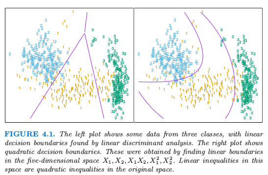

# 4.1 导言

| 原文   | [The Elements of Statistical Learning](../book/The Elements of Statistical Learning.pdf) |
| ---- | ---------------------------------------- |
| 翻译   | szcf-weiya                               |
| 时间   | 2016-12-06                               |
|更新|2018-02-12, 2018-03-10|
|状态|Done|

在这章我们重新回到分类问题上，并且集中在分类的线性方法上。因为我们的预测变量 $G(x)$ 是在离散集 $\cal G$ 中取值，所以我们总是可以把输入空间分成一些区域的集合，根据分类来标记这些区域。在第2章我们看到这些区域的边界依赖于预测函数，边界会因此变得粗糙或者光滑。这个过程的一个很重要的类是**线性判别边界 (decision boundaries)** 的情形；这也是我们说的分类的线性方法。

可以通过许多不同的方式找到线性判别边界。在第二章中，我们根据类别指示变量拟合线性回归模型，并分到最大的拟合值的类别。假设有 $K$ 个类别，为了方便记为 $1,2,\ldots,K$，第 $k$ 个响应的指示变量拟合的线性模型为 $\hat f_k(x)=\hat\beta_{k0}+\hat\beta_k^Tx$。第 $k$ 类和第 $l$ 类的判别边界是满足 $\hat f_k(x)=\hat f_\ell(x)$ 的点的集合，也就是集合 $\\{x:(\hat\beta_{k0}-\hat\beta_{\ell 0})+(\hat\beta_k-\hat\beta_\ell)^Tx=0\\}$，这是一个仿射集或者超平面。

!!! note "weiya 注：作者脚注"
    严格来说，超平面需要通过原点，而仿射集不需要。我们有时忽略它们之间的区别并且一般称超平面。

对于任意两个类别这也成立的，输入空间被分块超平面判别边界分成了常值分类的区域。回归方法对每个类别建立**判别函数 (discriminant functions)** $\delta_k(x)$，然后将 $x$ 分到取最大值的判别函数所在类别中。建立后验概率 $\Pr(G=k\mid X=x)$ 也是属于这种类别。说的更清楚点，只要 $\delta_k(x)$ 或者 $\Pr(G=k\mid X=x)$ 关于 $x$ 是线性的，则判别边界将也是线性的。

实际上，我们所有的要求是 $\delta_k$ 或者 $\Pr(G=k\mid X=x)$ 的一些单调变换关于判别边界要是线性的。举个例子，如果这里有两个类，一个关于后验概率很流行的模型是

$$
\begin{align}
\Pr(G=1\mid X=x)&=\dfrac{\exp(\beta_0+\beta^Tx)}{1+\exp(\beta_0+\beta^Tx)}\\
\Pr(G=2\mid X=x)&=\dfrac{1}{1+\exp(\beta_0+\beta^Tx)}
\end{align}
\qquad \qquad(4.1)
$$

这里单调变换是 logit 变换：$\log[p/(1-p)]$，事实上我们看到

$$
\log\dfrac{\Pr(G=1\mid X=x)}{\Pr(G=2\mid X=x)}=\beta_0+\beta^Tx\qquad\qquad (4.2)
$$

判别边界是 **log-odds** 等于0的点的集合，这是由 $\\{x\mid\beta_0+\beta^Tx=0\\}$ 定义的超平面。我们讨论两种非常流行但是不同的方法，都是采用线性的 log-odds 或者logits：线性判别分析和线性 logistic 回归。尽管它们的推导不相同，但是他们关键的区别在于用线性函数拟合训练数据的方式。

一种更直接的方式是在类别之间显性地建立线性边界。对于在 $p$ 维输入空间的两个类别的问题，这意味着将判别边界建模为超平面——换句话说，一个正态向量和一个分隔点。我们将看到两种方法都是显式寻找“分隔超平面”。第一个是著名的 Rosenblatt (1958)[^1] 的**感知器 (perceptron)** 模型，以及一个从训练数据中寻找分离超平面的算法（如果存在超平面的话）。第二个方法要归功于 Vapnik(1996)[^2]，如果超平面存在的话寻找一个**最优分离超平面**，不存在的话则寻找一个超平面使得训练数据中的重叠最小。我们这里处理可分的情形，不可分的情形将推到[第 12 章](../12-Support-Vector-Machines-and-Flexible-Discriminants/12.1-Introduction/index.html)讨论。

尽管整个章节都在谈论线性判别边界，但有泛化还有相当大的讨论余地。

!!! note "weiya 注：翻译"
    此处原文为，“While this entire chapter is devoted to linear decision boundaries, there is considerable scope for generalization.”

举个例子，我们可以对变量集 $X_1,X_2,\ldots,X_p$ 加上他们的交叉积 $X_1^2,X_2^2,\ldots,X_1X_2,\ldots,$ （因此加入了$p(p+1)/2$ 个额外的变量）进行推广。当增广空间的线性函数投影到原空间的线性函数，则线性判别边界转换为二次判别边界。图 4.1 解释了这个想法。数据集是一样的，左边是在二维空间中用线性判别函数，而右图在增广的五维空间中用线性判别函数。这种方式可以跟任意基变换 $h(X)$ 一起使用，其中 $h:\IR^p\rightarrow \IR^q,q > p$，这将在后面章节中讨论。

> 图4.1：左图显示了三个类别的一些数据，以及通过线性判别分析得到的线性判别边界。右图显示了二次判别边界。这是通过在五维空间$X_1,X_2,X_1X_2,X_1^2,X_2^2$找到线性边界得到。这个空间里面的线性不等式是原空间的二次不等式。

[^1]: Rosenblatt, F. (1958). The perceptron: a probabilistic model for information storage and organization in the brain, Psychological Review 65: 386–408.
[^2]: Vapnik, V. (1996). The Nature of Statistical Learning Theory, Springer, New York.