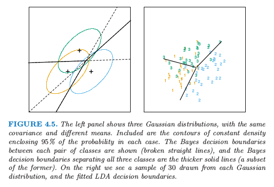
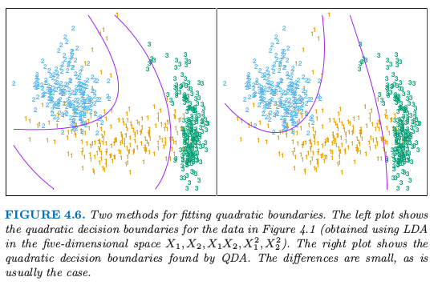
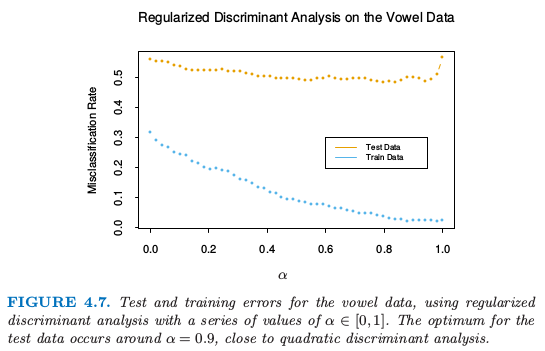
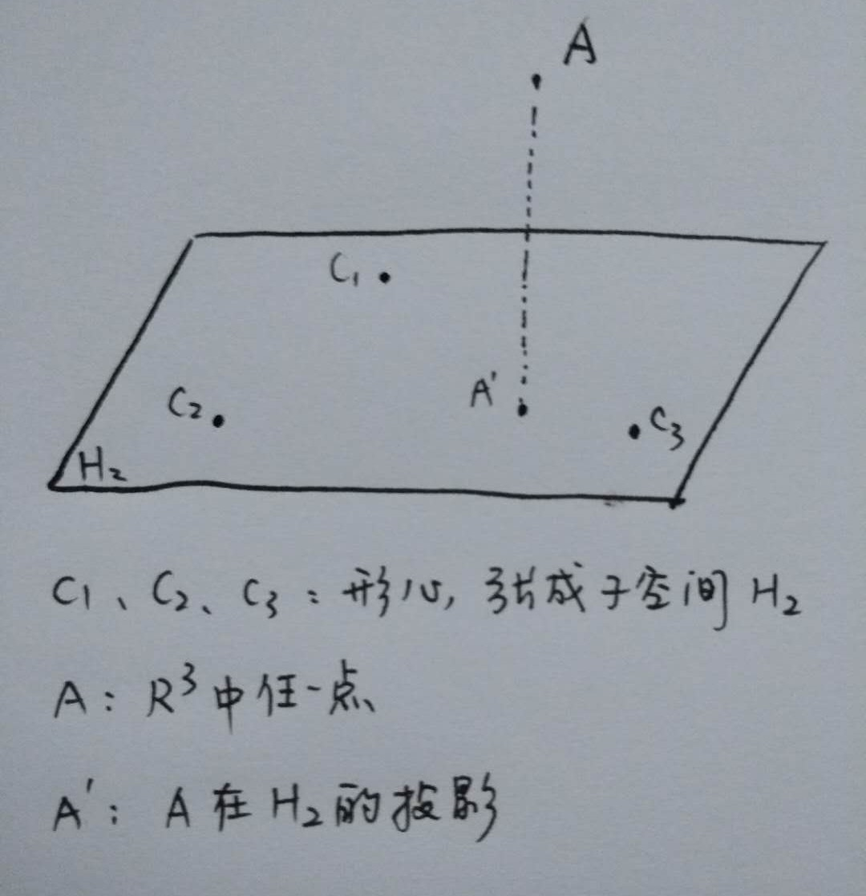
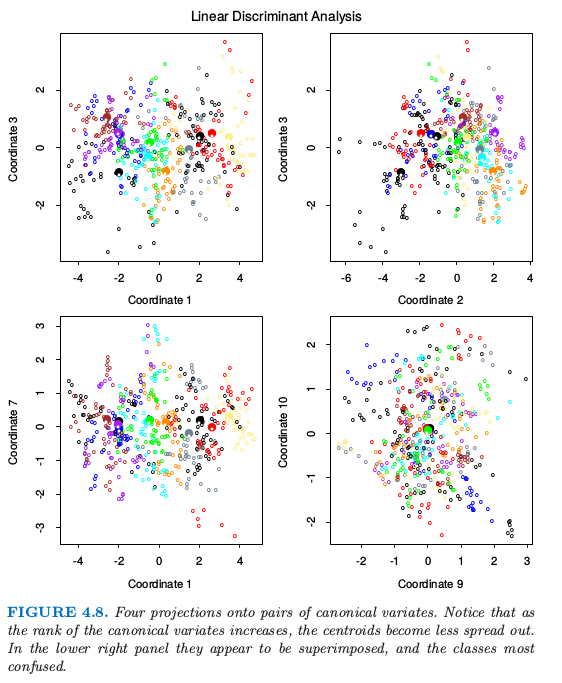
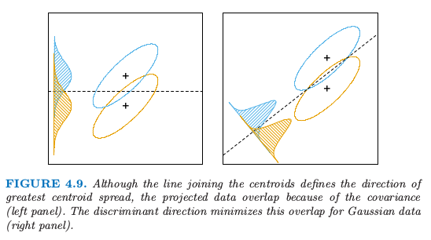
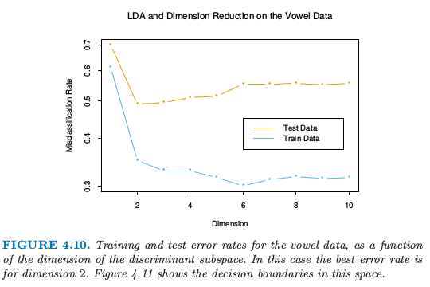
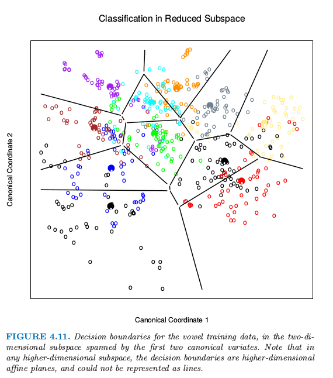

# 4.3 线性判别分析

| 原文   | [The Elements of Statistical Learning](../book/The Elements of Statistical Learning.pdf) |
| ---- | ---------------------------------------- |
| 翻译   | szcf-weiya                               |
| 时间   | 2016-12-09:2016-12-10                    |
|更新|2017-12-29, 2018-03-04|
|状态|Done|

!!! note "更新笔记"
    @2017-12-29 大三上学期学了多元统计分析，其中有个project便是对实际数据进行判别分析，当时用LDA、QDA、RDA以及SVM简单分析了一下。报告详见[**这里**](http://rmd.hohoweiya.xyz/3140105707hw4.pdf)（下载[**实际数据**](http://rmd.hohoweiya.xyz/肝胆病患者检查数据.xls)）

分类的判别理论（[2.4节](../02%20Overview%20of%20Supervised%20Learning/2.4%20Statistical%20Decision%20Theory/index.html)）告诉我们，我们需要知道的是最优分类的类别的后验概率 $\Pr(G\mid X)$。假设 $f_k(x)$ 是类别 $G=k$ 中 $X$ 的类别条件密度，并令 $\pi_k$ 为类别 $k$ 的先验概率，满足 $\sum_{k=1}^K\pi_k=1$。简单地应用一下贝叶斯定理得到

$$
\Pr(G=k\mid X=x)=\dfrac{f_k(x)\pi_k}{\sum_{\ell=1}^Kf_{\ell}(x)\pi_\ell}\qquad (4.7)
$$

我们看到就**判别能力(ability to classify)**而言，知道 $f_k(x)$ 几乎等价于知道概率 $\Pr(G=k\mid X=x)$。

许多方法是基于类别密度的模型：

- 采用高斯密度的线性和二次判别分析
- 更加灵活的混合的高斯密度允许非线性判别边界（[6.8节](../06-Kernel-Smoothing-Methods/6.8-Mixture-Models-for-Density-Estimation-and-Classification/index.html)）
- 每个类别密度的一般非参数密度估计允许最大的灵活性（[6.6.2节](../06-Kernel-Smoothing-Methods/6.6-Kernel-Density-Estimation-and-Classification/index.html#_3)）
- **朴素贝叶斯(Naive Bayes)**模型是上个情形的变种，而且假设每个类密度是边缘密度的乘积，这也就是，他们假设输入在每一类中都是条件独立的（[6.6.3节](../06-Kernel-Smoothing-Methods/6.6-Kernel-Density-Estimation-and-Classification/index.html#_4)）

假设我们每个类别密度用多元高斯分布来建模

$$
f_k(x)=\frac{1}{(2\pi)^{p/2}\vert \boldsymbol\Sigma_k\vert^{1/2}}e^{-\frac{1}{2}(x-\mu_k)^T\boldsymbol\Sigma^{-1}_k(x-\mu_k)} \qquad (4.8)
$$

线性判别分析 LDA 产生于假设类别有相同的协方差矩阵 $\Sigma_k=\Sigma\;\forall k$ 时。在比较两个类别 $k$ 以及 $\ell$ 时，比较 log-ratio 是充分条件，而且我们可以看到
$$
\begin{align}
\log\frac{\Pr(G=k\mid X=x)}{\Pr(G=\ell\mid X=x)}&=\log\frac{f_k(x)}{f_\ell(x)}+\log\frac{\pi_k}{\pi_\ell}\\
&=\log\frac{\pi_k}{\pi_\ell}-\frac{1}{2}(\mu_k+\mu_\ell)^T\boldsymbol\Sigma^{-1}(\mu_k-\mu_\ell)+x^T\boldsymbol\Sigma^{-1}(\mu_k-\mu_\ell)
\end{align}\qquad(4.9)
$$

!!! note "weiya 注"
    $$  
    a'Da-b'Db=(a+b)'D(a-b)
    $$    

这是个关于 $x$ 的线性等式。等协方差矩阵时消除了正规化因子，以及指数中的二次项。这个线性的 log-odds 函数表明类别 $k$ 和类别 $\ell$ 的判别边界为$p$维超平面内$\Pr(G=k\mid X=x)=\Pr(G=\ell\mid X=x)$的集合，这关于$x$是线性的。对于任意类别对也是成立的，所以所有的判别边界都是线性的。如果我们把 $\IR^p$ 分成不同区域，记为类别 1，类别 2 等等，这些区域会被超平面所分离。图 4.5（左图）显示了有三个类别且 $p=2$ 的假想的例子。这里数据是从 3 个协方差矩阵相等的高斯分布中产生的。我们已经在图像中包含了对应 95% 概率密度的等高图，以及三个类别的形心。注意到判别边界不是连接两个形心的垂直平分线。如果协方差矩阵 $\Sigma$ 是 $\sigma^2\mathbf I$，且类别的先验概率相等。从 (4.9) 我们可以看出线性判别函数为

$$
\delta_k(x)=x^T\boldsymbol\Sigma^{-1}\mu_k-\frac{1}{2}\mu_k^T\boldsymbol\Sigma^{-1}\mu_k+\log\pi_k\qquad (4.10)
$$

这是判别规则的等价描述，$G(x)=\mathrm{argmax}_k \delta_k(x)$。

> 图4.5. 左图显示了三个高斯分布，有相同的协方差和不同的均值。图中画出了在包含每个类别 95% 可能性的等高线。两两类别之间的贝叶斯判别边界用虚线显示，并且贝叶斯判别边界将所有的三个类别分隔开用实线表示出来（前者的一个子集）。右图我们看到有来自每个高斯分布的 30 个样本点以及画出了拟合后的 LDA 判别边界。

!!! info "weiya 注：重现图 4.5"
    模拟代码见[LDA/sim-4-5.R](../notes/LDA/sim-4-5.R)。

实际应用中我们不知道高斯分布的参数，我们需要用我们的训练数据去估计它们：

- $\hat \pi_k=N_k/N$，其中 $N_k$ 是第 $k$ 类观测值
- $\hat\mu_k=\sum_{g_i=k}x_i/N_k$
- $\hat{\boldsymbol\Sigma}=\sum_{k=1}^K\sum_{g_i=k}(x_i-\hat\mu_k)(x_i-\hat\mu_k)^T/(N-K)$

图 4.5（右图）显示了基于从 3 个高斯分布中取出的大小为 30 的样本集，图4.1是另外一个例子，但是那里类别不是高斯。

两个类别的情况下在线性判别分析和线性最小二乘之间有一个简单的对应，如 (4.5) 所示。如果满足下面条件则 LDA 分类规则分给第二类
$$
x^T\hat{\boldsymbol\Sigma}^{-1}(\hat\mu_2-\hat\mu_1)>\frac{1}{2}\hat\mu^T_2\hat\Sigma^{-1}\hat\mu_2-\frac{1}{2}\hat\mu_1^T\hat{\boldsymbol\Sigma}^{-1}\hat\mu_1+\log(N_1/N)-\log(N_2/N)\qquad (4.11)
$$
否则分为第一类。假设我们将两个类别编码为 $+1$ 和 $-1$。可以简单地证明得出最小二乘的系数向量与 (4.11) 式给出的 LDA 方向成比例。（[练习4.2](https://github.com/szcf-weiya/ESL-CN/issues/88)）。【实际上，这种对应关系对于任意的编码都会有，见练习4.2】。然而除了$N_1=N_2$的情形，截距不同因此得到的判别边界不一样。

因为通过最小二乘得到的 LDA 方向不需要对特征做高斯分布的假设，它的应用可以不局限于高斯分布的数据。然而，(4.11)式给出的特定的截距和分离点确实需要高斯分布的数据。因此对于给定的数据集凭经验地选择分割点最小化训练误差是有意义的。这也是我们在实际中发现效果很好，但是在理论中没有提到的原因。

多于两个类别的情形时，LDA 与类别指示矩阵的线性回归不是一样的，而且它避免了跟方法有关的掩藏问题(Hastie et al., 1994[^1])。 回归与LDA之间的对应可以通过在 12.5 节中讨论的最优评分来建立。

回到一般的判别问题(4.8)，如果没有假设$\boldsymbol\Sigma_k$相等，则(4.9)中方便的抵消不会发生；特别地关于$x$的平方项保留了下来。于是我们得到了平方判别函数QDA
$$
\delta_k(x)=-\frac{1}{2}\log\vert\Sigma_k\vert-\frac{1}{2}(x-\mu_k)^T\Sigma_k^{-1}(x-\mu_k)+\log\pi_k\qquad (4.12)
$$
每个类别对$k$和$\ell$的判别边界由二次等式来描述$\\{x:\delta_k(x)=\delta_\ell(x)\\}$.

图4.6显示了一个例子（p103中的图4.1），这三个类别都是混合高斯分布（6.8节），并且判别边界由关于$x$的二次函数近似给出。这里我们描述两种拟合这些判别边界的方式。右图使用这里描述的QDA，而左图是在增广的五维二次多项式空间中使用LDA。两者之间的差别很小，QDA是最好的方式，LDA方法是更方便的替换。

> 图4.6. 拟合二次边界的两种方法。左图显示了图4.1的二次判别边界（在五维空间$X_1,X_2,X_1X_2,X_1^2,X_2^2$中运用LDA得到）。右图显示了通过QDA寻找到的二次判别边界。两者差别很小，通常也是这种情况。

QDA的估计类似LDA的估计，除了协方差矩阵必须要按每一类来估计。当$p$很大这意味着系数有显著性的增长。因为判别边界是系数密度的函数，参数的个数必须要考虑。对于LDA，似乎有$(K-1)\times(p+1)$个参数，因为我们仅仅需要判别函数之间的不同$\delta_k(x)-\delta_K(x)$，其中$K$是一些预先选好的类别（这里我们已经选了最后一类），每个不同需要$p+1$个参数。对于QDA类似地，我们会有$(K-1)\times \\{p(p+3)/2+1\\}$个参数。LDA和QDA在非常大以及离散的数据集的分类上面表现得很好。举个例子，在STATLOG项目中(Michie et al. 1994)LDA在22个数据集的7个分类方法中的表现排前三名，QDA在四个数据集中排前三名，对于10个数据集两者中的一个排前三名。两种方法都被广泛运用，整本书集中讨论LDA上。在各种外来方法风靡一时的今天，我们总是会有两种简单的方法可以使用。为什么LDA和QDA有那么好的效果？原因不可能是数据近似服从高斯分布，对于LDA协方差矩阵也不可能近似相等。很可能的一个原因是数据仅仅可以支持简单的判别边界比如线性和二次，并且通过高斯模型给出的估计是稳定的，这是一个偏差与方差之间的权衡——我们可以忍受线性判别边界的偏差因为它可以通过用比其它方法更低的方差来弥补。这个论点对于QDA更是不可想象，因为它自身有许多的参数，尽管或许比非参估计的参数要少。

## 正则化判别分析

Friedman(1989)提出LDA和QDA之间的一个权衡，使得QDA的协方差阵向LDA中的共同协方差阵收缩。这些方法非常类似岭回归。正则化协方差矩阵有如下形式
$$
\hat\Sigma_k(\alpha)=\alpha\hat\Sigma_k+(1-\alpha)\hat\Sigma\qquad (4.13)
$$
其中，$\hat\Sigma$是像LDA中使用的联合协方差矩阵。这里$\alpha\in[0,1]$使得在LDA和QDA之间达到一个连续，而且需要指定。实际中，$\alpha$可以基于在验证数据的表现上进行选择，或者通过交叉验证。

> 图4.7. 对元音数据应用一系列$\alpha\in[0,1]$的正则化判别分析的测试和训练误差。测试数据的最优点发生在$\alpha=0.9$附近，离二次判别分析很相近。

图4.7显示了将RDA运用到元音数据的结果。训练和测试误差都随着$\alpha$的增大获得了改善，尽管在$\alpha=0.9$后测试误差急剧上升。训练和测试误差最大的区别部分因为在小数量的个体上有很多重复观测，在训练和测试集上是不同的。

类似的修改使得$\hat\Sigma$向着标量协方差收缩
$$
\hat{\boldsymbol\Sigma}(\gamma)=\gamma\hat\Sigma+(1-\gamma)\hat\sigma^2I\qquad (4.14)
$$
对于$\gamma\in[0,1]$。用$\hat\Sigma(\gamma)$替换掉(4.13)的$\hat\Sigma$导出了一个更加一般的协方差阵族$\hat\Sigma(\alpha,\gamma)$,这是由一对参数来表示的。

在12章，我们将讨论LDA的另一种正则化版本，当数据来自数字化的相似的信号和图像时更加地合适。在这些情形下特征是高维的且相关的，LDA系数可以通过正则化在原始信号域变得光滑和稀疏。这导出了更好的一般化并且对于这些系数有着简单的解释。在第18章中我们也处理非常高维的问题，举个例子如微阵列研究中基因表达测量的特征。这里方法集中在(4.14)中$\gamma=0$的情形，以及其它LDA的正则化版本。

## LDA的计算

作为下一主题的介绍，我们简单地岔开去讨论LDA的计算特别是QDA。这些计算可以通过对角化$\hat\ssigma$或$\hat\ssigma_k$来简化。对于后者，假设我们对每一个计算特征值分解$\hat\ssigma_k=U_kD_kU_k^T$，其中$U_k$是$p\times p$的对角矩阵，$D_k$是正的特征值$d_{k\ell}$组成的对角矩阵。则$\delta_k(x)$(4.12)的组成成分是

- $(x-\hat\mu_k)^T\hat\ssigma_k^{-1}(x-\hat\mu_k)=[U_k^T(x-\hat\mu_k)]^TD_k^{-1}[U_k^T(x-\hat\mu_k)]$
- $\log\vert \hat\ssigma_k\vert=\sum_{\ell}\log d_{k\ell}$

按照上面列出的计算步骤，LDA分类器可以通过下面的步骤来实现

- 对数据关于协方差矩阵$\hat\Sigma$球面化：$X^\*\leftarrow D^{-\frac{1}{2}}U^TX$,其中$\hat\Sigma=UDU^T$.$X^\*$的共同协方差矩阵变为单位阵。
- 对类别先验概率$\pi_k$的影响取模，在变换后的空间里面分到最近的类别形心。

## 降维线性判别分析

至此我们已经讨论了限制为高斯分类器中的LDA。它受欢迎的部分原因是因为额外的限制使得我们可以看到数据在低维空间中的投影。

在$p$维输入空间的$K$形心位于维数小于$K-1$的超平面，如果$p$比$K$大很多，维数上会有显著的降低。更多地，在确定最近的形心时，我们可以忽略到垂直子空间的距离，因为它们对每个类的作用同样大。因此我们可能仅仅将数据$X^\*$投射到形心张成的子空间$H_{K-1}$，并且在子空间内比较距离。因此在LDA中存在一个基础维数的降低，换句话说就是，我们仅仅需要考虑在维数至多为$K-1$的子空间的数据。如果$K=3$，举个例子，这允许我们可以在二维图中观察数据，对类别进行颜色编码。这样做我们不会丢失任何LDA分类需要的信息。

!!! note "weiya 注"
    更直观的解释如下图
    
    在考虑点$A$的最近形心时，不需要考虑$A$点垂直于$H_2$的距离，也就是直接在$H_2$子空间中比较点$A$在$H_2$中的投影点$A'$与三个待选形心的距离。

如果$K > 3$？我们可能在某种意义下要求一个最优的$L < K-1$维子空间$H_L\subset H_{K-1}$。Fisher定义的最优意思是投影形心关于方差尽可能地分散。这意味着寻找形心的主成分空间（主成分在3.5.1节中有简短的描述，在14.5.1节中将详细讨论）。图4.4显示了对于元音数据的一个最优的二维子空间。这里在一个10维的输入空间中11个类别，每一类指不同的元音发音。形心在这种情形下要求全空间，因为$K-1=p$，但是我们已经展示了一个最优的二维子空间。维数是按顺序排列的，所以我们可以依次计算额外的维数。图4.8显示了4个额外的坐标对，也被称作典则(canonical)或者判别(discriminant)变量。总结一下，寻找LDA的最优子空间序列涉及以下步骤：

- 计算类别形心$M$的$K\times p$矩阵以及共同协方差矩阵$W$(对于组内协方差)
- 使用$W$特征值分解计算$M^\*=MW^{-\frac{1}{2}}$
- 计算了$B^\*$，$M^\*$的协方差矩阵（$B$是组间协方差），特征值分解$B^\*=V^\*D_B{V^\*}^T$。$V^\*$的列$v_\ell^\*$从第一个到最后一个依次定义了最优子空间的坐标。

结合所有由$Z_\ell=v_\ell^TX$给出的第$\ell$个判别变量，其中$v_\ell=W^{-\frac{1}{2}}v_\ell^\*$.

Fisher通过不同的方式得到这个分解，完全没有引用高斯分布。他提出下面的问题：

> 寻找线性组合$Z=a^TX$使得组间方差相对于组内方差最大化

再一次，组间方差是$Z$的均值的方差，而组内方差是关于均值的联合方差。图4.9显示了为什么这个准则是有意义的。尽管联合形心的方向能将均值尽可能分离开（比如，使得组间方差最大化），但是由于协方差的本性在投影类别上有很大重叠。同时考虑协方差，可以找到最小化重叠的方向。

> 图4.8. 在成对典则变量上的四个投影。注意到当典则变量的秩增大，形心变得更不发散。右下角的图像看起来像是叠加上去的，类别也更加难以确定。

> 图4.9. 尽管连接形心的直线定义了最大形心分散的方向，但是由于协方差（左图）投影数据会发生重叠。判别边界的方向使得高斯数据的重叠最小（右图）。

$Z$的组间方差为$a^TBa$,而组内方差为$a^TWa$，$W$是很早定义的，$B$是类别形心矩阵$M$的协方差矩阵。注意到$B+W=T$，其中$T$是$X$的总协方差矩阵，忽略掉了类别信息。

$Fisher$问题因此等价于最大化Rayleigh quotient,
$$
\underset{a}{\max}\;\dfrac{a^TBa}{a^TWa}\qquad (4.15)
$$
或者等价地，
$$
\underset{a}{\max}\;a^TBa \; \st \; a^TWa=1\qquad (4.16)
$$
这是一个一般化的特征值问题，$a$是由$W^{-1}B$的最大特征值给出。不难证明（练习4.1）最优$a_1$等于上面定义的$v_1$。类似地，可以找到下一个方向$a_2$，在$W$中与$a_1$正交，使得$a_2^TBa_2/a_2^TWa_2$最大化；解为$a_2=v_2$，其余类似。$a_\ell$被称作判别坐标，不会与判别函数相混淆。他们同样被称作典则变量(canonical variables)，因为这些结果的一个变形是通过在预测变量矩阵$X$上对指示响应矩阵$Y$进行典则相关分析得到的。这一点将在12.5节继续讨论。

总结一下至今为止的发展：

- 有相同的协方差矩阵的高斯分类导出线性判别边界。分类可以通过对数据关于$W$球面化得到，并且划分到球空间的最近形心内（模$\log\pi_k$）
- 因为只计算了到形心的相对距离，所以可以把数据局限于在球空间的形心张成的子空间。
- 子空间可以进一步分解为关于形心分离的最优子空间。这个分解与Fisher的分解相同。

降维后的子空间可以看成是数据降维（为了观察）的一个工具。它们是否可以应用到分类上面以及它的基本原理是什么？很明显它们可以应用到分类上面，正如我们在最初的变形中一样；我们可以简单地把到形心的距离计算限制到选定的子空间中。可以证明这是有着额外限制条件——高斯形心位于$R^p$的$L$维子空间中——的高斯分类器。通过极大似然法拟合这样一个模型，然后运用贝叶斯定理构造后验概率，恰巧是上面描述的分类准则。（练习4.8）

高斯分类器在距离计算时要求矫正因子$\log\pi_k$。使用矫正因子的理由可以在图4.9中看出。错分类率是基于两个密度计算的重叠部分的面积。如果$\pi_k$是相等的（图中隐含了），则最优的分离点是在投射均值之间。如果$\pi_k$不相等，朝着最小类别移动分类点会改善错误率。正如之前提到的两个类别，可以通过使用LDA（或者其他任何方法）导出线性规则，然后选择分类点去最小化训练集上的误判率。

作为一个展现降维限制优点的例子，我们回到元音数据。这里有11个类别10个变量，因此该分类器有10个可能的维数。我们可以在每个层次空间计算训练和测试误差；图4.10显示了这个结果。图4.11显示了基于二维LDA的解的分类器的判别边界。

> 图4.10. 对于元音数据，训练和测试误差作为判别边界的维数的函数的图象。这种情况下最优的误差率是维数等于2的情况。图4.11显示了这个空间的判别边界。

Fisher降秩判别分析(RDA)和指示响应矩阵之间存在着紧密的联系。结果表明LDA意味着伴随着$\hat Y^TY$的特征值分解的回归。在两个类的情形下，存在一个单判别变量，它与在$\hat Y$的任意列乘上一个标量相等。这些联系将在第12章中讨论。一个相关的事实是先将原始的预测变量$X$转换为$\hat Y$，然后用$\hat Y$做LDA与在原空间中做LDA是相等的（练习4.3）。

> 图4.11. 对于元音训练数据，由前两个典则变量张成的二维子空间中的判别边界。注意到在任何高维子空间下，判别边界是高维仿射平面，而且不可以表示成直线。

[^1]: Hastie, T., Tibshirani, R. and Buja, A. (1994). Flexible discriminant analysis by optimal scoring, Journal of the American Statistical Association 89: 1255–1270.
