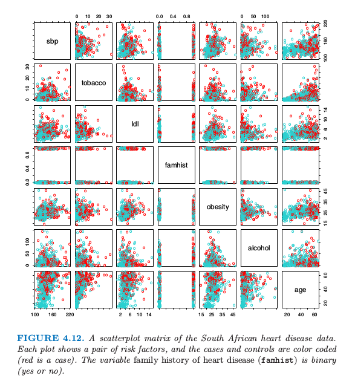
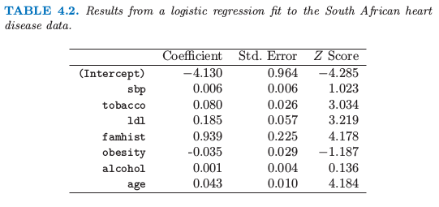
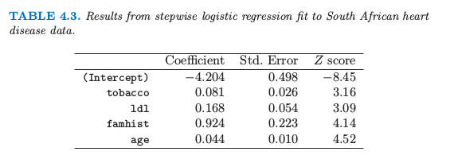
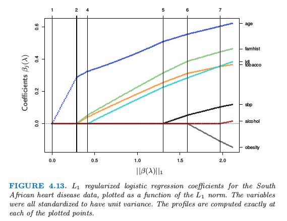

# 4.4 逻辑斯蒂回归

| 原文   | [The Elements of Statistical Learning](../book/The Elements of Statistical Learning.pdf) |
| ---- | ---------------------------------------- |
| 翻译   | szcf-weiya                               |
| 时间   | 2016-12-09:2016-12-15                    |
| 更新 | 2018-02-13; 2018-02-21|
|状态|Done|

逻辑斯蒂回归来自用$x$的线性函数来建立$K$个类别后验概率的模型的需要，同时保证后验概率的和为1且每一个都在$[0,1]$中取值。模型有如下形式

$$
\begin{array}{ll}
\log\dfrac{\Pr(G=1\mid X=x)}{\Pr(G=K\mid X=x)}&=\beta_{10}+\beta_1^Tx\\
\log\dfrac{\Pr(G=2\mid X=x)}{\Pr(G=K\mid X=x)}&=\beta_{20}+\beta_2^Tx\\
&\ldots\\
\log\dfrac{\Pr(G=K-1\mid X=x)}{\Pr(G=K\mid X=x)}&=\beta_{(K-1)0}+\beta_{K-1}^Tx\\
\end{array}
\tag{4.17}
$$

模型由$K-1$个log-odds或logit变换来确定（反映了概率相加和为1的约束）。虽然模型采用最后一类来作为odds-rations的分母，但分母的选择其实是任意的，因为在这个选择下估计值是等价的。简单地计算可以得到

$$
\begin{array}{ll}
\Pr(G=k\mid X=x)=\dfrac{exp(\beta_{k0}+\beta_k^Tx)}{1+\sum\limits_{\ell=1}^{K-1}exp(\beta_{\ell0+\beta_\ell^Tx})},& k=1,\ldots, K-1\\
\Pr(G=K\mid X=x)=\dfrac{1}{1+\sum\limits_{\ell=1}^{K-1}exp(\beta_{\ell0+\beta_\ell^Tx})}&
\end{array}
\tag{4.18}
$$

显然它们相加等于1。为了强调对参数集$\theta=\\{\beta_{10},\beta_1^T,\ldots,\beta_{(K-1)0},\beta_{K-1}^T\\}$的依赖，我们将概率记为$p_k(x,\theta)$。

当$K=2$时，模型非常简单，因为只有一个单线性函数。在生物统计应用中应用很广，因为经常会有二进制（两个类别）的响应变量。举个例子，病人获救或死亡，患心脏病和不患心脏病，或者某个条件存在与否。

## 拟合逻辑斯蒂回归模型

逻辑斯蒂回归经常通过极大似然法求解，采用在给定$X$时$G$的条件概率。因为$\Pr(G\mid X)$完全明确了条件分布，选择多项式分布(multinomial)是合适的。

!!! note "weiya注：多项式分布的合理性"
    因为条件概率之和等于1，而各个条件概率可疑看成是互斥事件的概率，满足多项式分布的条件。

$N$个观测的对数似然为

$$
\ell(\theta)=\sum\limits_{i=1}^Nlog\,p_{g_i}(x_i;\theta)\tag{4.19}
$$

其中，$p_k(x_i;\theta)=Pr(G=k\mid X=x_i;\theta)$

我们将详细讨论两个类别的情形，因为此时算法可以非常简化。我们可以用0/1来对两个类别$g_i$的响应变量$y_i$进行编码，当$g_i=1$时$y_i=1$，当$g_i=2$时$y_i=0$。令$p_1(x;\theta)=p(x,\theta)$,$p_2(x;\theta)=1-p(x;\theta)$，对数似然为

$$
\begin{array}{lll}
\ell(\beta)&=&\sum\limits_{i=1}^N\{y_i\log p(x_i;\beta)+(1-y_i)\log(1-p(x_i;\beta))\}\\
&=&\sum\limits_{i=1}^N\{y_i\beta^Tx_i-\log(1+e^{\beta^Tx_i})\}
\end{array}
\tag{4.20}
$$

这里$\beta=\\{\beta_{10},\beta_1\\}$，而且我们假设输入向量$x_i$包含表示截距的项$1$。

为了最大化对数似然，令微分为0，得到

$$
\dfrac{\partial \ell(\beta)}{\partial \beta}=\sum\limits_{i=1}^Nx_i(y_i-p(x_i;\beta))=0,\tag{4.21}
$$

这是关于$\beta$的$p+1$个非线性等式。注意到因为$x_i$的第一个组分为1，第一个组分满足的等式为$\sum_{i=1}^Ny_i=\sum_{i=1}^Np(x_i;\beta)$；这表明类别一概率的期望值与观测值一致（也因此类别二概率的期望值与观测值一致）。

为了求解（4.21）的得分等式，我们采用Newton-Raphson算法，需要Hessian矩阵

$$
\dfrac{\partial^2\ell(\beta)}{\partial\beta\partial\beta^T}=\sum\limits_{i=1}^Nx_ix_i^Tp(x_i;\beta)(1-p(x_i;\beta))\tag{4.22}
$$

!!! note "weiya注"
    Newton-Raphson 也就是我们熟知的牛顿迭代法
    $$
    x_{i+1}=x_i-\dfrac{f(x_i)}{f'(x_i)}
    $$

以$\beta^{old}$开始，新的Newton更新为
$$
\beta^{new}=\beta^{old}-(\dfrac{\partial^2\ell(\beta)}{\partial\beta\partial\beta^T})^{-1}\dfrac{\partial \ell(\beta)}{\partial(\beta)}\tag{4.23}
$$
其中微分值由$\beta^{old}$处的值得到。

把得分和Hessian写成矩阵形式是很方便的。记$\mathbf y$为$y_i$的值，$\mathbf X$是值为$x_i$的$N\times (p+1)$矩阵，$\mathbf p$是拟合概率的向量且第$i$个元素为$p(x_i;\beta^{odd})$，$\mathbf W$是第$i$个对角元为$p(x_i;\beta^{odd})(1-p(x_i;\beta^{odd}))$的$N\times N$的对角矩阵。则我们有

!!! note "weiya注"
    $\mathbf X=[x'_1,x'_2,\ldots,x'_N]'$

$$
\begin{array}{ll}
\dfrac{\partial \ell(\beta)}{\partial \beta}&=\mathbf{X^T(y-p)}\tag{4.24}\\
\dfrac{\partial^2\ell(\beta)}{\partial\beta\partial\beta^T}&=-\mathbf{X^TWX}\tag{4.25}
\end{array}
$$
牛顿迭代为
$$
\begin{array}{ll}
\beta^{new}&=\beta^{old}+\mathbf{(X^TWX)^{-1}X^T(y-p)}\\
&=\mathbf {(X^TWX)^{-1}X^TW(X\beta^{old}+W^{-1}(y-p))}\\
&=\mathbf{(X^TWX)^{-1}X^TWz}\tag{4.26}
\end{array}
$$

在第二和第三行我们已经重新把牛顿迭代表达成最小二乘迭代，响应变量为
$$
\mathbf z=\mathbf X\beta^{old}+\mathbf{W^{-1}(y-p)}\tag{4.27}
$$
有时也被称作调整后的响应变量。重复地进行求解这些方程，每一次迭代时，$\mathbf p$改变，因此$\mathbf W$和$\mathbf z$也改变。这个算法被称作是加权迭代最小二乘或者IRLS，因为每次迭代求解加权最小二乘问题：
$$
\beta^{new}\leftarrow arg\,\underset{\beta}{min}(\mathbf z-\mathbf X\beta)^T\mathbf W(\mathbf z-\mathbf X\beta)\tag{4.28}
$$

!!! note "weiya注：IRLS"
    [Github: xqwen/IRLS](https://github.com/xqwen/IRLS)用C++实现IRLS。

似乎$\beta=0$是迭代过程一个很好的初始值，尽管不会保证收敛性。一般地，算法确实是收敛的，因为对数似然是凹的(concave)，但是可能出现过收敛的情况。如果在罕见的情形下对数似然值下降，对步长进行二分法会保证收敛性。

对于多类别的情况$K\ge 3$，牛顿算法也可以表达成加权迭代最小二乘，只是对于每一个观测用一个$K-1$的响应向量和非对角系数矩阵。后者阻碍了算法的简化，在这种情况下直接使用展开向量$\theta$数值上会更加方便（练习4.4）。另一种是坐标下降方法（3.8.6节）也可以有效地最大化对数似然。`R`语言的`glmnet`包(Friedman et al., 2010[^1])可以有效地拟合$N$和$p$都非常大时的逻辑斯蒂回归。尽管是为了拟合正则化模型设计的，但是也适用于非正则化的拟合。

逻辑斯蒂回归经常被用作一种数据分析和推断的工具，目标就是理解在解释输出时输入变量的角色。一般地，拟合时要寻找变量的最简洁(parsimonious)的模型，很可能还有一些交叉项。下面的例子说明了涉及到的一些问题。

## 例子：南非心脏病

这里我们展示一个用二值数据分析去说明逻辑斯蒂回归的传统统计学应用。图4.12中的数据取自CORIS调查的部分数据，这个调查在南非Western Cape的三个乡村进行(Rousseauw et al., 1983[^2])。调查的目标是建立在高发生率的地区中缺血性心脏病影响因子的强度模型。数据中有15到64岁的白人男性，响应变量是MI的存在或者缺失（该地区整个MI流行程度为5.1%）。在我们数据集中有160个案例，以及302个控制个体。数据在Hastie and Tibshirani(1987)[^3]中有详细描述。

> 图4.12. 南非心脏病数据的散点图。每张图片是一对影响因子，案例集和控制集用不同颜色区分（红色的为案例）。家族心脏病史(famhist)是二值变量（是或否）

我们通过极大似然法拟合了逻辑斯蒂回归模型，给出了如表4.2所示的结果。结果概要包含了模型中每一个系数的$Z$分数（系数除以他们的标准误差）；不重要的$Z$分数表明该系数可以从模型中剔除。这对应着检验该系数为0而其它系数不为0的零假设（也被称作Wald检验）。$Z$分数的绝对值大于2表明在5%的水平下是显著的。

> 表4.2. 南非心脏病数据的逻辑斯蒂回归结果。

在系数表中有一些比较奇怪的结果，这必须认真对待。收缩压sbp竟然不显著！肥胖(obesity)也不显著，它的符号是负的。这个混乱是因为预测变量之间的相关关系。单独地来看，sbp和obesity都是显著的，而且都是正号。然而，当有其它相关变量时它们便不再需要了（甚至可以得到一个负号）。

这时分析者可能会做一些模型选择；寻找能够充分解释他们在chd上联合影响的子集变量。一种方式是删掉显著性最低的系数然后重新拟合模型。这个可以重复做下去直到没有更多的项可以从模型中剔除。这样得到了表4.3所示例的模型。

> 表4.3. 对南非心脏病数据逐步逻辑斯蒂回归的结果

一个更好但是需要花费更多时间的策略是对每一个剔除一个变量后的模型进行重新拟合，然后进行偏差分析(analysis of deviance)确定哪个变量需要剔除。拟合模型的残差是减去两倍的对数似然，两个模型的偏差是它们个体残差的差别（类似于平方和），这个策略给出了上面同样的最终结果。

举个例子，怎么解释tobacco的系数0.081（标准偏差为0.026）？tobacco是一生中使用的烟草总千克数，控制集中位数为1.0kg，而这个案例集为4.1kg。因此每增加1kg的烟草使用量意味着冠状心脏病的几率为$exp(0.081)=1.084$（或者8.4%）。结合标准误差我们得到95%的置信区间$exp(0.081\pm 2\times 0.026)=(1.03,1.14)$

我们将在第5章再次用到这些数据，我们将会看到一些变量会有非线性影响，当进行合适的建模后不会被剔除模型。

## 二次拟合和推断

极大似然法的参数估计$\hat\beta$满足自一致性(self-consistency)关系：它们是加权最小二乘拟合的系数，其中响应变量为

$$
z_i=x_i^T\hat\beta+\dfrac{y_i-\hat p_i}{\hat p_i(1-\hat p_i)}\tag{4.29}
$$

系数为$w_i=\hat p_i(1-\hat p_i)$，都依赖$\hat\beta$自身。除了提供了一个方便的算法，这与最小二乘的联系还有其它用处：

- 加权的残差平方和是熟悉的Pearson卡方统计量
$$
\sum\limits_{i=1}^N\dfrac{(y_i-\hat p_i)^2}{\hat p_i(1-\hat p_i)}\tag{4.30}
$$
这是对偏差的二次近似。
- 极限概率理论表明如果模型是正确的，则$\hat\beta$为常数（比如，收缩到真实的$\beta$）
- 中心极限定理证明$\hat \beta$的分布收敛到$N(\beta,\mathbf{(X^TWX)^{-1}})$。这个可以模仿正态理论推断直接从加权最小二乘得到。
- 对于逻辑斯蒂回归建立模型计算量比较大，因为每个模型拟合需要迭代。受欢迎的方法是Rao score检验来检验是否包含某一项，以及Wald检验来检验是否剔除某一项。这些都不需要迭代拟合，而且都是基于当前模型的极大似然拟合。结果是两者都代表在加权最小二乘拟合中运用相同的系数加上或剔除某一项。这些计算可以高效地进行，不需要重新计算整个加权最小二乘拟合。

软件实现可以利用这些联系。举个例子，R中的广义线性模型（包括作为二项式模型族中的逻辑斯蒂回归）充分运用了他们。GLM（广义线性模型）对象可以当作线性模型对象来处理，而且所有对于线性模型可用的工具都可以自动应用起来。

## $L_1$正则化逻辑斯蒂回归

lasso中使用的$L_1$惩罚（3.4.2节）可以应用到任意线性回归模型的变量选择和收缩上面。对于逻辑斯蒂回归，我们最大化(4.20)带惩罚项的版本：

$$
\underset{\beta_0,\beta}{\max}\{\sum\limits_{i=1}^N[y_i(\beta_0+\beta^Tx_i)-\log(1+e^{\beta_0+\beta^Tx_i})]-\lambda\sum\limits_{j=1}^p\vert \beta_j\vert\}\tag{4.31}
$$

对于lasso，我们一般不对截距项进行惩罚，且对预测变量标准化后加惩罚有意义。准则(4.31)是凹的，而且运用非线性规划方法可以找到一个解（举个例子，Koh et al., 2007[^4]）。另外，运用我们在4.4.1节运用的Netwon算法的二次逼近，我们可以通过重复应用加权的lasso算法求解(4.31)。有趣的是非零系数变量的得分等式（式4.24）有如下形式

$$
\mathbf {x_j^T(y-p)} = \lambda\cdot sign(\beta_j)\tag{4.32}
$$

这一般化了3.4.4节中的(3.58)；活跃变量再与残差的一般化相关性结合在一起。
路径算法比如说lasso的LAR算法更加困难，因为系数曲线是逐段光滑而不是线性的。然而，可以通过二次逼近来实现。

图4.13显示了4.4.2节南非心脏病数据的$L_1$正则化路径。这是通过R语言`glmpath`包(Park and Hastie, 2007[^4])实现的，运用了凸优化的predictor-corrector方法确定了$\lambda$在哪个非零活跃集值发生改变（图中的垂直线）。这里直线看似线性的，但在其它的例子中曲率将会更加明显。

> 图4.13. 南非心脏病数据的$L_1$正则化逻辑斯蒂回归系数，画出了作为$L_1$范数函数的曲线。这些变量都标准化后有单位方差。在图像每一个点处都精确算出来了。

坐标下降方法（3.8.6节）对于计算$\lambda$网格上的值的系数曲线是很有效的。`R`语言`glmnet`包(Friedman et al., 2010[^1])对于非常大的逻辑斯蒂回归问题拟合系数路径是非常有效的（$N$或$p$很大时）。他们的算法可以利用预测变量矩阵$X$的稀疏性，以至于对于大规模问题也适用。18.4节有更详细的解释，而且将会讨论$L_1$正则多项分布模型。

## 逻辑斯蒂回归或者LDA？

!!! info 
    基于本小节内容，回答了[Logistic回归模型和判别分析之间的关系？ - 知乎](https://www.zhihu.com/question/61101057/answer/324078106)。

在4.3节我们发现类别$k$和$K$类关于$x$线性函数的后验概率odds的对数（4.9）：

$$
\begin{array}{ll}
\log\dfrac{\Pr(G=k\mid X=x)}{\Pr(G=K\mid X=x)}&=\log\dfrac{\pi_k}{\pi_K}-\frac{1}{2}(\mu_k+\mu_K)^T\Sigma^{-1}(\mu_k-\mu_K)\\
&=\alpha_{k0}+\alpha_k^Tx\qquad\tag{4.33}
\end{array}
$$

线性是因为对类别的概率密度函数做了正态性假设及协方差矩阵相等的假设。通过构造线性逻辑斯蒂模型(4.17)有线性logits:

$$
\log\frac{\Pr(G=k\mid X=x)}{\Pr(G=K\mid X=x)}=\beta_{k0}+\beta_k^Tx\tag{4.34}
$$

看起来模型似乎是一样的。尽管它们确实有相同的形式，区别在于它们系数估计的方式。逻辑斯蒂回归模型更加一般，因为它做了更少的假设。我们可以把$X$和$G$的联合概率密度写成

$$
\Pr(X,G=k)=\Pr(X)\Pr(G=k\mid X)\tag{4.35}
$$

其中$\Pr(X)$为$X$的边缘概率密度。对于LDA和逻辑斯蒂回归，右边的第二项有线性logit形式

$$
\Pr(G=k\mid X=x)=\dfrac{e^{\beta_{k0}+\beta_k^Tx}}{1+\sum_{\ell=1}^{K-1}e^{\beta_{\ell0}+\beta_\ell^Tx}}\tag{4.36}
$$

我们再一次任意地选择最后一类作为标准。

逻辑斯蒂回归模型中，$X$的边缘概率密度可以取任意的边界密度函数$\Pr(X)$，然后通过最大化条件概率（$\Pr(G=k\mid X)$的多项式概率）来拟合$\Pr(G\mid X)$的参数。尽管可以完全忽略掉$\Pr(X)$，但我们可以把边缘密度看成在全部非参和无约束情形下的估计，该估计是在每个观测值上采用权重为$1/N$的经验分布函数。

进行LDA时，我们通过基于下面的联合密度来最大化对数似然进行拟合参数

$$
\Pr(X,G=k)=\phi(X;\mu_k,\Sigma)\pi_k\tag{4.37}
$$

其中$\phi$是高斯密度函数。用标准正态的理论可以更容易估计4.3节的$\hat\mu_k,\hat\Sigma$和$\hat\pi_k$。

!!! note "weiya注：Recall"
    $$
    \mathbf{ \hat Y = {X(X^TX)^{-1}X^TY}} \tag{4.3}
    $$

因为(4.3)形式的逻辑斯蒂回归的线性参数是高斯分布参数的函数，我们通过插入对应的估计得到它们的极大似然估计。然而，与条件概率密度不同，边缘密度$\Pr(X)$起着重要作用。它是一个混合密度

$$
\Pr(X)=\sum\limits_{k=1}^K\pi_k\phi(X;\mu_k,\Sigma)\tag{4.38}
$$

同样涉及到参数。

这个可加组分（约束条件）起着什么作用呢？通过依赖可加模型的假设，我们可以得到更多的参数信息，因此可以更加有效地估计它们（低方差）。事实上，如果$f_k(x)$的真实分布为高斯分布，则最坏的情形下忽略密度的边缘项会在误差率上有近30%的效率损失(Efron, 1975[^6])。换句话说：当再有30%的数据，条件概率效果一样。

举个例子，远离判别边界的观测点（权重被逻辑斯蒂回归低估(down-weighted)）在估计斜方差阵中起着作用。这不是一个好消息，因为这意味着当有许多的边界点时，LDA不够稳健。

从混合模型的组成来看，很显然没有类别标签的观测甚至都有参数的信息。产生类别标签经常是不划算的，但是产生未分类的观测值是容易的。通过依赖对模型强的假设，正如这里的一样，我们可以同时运用两种类别的信息。

边缘似然可以认为是一个正则器，从边缘角度来看在某种程度上类别密度是已知的。举个例子，如果在两个类别的逻辑斯蒂回归模型中，数据可以很好地被超平面分隔开，则参数的极大似然估计是没有定义的（比如说无穷，见练习4.5）。而对于同样的数据LDA的系数有很好的定义，因为边缘密度函数不会允许这些退化。

实际应用中这些假设从不正确，而且$X$的有些组分是定性变量。一般感觉逻辑斯蒂回归更加安全，比LDA模型更稳健，因为它依赖更少的假设。从我们经验来看，甚至不恰当地运用LDA时，比如说对定性预测变量应用LDA，两个模型都会得到非常相似的结果。

[^1]: Friedman, J., Hastie, T. and Tibshirani, R. (2010). Regularization paths for generalized linear models via coordinate descent, Journal of Statistical Software 33(1): 1–22.
[^2]: Rousseauw, J., du Plessis, J., Benade, A., Jordaan, P., Kotze, J., Jooste, P. and Ferreira, J. (1983). Coronary risk factor screening in three rural communities, South African Medical Journal 64: 430–436.
[^3]: Hastie, T. and Tibshirani, R. (1987). Nonparametric logistic and proportional odds regression, Applied Statistics 36: 260–276.
[^4]: Park, M. Y. and Hastie, T. (2007). l1-regularization path algorithm for generalized linear models, Journal of the Royal Statistical Society Series B 69: 659–677.
[^5]: Koh, K., Kim, S.-J. and Boyd, S. (2007). An interior-point method for large-scale L1-regularized logistic regression, Journal of Machine Learning Research 8: 1519–1555.
[^6]: Efron, B. (1975). The efficiency of logistic regression compared to normal discriminant analysis, Journal of the American Statistical Association 70: 892–898.
