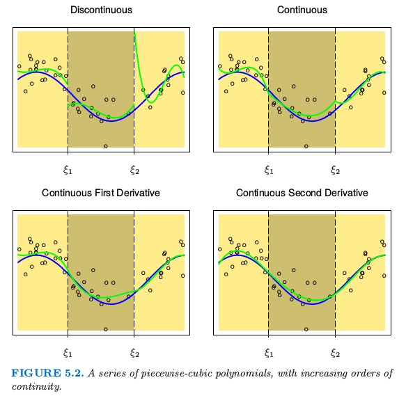

# 分段多项式和样条

| 原文   | [The Elements of Statistical Learning](../book/The Elements of Statistical Learning.pdf) |
| ---- | ---------------------------------------- |
| 翻译   | szcf-weiya                               |
| 时间   | 2017-02-08:2017-02-16                               |

直到5.7节我们都假设$X$为一维向量。分段多项式函数$f(X)$通过将$X$的定义域分成连续的区间，然后在每个区间内用单独的多项式来表示$f$。图5.1显示了两个简单的分段多项式。第一个是分段常值，含有三个基函数：
$$
h_1(X)=I(X<\xi_1),\;h_2(X)=I(\xi_1\le X\le \xi_2),\;h_3(X)=I(\xi_2\le X)
$$
因为这些在不连续区域为正值，模型$f(X)=\sum_{m=1}^3\beta_mh_m(X)$等价于$\hat\beta_m=\overline{Y}_m$,即为$Y$在第$m$个区域的均值。

> 图5.1. 上面图显示了对一些人造数据的分段常值函数拟合。垂直虚线表示两个结点$\xi_1$和$\xi_2$.蓝色曲线表示真正的函数，数据是通过函数加上高斯噪声产生的。下面板的图显示了对同样数据的分段线性函数拟合——上面板的图没有限制，而下面板的图限制为在结点处连续——右上图没有限制，而左下图限制为在结点处连续。右下图显示了分段线性的基函数，$h_3(X)=(X-\xi_1)_+$,它在$\xi_1$处连续。黑色点表示样本取值$h_3(x_i),i=1,2,\ldots,N$

右上图显示了分段线性拟合。需要三个额外的基函数：$h_{m+3}=h_m(X)X,m=1,2,3$.除了特殊的情形，我们一般更想要第三个面板的图，也是分段线性，但在间隔点上连续。这些连续性的约束导致在参数上的线性约束；举个例子，$f(\xi_1^-)=f(\xi_1^+)$意味着$\beta_1+\xi_1\beta_4=\beta_2+\xi_1\beta_5$.在这种情形下，因为存在两个约束，我们期减少了两个参数，最终得到4个自由参数。

这种情形下更直接的方式是将约束结合起来的基函数：
$$
h_1(X)=1,\;h_2(X)=X,\;h_3(X)=(X-\xi_1)_+,\;h_4(X)=(X-\xi_2)_+
$$
其中$t_+$记为正的部分。函数$h_3$的图象如图5.1显示。我们经常偏好光滑函数，这个可以通过增加局部多项式的阶数实现。图5.2显示了一系列对同样数据进行的分段3次多项式拟合，增加了结点处的连续性的阶数。右下图的函数是连续的，且在结点处的一阶微分和二阶微分均连续。这称为三次样条。再加一阶的连续性可以导致全局三次多项式。不难证明（练习5.1）下面的基函数表示结点为$\xi_1$和$\xi_2$的三次样条。
$$
\begin{align}
h_1(X)=1,\;h_3(X)=X^2,\;&h_5(X)=(X-\xi_1)_+^3\\
h_2(X)=X,\;h_4(X)=X^3,\;&h_6(X)=(X-\xi_2)_+^3
\end{align}
\qquad (5.3)
$$
这里6个基函数对应6维函数的线性空间。快速地确定参数个数：（3个区域）$\times$ (每个区域4个参数)-（2个结点）$\times$（每个结点3个限制）=6.

> 图5.2. 一系列分段3次多项式拟合，增加了连续性的阶数。

更一般地，结点为$\xi_j,j=1,\ldots,K$的阶数为$M$的样条是阶数为$M$的分段多项式，而且有连续的$M-2$阶微分。三次样条的$M=4$。实际上图5.1的分段常数函数是阶数为1的样条，而连续的分段线性函数是阶数为2的样条。同样地，截断（truncated-power）基的集合是
$$
\begin{align}
h_j(X)&=X^{j-1},j=1,\ldots,M\\
h_{M+\ell}(X)&=(X-\xi_\ell)_+^{M-1},\ell=1,\ldots,K
\end{align}
$$

声称三次样条是使得人眼看不出结点不连续的最低阶样条。需要选择样条的阶数，结点的个数以及它们的位置。参量化样条族的一种简单方式是通过基函数或者自由度，而且用观测$x_i$来确定结点的位置。举个例子，R语言中的表达式bs(x,df=7)产生在x中$N$个观测点取值的三次样条基函数，其中有$7-3=4$个内结点，内结点在x的（20,40,60和80）分位数处。（含四个结点的三次样条是8个维度的。bs()函数默认忽略基函数里面的常数项，因为这样的项一般包含在模型的其它项里面。）然而，也可以更明确地指出，bs(x, degree=1, knots=c(0.2,0.4,0.6))产生有三个内结点的线性样条的基，并且返回一个$N\times 4$的矩阵。

因为特定阶数以及结点序列的样条函数的空间是向量空间，所以表示它们有许多等价的基底（就像普通多项式一样。）尽管truncated power基在概念上很简单，但是数值计算时不是很吸引人：大的数值的power可以导致非常严重的舍入问题。在本章附录中描述的B样条的基即使在结点数$K$很大时也有很高的计算效率。

## 自然三次样条

我们知道对数据的多项式拟合的行为在边界处有不稳定的趋势，而且外推法可以很危险。这些问题被样条进一步恶化。边界结点之外的多项式拟合的表现比该区域对应的全局多项式拟合更野蛮。这个可以通过最小二乘拟合的样条函数的逐点方差方便地总结出来（更多细节见下一节的计算这些方差的例子）。图5.3比较了不同模型的逐点方差。在边界处的方差爆炸是显而易见的，对于三次样条这必要会更糟糕。

自然三次样条添加额外的限制，换句话说在边界结点之外的线性函数。这样减少了4个自由度（两个边界区域分别两个限制条件），这四个自由度可以通过在内部区域取更多的结点花费掉。图5.3用方差表示了这种权衡。在边界附近需要在偏差上付出代价，但是假设边界附近（不管怎样，我们的信息很少）为线性函数通常是合理的考虑。

含$K$个结点的自然三次样条用$K$基函数来表示。可以从三次样条的出发，通过强加上边界限制导出降维的基。举个例子，从5.2节描述的truncated power序列基出发，我们得到（练习5.4）：
$$
N_1(X)=1,\;N_2(X)=X,\; N_{k+2}(X)=d_k(X)-d_{K-1}(X),\qquad (5.4)
$$
其中，
$$
d_k(X)=\frac{(X-\xi_k)_+^3-(X-\xi_K)_+^3}{\xi_K-\xi_k}\qquad (5.5)
$$
可以看到当$X\ge \xi_K$时每个基函数的二阶微分和三阶微分均为0.

## 例子：南非心脏病（继续）

在4.4.2节我们对南非心脏病数据进行了线性逻辑斯蒂回归拟合。这里我们以采用自然样条的函数来探索非线性。模型的函数有如下形式：
$$
\mathrm{logit}[Pr(chd\mid X)]=\theta_0+h_1(X_1)^T\theta_1+h_2(X_2)^T\theta_2+\cdots+h_p(X_p)^T\theta_p\qquad (5.6)
$$
其中每个$\theta_i$都是乘以对应自然样条基函数$h_j$的系数向量。

我们在模型中对每一项采用4个自然样条基。举个例子，$X_1$代表sbp，$h_1(X_1)$是包含四个基函数的基。这实际上表明有三个而非两个内结点（在sbp的均匀分位数结点处取值），另外在数据端点有两个边界结点，因为我们把$h_j$的常数项提取出来了。

> weiya注：
>
> 因为把常数项单独提出来，所以原本应该为5个基函数。对于自然三次样条来说，$K$个基函数表示含有$K$个结点。
>
> 因为三次样条$M=4$，$K$为结点个数（含边界点）
>
> $M+K=4+$基函数个数
>
> 则$K$个基函数表示含有$K$个结点。
>
> 这里，总共5个结点，除去边界点，则还剩3个内结点。

!!! note "weiya注："
    因为把常数项单独提出来，所以原本应该为5个基函数。对于自然三次样条来说，$K$个基函数表示含有$K$个结点。

    因为三次样条$M=4$，$K$为结点个数（含边界点）

    $M+K=4+$基函数个数

    则$K$个基函数表示含有$K$个结点。

    这里，总共5个结点，除去边界点，则还剩3个内结点。
因为famhist是含两个水平的因子，所以通过一个二进制变量或者虚拟变量来编码，而且它与模型拟合中的单系数有关。

更简洁地，我们将$p$维基函数（以及常数项）向量结合成一个向量$h(X)$，则模型简化为$h(X)^T\theta$，总参数个数为$df=1+\sum_{j=1}^pdf_j$，是每个组分中参数个数的和。每个基函数在$N$个样本中分别取值，得到一个$N\times df$的基矩阵$\mathbf H$.在这点上看，模型类似于其他的线性逻辑斯蒂回归模型，应用的算法在4.4.1节描述。

我们采用向后逐步删除过程，从模型中删除项并且保持每个项的群体结构，而不是每次删除一个系数。AIC统计量（7.5节）用来删除项，并且在最后模型中保留下来的所有项如果被删掉都会导致AIC增大（见表5.1）.图5.4显示了通过逐步回归选择出的最终模型的图象。对于每个变量$X_j$，画出的函数是$\hat f_j(X_j)=h_j(X_j)^T\hat\theta_j$。协方差矩阵$Cov(\hat\theta)=\mathbf\Sigma$通过$\mathbf{\hat\Sigma=(H^TWH)^{-1}}$来估计，其中$\mathbf W$为逻辑斯蒂回归的对角元素构成的权重矩阵。因此$v_j(X_j)=Var[\hat f_j(X_j)]=h_j(X_j)^T\mathbf{\hat \Sigma}_{jj}h_j(X_j)$是$\hat f_j$的逐点方差函数，其中$Cov(\hat\theta_j)=\hat{\mathbf\Sigma}_{jj}$是$\hat{\mathbf\Sigma}$对应的子矩阵。图5.4中每张图的阴影区域由$\hat f_j(X_j)\pm2\sqrt{v_j(X_j)}$定义。

AIC统计量比似然比检验（偏差检验）更“宽容”（generous）。sbp和obesity都被包含进模型中，而不在线性模型中。图象解释了为什么它们的贡献本质上非线性。这些影响乍看或许很惊讶，但解释在于回顾性数据的本质。这些指标有时是当病人患上心脏病后测出来的，而且在很多情形下他们已经受益于健康饮食和生活状态，因此在obesity和sbp值较低时会有明显的增长。表5.1显示了所选模型的摘要。

## 例子：音素识别

在这个例子中我们采用样条来降低灵活性而非增大灵活性；这个应用在一般的函数型建模标题下。图5.5的上图显示了在256个频率下测量的两个音素“aa”和“ao”中的每一个的15个对数周期图的样本。目标是应用这些数据对口语音素进行分类。选择这两个音素是因为它们很难被分开。

> 图5.5 上图显示了对数周期图作为15个例子频率的函数，例子中每个音素“aa”和“ao”从总共695个“aa”和1022个“ao”中选取。每个对数周期图在256个均匀的空间频率处测量。下图显示了对数据进行极大似然拟合逻辑斯蒂回归得到的系数（作为频率的函数）的图象，将256个对数周期图值作为输入。系数被限制为在红色曲线中是光滑的，而在锯齿状灰色曲线中不受限制。

!!! note "weiya注"
    周期图（Periodogram）：在信号处理中，周期图是信号谱密度的估计。
	

输入特征是长度为256的向量$x$，我们可以看成是在频率$f$的节点上取值的函数值$X(f)$向量。实际上，存在一个连续的类似信号，它是频率的函数，而且我们有它的一个取样版本。

图5.5的下面板图显示了对从695个“aa”和1022个“ao”选出的1000个训练样本进行极大似然拟合得到的线性逻辑斯蒂回归模型的系数。也作出了系数关于频率的函数图象，而且实际上我们可以根据下面的连续形式来思考模型

$$
\mathrm{log}\frac{Pr(aa\mid X)}{Pr(ao\mid X)}=\int X(f)\beta(f)df\qquad (5.7)
$$

通过下式来近似

$$
\sum\limits_{j=1}^{256}X(f_j)\beta(f_j)=\sum\limits_{j=1}^{256}x_j\beta_j\qquad (5.8)
$$

系数计算一个反函数，而且将会在时域内有可测的值，其中在两个类别中对数周期图不同。

灰色曲线十分粗糙。因为输入信号有相当强的正自相关性，这导致系数中的负自相关。另外，样本大小仅仅对于每个系数仅仅提供了4个有效的观测。

类似这样的应用运行自然的正则化。我们强制系数作为频率的函数均匀变化。图5.5中下图的红色曲线显示了对这些数据这样一个光滑参数曲线。我们看到低频率提供最有差别的力量。这个光滑不仅允许对相反的进行简单的解读，而且得到更加精确的分类器：

红色光滑曲线可以应用非常简单的自然三次样条得到。我们可以将系数函数表达成样条$\beta(f)=\sum_{m=1}^Mh_m(f)\theta_m$的展开。实际中这意味着$\beta=\mathbf H\theta$，其中，$\mathbf H$是 $p\times M$三次样条的基矩阵，定义在频率集上。这里我们采用$M=12$个基函数，其中结点俊宇分布在表示频率的整数$1,2,\ldots,256$上。因为$x^T\beta=x^T\mathbf H\theta$，我们可以简单地将输入特征$x$替换成滤波（filtered）形式$x^*=\mathbf H^Tx$，并在$x^*$上通过线性逻辑斯蒂回归拟合$\theta$.红色曲线因此是$\beta(f)=h(f)^T\hat\theta$

