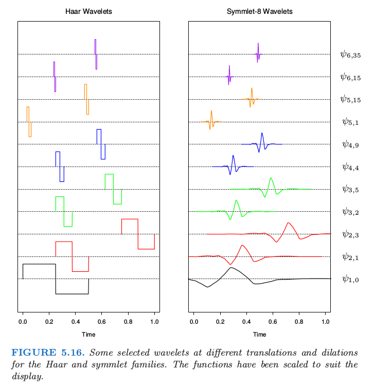

# 5.9 小波光滑

| 原文   | [The Elements of Statistical Learning](../book/The Elements of Statistical Learning.pdf) |
| ---- | ---------------------------------------- |
| 翻译   | szcf-weiya                               |
| 时间   | 2017-12-07                               |

我们有两种操作的模式来处理基函数的集合。对于回归样条时，我们运用专业相关的知识或者自动地来选择基底的子集。更自适应的过程比如MARS(第9章)可以同时捕捉光滑和非光滑的行为。对于光滑样条，我们采用整个基底，然后将系数收缩到光滑。

小波法一般用整个正交基底来表示函数，但是会进一步对参数进行收缩或选择来实现稀疏表示。正如光滑函数可以用很少的样条基函数来表示，对于大部分都是平滑、包含很少的独立凹凸块(isolated bumps)函数可以用很少的（凹凸不平的）基函数来表示。小波基在信号处理和压缩中非常流行，因为他们可以有效地表示光滑和局部凹凸不平的函数——这被称为时间和频率的局部化(time and frequency localization)。相反，传统的Fourier仅仅允许频率的局部化。

在我们介绍具体细节前，先看看图5.16中左边的Haar小波来直观感受小波光滑是怎样实现的。

竖轴表示小波的尺度(频率)，底部尺度最低，顶端尺度最高。在每个尺度下，小波并排着来填充时间轴：我们只展示出了一个子集。小波光滑通过最小二乘来拟合基底的系数，接着设置阈值来丢弃较小的系数。因为在每个尺度下都有很多的基函数，则可以在需要它的时候采用它，不需要它的时候丢弃它，这样来实现时间和频率的局部化。Harr小波很容易理解，但是用于更多的目的时不够光滑。图5.16中右边的symmlet小波有着相同的正交性质，但是更加光滑。

图5.17展示了一个NMR（原子核偶磁共振）信号，看上去由光滑的组分和单独的尖状物以及一些噪声组成。采用symmlet基底的小波变换显示在左下角的图中。小波的系数按行排列，从底部的最低尺度到顶部的最大尺度。每一条线段的长度表明了系数的大小。右下角显示了当设置阈值过滤时的小波系数。阈值的过程由式(5.69)给出，是与线性回归中lasso一样的软阈值过程。注意到许多较小的系数设为了0。图中上边的绿色曲线显示了阈值系数的向后转换：这也就是原始信号的光滑版本。在下一节我们将给出这一过程的细节，包括小波的构造和阈值规则。

## 小波基和小波变换

TODO

## 自适应小波滤波

TODO
