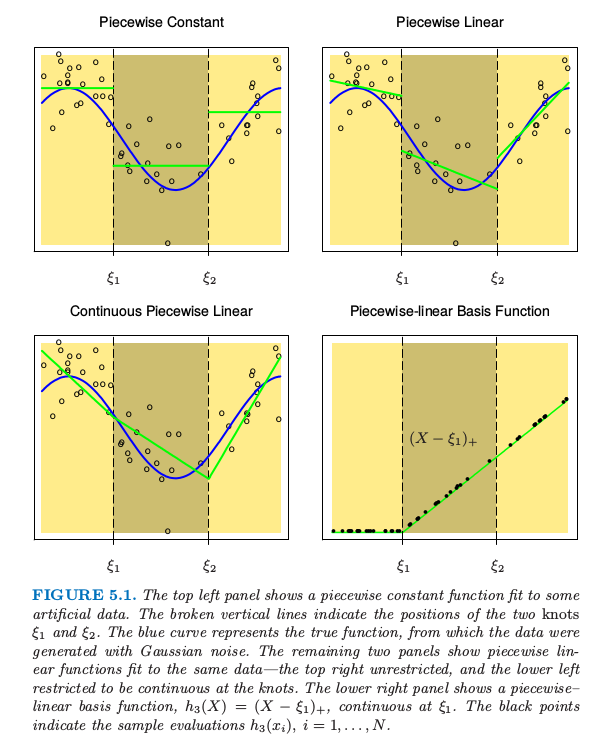
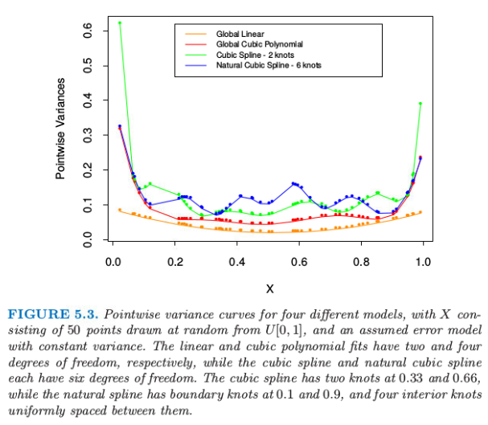
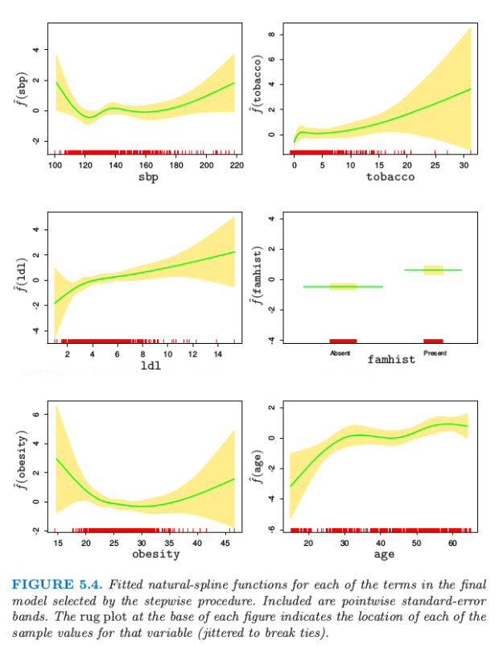
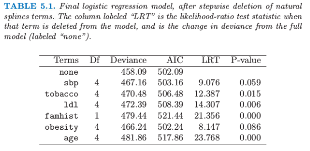
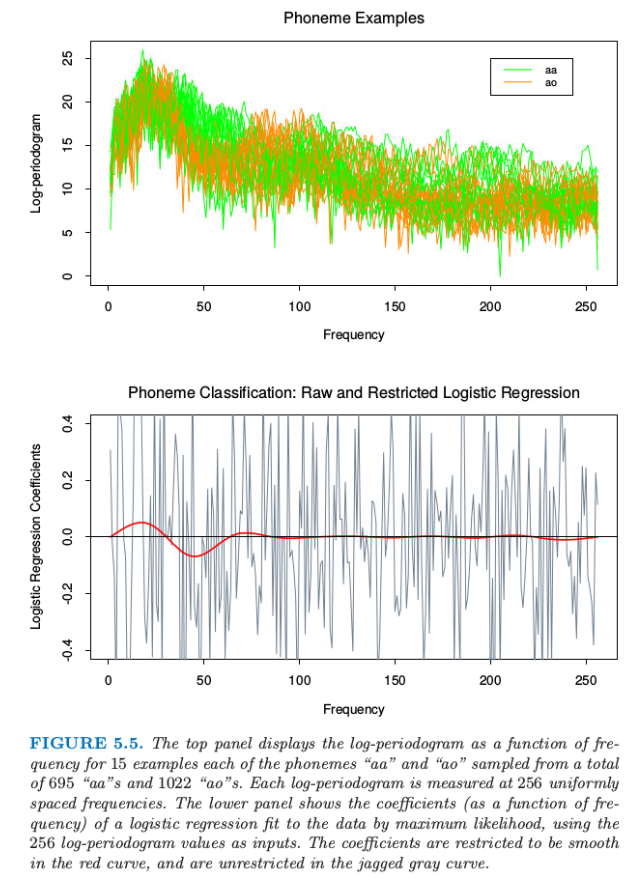

# 5.2 分段多项式和样条

| 原文   | [The Elements of Statistical Learning](../book/The Elements of Statistical Learning.pdf#page=160) |
| ---- | ---------------------------------------- |
| 翻译   | szcf-weiya                               |
| 时间   | 2017-02-08:2017-02-16                               |
| 更新   | 2017-09-13& 2017-10-18 & 2018-01-04             |

!!! note "更新笔记"
    @2017.09.13 这一节在 FRM 课程上，张老师特别介绍了三次样条，当时才意识到样条的order和degree是不同的，当时看这一节时还挺纳闷为啥阶数比自己理解的多 1．[wiki](https://en.wikipedia.org/wiki/Order_of_a_polynomial)上也提到了“the order of a spline, either the degree+1 of the polynomials defining the spline or the number of knot points used to determine it.” 比如 3 次样条的 order 为 4，但 degree 才是我们熟悉的阶数，degree等于 3．**故在本节的翻译中，原文为 order 的直接用 order，其它情况了类似称“三次多项式”均指 degree．** 当然上面仅限于样条，对于微分方程的 order 与 degree，用下面的例子来说明
    $$
    \frac{d^2y}{d x^2}+3\frac{dy}{dx}+2y=0
    $$
    微分方程的 order 指的是方程中最高次的微分，所以上式的 order 为 2；而 degree 指的是最高次微分的幂，所以上式 degree 为 1．值得注意的是，order 的定义是完整的，但 degree 的定义是不完整的，对于非多项式的微分方程，不能定义其 degree，也就是并不知道 $\sin(\frac{dy}{dx})$ 的 degree 是多少．
    关于这两者的区别，可以参见 Quora 上的一篇回答 [What is the difference between the degree and order of a differential equation?](https://www.quora.com/What-is-the-difference-between-the-degree-and-order-of-a-differential-equation)

    @2017.10.18 今天跟 yy 同学简要讨论了一下样条方法，ta觉得“样条方法本身其实就是最小二乘，惩罚样条也不过就是跟最小二乘的Lasso 之类一个原理，没什么新意，不过这种非参估计因为假设放宽所以渐近性要比线性模型证明起来复杂的多．” 说得很对，但我觉得并非没有新意，看上去确实是像最小二乘（或者说是广义最小二乘或者加权最小二乘），但想到样条方法的初衷，不就是将线性模型拓展到超线性吗，而这种超线性的体现在于可加的分量是$h(X)$，是原始变量$X$的某个变换，比如样条基．所以我觉得表现形式很像最小二乘（或广义最小二乘）是很自然的，并且其惩罚也应该对应着线性中的惩罚，无论是lasso，还是 $L_2$．另外，我个人一个很大的感受是，看上去很general的东西但看他们的论文或者书并不会觉得没有新意，比如esl中很多方法你似乎看上去都可以归结为最最一般的方法，但还是惊叹于新方法的巧妙．

直到 [5.7 节](5.7-Multidimensional-Splines/index.html) 我们都假设 $X$ 为一维向量．分段多项式函数 $f(X)$ 通过将 $X$ 的定义域分成连续的区间得到，并且在每个区间内用单独的多项式来表示 $f$．图 5.1 显示了两个简单的分段多项式．第一个是分段常值，含有三个基函数：
$$
h_1(X)=I(X<\xi_1),\;h_2(X)=I(\xi_1\le X\le \xi_2),\;h_3(X)=I(\xi_2\le X)
$$
因为这些在不连续区域都为正值，模型 $f(X)=\sum_{m=1}^3\beta_mh_m(X)$ 的最小二乘估计等价于 $\hat\beta_m=\overline{Y}_m$，即为 $Y$ 在第 $m$ 个区域的均值．

> 图 5.1. 上面两张图显示了对一些模拟数据的分段常值函数拟合．垂直虚线表示两个结点 $\xi_1$ 和 $\xi_2$．蓝色曲线表示真正的函数，数据是通过函数加上高斯噪声产生的．下面板的图显示了对同样数据的分段线性函数拟合——上面板的图没有限制，而下面板的图限制为在结点处连续——右上图没有限制，而左下图限制为在结点处连续．右下图显示了分段线性的基函数，$h_3(X)=(X-\xi_1)_+$,它在 $\xi_1$ 处连续．黑色点表示样本取值 $h_3(x_i),i=1,2,\ldots,N$．

右上图显示了分段线性拟合．需要三个额外的基函数：$h_{m+3}=h_m(X)X,m=1,2,3$．除了在特殊情况下，我们一般更想要第三个面板的图，也是分段线性，但在间隔点上连续．这些连续性的约束导致在参数上存在线性约束；举个例子，$f(\xi_1^-)=f(\xi_1^+)$ 意味着 $\beta_1+\xi_1\beta_4=\beta_2+\xi_1\beta_5$．在这种情形下，因为存在两个约束，我们则减少了两个参数，最终得到 4 个自由参数．

这种情形下更直接的方式是将约束结合起来的基函数：
$$
h_1(X)=1,\;h_2(X)=X,\;h_3(X)=(X-\xi_1)_+,\;h_4(X)=(X-\xi_2)_+
$$
其中 $t_+$ 记为正的部分．函数 $h_3$ 的图象如图 5.1 右下角图所示．我们经常偏好光滑函数，这个可以通过增加局部多项式的阶数实现．

> 图 5.2. 一系列分段 3 次多项式拟合，其中增加了连续性的阶数．

图 5.2 展示了一系列对同样数据进行的分段 3 次多项式拟合，增加了结点处连续性的阶数．右下图的函数是连续的，且在结点处的一阶微分和二阶微分均连续．这称为三次样条．再加一阶的连续性可以得到全局三次多项式．不难证明（[练习 5.1](https://github.com/szcf-weiya/ESL-CN/issues/29)）下面的基函数表示结点为 $\xi_1$ 和 $\xi_2$ 的三次样条．
$$
\begin{align*}
h_1(X)=1,\;h_3(X)=X^2,\;&h_5(X)=(X-\xi_1)_+^3\\
h_2(X)=X,\;h_4(X)=X^3,\;&h_6(X)=(X-\xi_2)_+^3
\end{align*}
\tag{5.3}
$$

!!! info "weiya 注：Ex. 5.1"
    已解决，详见 [Issue 29: Ex. 5.1](https://github.com/szcf-weiya/ESL-CN/issues/29)．

这里 6 个基函数对应 6 维函数的线性空间．快速地确定参数个数：（3 个区域）$\times$ (每个区域 4 个参数)-（2 个结点）$\times$（每个结点 3 个限制）= 6.

!!! note "weiya 注"
    单独考虑每个区域，因每个区域是三阶多项式，则需要确定的参数有四个，每个结点处，需要保持连续、一阶微分连续、二阶微分连续，所以每个结点3个限制．
    从另一个角度看，因 $\sum_{m=1}^6\beta_mh_m$ 需要确定的就是 $\beta_m$ 这 6 个参数．

<!--
单独考虑每个区域，则需要确定的参数有四个，$\sum_{i=1}^4\beta_mh_m$，每个结点处，需要保持连续、一阶微分连续、二阶微分连续，所以每个结点3个限制．
从另一个角度看，因$\sum_{i=1}^6\beta_mh_m$需要确定的就是$\beta_i$这6个参数．
-->

更一般地，结点为 $\xi_j,j=1,\ldots,K$ 的 order 为 $M$ 的样条是 order 为 $M$ 的分段多项式，而且有连续的 $M-2$ 次微分．三次样条的 $M=4$．实际上图 5.1 的分段常数函数是 order 为 1 的样条，而连续的分段线性函数是 order 为 2 的样条．同样地，**截断幂 (truncated-power)** 基的集合是
$$
\begin{align*}
h_j(X)&=X^{j-1},j=1,\ldots,M\\
h_{M+\ell}(X)&=(X-\xi_\ell)_+^{M-1},\ell=1,\ldots,K
\end{align*}
$$

据说三次样条是人眼看不出结点不连续的最低阶样条．很少有更好的理由去选择更高次的样条，除非对光滑的微分感兴趣．实际中，用得最多的 order 还是 $M=1,2,4$．

这些固定结点的样条也称作 **回归样条 (regression splines)**．我们需要选择样条的阶数，结点的个数以及它们的位置．一种简单方式是用基函数或自由度来参量化样条族，并用观测 $x_i$ 来确定结点的位置．举个例子，`R` 语言中的命令 `bs(x,df=7)` 产生在 `x` 的 $N$ 个观测点取值的三次样条基函数，其中有 $7-3=4$ 个内结点，内结点在 `x` 的（20,40,60 和 80）分位数处．（含四个结点的三次样条有 8 个维度．`bs()`函数默认忽略基函数里面的常数项，因为这样的项一般包含在模型的其它项里面．）

!!! note "weiya 注： "
    order 为 $M$，含有 $K$ 个结点的样条其自由度为
    $$
    M(K+1)-(M-1)K=K+M
    $$
    左边第一项表示 $K+1$ 个区域中每个区域需要 $M$ 个参数，而第二项表明 $K$ 个结点中需要 $M-1$ 个限制．比如，对于三次样条，$M=4$，则自由度为 $K+4$．在 `bs(x,df=7)` 中，原本四个结点的三次样条自由度为 8，但是由于 `bs()` 函数本身默认在基中去掉常数项．原书中解释说，“这样的项一般包含在模型的其它项里面”，能否举个例子？

然而，也可以更明确地指出，`bs(x, degree=1, knots=c(0.2,0.4,0.6))` 产生有三个内结点的线性样条的基，并且返回一个 $N\times 4$ 的矩阵．

因为特定 order 以及结点序列的样条函数的空间是向量空间，所以表示它们会有许多等价的基底（就像普通多项式一样．）尽管截断幂基在概念上很简单，但是数值计算时不是很吸引人：较大的幂次会导致非常严重的舍入问题．在本章附录中描述的 B 样条基即使在结点数 $K$ 很大时也有很高的计算效率．

## 自然三次样条

我们知道对数据的多项式拟合的行为在边界处有不稳定的趋势，而且外推法会很危险．样条进一步恶化了这些问题．边界结点之外的多项式拟合的表现比该区域对应的全局多项式拟合更野蛮．从最小二乘拟合的样条函数的 **逐点方差 (pairwise variance)**，可以很方便地看到这一点（更多细节见下一节的计算这些方差的例子）．图 5.3 比较了不同模型的逐点方差．在边界处的方差爆炸是显而易见的，对于三次样条这必要会更糟糕．

**自然三次样条 (natural cubic spline)** 添加额外的限制，具体地，令边界结点之外的函数是线性的．这样减少了 4 个自由度（两个边界区域分别两个限制条件），这四个自由度可以通过在内部区域取更多的结点花费掉．图 5.3 用方差表示了这种权衡．在边界附近需要在偏差上付出代价，但是假设边界附近（不管怎样，我们的信息很少）为线性函数通常是合理的考虑．

含 $K$ 个结点的自然三次样条用 $K$ 个基函数来表示．可以从三次样条的出发，通过强加上边界限制导出降维的基．举个例子，从 5.2 节描述的truncated power序列基出发，我们得到（[练习 5.4](https://github.com/szcf-weiya/ESL-CN/issues/31)）：
$$
N_1(X)=1,\;N_2(X)=X,\; N_{k+2}(X)=d_k(X)-d_{K-1}(X),\tag{5.4}
$$
其中，
$$
d_k(X)=\frac{(X-\xi_k)_+^3-(X-\xi_K)_+^3}{\xi_K-\xi_k}\tag{5.5}
$$
可以看到当$X\ge \xi_K$时每个基函数的二阶微分和三阶微分均为0.

!!! info "weiya 注：Ex. 5.4"
    已解决，详见 [Issue 31: Ex. 5.4](https://github.com/szcf-weiya/ESL-CN/issues/31)，欢迎讨论交流．

!!! note "weiya 注"
    下面说明对于自然三次样条而言，基函数个数即为结点个数．
    设有 $K$ 个结点，则有 $K-2$ 个内结点，$(K-2+1)$ 个区域，每个区域参数为 4 个，每个内结点减掉 3 个参数，每个边界点减掉一个参数，则还剩下
    $$
    (K-1)\cdot 4-3(K-2)-2\times 1 = K
    $$
    也就是 $K$ 个基函数．

    具体地，假设某内结点 $\xi$ 的左右区域函数分别为
    $$
    f_i(x) = a_ix^3+b_ix^2+c_ix+d_i,\quad i=1,2\,,
    $$
    则自由参数有 8 个 $(a_i,b_i,c_i,d_i),i=1,2$，结点 $\xi$ 处需要满足“函数值相等”、“一阶导相等”、“二阶导相等”，即
    $$
    \begin{align*}
    f_1(\xi) &=f_2(\xi)\\
    f_1'(\xi) &=f_2'(\xi)\\
    f_1''(\xi) &=f_2''(\xi)
    \end{align*}
    $$
    相当于减少了 3 个自由参数（换句话说，有三个参数可以被其他 5 个参数表示出来）。

    对于某边界点 $\xi_0$，其所在区域的函数为 $f(x)=ax^3+bx^2+cx+d$，边界点需要满足“二阶导为零”的约束，即
    $$
    f''(\xi_0) = 0\,,
    $$
    这减少了 1 个自由参数。

## 例子：南非心脏病（继续）

在 4.4.2 节我们对南非心脏病数据进行了线性逻辑斯蒂回归拟合．这里我们以采用自然样条的函数来探索非线性．模型的函数有如下形式：
$$
\mathrm{logit}[\Pr(chd\mid X)]=\theta_0+h_1(X_1)^T\theta_1+h_2(X_2)^T\theta_2+\cdots+h_p(X_p)^T\theta_p\tag{5.6}
$$
其中每个 $\theta_i$ 都是乘以对应自然样条基函数 $h_j$ 的系数向量．

我们在模型中对每一项采用4个自然样条基．举个例子，$X_1$ 代表 `sbp`，$h_1(X_1)$ 是包含四个基函数的基．因为我们把 $h_j$ 的常数项提取出来了，所以这实际上表明有三个而非两个内结点（在 `sbp` 的均匀分位数结点处取值），另外在数据端点有两个边界结点．

<!--
> weiya注：
>
> 因为把常数项单独提出来，所以原本应该为5个基函数．对于自然三次样条来说，$K$个基函数表示含有$K$个结点．
>
> 因为三次样条$M=4$，$K$为结点个数（含边界点）
>
> $M+K=4+$基函数个数
>
> 则$K$个基函数表示含有$K$个结点．
>
> 这里，总共5个结点，除去边界点，则还剩3个内结点．
-->

<!--
!!! note "weiya注："
    因为把常数项单独提出来，所以原本应该为5个基函数．对于自然三次样条来说，$K$个基函数表示含有$K$个结点．

    因为三次样条$M=4$，$K$为结点个数（含边界点）

    $M+K=4+$基函数个数

    则$K$个基函数表示含有$K$个结点．

    这里，总共5个结点，除去边界点，则还剩3个内结点．

!!! note "weiya 注"
    上文 $h_j$ 中的常数项已经提出，所以实际上含 $K$ 个基函数的自然三次样条，其内结点个数为
    $$
    (K+1)\cdot 3-3K=3
    $$

-->

!!! note "weiya 注："
    因为把常数项单独提出来，所以原本应该为 5 个基函数．考虑到对于自然三次样条，$K$ 个基函数表示含有 $K$ 个结点．所以这里也就是总共 5 个结点，除去边界点，则还剩 3 个内结点．

因为 `famhist` 是含两个水平的因子，所以用一个二值变量或者虚拟变量来编码，而且它与拟合的模型中的单个系数有关．

更简洁地，我们将 $p$ 维基函数（以及常数项）向量结合成一个向量 $h(X)$，则模型简化为 $h(X)^T\theta$，总参数个数为 $df=1+\sum_{j=1}^pdf_j$，是每个组分中参数个数的和．每个基函数在 $N$ 个样本中分别取值，得到一个 $N\times df$ 的基矩阵 $\mathbf H$．在这点上看，模型类似于其他的线性逻辑斯蒂回归模型，应用的算法在 4.4.1 节描述．

我们采用向后逐步删除过程，从模型中删除项并且保持每个项的整体结构，而不是每次删除一个系数．AIC 统计量（7.5 节）用来删除项，并且在最后模型中保留下来的所有项如果被删掉都会导致 AIC 增大（见表 5.1）．图 5.4 显示了通过逐步回归选择出的最终模型的图象．对于每个变量 $X_j$，画出的函数是$\hat f_j(X_j)=h_j(X_j)^T\hat\theta_j$．协方差矩阵 $\Cov(\hat\theta)=\mathbf\Sigma$ 通过 $\mathbf{\hat\Sigma=(H^TWH)^{-1}}$ 来估计，其中 $\mathbf W$ 为逻辑斯蒂回归的对角元素构成的权重矩阵．因此 $v_j(X_j)=\Var[\hat f_j(X_j)]=h_j(X_j)^T\mathbf{\hat \Sigma}\_{jj}h_j(X_j)$ 是 $\hat f_j$ 的逐点方差函数，其中 $\Cov(\hat\theta_j)=\hat{\mathbf\Sigma}\_{jj}$ 是 $\hat{\mathbf\Sigma}$ 对应的子矩阵．图 5.4 中每张图的阴影区域由 $\hat f_j(X_j)\pm2\sqrt{v_j(X_j)}$ 定义．

AIC统计量比似然比检验（偏差检验）更“宽容”（generous）．`sbp`和`obesity`都被包含进模型中，而这两个量都不在线性模型中．图象解释了为什么它们的贡献本质上是非线性．这些影响乍看或许很奇怪，但这因为是回顾性数据的本质．这些指标有时是当病人患上心脏病后测出来的，而且在很多情形下他们已经受益于健康饮食和生活状态，因此在`obesity`和`sbp`值较低时会有明显的增长．表5.1总结了部分模型的效果．

## 例子：音素识别

在这个例子中我们采用样条来降低灵活性而非增大灵活性；这个应用是属于一般的函数型(functional)建模．图5.5的上图显示了在256个频率下分别测量两个音素“aa”和“ao”的15个对数周期图．目标是应用这些数据对口语音素进行分类．选择这两个音素是因为它们很难被分开．

> 图5.5 上图显示了对数周期图作为15个例子中的频率的函数，例子中每个音素“aa”和“ao”从总共695个“aa”和1022个“ao”中选取．每个对数周期图在256个均匀的空间频率处测量．下图显示了对数据进行极大似然拟合逻辑斯蒂回归得到的系数（作为频率的函数）的图象，将256个对数周期图值作为输入．带约束的逻辑斯底回归的系数随频率变化是光滑的红色曲线，而在锯齿状灰色曲线是无约束的逻辑斯底回归情形下系数随频率变化的曲线．

!!! note "weiya注"
    周期图（Periodogram）：在信号处理中，周期图是信号谱密度的估计．
    抛开背景知识，直观理解便是上图绘制了每条曲线代表一个例子，其中15条表示"aa"，另外15条表示"ao"．

输入特征是长度为256的向量$x$，我们可以看成是在频率$f$的节点上取值的函数值$X(f)$向量．实际上，存在一个连续的类似信号，它是频率的函数，这里我们可以将$X(f)看成$是它的一个取样版本．

图5.5的下图显示了对从695个“aa”和1022个“ao”选出的1000个训练样本进行极大似然拟合得到的线性逻辑斯蒂回归模型的系数．也作出了系数关于频率的函数图象，而且实际上我们可以根据下面的连续形式来思考模型

$$
\mathrm{log}\frac{Pr(aa\mid X)}{Pr(ao\mid X)}=\int X(f)\beta(f)df\tag{5.7}
$$

可以用下式来近似

$$
\sum\limits_{j=1}^{256}X(f_j)\beta(f_j)=\sum\limits_{j=1}^{256}x_j\beta_j\tag{5.8}
$$

系数计算出对比度函数(contrast functional)，而且将会在频域内有显著的值，其中对数周期图会区分这两个类．

灰色曲线十分粗糙．因为输入信号有相当强的正自相关性，这导致系数中的负自相关．另外，样本大小仅仅为每个系数仅仅提供了4个有效的观测．

!!! note "weiya注： question"
    why? refer to [issues#32](https://github.com/szcf-weiya/ESL-CN/issues/32)

类似这样的应用允许自然的正则化(natural regularization)．我们强制系数作为频率的函数均匀变化．图5.5中下图的红色曲线显示了对这些数据应用这样一个光滑参数曲线．我们看到低频率的差异性很明显．这个光滑不仅允许对它们的差异进行更简单的解读，而且得到更加精确的分类器：

红色光滑曲线可以应用非常简单的自然三次样条得到．我们可以将系数函数表达成样条$\beta(f)=\sum_{m=1}^Mh_m(f)\theta_m$的展开．实际中这意味着$\beta=\mathbf H\theta$，其中，$\mathbf H$是 $p\times M$三次样条的基矩阵，定义在频率集上．这里我们采用$M=12$个基函数，其中结点均匀分布在表示频率的整数$1,2,\ldots,256$上．因为$x^T\beta=x^T\mathbf H\theta$，我们可以简单地将输入特征$x$替换成滤波（filtered）形式\(x^*=\mathbf{H}^Tx\)，并在$x^*$上通过线性逻辑斯蒂回归拟合$\theta$．因此红色曲线是$\beta(f)=h(f)^T\hat\theta$．

!!! note "weiya注"
    $$
    \mathbf H=
    \left[
    \begin{array}{cccc}
    h_1(f_1)&h_2(f_1)&\ldots & h_M(f_1)\\
    h_1(f_2)&h_2(f_2)&\ldots & h_M(f_2)\\
    \vdots &\vdots & \ddots &\vdots\\
    h_1(f_p)&h_2(f_p)&\ldots&h_M(f_p)
    \end{array}
    \right]
    $$
    故$p$其实为256
