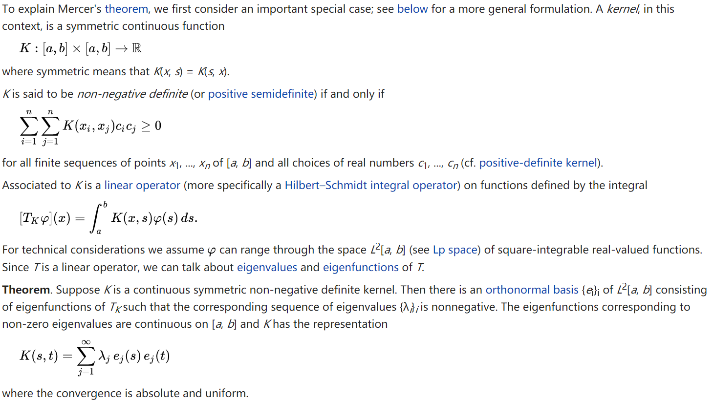
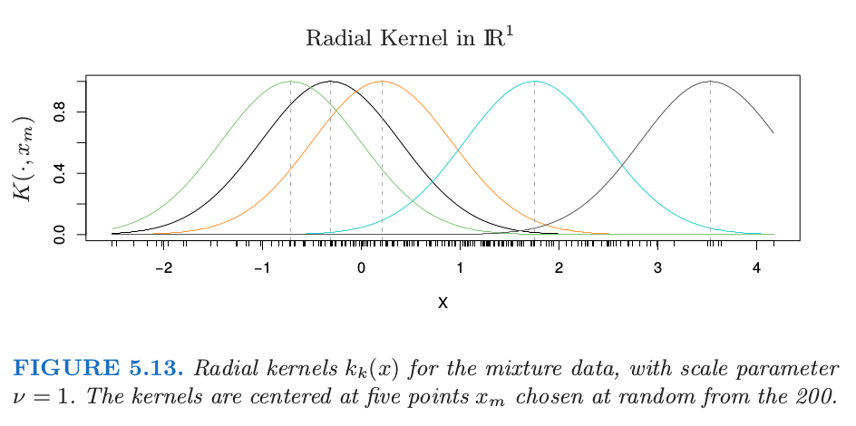
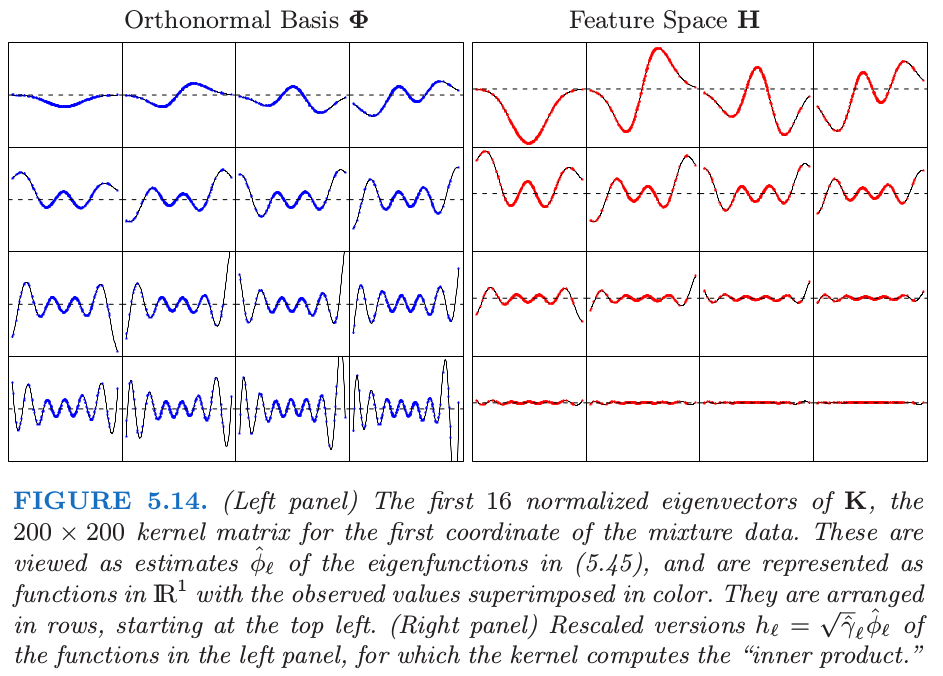
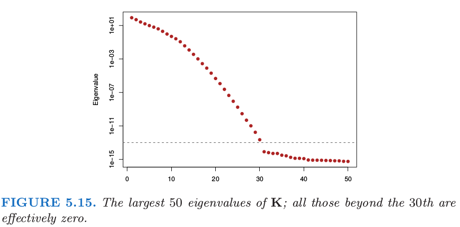

# 5.8 正则化和再生核希尔伯特空间理论

| 原文   | [The Elements of Statistical Learning](../book/The Elements of Statistical Learning.pdf#page=188) |
| ---- | ---------------------------------------- |
| 翻译   | szcf-weiya                               |
| 时间   | 2018-02-03; 2018-02-09                               |
|更新|  2018-02-11; 2018-12-11|
| 状态 | Done |

这一节我们将样条放进更大的正规方法框架下以及 **再生核希尔伯特空间 (reproducing kernel Hilbert spaces)** 中。这部分非常专业 (quite technical)，因此不感兴趣或者有些畏惧的读者可以跳过。

一般的正则化问题形式如下

$$
\underset{f\in{\cal H}}{\min}\Big[
\sum\limits_{i=1}^NL(y_i,f(x_i))+\lambda J(f)
\Big]\,,
\tag{5.42}
$$

其中 $L(y,f(x))$ 是损失函数，$J(f)$ 是惩罚函数，$\cal H$ 是 $J(f)$ 有定义的函数空间。Girosi et al. (1995)[^1] 描述了形如下式的非常一般的惩罚函数

$$
J(f)=\int_{\IR^d}\frac{\vert \tilde f(s)\vert^2}{\tilde G(s)}ds \tag{5.43}
$$

其中 $\tilde f$ 记为 $f$ 的 Fourier 变换，并且 $\tilde G$ 是当 $\Vert s\Vert\rightarrow \infty$ 趋于 $0$ 的正函数。上式想法是 $1/\tilde G$ 加大对 $f$ 的高频组分的惩罚。在一些额外的假设下，他们证明解有如下形式

$$
f(X)=\sum\limits_{k=1}^K\alpha_k\phi_k(X)+\sum\limits_{i=1}^N\theta_iG(X-x_i)\tag{5.44}
$$

其中 $\phi_k$ 张成惩罚函数 $J$ 的零空间，并且 $G$ 是 $\tilde G$ 的逆 Fourier 变换。光滑样条和 thin-plate 样条都属于这个框架。这个解的显著特点是当准则 $(5.42)$ 定义在无限维空间，解是有限维。在下一节我们考虑一些具体的例子。

## 核产生的函数空间

形如 $(5.42)$ 的问题的一个重要子类是由正定核 $K(x,y)$ 产生的，对应的函数空间 ${\cal H}_K$ 被称为 **再生核希尔伯特空间 (reproducing kernel Hilbert space)**，简称为 RKHS。惩罚函数也是用核来定义的。我们对这个模型类进行一个简短的介绍，这取自 Wahba (1990)[^2] 和 Girosi et al. (1995)[^1]，并且在 Evgeniou et al. (2000)[^3] 中有很好的总结。

令 $x,y\in \IR^p$。我们考虑由 $\\{K(\cdot, y), y\in \IR^p\\}$ 线性张成的函数空间；也就是，形如 $f(x)=\sum_m\alpha_mK(x, y_m)$ 的任意线性组合，其中每个核可以看成第一个变量的函数，并且由第二个变量索引。假设 $K$ 有 **特征展开 (eigen-expansion)**

$$
K(x, y)=\sum\limits_{i=1}^\infty \gamma_i \phi_i(x)\phi_i(y)\tag{5.45}
$$

其中 $\gamma_i\ge 0,\sum_{i=1}^\infty \gamma_i^2 < \infty$。

!!! note "weiya注：Mercer's theorem"
    $(5.45)$ 的分解由 Mercer's theorem 保证，Mercer's theorem 将半正定矩阵的特征分解推广到半正定核函数的特征分解，具体地，
    
    图片来源: [Wiki: Mercer's theorem](https://en.wikipedia.org/wiki/Mercer%27s_theorem)。

${\cal H}_K$ 的元素是关于这些 **特征函数 (eigen-functions)** 的展开，即

$$
f(x)=\sum\limits_{i=1}^\infty c_i\phi_i(x)\tag{5.46}
$$

并且约束条件为

$$
\Vert f \Vert_{{\cal H}_K}^2\overset{def}{=}\sum\limits_{i=1}^\infty c_i^2/\gamma_i < \infty\tag{5.47}
$$

其中 $\Vert f\Vert_{{\cal H}\_K}$ 由 $K$ 导出的范数。

!!! note "weiya 注：Induced Norm"
    希尔伯特空间是完备内积空间，对于一般的希尔伯特空间 $\cal H$，其 **导出范数 (induced norm)** 为
    $$
    \Vert f\Vert_{{\cal H}} := \sqrt{\langle f,f\rangle_{{\cal H}}}\,.
    $$

$(5.42)$ 中空间 ${\cal H}\_K$ 惩罚函数定义为二次范数 $J(f)=\Vert f\Vert_{{\cal H}\_K}^2$。$J(f)$ 的值可以解释为广义岭惩罚，其中在展开式 $(5.45)$ 中，大的特征值惩罚较小，反之亦然。

重写 $(5.42)$，我们有

$$
\underset{f\in {\cal H}_K}{\min}\Big[\sum\limits_{i=1}^NL(y_i, f(x_i))+\lambda \Vert f\Vert_{{\cal H}_K}^2\Big]\tag{5.48}
$$

或者等价地，

$$
\underset{\{c_j\}_1^\infty}{\min}\Big[\sum\limits_{i=1}^NL(y_i, \sum\limits_{j=1}^\infty c_j\phi_j(x_i))+\lambda \sum\limits_{j=1}^\infty c_j^2/\gamma_j\Big]\tag{5.49}
$$

可以证明（Wahba, 1990[^2], 另见 [练习 5.15](https://github.com/szcf-weiya/ESL-CN/issues/163)），$(5.48)$ 的解是有限的，并且如下形式

$$
f(x)=\sum\limits_{i=1}^N\alpha_i K(x, x_i)\tag{5.50}
$$

!!! info "weiya 注：Ex. 5.15"
    已解决，详见 [Issue 163: Ex. 5.15](https://github.com/szcf-weiya/ESL-CN/issues/163)。

基函数 $h_i(x)=K(x,x_i)$（关于第一个变量的函数）被称作 ${\cal H}\_K$ 中 $x_i$ 处的 **representer of evaluation**，因为对于 $f\in {\cal H}\_K$，容易看到 $\langle K(\cdot, x_i),f\rangle_{{\cal H}\_K} = f(x_i)$。类似地，$\langle K(\cdot, x_i), K(\cdot,x_j)\rangle_{{\cal H}\_K}=K(x_i, x_j)$（${\cal H}\_K$ 的再生性质），

!!! note "weiya 注: 核再生性质 (kernel reproducing property)"
    对于任意的 $x\in {\cal X}$, $K(\cdot, x) \in \cal H$，并且满足
    $$
    \langle f, K(\cdot, x)\rangle_{\cal H} = f(x)\qquad \text{for all }f\in \cal H\,.
    $$
    这称为 **核再生性质 (kernel reproducing property)**。另外，对于任意半正定核 $K$，存在唯一的希尔伯特空间 $\cal H$ 满足核再生性质，此时 $\cal H$ 也被称之为 **再生核希尔伯特空间 (RKHS)**.

也因此对于 $f(x)=\sum_{i=1}^N\alpha_iK(x,x_i)$

$$
J(f)=\sum\limits_{i=1}^N\sum\limits_{j=1}^NK(x_i,x_j)\alpha_i\alpha_j\tag{5.51}
$$

根据 $(5.50)$ 和 $(5.51)$，$(5.48)$ 退化为有限维准则

$$
\underset{\aalpha}{\min} L(\y,\K\aalpha)+\lambda\aalpha^T\K\aalpha\tag{5.52}
$$

我们正在使用向量记号，其中 $\K$ 是第 $ij$ 个元素为 $K(x_i,x_j)$ 的 $N\times N$ 的矩阵。简单的数值算法可以用来优化 (5.52)。无限维问题 (5.48) 或 (5.49) 退化为有限维优化问题的现象在支持向量机（见[第 12 章](../12-Support-Vector-Machines-and-Flexible-Discriminants/12.1-Introduction/index.html)）中被称为 **核性质 (kernel property)**。

这类模型有一个贝叶斯解释，其中 $f$ 被解释为零均值平稳高斯过程的实现，其中先验协方差函数为 $K$。特征值分解得到一系列方差为 $\gamma_j$ 的正交特征函数 $\phi_j(x)$。一般的情形是，“光滑”函数 $\phi_j$ 有更大的先验方差，而“粗糙”的 $\phi_j$ 有较小的先验方差。$(5.48)$ 中的惩罚是先验对联合概率的贡献度，并且方差越小惩罚越大（与 $(5.43)$ 相比）。

为了简便，我们这里处理所有 $\cal H$ 中的成员都被惩罚的情形，如 $(5.48)$。更一般地，$\cal H$ 中可能有些组分我们希望单独留下来，比如 [5.4 节](5.4-Smoothing-Splines/index.html) 中的三次光滑样条的线性函数。[5.7 节](5.7-Multidimensional-Splines/index.html) 的多维 thin-plate 样条以及张量积样条也都属于这类。在这些情形下，有个更方便的表示 $\cal H=\cal H_0\oplus\cal H_1$，举个例子，其中零空间 $\cal H_0$ 由没有被惩罚的 $x$ 的低阶多项式组成。惩罚项变为 $J(f)=\Vert P_1f\Vert$，其中 $P_1$ 是 $f$ 在 $\cal H_1$ 上的正交投影。这个解形式为 $f(x)=\sum_{j=1}^M\beta_jh_j(x)+\sum_{i=1}^N\alpha_iK(x,x_i)$，其中第一项表示 $\cal H_0$ 中的展开。从贝叶斯的观点看，$\cal H_0$ 中组分的系数的先验的方差无穷大。

## RKHS 的例子

上述的机理是由核 $K$ 和损失函数 $L$ 的选择 **驱动 (driven)** 的 。我们首先考虑采用平方误差损失的回归。将 $(5.48)$ 中的惩罚特定为最小二乘，则解可以用对应 $(5.49)$ 或 $(5.52)$ 的两个等价方式进行描述：

对于无穷维的广义岭回归问题
$$
\underset{\{c_j\}_1^\infty}{\min}\sum\limits_{i=1}^N\Big(y_i-\sum\limits_{j=1}^\infty c_j\phi_j(x_i)\Big)^2+\lambda\sum\limits_{j=1}^\infty \frac{c_j^2}{\gamma_j}\tag{5.53}
$$
或者写成
$$
\underset{\alpha}{\min}(\y-\K\alpha)^T(\y-\K\alpha)+\lambda \aalpha^T\K\aalpha\tag{5.54}
$$

易得 $\alpha$ 的解

$$
\hat\aalpha = (\K+\lambda\I)^{-1}\y\tag{5.55}
$$

且

$$
\hat f(x)=\sum\limits_{j=1}^N\hat\alpha_jK(x,x_j)\tag{5.56}
$$

$N$ 个拟合值的向量为

$$
\begin{align}
\hat{\f} &=\K\hat\aalpha\notag\\
&=\K(\K+\lambda\I)^{-1}\y\tag{5.57}\\
&=(\I+\lambda \K^{-1})^{-1}\y\tag{5.58}
\end{align}
$$

估计值(5.57)也是稀疏统计 (Cressie, 1993)[^4] 中高斯随机域的 kriging 估计。其和(5.18)可以与光滑样条拟合(5.17)进行比较。

### 带惩罚的多项式回归

核 $K(x,y)=(\langle x, y\rangle+1)^d$ (Vapnik, 1996)[^5]，对于 $x,y\in \IR^p$，有 $M=\binom{p+d}{d}$ 个特征函数，它张成了 $\IR^p$ 中总阶数为 $d$ 的多项式空间。举个例子，当 $p=2, d=2,M=6$，有

$$
\begin{align}
K(x,y)&=1+2x_1y_1+2x_2y_2+x_1^2y_1^2+x_2^2y_2^2+2x_1x_2y_1y_2\tag{5.59}\\
&=\sum\limits_{m=1}^Mh_m(x)h_m(y)\tag{5.60}
\end{align}
$$

其中

$$
h(x)^T=(1,\sqrt{2}x_1, \sqrt{2}x_2, x_1^2, x_2^2, \sqrt{2}x_1x_2)\tag{5.61}
$$

可以用 $M$ 个 $K$ 的特征函数和特征值来表示 $h$

$$
h(x)=\V\D_\gamma^{\frac 12}\phi(x)\tag{5.62}
$$

其中 $\D_\gamma=\diag(\gamma_1,\gamma_2,\ldots, \gamma_M)$，并且 $\V$ 是 $M\times M$ 的，且为正交。

假设我们希望求解带惩罚的多项式回归问题

$$
\underset{\{\beta_m\}_1^M}{\min}\sum\limits_{i=1}^N\Big(y_i-\sum\limits_{m=1}^M\beta_mh_m(x_i)\Big)^2+\lambda \sum\limits_{m=1}^M\beta_m^2\tag{5.63}
$$

将 $(5.62)$ 代入 $(5.63)$，我们得到 $(5.53)$ 的展开来进行优化（[练习 5.16](https://github.com/szcf-weiya/ESL-CN/issues/164)）。

基函数的个数 $M=\binom{p+d}{d}$ 可以非常大，通常大于 $N$。等式 $(5.55)$ 告诉我们如果采用解函数的核表示，我们仅仅需要对核进行 $N^2$ 次赋值，而且可以以 $O(N^3)$ 的计算量得到解。

This simplicity is not without implications. $(5.61)$ 中的每个多项式 $h_m$ 从 $K$ 的特定形式继承了缩放因子，这对 $(5.63)$ 的惩罚有影响。我们将在下一节详细讨论。

### 高斯径向基函数

在前面的例子中，选择核是因为它表示了多项式的一个展开，并且可以方便地计算高维内积。在这个例子中，选择核是因为 $(5.50)$ 中的函数形式。

举个例子，平方误差损失的高斯核 $K(x,y)=e^{-\nu \Vert x-y\Vert^2}$ 得到高斯径向基函数的展开式的回归模型，

$$
k_m(x)=e^{-\nu \Vert x-x_m\Vert^2},m=1,\ldots, N\tag{5.64}
$$

每个都在训练特征向量 $x_m$ 处中心化了。采用 $(5.54)$ 来估计参数。

图 5.13 展示了采用第二章混合例子中第一个坐标的 $\IR^1$ 中径向基。我们展示了 $200$ 个核基 $k_m(x)=K(x,x_m)$

图 5.14 展示了 $x\in \IR^1$ 的径向核的隐式特征空间。我们计算 $200\times 200$ 的核矩阵 $\K$，以及其特征分解 $\Phi\D_\gamma\Phi^T$。我们可以认为 $\Phi$ 的列和 $\D_\gamma$ 中对应的特征值是特征展开 $(5.45)$ 中的经验估计。尽管特征向量是离散的，但我们还是可以将它们表示成 $\IR^1$ 中的函数（[练习 5.17](https://github.com/szcf-weiya/ESL-CN/issues/165)）。

图 5.15 展示了 $\K$ 的最大的 $50$ 个特征值。最大特征值对应的特征函数是光滑的，并且它们随着 order 增加变得更加弯曲。这使得 $(5.49)$ 中的惩罚变成了可能，其中我们看到高阶函数的系数比低阶函数惩罚更多。图 5.14 中的右面板显示了下面特征函数对应的特征空间的表示

$$
h_\ell(x)=\sqrt{\hat{\gamma_\ell}}\hat\phi_\ell(x),\ell=1,\ldots, N\tag{5.65}
$$

注意到 $\langle h(x_i), h(x_{i'})\rangle=K(x_i, x_{i'})$。通过特征值来缩放快速将大部分的函数降为 $0$，在这种情形下留下大约 $12$ 个有效维度。对应的优化问题是如 $(5.63)$ 中标准的岭回归。所以尽管原则上隐式的特征空间是无穷维的，但有效维度还是非常小的，因为对每个基函数应用相对大小的收缩。核缩放参数 $\nu$ 在这里也起一定作用；更大的 $\nu$ 意味着更多局部的 $k_m$ 函数，并且也增加了特征空间的有效维度。更多细节参见 Hastie and Zhu (2006)[^6]。

我们知道被称为 thin-plate 样条是关于径向可积函数的展开 (Girosi et al., 1995)[^1]，它由下列核产生

$$
K(x, y)=\Vert x-y\Vert^2\LOG(\Vert x-y\Vert)\tag{5.66}
$$

径向基函数将在 [6.7 节](../6.7-Radial-Basis-Functions-and-Kernels/index.html)详细讨论。

### 支持向量机

[第 12 章](../12-Support-Vector-Machines-and-Flexible-Discriminants/12.1-Introduction/index.html)中用于两个类别分类的支持向量机有形式 $f(x)=\alpha_0+\sum_{i=1}^N\alpha_iK(x,x_i)$，选择参数使下式最小化

$$
\underset{\alpha_0,\aalpha}{\min}\Big\{
  \sum\limits_{i=1}^N[1-y_if(x_i)]_+ + \frac{\lambda}{2}\aalpha^T\K\aalpha
\Big\}
\tag{5.67}
$$

其中 $y_i\in \\{-1, 1\\}$，并且 $[z]_+$ 记做 $z$ 的正值部分。这可以看成是带线性约束的二次优化问题，并要求该解的二次规划算法。支持向量 (support vector) 的名字来自这样一个事实： 一般有许多的$\hat\alpha_i=0$[因为(5.67)中损失函数的piecewise-zero特性]，也因此 $\hat f$ 是 $K(\cdot, x_i)$ 的子集的展开。更多细节见 [12.3.3节](../12-Support-Vector-Machines-and-Flexible-Discriminants/12.3-Support-Vector-Machines-and-Kernels/index.html#svm_2)。

[^1]: Girosi, F., Jones, M. and Poggio, T. (1995). Regularization theory and neural network architectures, Neural Computation 7: 219–269.
[^2]: Wahba, G. (1990). Spline Models for Observational Data, SIAM, Philadelphia.
[^3]: Evgeniou, T., Pontil, M. and Poggio, T. (2000). Regularization networks and support vector machines, Advances in Computational Mathematics 13(1): 1–50.
[^4]: Cressie, N. (1993). Statistics for Spatial Data (Revised Edition), Wiley-Interscience, New York.
[^5]: Vapnik, V. (1996). The Nature of Statistical Learning Theory, Springer, New York.
[^6]: Hastie, T. and Zhu, J. (2006). Discussion of “Support vector machines with applications” by Javier Moguerza and Alberto Munoz, Statistical Science 21(3): 352–357.
