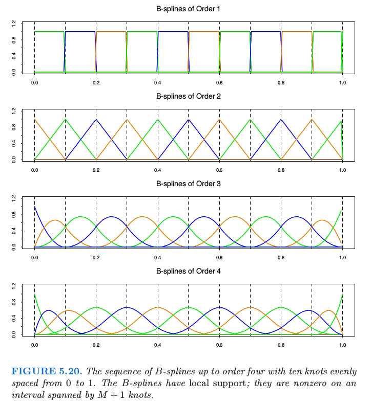

# 附录

| 原文   | [The Elements of Statistical Learning](../book/The Elements of Statistical Learning.pdf) |
| ---- | ---------------------------------------- |
| 翻译   | szcf-weiya                               |
| 时间   | 2017-10-22                    |

在附录里面，我们将要讨论表示多项式样条的$B$样条基。我们也讨论它们在光滑样条中计算的应用。

## B样条

在我们开始之前，我们需要对5.2节定义的结点序列进行增广。令$\xi_0<\xi_1$，和$\xi_K<\xi_{K+1}$为两个边界结点，一般地它们定义了样条取值的定义域。我们现在定义增广的结点序列$\tau$使得

- $\tau_1\le \tau_2\le \cdots\le \tau_M\le \xi_0$
- $\tau_{j+M}=\xi_j,j=1,\cdots,K$
- $\xi_{K+1}\le \xi_{K+M+1}\le \xi_{K+M+2}\le \cdots\le \tau_{K+2M}$

边界结点之外的这些额外结点的实际值是任意的，而且一般地令它们分别等于$\xi_0$和$\xi_{K+1}$。

!!! note "weiya注"
    差商(divided differences): from [wiki](https://en.wikipedia.org/wiki/Divided_differences)
    给定$k+1$个数据点$(x_i,y_i),i=1,2,\ldots,k$
    向前差商定义为
    $$
    [y_\nu]:=y_\nu,\;\nu\in\{0,\ldots, k\}\\
    [y_\nu,\ldots,y_{\nu+j}]:=\frac{[y_{\nu+1},\ldots,y_{\nu+j}]-[y_{\nu},\ldots,y_{\nu+j-1}]}{x_{\nu+j}-x_{\nu}},\;\nu\in\{0,\ldots,k-j\},j\in\{1,\ldots,k\}
    $$
    向后差商定义为
    $$
    [y_\nu]:=y_\nu,\;\nu\in\{0,\ldots, k\}\\
    [y_\nu,\ldots,y_{\nu-j}]:=\frac{[y_{\nu+1},\ldots,y_{\nu-j+}]-[y_{\nu-1},\ldots,y_{\nu-j}]}{x_{\nu}-x_{\nu-j}},\;\nu\in\{0,\ldots,k-j\},j\in\{1,\ldots,k\}
    $$

记$B_{i,m}(x)$为结点序列$\tau$的order为$m$的第$i$个$B$样条基函数，$m\le M$。通过差商递归定义有:

$$
B_{i,1}(x)=\left\{
  \begin{array}{ll}
  1&\text{if }\tau_i\le x< \tau_{i+1}\\
  0&\text{otherwise}
  \end{array}
  \right.
  \;
  i=1,\ldots, K+2M-1
  \qquad (5.77)
$$

这些也被称为Haar基函数。
$$
B_{i,m}(x)= \frac{x-\tau_i}{\tau_{i+m-1}-\tau_i}B_{i,m-1}(x)+\frac{\tau_{i+m}-x}{\tau_{i+m}-\tau_{i+1}}B_{i+1,m-1}(x), \; i=1, \ldots,K+2M-m\qquad (5.78)
$$

因此当$M=4,B_{i,4},i=1,\cdots,K+4$是结点序列$\xi$的$K+4$个立方样条基函数。这个递归可以继续，并且将会产生任意order样条的$B$样条基。图5.20显示了order至多为4的$B$样条序列，其中结点在$0.0,0.1,\ldots, 1.0$。因为我们构造了一些重复结点，所以需要注意避免分母为0。如果我们约定当$\tau_i=\tau_{i+1}$，有$B_{i,1}=0$，于是可以归纳法得到当$\tau_i=\tau_{i+1}=\ldots=\tau_{i+m}$，有$B_{i,m}=0$。注意到在上面的构造中，只要求子集$B_{i,m},i=M-m+1,\ldots, M+K$用作结点为$\xi$的order为$m<M$的$B$样条基。

TODO
