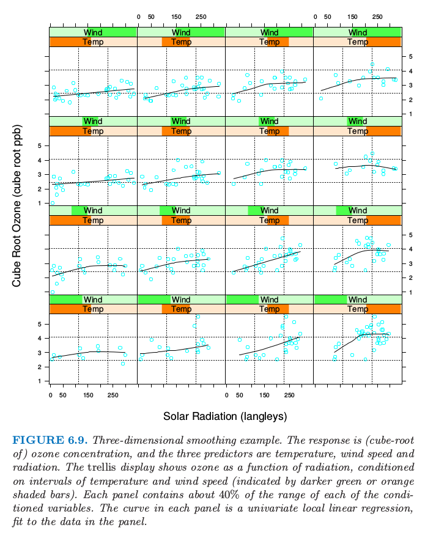

# 6.3 $\IR^p$中的局部回归

| 原文   | [The Elements of Statistical Learning](../book/The Elements of Statistical Learning.pdf#page=219) |
| ---- | ---------------------------------------- |
| 翻译   | szcf-weiya                               |
| 时间   | 2017-03-01：2017-03-02                    |
| 更新 | 2018-08-14|
| 状态 | Done|

核光滑和局部回归可以非常自然地推广到二维或更高维空间中．Nadaraya–Watson 核光滑器局部拟合常值，其中权重由 $p$ 维核得到．局部线性回归通过加权最小二乘来拟合 $X$ 中局部的超平面，参数由 $p$ 维核给出．这可以很简单地实现，并且一般偏爱边界处有更好的表现的局部常值拟合．

令 $b(X)$ 为 $X$ 最大 degree 为 $d$ 的多项式的向量．例如，$d=1,p=2$ 时有 $b(X)=(1,X_1,X_2)$；$d=2$ 时我们得到 $b(X)=(1,X_1,X_2,X_1^2,X_2^2,X_1X_2)$；并且在 $d=0$ 的平凡情形下我们得到 $b(X)=1$．在每个 $x_0\in \IR^p$ 处求解
$$
\underset{\beta(x_0)}{\min}\sum\limits_{i=1}^NK_\lambda(x_0,x_i)(y_i-b(x_i)^T\beta(x_0))^2\tag{6.12}
$$
得到拟合 $\hat f(x_0)=b(x_0)^T\hat \beta(x_0)$．一般地，核是径向函数，比如 radial Epanechnikov 或三次立方核
$$
K_\lambda(x_0,x)=D(\frac{\Vert x-x_0\Vert}{\lambda}),\tag{6.13}
$$
其中 $\Vert \cdot\Vert$ 是欧几里得范数．因为欧式范数取决于每个坐标的单位，所以对每个预测变量进行标准化是有意义的，举个例子，在光滑之前，标准化为单位标准误差．

边界影响不仅在一维光滑中是一个问题，在二维或者高维空间中是更大的问题，因为边界上点的比例较大．事实上，维数灾难的一个表现是边界点的比例随着维数的增大而增大．直接修改核来适应二维边界会变得很复杂，特别是对于不规则的边界．局部多项式回归完美地将任意维度中边界矫正为需要的阶数．图 6.8 显示了在天文研究中一些测量值上的局部线性回归，其中用了不常见的预测变量设计（星形）．这里边界特别不规则，并且当我们接近边界时拟合表面必须在数据稀疏度的区域中插值．

> 图 6.8. 左图显示了三维数据，其中响应变量为星系速度的测量值，两个预测变量记录了在宇宙中的位置．特别的星形设计表示衡量的方式，而且最终得到非常不规则的边界．右图显示了在 $\IR^2$ 中局部线性拟合的结果，采用含 $15\%$ 数据的最近邻窗口．

局部回归在高于 $2$ 或 $3$ 维中不是很有用．例如，在第 $2$ 章中，我们已经详细讨论了维数的问题．当维数增加时，同时维持局部（低偏差）并且邻域中相当大规模的样本是不可能的，总体数据大小没有随着 $p$ 指数增长．$\hat f(X)$ 的可视化在高维中会变得困难，并且这通常是光滑的其中一个主要目标．尽管图 6.8 中的散点云 (scatter-cloud)和线框 (wire-frame) 看起来很吸引人，但除了在总量水平下，结果的解释是很困难的．从数据分析的角度，条件图象更有用．

图 6.9 显示了三个预测变量的一些环境数据的分析．这里的网格显示出了在其他两个变量，温度和风速的条件下，臭氧作为辐射的函数．然而，在某变量的值的条件下意味着确实表明对这个值是局部的（正如在局部回归中一样）．图 6.9 中的每个图是在该图中在每个条件值下显示出值的范围．在图本身，显示了数据子集（响应变量相对于剩余变量），以及一个对数据的一维局部线性回归．尽管当观察拟合的 3 维表明不是完全一样的，但可能对理解数据的联合行为是有用的．

> 图 6.9. 三维光滑例子．响应变量是臭氧浓度（立方根），并且这三个预测变量分别是温度，风速和辐射．网格显示了在温度区间和风速条件下（由深绿或橘黄阴影条表示）臭氧浓度作为辐射的函数．每个图包含每个条件变量大概 $40\%$ 的区间．每个图中的曲线是对图中数据的单变量局部线性回归拟合．