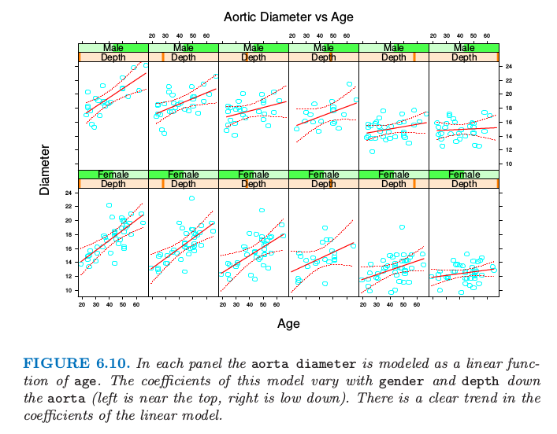

# $\IR^p$中结构化局部回归

| 原文   | [The Elements of Statistical Learning](../book/The Elements of Statistical Learning.pdf) |
| ---- | ---------------------------------------- |
| 翻译   | szcf-weiya                               |
| 时间   | 2017-03-03：2017-03-03                    |

当维度与样本大小的比率不是很好，则局部回归对我们没有太大帮助，除非我们想要对模型做出一些结构化的假设。这本书的很多部分是关于结构化回归和分类模型的。这里我们关注一些与核方法直接相关的方法。

## 结构核

一种方式是修改核。默认的球面核(6.13)对每个坐标给出了相等的权重，所以一种自然的默认策略是对每个变量标准化得到单位标准误差。更一般的方式是使用半正定矩阵$\mathbf A$来对不同的坐标进行赋权：

$$
K_{\lambda, A}(x_0,x)=D(\frac{(x-x_0^T\mathbf A(x-x_0))}{\lambda})\qquad (6.14)
$$

整个坐标或者方向可以通过在$\mathbf A$上加入合适的限制来降低或者忽略。举个例子，如果$\mathbf A$为对角矩阵，则我们可以通过增加或者减小$A_{jj}$来增大或者减小单个预测变量$X_j$的影响。预测变量很多通常都是高度相关的，比如从相似的数字信号或者图像中得到。预测变量的协方差函数可以用来修改矩阵$\mathbf A$，使得在高频对比中关注更少（练习6.4）。已经提出了多维核参数训练的方法。举个例子，第11章中讨论的投影寻踪回归模型是合适的，其中$\mathbf A$的低阶形式表示$\hat f(X)$的岭回归。关于$\mathbf A$的更一般的模型是累赘的，相反地，我们支持接下来讨论的结构形式的回归函数。

### 结构回归函数

我们试着在$R^p$中拟合回归函数$E(Y\mid X)=f(X_1,X_2,\ldots,X_p)$，交叉的每一层次潜在地表现出来了。自然考虑到下列形式的方差分析(ANOVA)分解：
$$
f(X_1,X_2,\ldots,X_p)=\alpha+\sum\limits_jg_j(X_j)+\sum\limits_{k<\ell}g_{k\ell}(X_k,X_\ell)+\cdots\qquad (6.15)
$$
并且接着介绍消除一些高阶项的结构。可加性模型假设只有主要影响项$f(X)=\alpha+\sum\limits_{j=1}^pg_j(X_j)$，二阶模型会有次数至多为2的交叉项，一次类推。在第9章中，我们描述了对于拟合这样低阶交叉模型的迭代向后拟合算法。在加性模型中，举个例子，如果所有但除了第$k$项是一致的，则我们可以用在$X_k$上的局部回归$Y-\sum_{j\neq k}g_j(X_j)$来估计$g_k$。这个依次对每个函数重复进行，直到收敛。重要的细节是，在每一步，一维局部回归是所有都需要的。同样的思想可以用来拟合低维ANOVA分解。

这些结构模型的一个重要的特殊情形是可变系数模型(varying coefficient models)类。举个例子，假设我们将$X$中的$p$个预测变量分成集合$(X_1,X_2,\ldots,X_q),q<p$，以及我们集中在向量$Z$中的剩余的变量。接着我们假设条件线性模型

$$
f(X)=\alpha(Z)+\beta_1(Z)X_1+\cdots+\beta_q(Z)X_q\qquad (6.16)
$$

对于给定的$Z$，这是线性模型，但是每个参数可以随着$Z$而改变。很自然地可以通过局部加权最小二乘来捏这个模型：

$$
\underset{\alpha(z_0),\beta(z_0)}{\min}\sum\limits_{i=1}^NK_\lambda(z_0,z_i)(y_i-\alpha(z_0)-x_{1i}\beta(z_0)-\cdots - x_{qi}\beta_q(z_0))^2\qquad (6.17)
$$

图6.10说明了在人类大动脉测量数据上的想法。一个持续很久（？？）的单元说大动脉会随着age变厚。这里我们将大动脉的diameter建立为age的线性函数，但是允许系数随着gender和depth的变化而变化。我们对男性和女性分别采用局部回归模型。尽管大动脉确实很明显地在大动脉高区域中随着年龄而变粗，这种关系随着到大动脉的距离而减弱。图6.11显示了截距和斜率作为深度的函数。

> 图6.11. 每张图中aorta diameter建立为age的线性函数模型。这个模型的系数随着gender和到aorta的depth（左边靠近顶端，右边靠近底端）变化。在线性模型中的系数有着明显的趋势。

> 图6.11. 在男性和女性情形下，age作为到aorta的distance的函数的截距和斜率。黄色带状表示一个标准误差。
