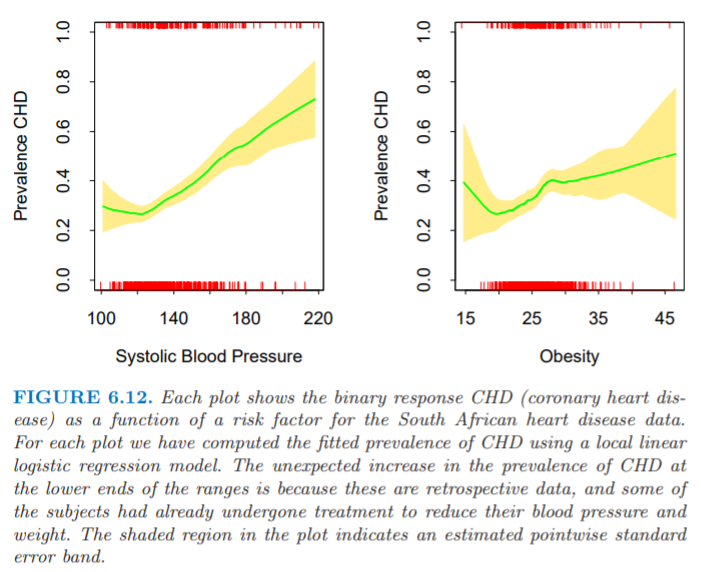

# 局部似然和其他模型

| 原文   | [The Elements of Statistical Learning](../book/The Elements of Statistical Learning.pdf) |
| ---- | ---------------------------------------- |
| 翻译   | szcf-weiya                               |
| 时间   | 2017-03-04：2017-03-04                    |
|更新 | 2018-03-05|
|状态|Done|

**局部回归(local regression)**和**可变参数模型(varying coefficient models)**的概念非常广泛：如果拟合方法适合(accommodates)观测点的权重系数，则任意参数模型可以变得局部。

!!! question
    怎么理解“accommodate”？

这里有一些例子：

- 每个观测$y_i$与协变量$x_i$成线性的参数$\theta_i=\theta(x_i)=x_i^T\beta$有关，并且基于对数似然$l(\beta)=\sum_{i=1}^Nl(y_i,x_i^T\beta)$对$\beta$进行推断。为了更灵活地对$\theta(X)$建模，我们可以用$x_0$处局部的概率来推断$\theta(x_0)=x_0^T\beta(x_0)$：

$$
l(\beta(x_0))=\sum\limits_{i=1}^NK_\lambda(x_0,x_i)l(y_i,x_i^T\beta(x_0))
$$

许多似然模型，特别是包含**逻辑斯蒂回归(logistic)**和**对数线性模型(log-linear models)**的**广义线性模型(generalized linear models)**。局部似然允许对全局线性模型进行松弛得到局部线性。

- 同上所述，区别是不同的变量与用于定义局部似然性的$\theta$相关联：
$$
l(\theta(z_0))=\sum\limits_{i=1}^NK_\lambda(z_0,z_i)l(y_i,\eta(x_i,\theta(z_0)))
$$
举个例子，$\eta(x,\theta)=x^T\theta$可以是关于$x$的线性模型。这通过最大化局部似然可以拟合可变参数模型$\theta(z)$。

- 阶数为$k$的**自回归(autoregressive)**时间序列形式为$y_t=\beta_0+\beta_1y_{t-1}+\beta_2y_{t-2}+\cdots+\beta_ky_{t-k}+\varepsilon_t$。用$z_t=(y_{t-1},y_{t-2},\cdots,y_{t-k})$记**滞后集(lag set)**，模型则看起来是一个标准的线性模型$y_t=z_t^T\beta+\varepsilon_t$，而且一般使用最小二乘来拟合。采用核为$K(z_0,z_t)$的局部最小二乘拟合允许模型根据**序列的短期记忆(short-term history of the series)**来变化。这区别于更传统的因窗口时间变化的动态线性模型。

为了解释局部似然，我们考虑[第4章](../04-Linear-Methods-for-Classification/4.4-Logistic-Regression/index.html)中**多类别线性逻辑斯蒂回归模型**(4.36)的局部形式。

!!! note "Recall"
    $$
    \Pr(G=k\mid X=x)=\dfrac{e^{\beta_{k0}+\beta_k^Tx}}{1+\sum_{\ell=1}^{K-1}e^{\beta_{\ell0}+\beta_\ell^Tx}}\qquad (4.36)
    $$

数据包含特征$x_i$和相关的类别响应变量$g_i\in\\{1,2,\ldots,J\\}$，并且线性模型有如下形式
$$
\Pr(G=j\mid X=x)=\frac{e^{\beta_{i0}+\beta_j^Tx}}{1+\sum_{k=1}^{J-1}e^{\beta_{k0}+\beta_k^Tx}}\qquad (6.18)
$$

第$J$类的局部对数似然模型可以写成

$$
\sum\limits_{i=1}^NK_\lambda(x_0,x_i)\Big\{\beta_{g_i0}(x_0)+\beta_{g_i}(x_0)^T(x_i-x_0)\\-\LOG[1+\sum\limits_{k=1}^{J-1}\exp(\beta_{k0}(x_0)+\beta_k(x_0)^T(x_i-x_0))]\Big\}\qquad (6.19)
$$

注意到

- 我们使用$g_i$作为下标来选择合适的分子。
- 由模型定义得$\beta_{J0}=0,\beta_J=0$
- 我们已经对$x_0$处的局部回归进行了中心化，所以在$x_0$处的拟合后验概率简化为

$$
\widehat{\Pr}(G=j\mid X=x_0)=\frac{e^{\hat \beta_{j0}(x_0)}}{1+\sum_{k=1}^{J-1}e^{\hat\beta_{k0}(x_0)}}\qquad (6.20)
$$

尽管该方法在高维的ZIP号码分类问题中效果显著，但它也可以用来在适当低维度(moderately low dimensions)中的灵活多类别分类。与之相关的方法是广义加性模型（[第9章](../09%20Additive%20Models,%20Trees,%20and%20Related%20Methods/9.1%20Generalized%20Additive%20Models/index.html)）采用的核光滑方法，并且通过假设回归函数的加性结构来避免了维数问题。

作为一个简单的说明，我们对第4章中的心脏病数据拟合两个类别的**局部线性逻辑斯蒂回归模型(local linear logistic model)**。图6.12显示了对两个风险因子**分别**拟合单变量局部逻辑斯蒂回归模型。当数据本身提供很少的可视信息，这是检测非线性是很有用的筛选工具。这种情形下会发现意外的异常值，而用传统的方法可能会没注意到。

> 对于南非心脏病数据，每张图显示了二值响应变量`CHD`（冠状心脏病）作为风险因子的函数。每张图我们采用局部线性逻辑斯蒂回归模型来计算拟合的`CHD`患病率。`CHD`患病率在横轴取值较小时意外增加是因为它们是retrospective data，并且一些个体已经接受了降低血压和减轻体重的处理方式。图中的阴影区域表明逐点估计的标准误差带。

因为`CHD`是二值指示变量，所以我们可以通过直接地光滑二值响应变量来估计条件患病率$\Pr(G=j\mid x_0)$，而不是用似然公式(likelihood formulation)。这意味着拟合局部常值逻辑斯蒂回归模型（[练习6.5](https://github.com/szcf-weiya/ESL-CN/issues/84)）。为了享受局部线性拟合的偏差纠正，在无限制的逻辑斯蒂尺度上操作会更加自然。

一般地，我们用逻辑斯蒂回归来计算参数估计和它们的标准差。这个也可以局部实现，因为我们可以得到如图中所示的关于我们拟合的患病率的逐点标准误差带。

