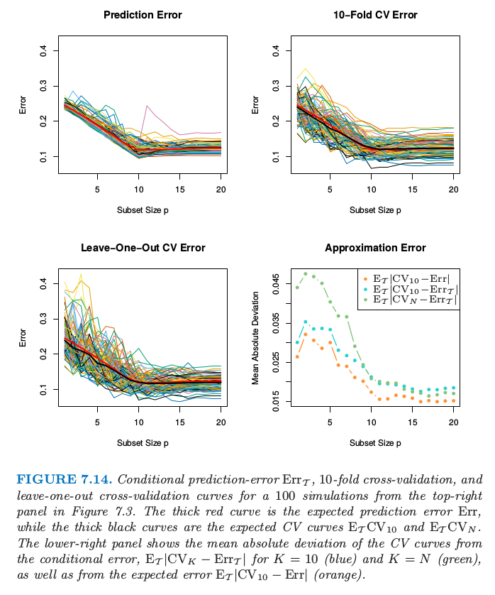
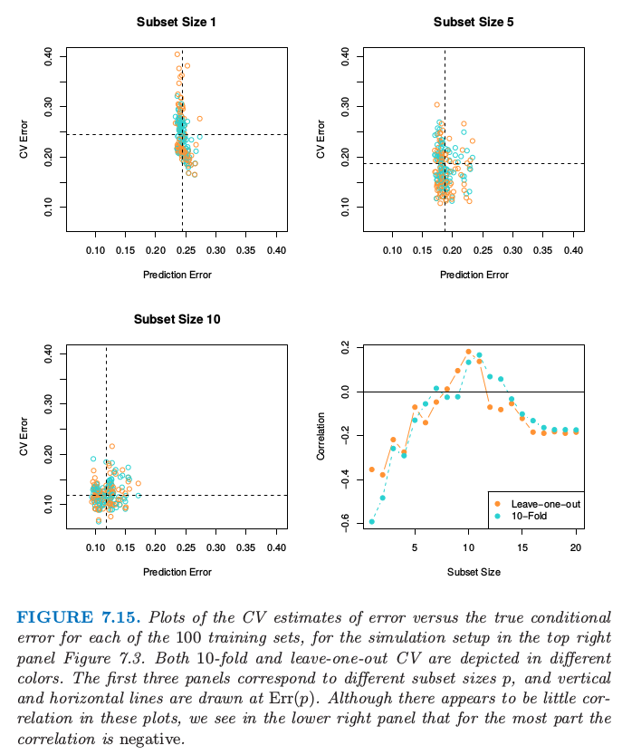

# 条件测试误差或期望测试误差？

| 原文   | [The Elements of Statistical Learning](../book/The Elements of Statistical Learning.pdf) |
| ---- | ---------------------------------------- |
| 翻译   | szcf-weiya                               |
| 时间   | 2017-02-20:2017-02-20                    |

图7.14和7.15验证了交叉验证是否能很好地估计$Err_{\cal T}$的问题，其中$Err_{\cal T}$表示在给定训练集$\cal T$上的误差（228页的式（7.15）），它与期望预测误差相对。对于从图7.3的右上图的“回归问题/（最优子集）线性拟合”的设定中产生的100个训练集中的每一个训练集，图7.14显示了条件误差$Err_{\cal T}$作为子集大小的函数图象（左上图）。接下来两张图显示了10折交叉验证和N折交叉验证，后者也称作舍一法（LOO）。每张图的红色粗线表示期望误差Err，而黑色粗线表示期望交叉验证。右下图则显示了交叉验证近似条件误差和期望误差的程度。

可能会认为N折交叉验证能很好地近似$Err_{\cal T}$，因为它几乎用了整个训练样本来拟合新的测试点。另一方面，可能会期望10折交叉验证会很好地估计Err，因为它平均了不同的训练集。从图中看到估计$Err_{\cal T}$时10折交叉验证比N折做得更好，而且估计时$Err$更好。确实如此，两条黑色曲线与红色曲线的相似性表明两个CV曲线对Err近似无偏，且10折有更小的方差。类似的趋势由Efron（1983）给出。

> 图7.14. 从图7.3的右上图得到的100个模拟值的条件预测误差$Err_{\cal T}$，10折交叉验证，以及舍一交叉验证的曲线。红色粗线为期望预测误差$Err$，而黑色粗线为期望CV曲线$E_{\cal T}CV_{10}$和$E_{\cal T}CV_N$。右下图显示了CV曲线与条件误差的绝对偏差的期望$E_{\cal T}\vert CV_k-Err_{\cal T}\vert$，$K=10$（蓝色）以及$K=N$（绿色），并且也显示了CV曲线与期望误差之间绝对偏差的期望$E_{\cal T}\vert CV_{10}-Err\vert$（橘黄色）。

图7.15显示了100次模拟中，10折交叉验证和N折交叉验证对误差的估计关于真是条件误差的散点图。尽管散点图没有表明太多的相关性，但右下图表明对于大部分来说是呈负相关的，之前已经观察到的神奇现象。这种负相关解释了为什么任意形式的CV都能很好地估计$Err_{\cal T}$。每张图的虚线是在$Err(p)$处画的，$Err(p)$是对于最优子集大小$p$时的期望误差。我们再一次看到两种形式的CV对于期望误差是近似无偏的，但是对于不同训练集的测试误差的方差是相当不同的。

在7.3的四种实验条件下，“回归/线性”条件表现出实际测试误差与预测测试误差最高的相关性。这个现象也发生在自助法估计误差时，而且我们会猜测，对任意其他的条件预测误差的估计都成立。

我们得出结论，仅仅给出从与训练集相同的数据，一般情况下得到特定训练集的测试误差的估计不是很容易的。相反地，交叉验证和相关的方法可能可以对期望误差Err给出合理的估计。

> 图7.15.  对100个训练集的每个CV估计误差关于真实条件误差的图象，模拟的设定与图7.3的右上图相同。前三张图对应不同的子集大小$p$，且水平直线和垂直直线是在$Err(p)$处画的。尽管看起来这些图象没有多大的关联，但是我们从右下图看到大部分是负相关的。

!!! notes "weiya 注"
    真实条件误差如何给出？

