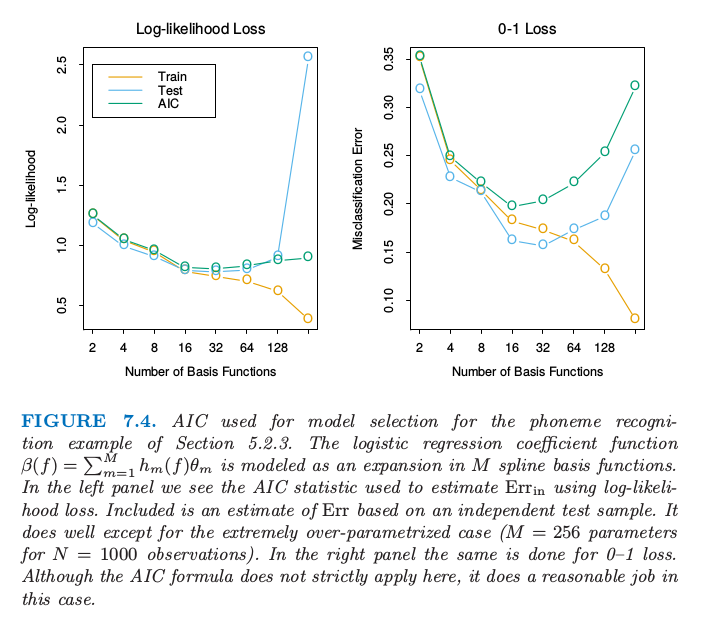

# 样本内误差的估计

| 原文   | [The Elements of Statistical Learning](../book/The Elements of Statistical Learning.pdf) |
| ---- | ---------------------------------------- |
| 翻译   | szcf-weiya                               |
| 时间   | 2017-02-18:2017-02-18                    |
|更新|2017-09-17, 2018-01-04|

!!! note "weiya注"
    本节很多地方需要用到上一节的(7.23)式
    $$
    \sum\limits_{i=1}^NCov(\hat y_i,y_i) = d\sigma_{\varepsilon}^2\qquad (7.23）
    $$
    和(7.24)式
    $$
    E_{\mathbf y}(Err_{in})=E_{\mathbf y}(\overline{err})+2\cdot\frac{d}{N}\sigma_\varepsilon^2\qquad (7.24)
    $$

样本内误差估计的一般形式为

$$
\widehat{Err}_{in}=\overline{err}+\hat\omega\qquad (7.25)
$$

其中$\hat\omega$是optimism平均值的估计。

当在平方误差损失下拟合$d$个参数后，是可以应用式（7.24）的；利用表达式（7.24）导出被称作$C_p$的统计量
$$
C_p=\overline{err}+2\cdot\frac{d}{N}\hat \sigma^2_\varepsilon\qquad (7.26)
$$
这里$\hat\sigma_\varepsilon^2$是噪声方差的估计，由低偏差模型的均方误差得到。使用这个准则，我们用一个与使用的基函数个数成比例的因子来调节训练误差。

当采用对数似然损失函数时，Akaike信息准则（Akaike information criterion）是类似的但使用更普遍的$Err_{in}$的估计。它依赖于与（7.24）类似的关系式，在$N\rightarrow \infty$渐近地成立：
$$
-2\cdot E[\mathrm{log}Pr_{\hat \theta}(Y)]\approx -\frac{2}{N}\cdot E[\mathrm{loglik}]+2\cdot\frac{d}{N}\qquad (7.27)
$$
这里$Pr_{\theta}(Y)$是$Y$密度函数族（包含“真正的”密度），$\hat\theta$是$\theta$的极大似然估计，并且“loglik”是最大化的对数似然
$$
loglik=\sum\limits_{i=1}^N\mathrm{log }Pr_{\hat\theta}(y_i)\qquad (7.28)
$$
举个例子，对于逻辑斯蒂回归模型，采用二项对数似然，我们有
$$
AIC=-\frac{2}{N}\cdot loglik+2\cdot \frac{d}N\qquad (7.29)
$$
对于高斯模型（假设方差$\sigma_\varepsilon^2=\hat\sigma_\varepsilon^2$已知），AIC统计量等于$C_p$，因此我们称它们一起称为AIC。

采用AIC来进行模型选择，我们在考虑的模型中选择具有最小的AIC的模型。对于非线性或者其他复杂模型，我们需要将$d$换成其它衡量模型复杂度的量。我们将在7.6节讨论这点。

给定由调整参数$\alpha$编号的一系列模型，用$\overline{err}(\alpha)$和$d(\alpha)$记为每个模型的训练误差和参数的个数。接着对于模型序列我们定义
$$
AIC(\alpha)=\overline{err}(\alpha)+2\cdot\frac{d(\alpha)}{N}\hat\sigma_\varepsilon^2\qquad (7.30)
$$
函数$AIC(\alpha)$给出了测试误差曲线的一个估计，而且我们找到最小化它的调整参数$\hat \alpha$。我们最终选择的模型是$f_{\hat\alpha}(x)$。注意到如果我们基函数是自适应地选择，（7.23）不再成立。举个例子，如果我们总共有$p$个输入，选择含有$d<p$个输入的最优线性拟合模型，optimism将会超过$(2d/N)\sigma_\varepsilon^2$。换句话说，通过选择含有$d$个输入的最优拟合模型，有效参数的个数将会超过$d$。

图7.4显示了将AIC用于148页上5.2.3节的音素识别的例子的效果。输入向量是口语元音的对数周期图，在256个均匀间隔的频率上取值。采用线性逻辑斯蒂回归模型来预测音素的类别，参数函数为$\beta(f)=\sum_{m=1}^Mh_m(f)\theta_m$，是$M$个样条基函数的展开。对于给定的$M$，对$h_m$应用自然三次样条，在频率范围内均匀选取结点（因此$d(\alpha)=d(M)=M$）。使用AIC来选择基函数的个数会近似最小化损失函数为熵损失和0-1损失时的$Err(M)$。

> 图7.4.对5.2.3节的音素识别的例子应用AIC来做模型选择。逻辑斯蒂回归参数函数$\beta(f)=\sum_{m=1}^Mh_m(f)\theta_m$建模成$M$个样条基函数的展开。在左图中我们看到采用对数似然损失时用来估计$Err_{in}$的AIC统计量。也画出了基于独立的测试样本的$Err$估计。除了极端过参数化的情形（$N=1000$个观测时含有$M=256$个参数）都估计得很好。右图是在0-1损失下重复左图的工作。尽管这里AIC准则严格上不能应用，但是在这种情形下估计也是合理的。

下式这一简单的法则
$$
2/N\sum\limits_{i=1}^N\mathrm{Cov}(\hat y_i,y_i)=(2d/N)\sigma_\varepsilon^2
$$
对于含有加性误差的线性模型在平方误差损失下是精确成立的，在对数似然损失下是近似成立的。特别地，这个法则一般地对于0-1损失是不成立的（Efron，1986[^1]），尽管许多作者仍然在这种情形下使用它（图7.4的右图）

[^1]: Efron, B. (1986). How biased is the apparent error rate of a prediction rule?, Journal of the American Statistical Association 81: 461–70.
