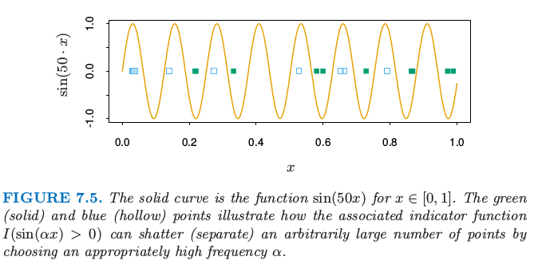
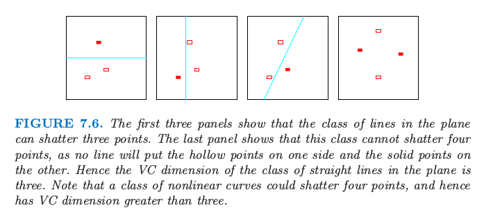
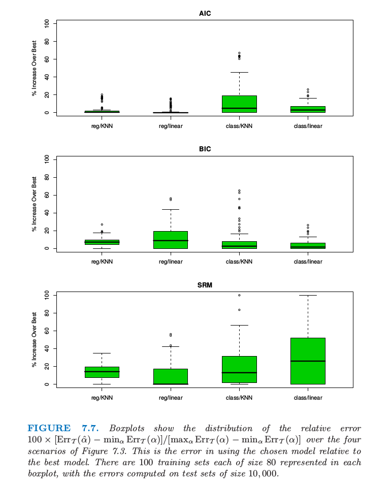

# 7.9 VC维

| 原文   | [The Elements of Statistical Learning](../book/The Elements of Statistical Learning.pdf) |
| ---- | ---------------------------------------- |
| 翻译   | szcf-weiya                               |
| 时间   | 2017-02-19:2017-02-19                    |
|更新|2018-01-05|

使用样本内误差估计的困难在于需要确定在拟合中使用的参数（或复杂度）个数$d$。尽管7.6节引入的有效参数个数对部分非线性模型是有用的，但是不太普遍。Vapnik-Chervonenkis（VC）理论提供了对复杂度更一般的度量，而且给出了相应的optimism估计。这里我们简短回顾这个理论。

假设我们有由参数$\alpha$编码的函数类$\\{f(x,\alpha)\\},x\in R^p$。现在假设$f$为指示函数，也就是取值为0或1。如果$\alpha=(\alpha_0,\alpha_1)$，且$f$为线性指示函数$I(\alpha_0+\alpha_1^Tx>0)$，于是说函数$f$的复杂度是参数个数$p+1$似乎是合理的。但是如果$f(x,\alpha)=I(sin\alpha\cdot x),x\in R$， $\alpha$为任意实数会怎么样呢？图7.5显示了函数$sin(50\cdot x)$的图象。

> 实线是函数$sin(50x),x\in [0,1]$。绿点（实心）和蓝色（空心点）说明了相应的指示函数$I(sin(\alpha x)>0)$如何通过选择合适高的频率$\alpha$来打散（分离）任意多的点。

这是个非常弯曲的函数，当频率$\alpha$增大变得更粗糙，但是它仅仅有一个参数$\alpha$：尽管这样，它比$p=1$时的线性指示函数$I(\alpha_0+\alpha_1x)$复杂度更低的结论似乎是不合理的。

Vapnik-Chervonenkis维度是衡量函数类的复杂度的一种方式，它通过评估函数类中的成员的弯曲程度实现的。

> 函数类$\\{f(x,\alpha)\\}$的VC维定位为可以被$\\{f(x,\alpha)\\}$的成员打散的点的最多数目（在一定条件下）。

点集被函数类打散是指无论我们对每个点如何赋予二值标签，都有类中的一个函数完美地将它们分隔开。

> 图7.6. 前三张图显示了平面中的直线类可以打散3个点。最后一张图显示了这个类不能打散4个点，因为没有直线可以使得空心点在一侧而实心点在另一侧。因此平面中直线类的VC维是3.注意到非线性曲线类可以打散4个点，也因此有比3更高的VC维。

图7.6显示了在平面中线性指示函数的VC维是3而非4，因为没有4个点可以被直线集打散。一般地，$p$维线性指示函数的VC维为$p+1$，这也是自由参数的个数。另一方面，可以证明$sin(\alpha x)$函数类有无穷的VC维，正如图7.5显示的那样。通过合适的$\alpha$，任何点集都可以被这个函数类打散（练习7.8）。

至今我们仅仅讨论了指示函数的VC维，但这个可以推广到实值函数中。实值函数类$\\{g(x,\alpha)\\}$的VC维定义为指示类$\{I(g(x,\alpha)-\beta)\}$的VC维，其中$\beta$在$g$的值域中取值。

可以使用VC维来构造（样本外）预测误差的估计；不同类型的结果都是可以的。当使用函数类时，采用VC维的概念，可以证明训练误差的乐观（optimisim）的结果。这样的结果的例子如下。如果我们采用VC维为$h$的类函数$\\{f(x,\alpha)\\}$来拟合$N$个训练点，于是在训练集上至少以$1-\eta$的概率成立下式：

$$
\begin{align}
Err_{\cal T}&\le \overline{err} + \frac{\epsilon}{2}(1+\sqrt{1+\frac{4\cdot\overline{err}}{\epsilon}})\;(\text{二分类})\\
Err_{\cal T}&\le \frac{\overline{err}}{(1-c\sqrt{\epsilon})_+}\; (\text{回归})\\
& \text{其中 }\epsilon=a_1\frac{h[log(a_2N/h)+1]-log(\eta/4)}{N}\\
& 0<a_1\le 4,\;0<a_2\le 2
\end{align}
\qquad (7.46)
$$

这些界对$\\{f(x,\alpha)\\}$的所有成员都同时成立，而且选自Cherkassky and Mulier（2007）。他们建议$c=1$。对于回归他们建议$a_1=a_2=1$，对于分类他们没有给出推荐，因为$a_1=4,a_2=2$对应最坏的情形。它们也给出了回归的另一个实用（practical）的界
$$
Err_{\cal T}\le \overline{err}(1-\sqrt{\rho-\rho \mathrm{log}\rho}+\frac{\mathrm{log}N}{2N})^{-1}_+\qquad (7.47)
$$
其中$\rho=\frac{h}{N}$，不含调整常数。这个界表明随着$h$增大$N$减小，optimism会增大，这与式（7.24）给出的AIC调整值$d/N$数值上是一致的。然而，（7.46）结果更强：不是给出每个固定函数$f(x,\alpha)$的optimism的期望值，而是给出对于所有函数$f(x,\alpha)$的概率上限，也因此可以对函数类进行搜索。

Vapnik的结构风险最小化（SRM）方法拟合嵌套的VC维递增$h_1<h_2<\cdots$的模型序列，接着选择有最小上界的模型。

我们注意到类似（7.46）中的上界通常是非常不精确的，但是这并不会妨碍它们成为模型选择的良好准则，其中相对（不是绝对）的测试误差的大小是重要的。这种方法的主要不足是计算类函数的VC维的困难。通常只能得到粗糙的VC维上界，这可能不是充分的。结构风险最小化程序可以成功运行的例子是支持向量分类器，将在12.2节讨论。

## 例子（继续）

> 图7.7. 在图7.3的四种情形下，用箱线图显示相对误差$100\times [Err_{\cal T}(\hat\alpha)-min_\alpha Err_{\cal T}(\alpha)]/[max_\alpha Err_{\cal T}(\alpha)-min_\alpha Err_{\cal T}(\alpha)]$的分布。这是选择的模型相对于最优模型的误差。每个箱线图表示大小为80的100个训练集，误差是在大小为10000的测试集上计算的。

图7.7显示了当采用AIC，BIC和SRM来对图7.3的例子来选择模型大小的结果。对于标着KNN的例子，模型指标$\alpha$指的是邻居的个数，而对于标着REG的来说$\alpha$为子集大小。采用每个选择方法（例如，AIC），我们估计最优模型$\hat \alpha$并且在测试集上找到真实的预测误差$Err_{\cal T}(\hat\alpha)$。对于同样的训练集，我们计算最优和最坏可能的模型选择的预测误差：$min_\alpha Err_{\cal T}(\alpha)$和$max_\alpha Err_{\cal T}(\alpha)$。箱线图显示了下面值的分布
$$
100\times \frac{Err_{\cal T}(\hat \alpha)-min_\alpha Err_{\cal T}(\alpha)}{max_\alpha Err_{\cal T}(\alpha)-min_\alpha Err_{\cal T}(\alpha)}
$$
它表示选定的模型相对于最优模型的误差。对于线性回归，模型复杂度由特征的个数度量；正如在7.5节提到的那样，它低估了$df​$，因为它没有考虑该大小下对最优模型的搜索。这对线性分类器的VC维也同样适用。对于$k​$最近邻，模型复杂度取$N/k​$。在加性误差模型回归模型下，这个可以证明为真正的有效自由度个数（练习7.6）；我们不知道它是否对应VC维。我们取（7.46）中常数为$a_1=a_2=1​$；SRM的结果随着不同的常数值而变化，而且这个选择给出了最有利的结果。我们运用另一个实用的界（7.47）来重复SRM的选择过程，并且得到几乎一样的结果。对于误分类误差，我们在最少限制的模型上（对于KNN取$k=5​$，因为$k=1​$会导致0训练误差）采用$\hat\sigma_\varepsilon^2=[N/(N-d)]\cdot \overline{err}(\alpha)​$。AIC准则对于四种情形都适用，尽管在0-1损失时缺少理论支撑。BIC表现也近似一样，但SRM的表现很混合。
