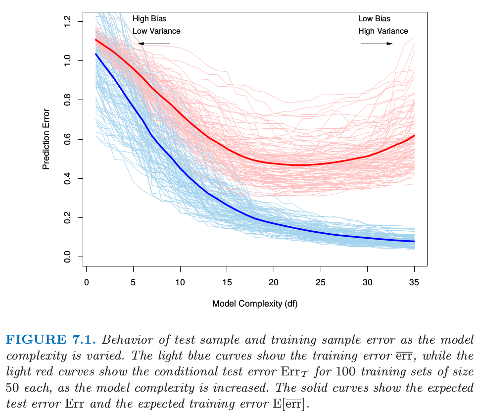

# 7.2 偏差，方差和模型复杂度

| 原文   | [The Elements of Statistical Learning](../book/The Elements of Statistical Learning.pdf) |
| ---- | ---------------------------------------- |
| 翻译   | szcf-weiya                               |
| 时间   | 2017-02-18:2017-02-18                    |
| 更新 | 2017-09-17, 2018-01-04, 2018-05-05|

!!! note "更新笔记"
    @2018-01-04 增加信噪比的笔记。

> 图 7.1. 当模型复杂度变化时测试样本和训练样本的误差。浅蓝色曲线显示了当模型复杂度增加时训练误差 $\overline{err}$ 的变化，而浅红色曲线显示了当模型复杂度增加时 100 个大小为 50 的训练集的条件测试误差 $Err_{\cal T}$ 的变化。实（粗）线显示了对应的期望测试误差 $Err$ 和期望训练误差 $\E[\overline{err}]$

图 7.1 说明了评估某学习方法泛化能力中的一个重要问题。首先考虑一个定量或者间隔尺度响应变量的情形。我们有目标变量 $Y$，输入向量 $X$，以及从训练集 $\cal T$ 估计出来的预测模型 $\hat f(X)$。衡量 $Y$ 与 $\hat f(X)$ 间误差的损失函数记为 $L(Y,\hat f(X))$。一般的选择是
$$
L(Y,\hat f(X))=\left\{
\begin{array}{cc}
(Y-\hat f(X))^2&\text{平方误差}\\
\vert Y-\hat f(X)\vert &\text{绝对误差}
\end{array}
\right.
\qquad (7.1)
$$
测试误差 (test error)，也被称作泛化误差 (generalization error)，它是在独立的测试样本上的预测误差
$$
Err_{\cal T}=E[L(Y,\hat f(X))\mid {\cal T}]\qquad (7.2)
$$
其中 $X$ 和 $Y$ 都是随机从它们的联合分布（总体）中选取的。这里训练集 $\cal T$ 是固定的，测试误差指的是对该特定训练集的误差。一个相关的量是预测误差的期望值（或者期望测试误差）
$$
Err = E[L(Y,\hat f(X))]=E[Err_{\cal T}]\qquad (7.3)
$$
注意到这个期望平均的任何项都是随机的，包括训练集产生 $\hat f$ 的随机性。

图 7.1 显示了大小为 50 的 100 个训练集的预测误差（浅红色曲线） $Err_{\cal T}$。使用 lasso（[3.4.2 节](../03-Linear-Methods-for-Regression/3.4-Shrinkage-Methods/index.html)）来得到拟合模型序列。实心红色曲线是平均值，因此是 $Err$ 的一个估计。

估计 $Err_{\cal T}$ 将是我们的目标，尽管我们将会看到 $Err$ 更适合于统计分析，而且大部分方法能有效地估计出期望误差。如果仅仅给出同一个训练集的信息，有效地估计条件误差似乎不可能。这点的一些讨论将在 [7.12 节](7.12-Conditional-or-Expected-Test-Error/index.html)给出。

!!! note "weiya 注"
    对于给定的训练集 $\cal T$，我们能得到模型，此时我们关心的是由训练集 $\cal T$ 训练得到的模型的误差率 $Err_{\cal T}$；而非重复从总体中抽取训练集，在这些训练集上求期望得到期望测试误差 $Err$。

训练误差 (Training error) 是在训练样本上的平均损失。
$$
\overline{err}=\frac{1}{N}\sum\limits_{i=1}^NL(y_i,\hat f(x_i))\qquad (7.4)
$$
我们想要知道我们估计模型 $\hat f$ 的测试误差的期望值。当模型越来越复杂时，它使用更多的训练数据并且可以适应于更复杂的潜在结构。因此偏差会有降低而方差会有增大。一些中等程度的模型复杂度给出了最小的测试误差期望值。

不幸的是，正如我们在图 7.1 中看到的那样训练误差不是测试误差一个良好的估计。训练误差随着模型复杂度增大不断降低，一般地如果我们将模型复杂性增到充分大它会降为 0。然而，0 训练误差的模型对训练数据是过拟合的并且一般泛化性很差。

对于定性或者类别型响应变量 $G$ 也有类似的情况，$G$ 在含有 $K$ 个值的 $\cal G$ 中取值，为了方便记 $K$ 个值编号为 $1,2,\ldots,K$。一般地，我们对概率 $p_k(X)=\Pr(G=k\mid X)$（或者其他单调变换 $f_k(X)$）进行建模，然后 $\hat G(X)=\mathrm{arg\; \max} \hat p_k(X)$。某些情形下，比如 1-最近邻分类（第 2 和第 13 章）我们直接得到 $\hat G(X)$。一般地，损失函数为
$$
\begin{align}
L(G,\hat G(X))&=I(G\neq \hat G(X))\quad (0-1\; \mathrm {loss})\qquad \qquad (7.5)\\
L(G,\hat p(X))&=-2\sum\limits_{k=1}^K\log\hat p_k(X)\\
&=-2\log\hat p_G(X)\quad (-2\times \text{log-likelihood})\qquad (7.6)
\end{align}
$$
$-2\times \text{log-likelihood}$ 值有时也被称为**偏差 (deviance)**

同样，这里测试误差为 $Err_{\cal T}=E[L(G,\hat G(X))\mid \cal T]$，这是在 $\cal T$ 上训练的分类器的总体误分类率，且 $Err$ 是误分类错误率的期望值。

类似前面的定量变量情形，训练误差也是关于样本的，例如，模型的样本对数似然
$$
\overline{err}=-\frac{2}{N}\sum\limits_{i=1}^N\mathrm{log}\hat p_{g_i}(x_i)\qquad (7.7)
$$

对数似然可以作为一般响应密度的损失函数，比如Poisson，gamma，指数，对数正态以及其它的。如果 $\Pr_{\theta(X)}(Y)$ 为 $Y$ 的密度，由取决于预测变量的参数 $\theta(X)$ 来编号，则
$$
L(Y,\theta(X))=-2\cdot \mathrm{log\; \Pr}_{\theta(X)}(Y)\qquad (7.8)
$$
定义中的“-2”使得高斯分布的对数似然损失会与平方误差损失匹配。

为了表达的简洁，本章的剩余部分我们将用 $Y$ 和 $f(X)$ 来表示上述的所有情形，因为我们主要集中在定量响应变量（平方误差损失）的设定上。对于其它的情形，合适的转换是很显然的。

这章中我们描述一系列估计模型的期望测试误差 ($Err$) 的方法。一般地我们的模型会有一个调整参数 (tunning parameter) 或者参数 $\alpha$，所以我们可以把预测写成 $\hat f_\alpha(x)$。调整参数会随着我们模型的复杂度而变，而且我们希望找到 $\alpha$ 值来最小化误差，也就是，得到图 7.1 的平均测试误差曲线的最小值。说完这些，为了简洁我们经常默认 $\hat f(x)$ 对 $\alpha$ 的依赖性。

!!! note "weiya 注"
    这里原文为，“for brevity we will often suppress the dependence of $f^(x)$ on $\alpha$.” 关键词为"suppress"，意为“抑制；压制；阻止；控制”。不过结合上下文，此处想表达的是省略$\hat f_\alpha(x)$ 中的 $\alpha$。

重要的是要注意，事实上我们可能有两个单独的目标：

**模型选择：** 估计不同模型的表现来选择最好的那个

**模型评估：** 已经选择好了最终模型，估计它在新数据上的预测误差（泛化误差）

如果我们处在有充足数据的情形中，对于这两个问题的最好的方式是将数据集随机地分成 3 个部分：训练集，验证集，以及测试集。训练集用来拟合模型；验证集用来估计预测误差来进行模型选择；测试集用来评估最终选择的模型的推广误差。理想情形下，测试集应保存在“黑箱 (valut)”中，并且只在数据分析结束时才会显示出来。相反地，假设我们重复采用测试集，选择具有最小测试误差的模型。则最终选择模型的测试误差会低估真实的测试误差，有时候偏差是相当大的。

在三个部分的每一个中如何选取观测的个数很难给出一个一般性的规则，因为这取决于数据的信噪比和训练样本的规模。一般的分割是 50% 用于训练，25% 用于验证，25% 用于测试：

本章中的方法是为了没有足够的数据来分成3部分的情形设计的。同样地，给出多少的训练数据是足够的一般规则太难了；此外 (among other things)，这取决于潜在函数的信噪比以及根据数据拟合出的模型的复杂度。

!!! note "weiya 注： 信噪比"
    在 [11.6 例子：模拟数据](https://esl.hohoweiya.xyz/11%20Neural%20Networks/11.6%20Example%20of%20Simulated%20Data/index.html)有提到信噪比为
    $$
    \frac{Var(E(Y\mid X))}{Var(Y-E(Y\mid X))}=\frac{Var(f(X))}{Var(\varepsilon)}
    $$
    另外 [18.1 当 p 远大于 N](https://esl.hohoweiya.xyz/18%20High-Dimensional%20Problems/18.1%20When%20p%20is%20Much%20Bigger%20than%20N/index.html) 中也涉及信噪比。

本章的方法有两类，第一类通过分析的手段 (AIC，BIC，MDL，SRM)，第二类通过有效的样本重利用（交叉验证和自助法）来近似验证过程（验证过程即比较候选模型选出最优的模型）。除了在模型选择使用它们，我们也检验了每个方法对最终选择的模型的测试误差的估计的可靠性程度。

在讨论这些之前，我们首先进一步探究测试误差的本质与偏差-方差之间的权衡 (the bias-variance tradeoff)。
