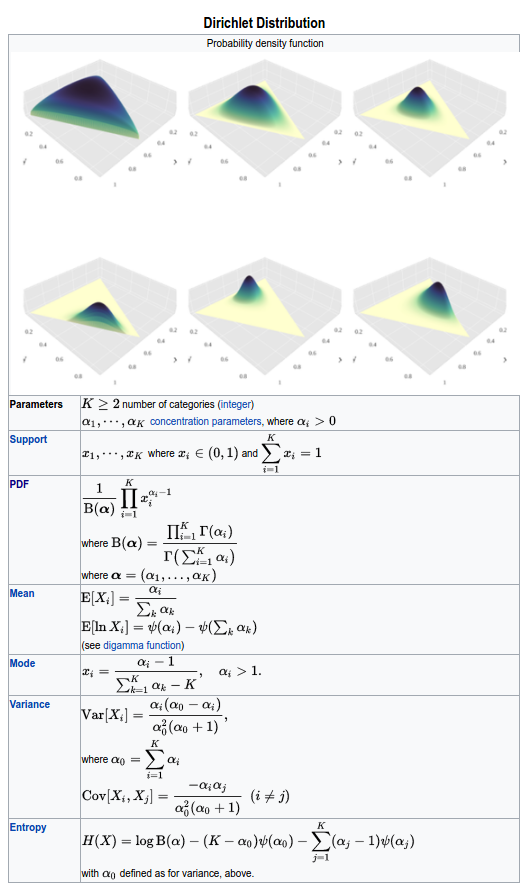
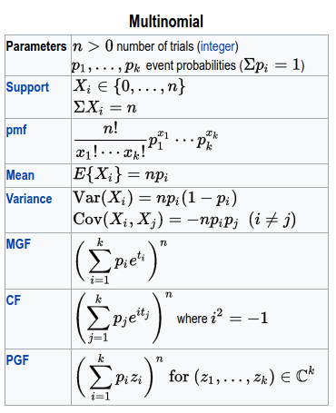

# 8.4 自助法和贝叶斯推断之间的关系

| 原文   | [The Elements of Statistical Learning](../book/The Elements of Statistical Learning.pdf) |
| ---- | ---------------------------------------- |
| 翻译   | szcf-weiya                               |
| 时间   | 2017-02-01                               |

首先考虑一个非常简单的例子，我们考虑服从正态分布单个的观测变量$z$
$$
z\sim N(\theta,1)\tag{8.29}
$$
为了完成关于$\theta$的贝叶斯分析，我们需要确定一个先验．最方便和普遍的选择是$\theta\sim N(0, \tau)$,得到后验分布
$$
\theta\mid z\sim N(\frac{z}{1+1/\tau},\frac{1}{1+1/\tau})\tag{8.30}
$$
于是当我们选择的 $\tau$ 越大，后验在最大似然估计$\hat\theta=z$附近越集中．当$\tau\rightarrow\infty$时，我们得到一个无信息（常值）先验，后验分布为
$$
\theta\mid z\sim N(z,1)\tag{8.31}
$$
这与参数自助法的分布相同，其中我们从采样密度$N(z,1)$的最大似然估计产生自助法值$z^*$．

有三点性质实现了这种对应关系．

1. $\theta$的无信息先验的选择；
2. 数据$\mathbf Z$上的对数似然函数$\ell(\theta;\mathbf Z)$的独立性仅仅与最大似然估计$\hat\theta$有关．因此可以将对数似然函数写成$\ell(\theta;\hat\theta)$
3. 关于$\theta$和$\hat\theta$的对数似然函数存在对称性，也就是，$\ell(\theta;\hat\theta)=\ell(\hat\theta;\theta)+\text{constant}$

性质（2）和（3）本来只有当为高斯分布时才满足．然而，对于多项式分布也近似满足，导出非参自助法和贝叶斯推断之间的对应，我们将在下面阐述要点．

假设我们有$L$个类别的离散样本空间．令$w_j$为样本点落入第$j$类的概率，而$\hat w_j$为第$j$类的观测比例．令$w=(w_1,w_2,\ldots,w_L)$,$\hat w=(\hat w_1,\hat w_2,\ldots, \hat w_L)$．记我们的估计为$S(\hat w)$;取参数为$a$的对称Dirichlet分布作为$w$的先验分布：
$$
w\sim \mathrm{Di}_L(a1)\tag{8.32}
$$

!!! note "weiya注"
    [from wiki](https://en.wikipedia.org/wiki/Dirichlet_distribution)
    

也就是，先验概率质量函数与$\prod_{\ell=1}^Lw_\ell^{a-1}$成比例．则$w$的后验密度为
$$
w\sim \mathrm{Di}_L(a1+N\hat w)\tag{8.33}
$$
其中$N$为样本大小．令$a\rightarrow 0$得到无信息先验
$$
w\sim \mathrm{Di}_L(N\hat w)\tag{8.34}
$$
于是，通过有放回取样得到的自助法分布可以表示成从多项式分布中对类别比例进行抽样．特别地，
$$
N\hat w^*\sim \mathrm{Mult}(N,\hat w)\tag{8.35}
$$
其中，$\mathrm {Mult}(N,\hat w)$为多项式分布，概率质量函数为$\binom{N}{N\hat w_1^\*,\ldots,N\hat w_L^\*}\prod\hat w_\ell^{N\hat w_\ell^\*}$.这个分布与上面的后验分布很相似，有着相同的支撑集，相同的均值，以及近似相同的协方差矩阵．因此$S(\hat w^\*)$的自助法分布近似为$S(w)$的后验分布．

!!! note "weiya注"
    [from wiki](https://en.wikipedia.org/wiki/Multinomial_distribution)
    

从这点看，自助法分布表示我们参数的（近似的）非参、无信息后验分布．但是自助法分布可以很方便地得到——不需要正式地确定一个先验而且不需要从后验分布中取样．因此我们或许可以把自助法分布看成一个“穷人的”贝叶斯后验．通过扰动数据，自助法近似于扰动参数后的贝叶斯效应，而且一般实施起来更简单．
