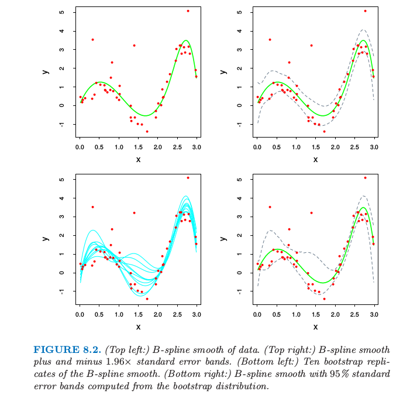
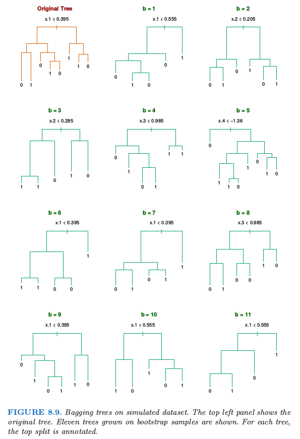
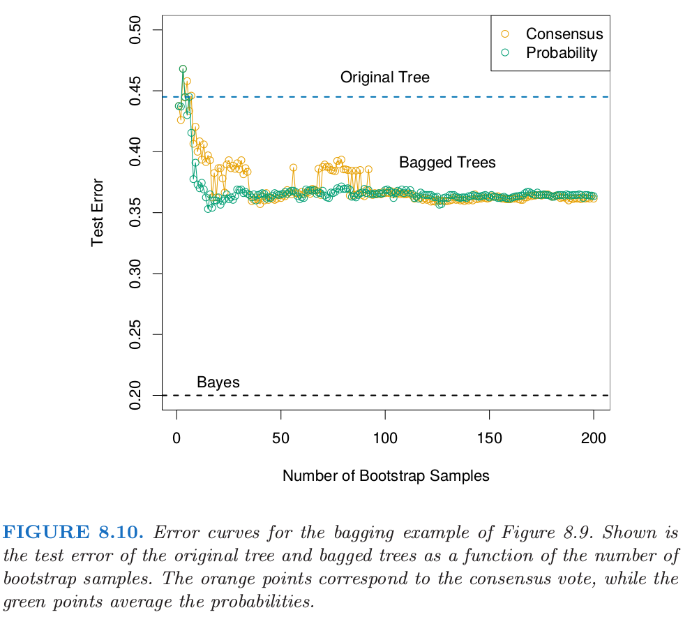
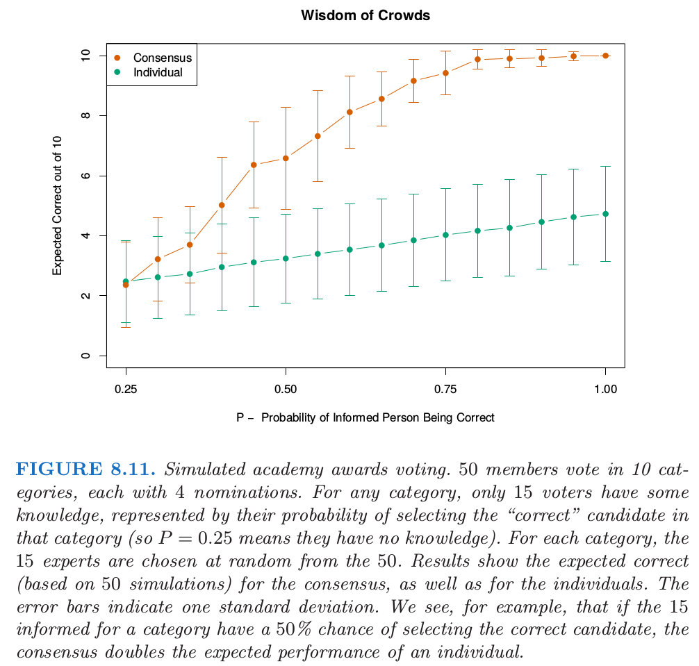
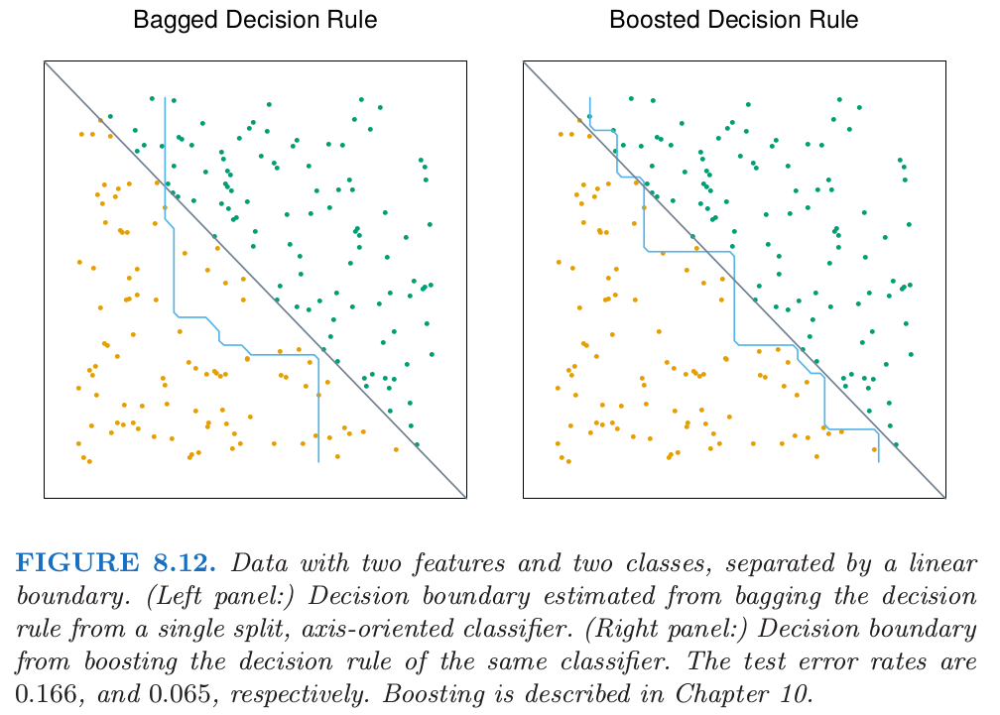

# 8.7 Bagging

| 原文   | [The Elements of Statistical Learning](../book/The Elements of Statistical Learning.pdf) |
| ---- | ---------------------------------------- |
| 翻译   | szcf-weiya                               |
| 时间   | 2017-02-03                               |
| 更新 | 2017-12-31|

!!! note "更新笔记"
    @2017-12-31 本节中提到了随机森林和boosting方式。ISLR在讲基于树的方法时是将这两种方式与bagging一起介绍的，有个读书笔记及有关R代码参见[这里](https://stats.hohoweiya.xyz/rmd/Tree-Based%20Methods.html)。简单来说，bagging和随机森林都是针对bootstrap样本，且前者可以看成后者的特殊形式；而boosting是针对残差样本。

前面我们已经介绍了自助法 (bootstrap) 可用来评估参数估计或预测的正确性。这里我们展示怎么使用自助法去改善估计或者预测本身。在 8.4 节我们研究了自助法和贝叶斯方法之间的关系，而且发现自助法均值近似于一个后验平均。Bagging进一步探索这之间的联系。

首先考虑一个回归问题。假设我们根据我们的训练数据 $\mathbf Z=\{(x_1,y_1),(x_2,y_2),\ldots,(x_N,y_N)\}$ 拟合一个模型，得到在输入$x$处的预测值$\hat f(x)$。自助法整合(Bootstrap aggregation)或者bagging在自助法样本的集合中平均了这个预测值，因此降低了它的方差。对于每个自助法样本$\mathbf Z^{\*b},b=1,2,\ldots,B$，拟合我们的模型得到预测值$\hat f^{\*b}(x)$。bagging估计定义为

$$
\hat f_{bag}(x)=\frac{1}{B}\sum\limits_{b=1}^B\hat f^{*b}(x)\qquad (8.51)
$$

记$\hat{\cal P}$为在每个数据点$(x_i,y_i)$上赋予相同概率$1/N$的经验分布。实际上，“真正”的bagging估计由$E_{\hat{\cal P}}\hat f^\*(x)$定义，其中$\mathbf Z^\*=(x_1^\*,y_1^\*),(x_2^\*,y_2^\*),\ldots,(x_N^\*,y_N^\*)$，并且$(x_i^\*,y_i^\*)\in \hat{\cal P}$。当$B\rightarrow \infty$，表达式（8.51）是真实bagging估计的蒙特卡洛估计。

bagged估计(8.51)与原始估计$\hat f(x)$仅仅当后者是数据的非线性或者数据的自适应函数才有区别。举个例子，为了打包(bag)8.2.1节的B样条光滑器，我们对图8.2的左下图中的曲线在每个$x$处进行平均。

!!! note "Recall"
    

如果我们固定输入则B样条光滑器关于数据是线性的，因此如果我们采用式(8.6)给出的参数自助法，则当$B\rightarrow \infty$时，$\hat f_{bag}(x)\rightarrow \hat f(x)$（练习8.4）。因此bagging仅仅在图8.2的左上图中重现了原先的光滑器。如果我们使用非参自助法来bagging结论也近似正确。

一个更有趣的例子是回归树，其中$\hat f(x)$记为在每个输入向量$x$处树的预测（回归树在第九章中讨论）。每个自助法树跟比原始特征相比，涉及不同的特征，而且可能会有不同的终止结点。bagged估计是在$x$处这$B$棵树的平均预测值。

现在假设我们的树产生一个用于$K$个类别响应变量的分类器$\hat G(x)$。这里考虑一个潜在的指示向量函数$\hat f(x)$（$K$维向量，其中有一个1和$K-1$个0）使得$\hat G(x)=\mathrm{arg \; max}\_k\;\hat f(x)$是很有用的。则袋装估计$\hat f_{bag}(x)$（8.51）是一个$K$维向量$[p_1(x),p_2(x),\ldots,p_K(x)]$，其中$p_k(x)$等于在$x$处预测为类别$k$的树的比例。bagged分类器从$B$棵树中选择得“票”最多的类别，也就是$\hat G_{bag}(x)=\mathrm{arg \; max}\_k\; \hat f_{bag}(x)$。

经常我们需要在$x$的估计类别概率，而不是分类自身。将投票比例$p_k(x)$看成是这些概率的估计是很吸引人的。

!!! note "weiya注"
    本书很多部分都有这样处理：
    如[混合模型的密度估计和分类](https://esl.hohoweiya.xyz/06%20Kernel%20Smoothing%20Methods/6.8-Mixture-Models-for-Density-Estimation-and-Classification/index.html)中
    $$
    \hat\gamma_{im}=\frac{\hat\alpha_m\phi(x_i;\hat\mu_m,\hat\Sigma_m)}{\sum_{k=1}^M\hat\alpha_k\phi(x_i;\hat\mu_k,\hat\Sigma_k)}\qquad (6.33)
    $$
    又如[对角线性判别分析和最近收缩重心](https://esl.hohoweiya.xyz/18%20High-Dimensional%20Problems/18.2%20Diagonal%20Linear%20Discriminant%20Analysis%20and%20Nearest%20Shrunken%20Centroids/index.html)中
    $$
    \hat p_k(x^\*)=\frac{e^{\frac{1}{2}\delta_k(x^\*)}}{\sum_{\ell=1}^Ke^{\frac{1}{2}\delta_\ell(x^\*)}}\qquad (18.8)
    $$

一个简单的两个类别的例子显示了它们在这种情形下的失败。假设在$x$处类别1的真实概率为0.75，而且每个bagging分类器准确地预测了1。于是$p_1(x)=1$,这是不正确的。然而，对于许多分类器$\hat G(x)$，已经有一个估计了$x$处类别概率的潜在函数$\hat f(x)$（对于树而言，类别的比例即为末结点处的类别比例）。另一种bagging策略是对这些结点处的比例取平均而不是对得分指示向量取平均。这个过程不仅仅改善了类别概率的估计，而且趋向于产生低方差的bagging分类器，特别是对于小$B$(见下一个例子的图8.10)

## 例子： 树与模拟数据

我们产生样本大小为$N=30$，两个类别，以及有$p=5$个特征的样本，每个样本服从标准高斯分布，并且成对相关系数为0.95。根据$Pr(Y=1\mid x_1\le 0.5)=0.2，Pr(Y=1\mid x_1> 0.5)=0.8$。贝叶斯误差率为0.2。同时从相同的总体中生成大小为2000的测试集合。我们对训练样本和200个自助样本拟合分类树（分类树在第九章中有描述）。不使用剪枝技巧。图8.9显示了原始的树和11个自助树。

注意到这些树是怎样完全不同的，既有不同的分割特征，也有不同的截断点。原始分类树和bagged树的测试误差展现在图8.10。

在这个例子中，由于预测变量间的相关性，树有很高的方差。Bagging成功光滑掉方差，也因此降低了测试误差。

Bagging可以显著降低不稳定的过程的方差得到更好的预测，比如说树。一个简单的论据说明了为什么bagging在平方误差损失下有效果，简单来说是因为它保持偏差不变降低了方差。

假设我们的训练样本$(x_i, y_i),i=1,\ldots,N$是从分布$\cal P$中独立采样的，并且考虑理想的整合估计器$f_{ag}(x)=E_{\cal P}\hat f^\* (x)$。这里$x$是固定的，并且自助数据集$\mathbf Z^\*$包含从$\cal P$中采样的的观测$x_i^\*, y_i^*$。注意到$f_{ag}(x)$是从实际总体$\cal P$中而不是数据中采样得到一个bagging估计。实际中这并不是我们可以用的估计，但是用于分析这是很方便的。我们可以写出如下关系

$$
\begin{align}
E_{\cal P}[Y-\hat f^*(x)]^2 &= E_{\cal P}[Y-f_{ag}(x)+f_{ag}(x)-\hat f^*(x)]^2\\
& = E_{\cal P}[Y-f_{ag}(x)]^2+E_{\cal P}[\hat f^*(x) - f_{ag}(x)]^2\\
& \ge E_{\cal P}[Y-f_{ag}(x)]^2\qquad (8.52)
\end{align}
$$

右侧额外的误差来自$\hat f^\*(x)$在$f_{ag}(x)$附近的方差。因此真实的总体整合不会增加均值和平方误差。这表明从训练样本中采样的bagging将会经常降低均方误差。

上面的论据对于0-1损失下的分类并不能保证，因为偏差和方差的不可加性。在那种情形下，对一个较好的分类器进行bagging会变得更好，但是bagging一个差的分类器会变得更差。举个简单采用随机化规则的例子。假设对于所有的$x$我们都有$Y=1$，并且分类器$\hat G(x)$以概率0.4预测$Y=1$（对所有$x$），并且以0.6的概率预测$Y=0$（对所有$x$）。则$\hat G(x)$的误分类率为0.6，但是bagged分类器的误差率为1.0。

对于分类，我们可以就一个独立弱分类器的共识来理解bagging的效应（Dietterich, 2000a）。令在两类别例子中$x$处的贝叶斯最优边界为$G(x)=1$。假设每个弱分类器$G_b^\*$的误差率为$e_b=e<0.5$，并令$S_1(x)=\sum_{b=1}^BI(G_b^\*=1)$是类别1的共识投票(consensus vote)。因为弱分类器假设是独立的，则$S_1(x)\sim B(B, 1-e)$，并且当B变大时，$Pr(S_1>B/2)\rightarrow 1$。这个概念已经作为“Wisdom of Crowds”流行于统计学之外了（Surowiecki, 2004）——多样且独立的人们的群体知识一般会超出人格单个的个体，而且可以用于投票。当然，最主要的警告是“独立”，但bagged树不是。图8.11说明了在模拟例子中投票共识(consensus vote)的力量，其中只有30\%的投票者对候选者有一些了解。

第15章中我们将看到随机森林通过降低被采样的树的相关性来改善bagging。

注意到当我们bag一个模型时，模型中任何简单的结构都会丢失。举个例子，bagged树不再是一棵树。对于模型的解释性来说，这显然是一个缺点。更稳定的过程，如最近邻，一般不会被bagging所影响。不幸的是，大都被bagging改善的不稳定的模型其实是不稳定的，因为对解释性的重视，而且这在bagging过程中会丧失掉。

图8.12展示了一个bagging不起作用的例子。这100个数据点有两个特征和两个类别，被灰色线性边界$x_1+x_2=1$分隔开。我们选择单个坐标轴定向的分隔作为我们的分类器$\hat{\cal G(x)}$，选择沿着$x_1$或$x_2$那个使得训练误分类误差有最大下降的分割点。

在50个自助样本上的0-1判别规则进行bagging得到的判别边界用蓝色曲线显示在图8.12的左面板。在捕捉真实的边界方面做得很差。从训练数据中得到的单个判别规则，分割点在0附近（
$x_1$或$x_2$中间的值），因此对于远离中心有很小的贡献。对概率进行平均而不是对分类平均在这里并没有帮助。bagging从单个分隔规则估计类别的期望概率，也就是，对许多重复实验进行平均。注意到通过bagging计算得到的期望类别概率不能被任意单个的实验所重现，这跟一个妇女不能有2.4个孩子的道理是一样的。在这个意义下，bagging以某种方式增加了单个基分类器的模型空间。然而，在这里并没有帮助，而许多其它的例子中模型类的更大推广是需要的。“boosting”是这样一种方式，这将在第10章讨论。图中右面板的判别边界是boosting过程的判别边界，而且其大致捕捉到了对角边界。

