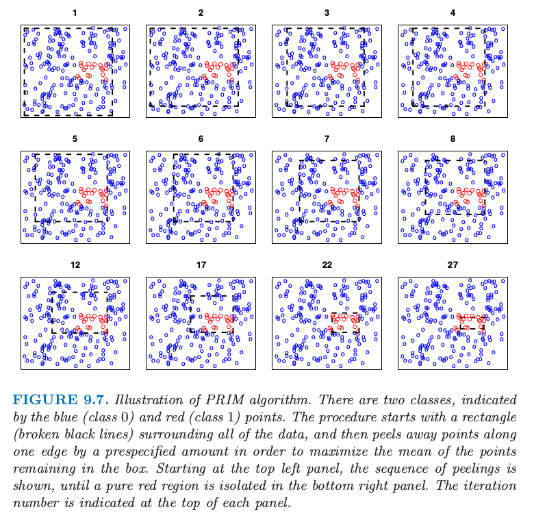
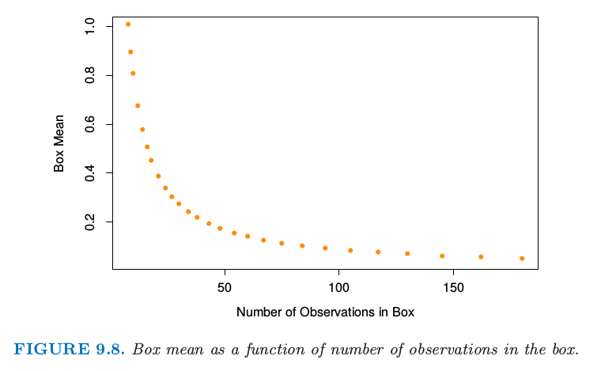
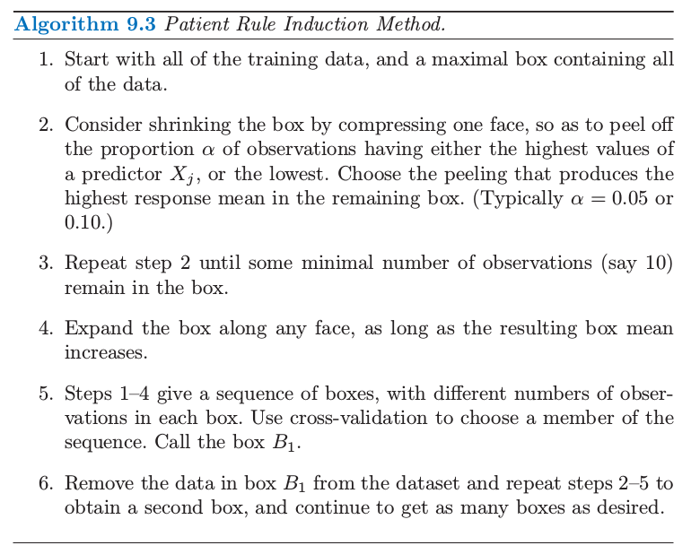
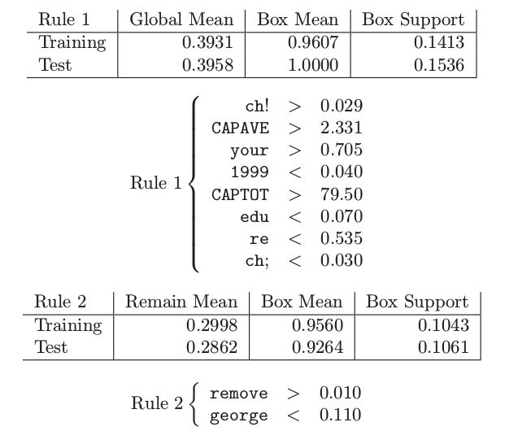

# PRIM

| 原文   | [The Elements of Statistical Learning](../book/The Elements of Statistical Learning.pdf) |
| ---- | ---------------------------------------- |
| 翻译   | szcf-weiya                               |
| 时间   | 2017-03-12                               |

基于树的方法（用于回归）将特征空间分成盒状的区域，来试图将响应变量在每个盒子中尽可能不同。通过二叉树定义了盒子的分割规则与每个都相关，帮助我们的理解。

耐心诱导方法(PRIM)也在特征空间中找到了盒子，但是它是寻找具有高的平均响应的盒子。因此它是在寻找目标函数的最大值，称为bump hunting。（如果需要最小值而非最大值，简单地用负的响应变量值来进行。）

PRIM也区别于基于树的分割方法，因为盒子的定义不是通过二叉树来描述的。这使得规则集合的解释更加困难；然而，通过移除二叉树的限制，单个规则经常更加简单。

PRIM中构造盒子的主要方法是自上而下，以包含所有数据的盒子开始。这个盒子沿着一个面被少量压缩，接着观测落在盒子外面被剔除掉。用于压缩的面的选择使得压缩过后，盒子均值最大的那个面。接着这个过程被重复，直到当前的盒子包含最小数目的数据点。

这个过程在图9.7中进行了图示。在单位方格中200个数据点均匀分布。用颜色编码的图象表明当$0.5<X_1<0.8,0.4<X_2<0.6$时，响应变量$Y$取值1（红色），否则取值为0（蓝色）。这个面板显示了通过自上而下的剔除过程被逐步找到的盒子，在每一步剔除了剩余数据点中的$\alpha=0.1$.

> 图9.7. PRIM算法的图解。有两个类别，用蓝色（类别0）和红色（类别1）的点来表示。这个过程以包含所有数据的长方形（黑色虚线）开始，接着沿着某条边剔除预定量的点，使得留在盒子中的点的均值最大。从左上图开始，显示了这个剔除序列，直到右下图中纯红色区域被隔离开。这个迭代次数由每张图上面的数字表示。

图9.8显示了当盒子被压缩后，盒子中响应变量的均值。

> 图9.8. 盒子中盒子的均值作为观测数目的函数。

计算自上而下的序列之后，PRIM颠倒了这个过程，沿着任意边进行展开，如果这样的展开增大盒子均值的话。这称为pasting。因为自上而下的过程在每一步是贪婪的，这样的展开经常是可行的。

这些步骤的结果是盒子的序列，每个盒子中含有不同数目的观测。交叉验证，并结合数据分析家的判断，来选择最优的盒子大小。

用$B_1$记在第一步中找到的盒子的观测的指标。PRIM过程接着从训练集中移除$B_1$的观测，并且这两步的过程——先自下而上pasting，后自上而下剔除——在剩下的数据集中重复。整个过程重复若干次，得到盒子序列$B_1,B_2,\ldots,B_k$。每个盒子由涉及预测变量的子集的规则集
$$
(a_1\le X_1\le b_1)\text{ and } (b_1\le X_3\le X_2)
$$
来定义。PRIM过程的总结在算法9.3中给出。

PRIM可以通过考虑所有预测变量的划分处理类别型变量，正如CART中一样。缺失值也通常以一种类似CART的方式进行处理。PRIM是为回归（定量响应变量）而设计的；两个类别的输出可以简单地编码成0和1来处理。没有简单的方式来同时处理$k>2$个的类别的情形：一种方式是对每个类别和基准类别单独采用PRIM。

PRIM与CART相比的优点是它的耐心(patience)。因为它的二值分割，CART快速地将数据分割开。假设等大小的分割，有$N$个观测情况下，在使用完数据之前，只能进行$log_2(N)-1$次分割。如果PRIM在每一步剔除掉训练点的$\alpha$（$\alpha$是个百分比），则在用完数据之前近似需要$-log(N)/log(1-\alpha)$次剔除步骤。举个例子，如果$N=128,\alpha=0.10$，则$log_2(N)-1=6$，而$-log(N)/log(1-\alpha)\approx 46$。考虑每一步需要整数个的观测，PRIM实际上仅仅可以剔除29次。在任何情形下，PRIM的能力更加耐心，这应该帮助自上而下的贪婪算法找到更好的解。

## 垃圾邮件的例子（继续）

我们对spam数据应用PRIM，对spam编码为1，对email编码为0.

通过PRIM最初找到的两个盒子总结如下：

盒子的支撑为观测值落入盒子的比例。第一个盒子是纯spam，并且大约包含15%的测试数据。第二个盒子包含10.6%的测试观测，其中92.6%为spam。加起来两个盒子包含数据的26%，以及大约97%的spam。接下来一些盒子（没有显示出来）相当小，仅仅包含数据的3%.

预测变量按照重要性列出来。有趣的是在CART树中最上面的分割变量没有出现在PRIM的第一个盒子中。

