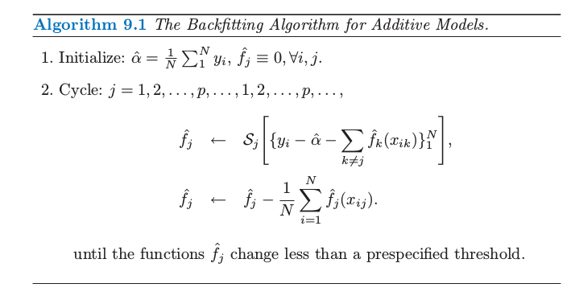
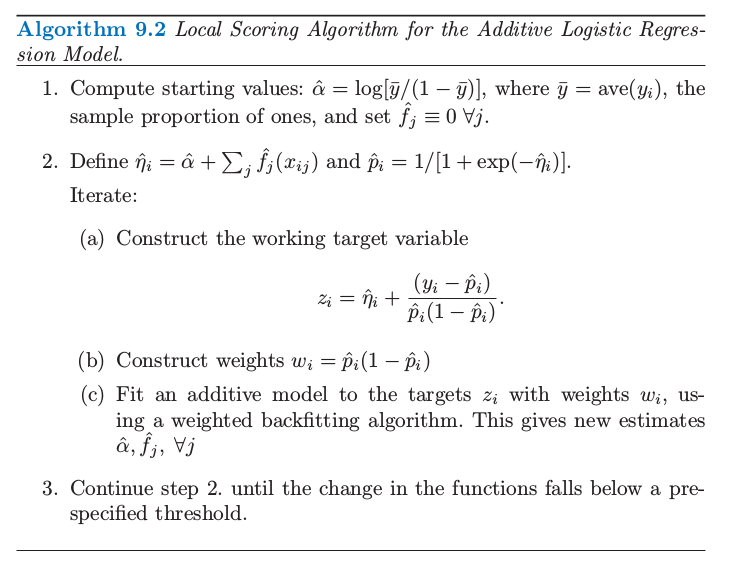
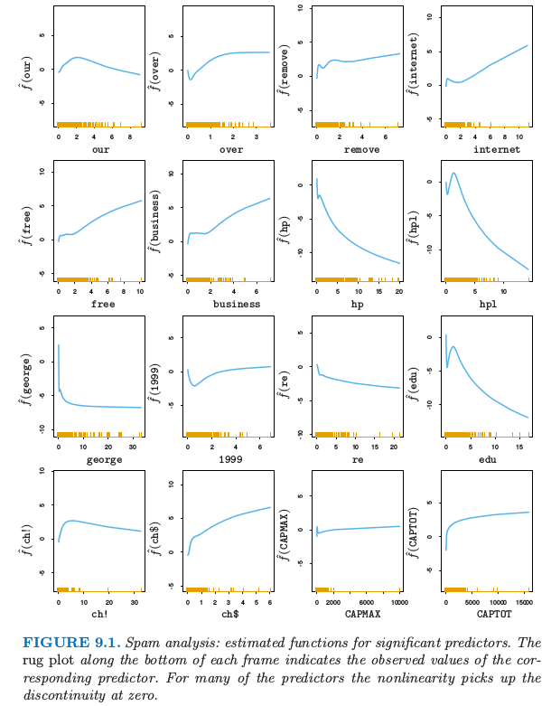
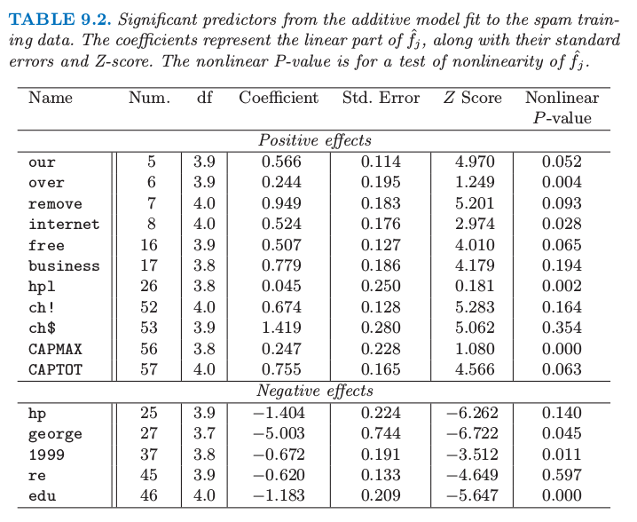

# 9.1 广义可加模型

| 原文   | [The Elements of Statistical Learning](../book/The Elements of Statistical Learning.pdf#page=314) |
| ---- | ---------------------------------------- |
| 翻译   | szcf-weiya                               |
| 时间   | 2017-02-04                               |
| 更新 | 2018-02-21|
| 状态 | Done | 

回归模型在许多数据分析中起着重要的作用，提供了预测和分类的规则、以及理解不同输入变量重要性的数据分析工具．

尽管非常简单，但是传统的线性模型经常在这些情形下失效：实际生活中，变量的影响往往不是线性的．在前面的章节中我们讨论使用预定义的基函数来实现非线性的技巧．这部分描述更多 **自动灵活 (automatic flexible)** 的统计方法来识别和表征非线性回归的影响．这些方法被称为“广义可加模型”．

在回归的设定中，广义可加模型有如下形式

$$
\E(Y\mid X_1,X_2,\ldots,X_p) = \alpha+f_1(X_1)+f_2(X_2)+\cdots+f_p(X_p).\tag{9.1}
$$

和通常一样，$X_1,X_2,\ldots,X_p$ 代表预报变量，$Y$ 表示输出变量；$f_j$ 是未定义的（非参）光滑函数．如果我们用基函数的展开（[第 5 章](../05-Basis-Expansions-and-Regularization/5.1-Introduction/index.html)）对每个函数进行建模，则最终的模型可以通过简单的最小二乘实现．我们这里的方式有些不同：我们用散点图光滑器来拟合每个函数（比如，三次光滑样条或核光滑），并且提供了同时估计所有 $p$ 个函数的算法（[9.1.1节](#_1)）

对于二分类，回忆在[ 4.4 节](../04-Linear-Methods-for-Classification/4.4-Logistic-Regression/index.html) 中讨论的二值数据的逻辑斯蒂回归模型．我们通过一个线性回归模型和 logit 链接函数将预报变量与二进制响应变量的均值 $\mu(X)=\Pr(Y=1\mid X)$ 关联起来：

$$
\log(\frac{\mu(X)}{1-\mu(X)})=\alpha+\beta_1X_1+\cdots+\beta_pX_p\tag{9.2}
$$

可加逻辑斯蒂回归模型将每个线性项换成更一般的函数形式

$$
\log(\frac{\mu(X)}{1-\mu(X)})=\alpha+f_1(X_1)+f_2(X_2)+\cdots+f_p(X_p)\tag{9.3}
$$

其中每个 $f_j$ 也是未定义的光滑函数．尽管函数 $f_j$ 的非参形式使得模型更加灵活，但是仍然保留着可加性，而且允许我们用前面一样的方式来解读模型．可加逻辑斯蒂回归模型是广义加性模型的一个例子．一般地，响应变量 $Y$ 的条件均值 $\mu(X)$ 通过一个链接函数 $g$ 将预报变量的可加函数联系起来：

$$
g[\mu(X)]=\alpha+f_1(X_1)+\cdots+f_p(X_p)\tag{9.4}
$$

典型的链接函数的例子如下：

- $g(\mu)=\mu$ 是等值链接，用于高斯响应数据的线性和可加模型
- 如上面所示的对二项分布概率建模的 $g(\mu)=\logit(\mu)$，或者 $g(\mu)=\probit(\mu)$ （probit 链接函数）．probit 函数是高斯分布函数的反函数：$\probit(\mu)=\Phi^{-1}(\mu)$
- $g(\mu)=\log(\mu)$ 应用于处理泊松计数数据的对数线性或者对数加性模型．

上面的三种情形都是来自指数族采样模型，另外也包括 Gamma 分布和负二项分布．这个分布族产生了著名的广义线性模型类，它们都是以同样的方式扩展为广义可加模型．

使用基本构造块 (basic building block) 为散点图平滑器 (scatterplot smoother) 的算法来灵活地估计函数 $f_j$．估计的函数 $\hat f_j$ 然后可以揭示 $X_j$ 可能的非线性影响．并不是所有的函数 $f_j$ 需要是非线性．我们可以简单地将线性项和其它带非线性项的参数形式混合，当一些输入变量是定性的（或者说是因子）时这个混合是必要的．非线性项也没有约束为主要影响 (main effect)；可以存在关于两个或更多个变量的非线性成分，或者因子 $X_k$ 的每个层次关于 $X_j$ 的单一曲线．因此下列的每种情形都有可能：

- $g(\mu)=X^T\beta+\alpha_k+f(Z)$，这是一个半参模型，其中 $X$ 是需要线性建模的预测变量的向量，$\alpha_k$ 是定性输入变量 $V$ 的第 $k$ 个层次的影响，而且非参数地建模预测变量 $Z$ 的影响．
- $g(\mu)=f(X)+g_k(Z)$，同样 $k$ 表示定性输入 $V$ 的层次，因此这构造出一个关于 $V$ 和 $Z$ 影响的交叉项 $g(V,Z)=g_k(Z)$
- $g(\mu)=f(X)+g(Z,W)$，其中 $g$ 是关于两个特征的非参数函数．

可加模型可以用各种设置来替换线性模型，举个例子，时间序列的可加性分解：

$$
Y_t=S_t+T_t+\varepsilon_t\tag{9.5}
$$

其中，$S_t$ 是季节项，$T_t$ 是趋势项，$\varepsilon_t$ 是误差项．

## 拟合可加模型

在这一节我们讨论拟合加性模型和它们的一般形式的标准算法．building block 是用一种灵活的方式拟合非线性影响的散点图光滑器．具体地，我们将第五章中讨论的三次光滑样条作为我们的散点图光滑器．

可加模型有如下形式

$$
Y=\alpha + \sum_{j=1}^pf_j(X_j)+\varepsilon\tag{9.6}
$$

其中误差项 $\varepsilon$ 均值为 $0$．给定观测值 $x_i,y_i$，类似 [5.4 节](../05-Basis-Expansions-and-Regularization/5.4-Smoothing-Splines/index.html)中讨论的惩罚平方和 (5.9) 准则，可以确定出下面的准则，

$$
\mathrm{PRSS}(\alpha,f_1,f_2,\ldots,f_p)=\sum\limits_{i=1}^N(y_i-\alpha-\sum\limits_{j=1}^pf_j(x_{ij}))^2+\sum\limits_{j=1}^p\lambda_j\int f_j''(t_j)^2dt_j\quad (9.7)
$$

其中 $\lambda_j\ge 0$ 是调整参数．可以证明 (9.7) 的最小值是可加三次样条模型；每个函数 $f_j$ 是一个关于组分 $X_j$ 的三次样条，结点在每个唯一的 $x_{ij},i=1,\ldots,N$ 值处．然而，如果没有对模型有进一步的约束，解不是唯一的．常数 $\alpha$ 不是唯一的，因为我们可以对每个函数 $f_j$ 进行加减任意常数，然后因此调整 $\alpha$．标准的规定是假设 $\sum_1^Nf_j(x_{ij})=0,\forall j$ ——这些函数在数据上均值为 0．可以很简单地证明得到在这种情形下 $\hat\alpha=\mathrm {ave}(y_i)$．除了这条约束，再加上输入矩阵（第 $ij$ 位置值为 $x_{ij}$）是列满秩的条件，则 (9.7) 是严格凸准则并且最小值是唯一的．如果矩阵是奇异的，则不能唯一确定组分 $f_j$ 的线性部分（尽管非线性部分可以！）(Buja et al., 1989[^1])

进一步，有一个简单的迭代过程来寻找解．令 $\hat\alpha=\mathrm {ave}(y_i)$，而且保持不变．我们对关于 $x_{ij}$ 函数的目标$\\{y_i-\hat\alpha-\sum_{k\neq j}\hat f_k(x_{ik})\\}\_1^N$ 应用三次光滑样条 $\cal S_j$ 得到新估计 $\hat f_j$．对每个预报变量轮流这样处理，当计算 $y_i-\hat\alpha-\sum_{k\neq j}\hat f_k(x_{ik})$ 时使用其它函数的当前估计 $\hat f_k$．重复这个过程直到估计值 $\hat f_j$ 稳定．这个过程被称作 “backfitting”（算法 9.1 中给出了详细细节），而且最后的拟合与线性模型的多项式回归是相似的．

原则上，算法 9.1 中第 2(2) 步不是必需的，因为光滑样条对 0 均值响应变量拟合均值为 0（[练习 9.1](https://github.com/szcf-weiya/ESL-CN/issues/167)）．实际中，机器舍入误差会导致下降，所以建议进行调整．

当确定了合适的光滑算子 $\cal S_j$，同样的算法可以用完全相同的方式适应其他的拟合方法：

- 其它的单变量回归光滑器，比如局部多项式回归和核方法；
- 线性回归算子，可以得到多项式拟合，分段常值拟合，参数化样条拟合，序列和傅里叶拟合；
- 更加复杂的算子，比如对于二阶或者高阶交互项或者对于季节影响的周期光滑器．

如果我们仅仅在训练集点上考虑光滑器算子 $\cal S_j$，则可以用 $N\times N$ 的算子矩阵 $\mathbf S_j$ 来表示（见[ 5.4.1 节](../05-Basis-Expansions-and-Regularization/5.4-Smoothing-Splines/index.html)）．则第 $j$ 项的自由度（近似）是 $\mathrm {df}_j=\mathrm{trace}[\mathbf S_j]-1$，这与第 5 和第 6 章中讨论的光滑器的自由度是类似的．

对于一个大类别的线性光滑器 $\mathbf S_j$，backfitting 等价于求解确定线性系统的 Gauss-Seidel 算法．细节在[练习 9.2](https://github.com/szcf-weiya/ESL-CN/issues/68)中给出．

对于逻辑斯蒂回归和其他广义加性模型，合适的准则是带惩罚的对数似然．为了最大化它，backfitting过程与概率最大化一起作用．在广义线性模型中最大化对数似然的 Newton-Raphson 方法可以重新改造成一个 IRLS（迭代重加权最小二乘）算法．这涉及在协变量上对工作中的响应变量重复进行加权线性回归；每个回归得到一个新的参数估计，反过来又给了新的工作相应变量和系数，而且这一过程迭代进行（见 [4.4.1 节](../04-Linear-Methods-for-Classification/4.4-Logistic-Regression/index.html)）．在广义加性模型中，加权线性回归可以简单地用加权 backfitting 算法来替换．我们将在下面讨论逻辑斯蒂回归时该算法的细节，更一般的讨论可以在 Hastie and Tibshirani(1990)[^2]的第 6 章中找到．

## 例子：可加逻辑斯蒂回归

在医学研究中应用最广的模型或许是对二值数据的逻辑斯蒂回归模型．在这个模型中，输出 $Y$ 可以编码成 0 或 1，其中 1 代表事件发生（比如死亡，疾病复发），0 代表没有事件发生．我们希望建立 $\Pr(Y=1\mid X)$ 的模型，其中 $\Pr(Y=1\mid X)$ 是给定预测因子 $X^T=(X_1,\ldots,X_p)$ 后事件发生的概率．目标通常是确定预测因子的作用，而不是对新个体进行分类．逻辑斯蒂回归也应用到当对估计类别比例感兴趣的情况下，比如 risk screening．除了医学上的应用，信用风险 screening 也是一个受欢迎的应用方面．

广义加性模型有如下形式
$$
\log\frac{\Pr(Y=1\mid X)}{\Pr(Y=0\mid X)}=\alpha+f_1(X_1)+\cdots+f_p(X_p)\tag{9.8}
$$

函数 $f_1,f_2,\ldots,f_p$ 是通过在 Newton-Raphson 过程中运用 backfitting 算法估计得到的，算法 9.2 中显示了具体过程．

可加模型在算法 9.2 中的第 (2) 步拟合需要一个带权重的散点图光滑器．许多光滑过程可以接受观测值权重（[练习 5.12](https://github.com/szcf-weiya/ESL-CN/issues/107)）；更多细节参见 Hastie and Tibshirani (1990)[^2] 的第三章．

可加逻辑斯蒂回归模型可以进一步推广为解决超过两个类别的情形，通过采用在 [4.4 节](../04-Linear-Methods-for-Classification/4.4-Logistic-Regression/index.html)中列出的多维逻辑斯蒂公式．尽管这个形式是 (9.8) 式的直接展开，但拟合这些模型的算法更加复杂．更多细节参见 Yee and Wild(1996)[^3]，并且 VGAM 软件可以从下面网站中得到

[http://www.stat.auckland.ac.nz/∼yee](http://www.stat.auckland.ac.nz/∼yee)

### 例子：预测垃圾邮件

我们对第一章的 spam 数据应用广义可加模型．数据包含 4601 条电子邮件信息，在一项研究中去扫描邮件来找出 “spam”（也就是，垃圾邮件）．数据可以在[ftp.ics.uci.edu](ftp.ics.uci.edu) 上获得，而且收到了 California 的 Palo Alto 的 Hewlett-Packard 实验室中 George Forman 的捐赠．

响应变量是二值数据，值为 email 或者 spam，在下面描述了 57 个预报变量．

- 48 个定量预报变量——邮件中匹配给定单词的单词比例．举个例子，比如说有 `business`，`address`，`internet`，`free` 和 `george`．这个想法是这些对不同用户会不一样．
- 6 个定量预报变量——邮件中匹配给定字符的字符比例．字符为 `ch;`，`ch(`，`ch[`，`ch!`，`ch$`，和 `ch#`．
- 未间断的大写字符序列的平均长度：`CAPAVE`
- 未间断的大写字符序列的最长长度：`CAPMAX`
- 未间断的大写字符序列的总长度：`CAPTOT`

我们将 spam 编码成 1，email 编码成 0．随机选取大小为 1536 的测试集，剩下的 3065 个测试集作为测试集．一个广义加性模型通过对每个预报变量用四个名义自由度的三次光滑样条．这意味着对于每个预报变量 $X_j$，选择光滑样条的参数 $\lambda_j$ 使得 $\mathrm {trace}[\mathbf S_j(\lambda_j)]-1=4$，其中 $\mathbf S_j(\lambda)$ 是使用观测数据 $x_{ij},i=1,\ldots,N$ 构造出的光滑样条算子矩阵．这是在这样一个复杂模型中确定光滑数量的方便方式．

大多数的 spam 预报变量服从一个非常长的长尾分布．在拟合 GAM 模型之前，对每个变量进行对数变换（实际上是 $\log(x+0.1)$），但是在图 9.1 画出的是关于原始变量的函数．

> 图 9.1. 垃圾邮件分析：对于显著性预报变量的估计函数．在每张图的横轴的须状图 (rug plot) 表示对应的预报变量．对于许多预报变量非线性是在 0 处的不连续性导致的．

表 9.1 显示了测试误差率；总体误差率为 $5.3\%$．为了对比，线性逻辑斯蒂回归有 $7.6\%$ 的测试误差．表 9.2 显示了在可加性模型中显著性强的预报变量．

> 表 9.1. 对垃圾训练数据的可加逻辑斯蒂回归模型拟合的混淆矩阵．整体测试误差率为 $5.5\%$.

> 表 9.2. 对 spam 训练数据进行可加模型拟合的显著性预报变量．系数和它们的标准误差以及 Z 得分来表示 $\hat f_j$ 的线性部分．非线性 p 值是对$\hat f_j$ 非线性的检验．

为了解释的方便，表 9.2 中有每个变量分解成线性组分和剩余非线性组分的贡献．靠前的预测变量与 spam 正相关，而最后的预测变量负相关．线性组分是在预报变量上对拟合曲线的加权最小二乘线性拟合，而非线性部分是剩余部分．估计函数的线性部分是由系数、标准误差和 $Z$ 得分来总结（表示）；后者（指 Z 得分）是系数除以它的标准误差，而且当它超过合适的标准正态分布的分位数认为是显著的．标签为 nonlinear P-value 的列是对估计函数非线性部分的测试．然而，注意到，每个预报变量的影响是根据其他变量的整体影响来调整的，而不仅仅是它们的线性部分．表中显示的预报变量通过在 $p=0.01$ 水平下（双边）进行至少一个检验（线性或者非线性）来判断是否显著的．

图 9.1 显示了在表 9.2 中出现的显著预测变量的估计函数．许多非线性影响表明在 0 处的强不连续性．举个例子，当 `george` 的频率从 $0$ 增长， `spam` 的概率显著下降，但是此后没有太大改变．这表明或许会用一个表示计数为 0 的指示变量来替换每个频率预测变量，这样回到线性逻辑斯蒂回归．这给出 $7.4\%$ 的测试误差；包括频率的线性影响将测试误差降低到 $6.6\%$．看起来在可加模型中的非线性有着额外的预测力量．

将真正的 `email` 分类成 `spam` 是很严重的，因为好邮件会被过滤掉而不能到达用户手中．我们可以通过改变损失来平衡类别误差率（见 2.4 节）．如果我们对将真实的类别 0 预测成类别 1 赋予损失 $L_{01}$，$L_{10}$ 为将真实的类别 1 预测成类别 0 的损失，于是如果概率大于 $L_{01}/(L_{01}+L_{10})$ 则估计的贝叶斯准则预测为类别 1．举个例子，如果我们取 $L_{01}=10,L_{10}=1$ 则（真实的）类别 0 和类别 1 误差率变成 $0.8\%$ 和 $8.7\%$．

更 ambitiously，我们通过对类别 0 的观测赋予权重 $L_{01}$，对类别 1 的观测赋予权重 $L_{10}$ 使得模型更好地对类别 0 中的数据进行拟合．像上面一样，我们接着运用贝叶斯准则来预测．在类别 0 和类别 1 中误差率分别为 $1.2\%$ 和 $8.0\%$．我们将在基于树的模型中讨论损失不相等的问题．

拟合加性模型之后，应该检查一下加入交互关系之后是否显著性提高拟合．这可以通过插入一些或全部的显著性输入来“手动”完成，或者通过 MARS 过程来自动完成．（见[ 9.4 节](../09-Additive-Models-Trees-and-Related-Methods/9.4-MARS/index.html)）

这个例子以一种自动的方式来使用加性模型．作为一个数据分析工具，可加模型经常以一种更交互的方式来使用，通过添加或者删除项来确定它们的影响．通过校准关于 $df_j$ 的光滑数量，可以在线性模型 ($df_j=1$) 和部分线性模型中移动，其中对一些项更加灵活地建模．更多细节见 Hastie and Tibshirani(1990)[^2]．

## 总结

可加模型提供一个有用的线性模型拓展，使得不仅保留着大部分的可解释性，也更加灵活．在线性模型中建模和推断熟悉的工具对于加性模型也是适用的，见表 9.2 的例子．拟合这些模型的 backfitting 过程是简单而有模式的，允许对于每个输入变量去选择合适的拟合方法．在统计领域它们越来越被广泛地应用．

然而可加模型对于大的数据挖掘的应用是有限制的．backfitting 算法拟合所有的预测变量，而大部分的预测变量是不可行的也不是必需的．BRUTO 过程（Hastie and Tibshirani, 1990[^2]，第 9 章）结合 backfitting 和输入选择，但是不是为了大规模的数据挖掘的问题．最近也有用 lasso 型惩罚来估计稀疏加性模型的工作，举个例子，Lin and Zhang (2006)[^4] 提出的 COSSO 过程，以及 Ravikumar et al., (2008)[^5] 提出的 SpAM．对于大型问题，向前逐步方法（比如第 10 章的 boosting）更加地有效，而且允许交叉项包含进模型中．

[^1]: Buja, A., Hastie, T. and Tibshirani, R. (1989). Linear smoothers and additive models (with discussion), Annals of Statistics 17: 453–555
[^2]: Hastie, T. and Tibshirani, R. (1990). Generalized Additive Models, Chapman and Hall, London.
[^3]: Yee, T. and Wild, C. (1996). Vector generalized additive models, Journal of the Royal Statistical Society, Series B. 58: 481–493.
[^4]: Lin, Y. and Zhang, H. (2006). Component selection and smoothing in smoothing spline analysis of variance models, Annals of Statistics 34: 2272–2297.
[^5]: Ravikumar, P., Liu, H., Lafferty, J. and Wasserman, L. (2008). Spam: Sparse additive models, in J. Platt, D. Koller, Y. Singer and S. Roweis (eds), Advances in Neural Information Processing Systems 20, MIT Press, Cambridge, MA, pp. 1201–1208.