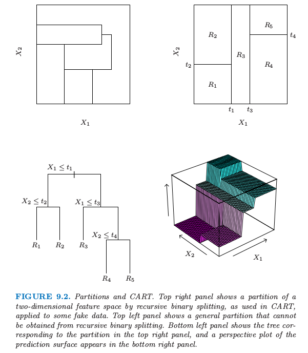
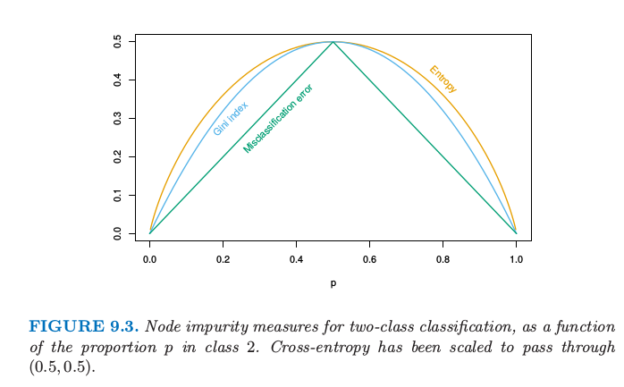
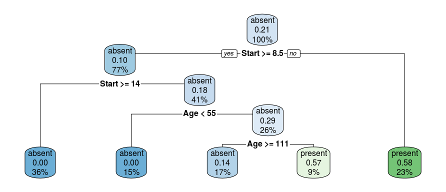
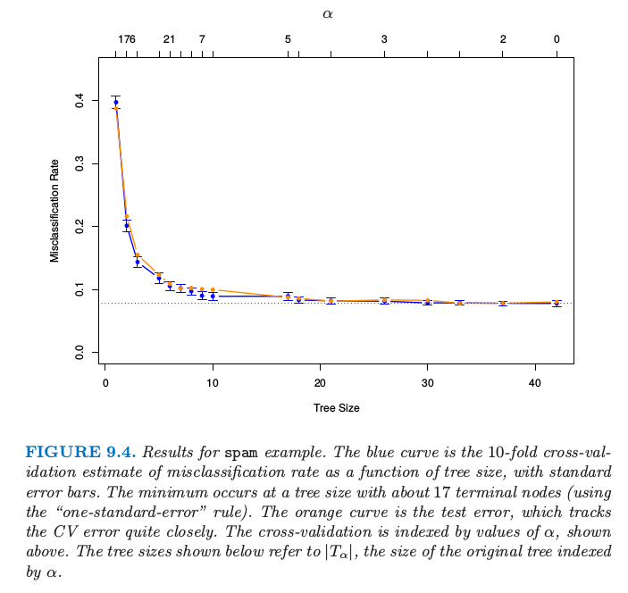
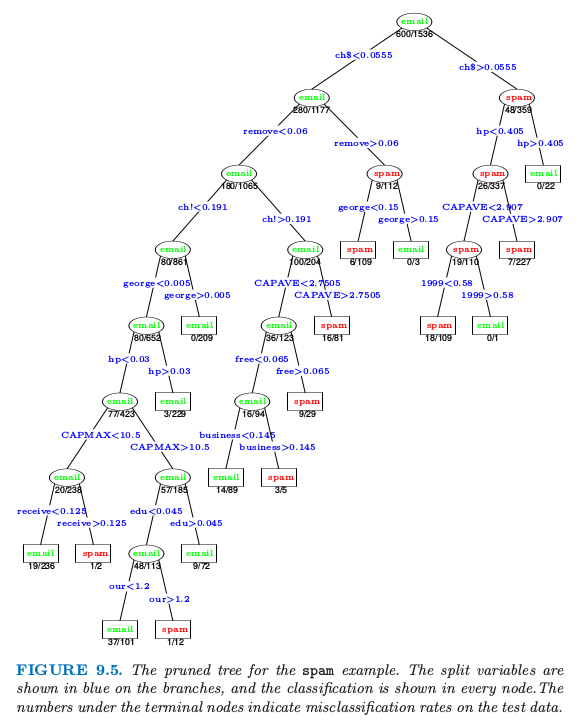
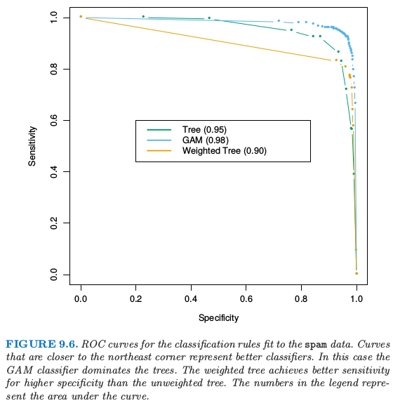

# 9.2 基于树的方法(CART)

| 原文   | [The Elements of Statistical Learning](../book/The Elements of Statistical Learning.pdf) |
| ---- | ---------------------------------------- |
| 翻译   | szcf-weiya                               |
| 时间   | 2017-02-05                               |
| 更新 |2018-03-15|
|状态|Done|

## 背景

**基于树 (Tree-based)** 的方法将特征空间划分成一系列的长方形，然后对每个长方形拟合简单的模型（比如常数）．想法很简单但是很有用．我们首先描述一个基于树的回归和分类的方法，称为CART，后来与 C4.5 进行对比，这是它主要的一个对手．

让我们考虑含连续响应变量 $Y$ 和输入变量 $X_1$ 和 $X_2$ 的回归问题，每个都在单位区间内取值．

> 图9.2. 划分和CART．右上图展示了二维特征空间被一些模拟的值进行递归二值分割得到的一个划分，就像CART中使用的那样．左上图展示了一个不能通过递归二分得到的一般划分．左下图展示了对应右上图划分的树，右下图则画出了预测平面的透视图．

图 9.2 的左上图展示了用平行于坐标轴的直线对特征空间的一个划分．在每个划分元素里面我们可以用不同的常值来对 $Y$ 进行建模．然而，这里有个问题：尽管每个划分直线有个类似 $X_1=c$ 的简单表示，但有一些区域是很难描述的．

为了简化问题，我们限制在如图 9.2 的右上图所示的递归二值划分．我们首先将空间分成两个区域，然后在每个区域里面用 $Y$ 的均值来对响应变量进行建模．我们选择变量和分离点以实现最优拟合．然后这些区域又被分成两个区域，这个过程一直进行下去，直到满足停止规则．举个例子，在图 9.2 的右上图，我们首先在 $X_1=t_1$ 处进行划分．然后在 $X_2=t_2$ 处对区域 $X_1\le t_1$ 进行划分，在$X_1=t_3$ 对区域 $X_1> t_1$ 进行划分．最后，在 $X_2=t_4$ 处对区域 $X_1>t_3$ 进行划分．这一过程的结果是得到如图所示的五个区域 $R_1,R_2,\ldots,R_5$ 的划分．对应的回归模型在区域 $R_m$ 中用常数 $c_m$ 来预测 $Y$，也就是

$$
\hat f(X)=\sum\limits_{m=1}^5c_mI\{(X_1,X_2\in R_m\}\tag{9.9}
$$

同样的模型也可以用图 9.2 的左下图的二叉树来表示．在树的顶端标出全数据集．在每个交叉点处满足条件的观测分配到左枝上去，其他的分到右枝上去．终止结点或者树的叶子对应区域 $R_1,R_2,\ldots, R_5$．图 9.2 的右下图是该模型回归表面的透视图．为了说明，我们选择结点均值 $c_1=-5,c_2=-7,c_3=0,c_4=2,c_5=4$ 来画这张图．

递归二叉树一个重要的优点在于它的解释性．特征空间被一棵树完全描述．当超过两个输入，类似图 9.2 的右上图的划分很难画出来，但是二叉树表示能够仍然起作用．这种表示方法在医学科学家中很流行，或许它在模仿医生的思考方式．基于病人的特征，树将总体分成了高低不同的阶层．

## 回归树

我们现在讨论怎样生成一个回归树的问题．我们的数据包含对$N$个观测值中的每一个的$p$个输入和1个输出：这就是，$(x_i,y_i),i=1,2,\ldots, N,$其中，$x_i=(x_{i1},x_{i2},\ldots,x_{ip})$.这个算法需要根据分离变量和分类点来自动确定，而且确定树应该有的拓扑结构（形状）．首先假设我们有一个分成$M$个区域$R_1,R_2,\ldots, R_M$的一个划分，而且我们在每个区域内用常数$c_m$来对响应变量来建立模型：
$$
f(x)=\sum\limits_{m=1}^Mc_mI(x\in R_m)\tag{9.10}
$$
如果我们采取最小化平方和$\sum(y_i-f(x_i))^2$的准则，则可以很简单地证明得到最好的$\hat c_m$恰巧是区域$R_m$中$y_i$的平均值：
$$
\hat c_m=\mathrm{ave}(y_i\mid x_i\in R_m)\tag{9.11}
$$
现在找出使得平方和最小的最优二分在计算上一般是不可行的．因此我们采用一种贪婪算法．从所有变量开始，考虑分离变量$j$和分离点$s$,定义半平面对
$$
R_1(j,s)=\{X\mid X_j\le s\}\;\text{and}\; R_2(j,s)=\{X\mid X_j>s\}\tag{9.12}
$$
于是我们寻找分离变量$j$和分离点$s$求解
$$
\underset{j,s}{\mathrm {min}}[\underset{c_1}{\mathrm{min}}\;\sum\limits_{x_i\in R_1(j,s)}(y_i-c_1)^2+\underset{c_1}{\min}\sum\limits_{x_i\in R_2(j,s)}(y_i-c_2)^2]\tag{9.13}
$$
对于每个选定的$j$和$s$，内部最小化通过下式来求解
$$
\hat c_1=\mathrm{ave}(y_i\mid x_i\in R_1(j,s))\;\text{and}\; \hat c_2=\mathrm{ave}(y_i\mid x_i\in R_2(j,s))\tag{9.14}
$$
对于每个分离变量，可以非常快地确定分离点$s$，因此对所有输入进行扫描，确定最优的对$(j,s)$是可行的．

找到最优的分割之后，我们将数据分成两个区域，然后对每个区域重复分割过程．然后在对所有区域都重复同样的分割过程．

我们应该生成多大的树？很显然，树太大会过拟合数据，而树太小则可能捕捉不了重要的结构．树的大小也是一个调整参数来控制模型复杂度，最优的树规模应该从数据中自适应选取．一种分割树结点的方式可能是仅仅如果由于分割超出一些阈值使得平方和降低．然而，这种策略太目光短浅了，因为看似无用的分割或许会导致下面得到很好的分割．

更好的策略是生成一个大树$T_0$,仅仅当一些最小结点规模（比如5）达到停止分割过程．接着大树采用cost-complexity pruning来调整，我们现在讨论的内容．

我们定义子树$T\subset T_0$为任何可以通过对$T_0$剪枝得到的树，也就是，压缩任意数目的中间（非终止）结点．我们用$m$表示终止结点，其中结点$m$表示区域$R_m$．令$\vert T\vert $为$T$中终止结点的个数．令
$$
\begin{align}
N_m&=\#\{x_i\in R_m\}\\
\hat c_m&=\frac{1}{N_m}\sum\limits_{x_i\in R_m}y_i\\
Q_m(T)&=\frac{1}{N_m}\sum\limits_{x_i\in R_m}(y_i-\hat c_m)^2
\end{align}
\tag{9.15}
$$
定义复杂度代价准则
$$
C_\alpha(T)=\sum\limits_{m=1}^{\vert T\vert}N_mQ_m(T)+\alpha\vert T\vert\tag{9.16}
$$
想法是对于每个$\alpha$,寻找子树$T_\alpha\subset T_0$使得$C_\alpha(T)$最小化．调整参数$\alpha\ge 0$调整树的规模和它对数据拟合的成都之间的平衡．较大的$\alpha$值导致小规模的树$T_\alpha$,对于较小的$\alpha$情况反过来了．这种记号表明，当$\alpha=0$时，解为全树$T_0$.我们下面讨论怎么自适应地选择$\alpha$.

对于每个$\alpha$,可以找到唯一最小的子树$T_\alpha$使得$C_\alpha(T)$最小化．为了寻找$T_\alpha$我们采用weakest link pruning：逐步压缩在$\sum_mN_mQ_m(T)$中单节点增长最小的中间结点，直到我们得到单结点（根）的树．这给出了子树的（有限）序列，而且可以证明这条序列一定包含$T_\alpha$.更多细节见Breiman等人（1984）或者Ripley（1996）年的工作．$\alpha$的估计可以通过五折或者十折交叉验证得到：我们选择$\hat\alpha$使得交叉验证平方和最小．我们最终的树为$T_{\hat \alpha}$

## 分类树

如果目标是结果取值为 $1,2,\ldots,K$ 的分类问题，则在树的算法中唯一需要改变的是关于分离结点以及剪枝的准则．对于回归我们用 (9.15) 式定义的平方误差结点纯度，但是这对于分类便不适合了．在结点$m$,用 $N_m$ 个观测值表示区域 $R_m$，令
$$
\hat p_{mk} = \frac{1}{N_m}\sum\limits_{x_i\in R_m}I(y_i=k)
$$
类别$k$的观测在结点$m$处的比例．我们将结点$m$处的观测划分为类别$k(m)=\mathrm{arg\; max}\_k\hat p_{mk}$，结点$m$处最主要的类别．不同衡量结点纯度$Q_m(T)$的方法包括如下：
$$
\begin{align}
\text{误分类误差：}& \frac{1}{N_m}\sum_{i\in R_m}I(y_i\neq k(m))=1-\hat p_{mk(m)}\\
\text{Gini指数：}&\sum_{k\neq k'}\hat p_{mk}\hat p_{mk'}=\sum_{k=1}^K\hat p_{mk}(1-\hat p_{mk})\\
\text{交叉熵或者偏差：}&-\sum_{k=1}^K\hat p_{mk}\mathbf{log} \hat p_{mk}
\end{align}
\tag{9.17}
$$
对于两个类别，如果$p$是第二类的比例，则这三个衡量指标分别为$1-max(p,1-p), 2p(1-p)$以及$-p\mathrm{log}p-(1-p)\mathrm{log}(1-p)$.图9.3 画出了它们的函数曲线．这三者都类似，但是交叉熵和Gini指数是可微的，因此更加适合数值优化．比较（9.13）和（9.15）,我们看到我们需要由分离结点$m$得到的两个子节点的观测数$N_{m_L}$和$N_{m_R}$来对结点纯度赋予权重．

> 图9.3 两类别分类的结点纯度关于类别2比例$p$的函数．交叉熵已被缩放使能过点（0.5,0.5）

另外，交叉熵和Gini指数比误分类率对结点概率的改变更加敏感．举个例子，在每个类别都有400个观测的两个类别的问题中（记为（400,400）），假设一个分割得到得到结点（300,100）和结点（100,300），而另外一个分割得到结点（200,400）和结点（200，0）．两个分割过程的误分类误差率都是0.25，但是第二个分割产生一个纯结点，似乎更好一些．对于第二个分割，Gini指数和交叉熵都更低一点．基于这个原因，当生成一棵树时应该使用Gini指数或者交叉熵中的一个．为了引导复杂度代价剪枝，三种衡量指标的任意一个都可以使用，但是一般地是采用误分类误差率．

Gini指数可以用两种方式来解读．与其将观测值划分到结点的主要类别中，我们可以以一定概率$\hat p_{mk}$将它们划分到类别$k$．于是该结点的这条规则的训练误差率是$\sum_{k\neq k'}\hat p_{mk}\hat p_{mk'}$——Gini指数．类似地，如果我们对类别$k$的观测编码为1，而对其它的观测编码为0，则该结点的0-1响应变量的方差为$\hat p_{mk}(1-\hat p_{mk})$.将$k$个类别的全部相加再一次得到Gini指数．

!!! note "weiya注"
    下面看一下如何在 R 中实现 CART 算法，采用 rpart 包来完成，下面是一个很简单的例子．

    library(rpart)

    library(rpart.plot)

    fit <- rpart(Kyphosis ~ Age + Number + Start, data = kyphosis)

    rpart.plot(fit)

    最终，我们得到
    

## 其他的问题

### 类别型预测变量

当对一个有着$q$个可能的无次序值的预测变量，则将这$q$个值分成两块有$2^{q-1}-1$种可能的划分，对于大的$q$值，计算变得很困难．然而，输出为0-1时，计算可以简化．我们根据落入类别1的比例对预测变量的类别进行排序．然后把预测变量看成是有序预测变量进行划分．可以证明这给出了在交叉熵或者Gini指数情形下$2^{q-1}-1$种可能分割的最优分割．这个结果对与定量输出和平方误差损失也一样成立——通过增加输出的均值对类别进行排序．尽管很直观，但是这些断言的证明不是很简单．二值输出的证明由Breiman等人（1984）和Ripley(1996)给出；定量输出的证明可以在Fisher（1958）的工作中找到．对于多重类别的输出，没有这样的简化，尽管已经提出不同的近似（Loh和Vanichsetakul,1988）

这个划分算法趋向于偏爱有多个层次$q$的类别型预测变量；划分的种类关于$q$呈指数增长，而且我们有更多的选择，我们更有可能招待一个对于当前数据好的方法．如果$q$很大，这导致严重的过拟合，而且类似的变量应该被避免．

### 损失矩阵

在分类问题中，某些类别的误分类的后果会比其他类别的误分类后果要严重．举个例子，当某人实际上会发生心脏病而预测他/她不会发生心脏病比反过来的情形要糟糕．为了说明这一点，我们定义$K\times K$的损失矩阵$\mathbf L$,其中$L_{kk'}$为将类别$k$的观测划分为$k'$的观测产生的损失．一般地，对于正确的分类不会带来损失，也就是$L_{kk}=0\;\forall k$.为了将损失结合到模型过程中，我们可以将Gini指数修改成$\sum_{k\neq k'}L_{kk'}\hat p_{mk}\hat p_{mk'}$;这个可以成为由于随机规则引起的期望损失．这对于多重类别的情形也成立，但是对于两个类别的情形没有影响，因为$\hat p_{mk}\hat p_{mk'}$的系数为$L_{kk'}+L_{k'k}$.对于两个类别的情形更好的方式是对类别$k$的观测赋予权重$L_{kk'}$. 这个可以在多重类别情形下使用仅仅当关于$k$的函数$L_{kk'}$不依赖$k'$.观测的权重也可以同偏差一起使用．观测权重的影响是去更改类别的先验概率．在终止结点上，经验贝叶斯规则表明我们划分成类别$k(m)=\mathrm{arg\; min_k}\sum_\ell L_{\ell k}\hat p_{m\ell}$

### 缺失预测变量的值

假设我们的数据在部分或全部变量中有一些缺失的预测变量的值．我们可能丢弃含有缺失数据的观测，但是这会导致训练集严重的消耗．另外我们或许试图填补缺失数据，如用非缺失观测的均值来填补．对于基于树的模型，有两种更好的方式．第一种是应用到类别型预测变量上：我们简单地新建一个“缺失”的类别．从这里我们可能发现含缺失值的观测在某些指标上的表现与其他不含缺失值的表现有不同．第二种更一般的方式是构造代理变量．当对一个分割考虑一个预测变量，我们仅仅考虑该变量未缺失的观测．选择好最优的（主要的）预测变量和分割点，我们构造代理预测变量和分离点的列表．第一个代理是最好模拟由初次分割得到的训练数据分割的预测变量和对应的分离点．第二代理是模仿的第二好的预测变量和对应的分离点，以此类推．当在训练阶段或者预测阶段使得观测在树中下降，我们依次采用代理分割，如果最初的分割预测变量缺失．代理分割探索预测变量之间的相关性来试图减轻丢失数据的影响．丢失预测变量和其他预测变量的相关度越高，则由于丢失数据造成信息丢失的影响越小．丢失数据的一般问题将在9.6节中讨论．

### 为什么二值分割？

与其在每一步对每个结点只分割成两个群体（如上面讨论的），我们或许考虑多重分割成多于两个群体．尽管这个在某些情况下是有用的，但不是一个好的一般策略．问题在于多重分割将数据分得太快，以至于在下一层次没有充分多的数据．因此我们仅仅当需要的时候采用这种分割．因为多重分割可以通过一系列的二值分割实现，所以后者更好一点．

### 其他建树的过程

上面的讨论集中在CART(分类和回归树)树的实现．其他流行的方法是ID3和后来的版本，C4.5和C5.0（Quinlan, 1993). 程序的早期版本只限制类别型变量，而且采用自上而下没有剪枝的规则．经过最近的发展，C5.0已经变得与CART很相似．C5.0独有的最显著的特征是用于导出规则集的方案．树建成之后，定义终止结点的分割规则有时可以被简化：这就是，不用改变落入结点里面的观测的子集删掉一个或多个条件．最终我们得到定义每个终止结点的简化规则集；这些不再遵循树的结构，但是它们的简化可能使得它们更加吸引人们使用．

### 线性组合分割

与其将分割限制成$X_j\le s$的形式，可以允许线性组合形式的分割$\sum a_jX_j\le s$.优化权重 $a_j$ 和分离点 $s$ 使得有关的准则最小（比如Gini 指数）．尽管这个可以提高树的预测能力，但这也会损害解释性．计算上，分离点搜索的分离性妨碍了对权重的光滑优化．更好地结合线性组合分割的方式是在专家系统混合模型中，这是9.5节的主题．

### 树的不稳定性

树的一个主要问题是它们的高方差性．经常在数据中的一个小改动导致完全不同的分割点序列，使得解释不稳定．这种不稳定的主要原因是这个过程的层次性：上一个分割点的误差会传递到下面所有的分割点上．可以试图采取更加稳定的分离准则在某种程度上减轻这一影响，但是固有的不稳定性没有移除．这是从数据中估计一二简单的、基于树结构的代价．Bagging（8.7节）对很多树进行平均来降低方差．

### 缺乏光滑性

树的另一个限制是预测表面缺乏光滑性，如在图 9.2 中的右下图中那样．在0/1损失的分类问题中，这不会有太大的损伤，因为类别概率估计的偏差的影响有限．然而，在回归问题中这会降低效果，正常情况下我们期望潜在的函数是光滑的．9.4 节介绍的 MARS 过程可以看出是为了减轻 CART 缺乏光滑性而做的改动．

### 捕捉加性结构的困难

另外一个树的问题是对加性结构建模的困难．举个例子，在回归问题中，假设 $Y=c_1I(X_1<t_1)+c_2I(X_2<t_2)+\varepsilon$，其中$\varepsilon$ 是 0 均值噪声．则二叉树会在 $t_1$ 附近对 $X_1$ 做第一次分割．为了捕捉加性结构，下一层两个结点都需要在 $t_2$ 处对 $X_2$ 分割．在充足数据情况下这个或许可以发生，但是这个模型没有给予特别鼓励来找到这一结构．如果有 10 个而不是 2 个加性影响，需要花费很多偶然的分割来重造这个结构，并且在估计的树中，通过数据分析来识别它会变得非常困难．原因再一次可以归结为二叉树的结构，既有优点也有不足．为了捕捉加性结构，MARS 方法（9.4 节）再一次放弃树的结构．

## 垃圾邮件的例子（继续）

前面我们已经对spam例子应用了分类树的方法．我们运用偏差来建树，用误分类率来剪枝．图9.4显示了根据10个复制数据的10折交叉验证误差率作为剪枝树的大小的函数，以及 $\pm2$ 倍的均值的标准误差．测试误差曲线用橘黄色来表示．注意到交叉验证误差率是通过$\alpha$的序列而非树的大小来索引的；对于不同的复制数据建的树，一个 $\alpha$ 可能对应不同的大小．在图的底部所示的大小指的是剪枝的原始树的大小 $\vert T_\alpha\vert$.

> 表9.3. 垃圾邮件数据：测试数据上 17 个结点（通过交叉验证选出来的）树的混淆比例．总的误差率为9.3%．

> 图9.4. spam例子的结果．蓝色曲线是10折交叉验证误分类率的估计作为树大小的函数的曲线．最小值发生在含有17个终止结点的树处（采用“one-standard-error”规则）．橘黄色区显示测试误差，其非常接近地沿着CV误差．交叉验证由如上所示的$\alpha$值索引．下面显示的树的大小指的是由$\alpha$索引的原始树的大小$\vert T_\alpha\vert$．

误差在大概17个终止结点处变平，给出了图9.5的剪枝树．在树的13个不同特征中，有11个与加性模型中16个显著特征重合（表9.2）.表9.3显示的整体误差率比表9.1显示的加性模型大概高出50%.

> 图9.5. spam例子的剪枝树．分离变量在树枝上用蓝色显示，分类结果在每个结点处显示．在终止结点处的数目表示在测试数据上的错误分类率．

考虑树的最右边分支，如果超过5.5%的字符是\$符号则将分到右边分支并且显示为垃圾邮件（spam）的警告．然而，另外如果词语hp经常出现，则很可能是公司事务并且我们分成email．在测试集里的所有22个情形满足正确分类的准则．如果第二个条件不满足，而且重复出现的大写字母平均长度CAPAVE大于2.9，则我们分成spam类．在227个测试情形中，只有7个被错误分类．

在医学分类问题中，sensitivity和specificity经常用来衡量一个准则．它们按如下定义：

Sensitivity：给定真实状态为患病预测为患病的概率

Specificity：给定真实状态为未患病预测为未患病的概率

如果我们将spam和email看成有无患病，则从表9.3我们有
$$
\begin{align}
Sensitivity & = 100\times\frac{33.4}{33.4+5.3}=86.3\%\\
Specificity &  = 100\times \frac{57.3}{57.3+4.0}=93.4\%
\end{align}
$$
在这个分析中我们使用了相等的损失．和之前一样令 $L_{kk'}$ 为将类别 $k$ 预测成类别 $k'$ 对应的损失．通过改变损失 $L_{01}$ 和 $L_{10}$ 的相对大小，我们增大该规则的敏感性降低该规则的特异性，或者反过来．在这个例子中，我们想要避免将好的email预测成spam，因此我们希望确定性非常高．我们可以通过设置 $L_{01}>1,L_{10}=1$ 来实现．如果spam的比例 $\ge L_{01}/(L_{10}+L_{01})$，则在每个终止结点处的贝叶斯规则将此结点归类为类别1，否则归为类别0.受试者工作特征曲线（ROC）是用于评估敏感性和特异性之间折中的常用概述．当我们改变分类规则的参数得到敏感性关于特异性的图像．在0.1和 10之间改变损失 $L_{01}$，然后对图 9.4 中选定的17个结点的贝叶斯规则，得到如图9.6所示的ROC曲线．每条曲线靠近0.9的标准误差近似为$\sqrt{0.9(1-0.9)/1536}=0.008$，因此差别的标准误差大概为0.01．我们为了实现接近 100% 的特异性，敏感性大致降低到了50%.曲线下面的面积是通常使用的定量概述；在曲线的两端线性扩张使得它在[0,100]上有定义，面积大概为0.95.为了比较，我们也画出了在9.2节对这些数据进行GAM模型拟合的ROC曲线；它给出了对于任意损失更好的分类规则，面积为0.98.

> 图9.6. 对spam数据应用分类规则拟合的ROC曲线．越靠近东北角落的曲线表示越好的分类器．这种情形下，GAM分类器比树模型更好．加权树比未加权树在更高特异性情况下有更好的敏感性．图例中的数字表示曲线下面的面积．

与其仅仅修改结点处的贝叶斯规则，在建树的时候将不相等的损失进行全面考虑更好，正如我们在9.2节做的那样．当只有两个类别0和1时，通过对类别$k$的观测赋予权重$L_{k,1-k}$将损失考虑到建树的过程中．这里我们选择$L_{01}=5,L_{10}=1$而且像前面一样拟合同样大小的树（$\vert T_\alpha\vert=17$）.这棵树在高特异性下比原树有更高的敏感性，但是在其它极端情况下表现得更差．前几层的分割与原树是一样的，但是接着就变不同了．因为这个应用通过$L_{01}=5$建的树显然好于原来的树．

上面使用的ROC曲线下的面积有时被称作$c$统计量．有趣地是，对于两个群体中预测得分差异的中位数（Hanley和McNeil，1982），可以证明ROC曲线下的面积等于Mann-Whitney U统计量（或者 Wilcoxon 秩和检验）.当额外的预测变量加入到标准模型中时衡量该预测变量的贡献度，$c$统计量或许不是一个有信息的衡量．新预测变量可以对模型偏差改变很显著，但是$c$统计量却只有很小的增大．举个例子，从表9.2中移除高显著项george会导致$c$统计量的增长小于0.01.相反地，基于个体样本基来检查额外的预测变量怎样改变分类是有用的．这点将在Cook(2007)中进行充分讨论．
