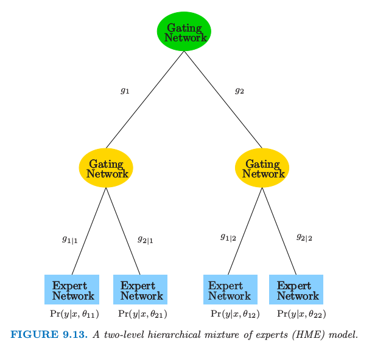

# 9.5 专家的分层混合

| 原文   | [The Elements of Statistical Learning](../book/The Elements of Statistical Learning.pdf) |
| ---- | ---------------------------------------- |
| 翻译   | szcf-weiya                               |
| 时间   | 2017-03-13                               |
| 更新 | 2018-03-17|
| 状态 |Done|

**专家的分层混合 (HME)** 过程可以看成是基于树方法的变种。主要的差异是树的分割不是**硬决定 (hard decision)**，而是**软概率的决定 (soft probabilistic)**。在每个结点观测往左或者往右的概率取决于输入值。因为最后的参数优化问题是光滑的，所以有一些计算的优势，不像在基于树的方式中的离散分割点的搜索。软分割或许也可以帮助预测准确性，并且提供另外一种有用的数据描述方式。

HMEs 和 CART 树的实现还有其他的差异。在HME中，在每个终止结点处拟合线性（或者逻辑斯蒂回归）模型，而不是像 CART 中那样是常值。分割点可以是多重的，而不仅仅是二值的，并且分割点是输入的线性组合的概率函数，而不是在标准 CART 中的单个输入。然而，这些选择的相对优点不是清晰的，大部分将在 9.2 节的后面中讨论。

简单的 2 层 HME 模型如图 9.13 所示。可以认为是在每个非终止结点处进行软分割的树。然而，这种方法的发明者采用不同的术语。终止结点称为**专家 (experts)**，非终止结点称为**门控网络 (gating networks)**。想法是，每个专家对响应变量提供一个看法（预测），并且通过门控网络将这些“看法”结合在一起。正如我们所见，这个模型形式上是混合模型，并且图中的两层模型可以推广为多层，因此有了称为**专家的分层混合 (hierarchical mixtures of experts)**

> 图9.13. 两层专家分层混合模型 (HME)。

考虑回归或者分类问题，正如本章中前面描述的一样。数据 $(x_i,y_i),i=1,2,\ldots,N$，$y_i$ 要么是连续响应变量，要么是二值响应变量，并且 $x_i$ 是向量值输入。为了记号的简便，我们假设 $x_i$ 的第一个元素是1，这个元素代表截距。

这里描述 HME 是如何定义的。顶层的门控网络有输出

$$
g_j(x,\gamma_j)=\frac{e^{\gamma_j^Tx}}{\sum_{k=1}^Ke^{\gamma_k^Tx}}\; j=1,2,\ldots,K\tag{9.25}
$$

其中每个 $\gamma_j$ 是未知参数向量。这表示软的 $K$ 重分割（图 9.13 中 $K=2$）每个 $g_j(x,\gamma_j)$ 是将特征向量为$x$ 的观测赋给第 $j$ 个分支。注意到 $K=2$ 时，如果我们将 $x$ 的某一个元素的系数取为 $+\infty$，接着我们得到无穷大的斜率的逻辑斯蒂曲线。在这种情形下，门的概率取 0 或 1，对应在该输入下的硬分割。

在第二层，门控网络有类似的形式：
$$
g_{\ell\mid j}(x,\gamma_{j\ell})=\frac{e^{\gamma_{j\ell}^Tx}}{\sum_{k=1}^Ke^{\gamma_{jk}^Tx}},\ell=1,2,\ldots,K\tag{9.26}
$$
这是在给定上一层第 $j$ 个分支的情况下，赋予第$\ell$分支的概率。

在每个专家（终止结点），我们有如下形式的响应变量的模型

$$
Y\sim  Pr(y\mid x,\theta_{jl})\tag{9.27}
$$

这根据问题而有不同。

**回归：** 使用高斯线性回归模型，其中$\theta_{j\ell}=(\beta_{i\ell},\sigma^2_{j\ell})$:
$$
Y=\beta_{k\ell}^Tx+\varepsilon\text{  and  }\varepsilon\sim N(0,\sigma_{j\ell}^2)\tag{9.28}
$$
**分类：** 使用线性逻辑斯蒂回归模型：
$$
\Pr(Y=1\mid x,\theta_{j\ell})=\frac{1}{1+e^{-\theta_{j\ell}^Tx}}\tag{9.29}
$$
用$\Psi=\\{\gamma_j,\gamma_{j\ell},\theta_{j\ell}\\}$表示参数的集合，$Y=y$ 整体概率为
$$
Pr(y\mid x,\Psi)=\sum\limits_{j=1}^Kg_j(x,\gamma_j)\sum\limits_{\ell=1}^Kg_{\ell\mid j}(x,\gamma_{j\ell})Pr(y\mid x,\theta_{j\ell})\tag{9.30}
$$
这是个混合模型，其中混合概率由门控网络模型确定。

为了估计这些参数，我们在 $\Psi$ 的参数上最大化数据的对数似然，$\sum_i \log \Pr(y_i\mid x_i,\Psi)$。处理这个的最方便是 EM 算法，我们已经在[8.5节](../08-Model-Inference-and-Averaging/8.5-The-EM-Algorithm/index.html)中描述了。我们定义潜在变量 $\Delta_j$， 除了一个元素为 1，所有的都是 0。我们把这个解释为由顶层门控网络作出的分支判断。类似地，我们定义潜在变量 $\Delta_{\ell\mid j}$ 来描述第二层的门控判断。

在 E 步，EM 算法在给定当前参数值的情况下计算 $\Delta_j$ 和 $\Delta_{\ell\mid j}$ 的期望。这些期望接着作为 M 步的观测权重，来估计专家网络的参数。中间结点的参数由多重逻辑斯蒂回归来估计。$\Delta_j$ 和 $\Delta_{\ell\mid j}$ 的期望是概率，并且这些用作逻辑斯蒂回归的响应向量。

专家的分层混合方式是 CART 树的一个有潜力的对手。采用**软分割 (soft splits)**，而不是硬分割，它可以捕捉到从低到高响应变量的转变是渐增的情形。对数似然是未知系数的光滑函数，因此更适合数值优化。和 CART 类似，都是线性组合的分割，但是后者更难优化。另一方面，基于我们的了解，寻找 HME 模型的一个好的树拓扑结构是没有方法的，正如 CART 中一样。一般地，可以采用一些深度固定的树，很可能得到 CART 过程的输出。HMEs 上的研究强调预测而不是最终模型的解释。与 HME 很相近的模型是**潜类别模型(latent class model)** (Lin et. al, 2000[^1])，一般只有一层；且结点或者潜在类别解释成表现出相似响应变量行为的个体的群体。

[^1]: Lin, H., McCulloch, C., Turnbull, B., Slate, E. and Clark, L. (2000). A latent class mixed model for analyzing biomarker trajectories in longitudinal data with irregularly scheduled observations, Statistics in Medicine 19: 1303–1318.
