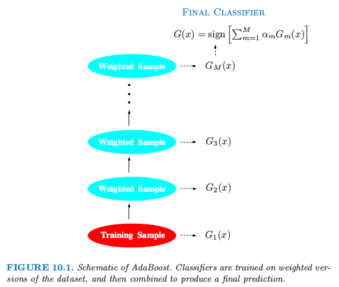

#  boosting方法

| 原文   | [The Elements of Statistical Learning](../book/The Elements of Statistical Learning.pdf) |
| ---- | ---------------------------------------- |
| 翻译   | szcf-weiya                               |
| 时间   | 2017-02-06                               |

boosting是在最近20年内提出的最有力的学习方法。最初是为了分类问题而设计的，但是将在这章中看到，它也可以很好地扩展到回归问题上。boosting的动机是集合许多弱学习的结果得到有力的“committee”。从这点看boosting以bagging和其他的基于committee的方式（8.8节）相似。然而，我们应该看到这种联系最多是表面上的，boosting在根本上存在不同。

我们首先描述最流行的boosting算法，因为Freund和Schapire（1997）称为“AdaBoost.M1”。考虑两个类别的问题，输入变量编码为$Y\in\{-1,1\}$.给定预报向量$X$，分类器$G(X)$在二值$\{-1,1\}$中取一个值得到一个预测。在训练样本上的误差率是
$$
\overline{err}=\frac{1}{N}\sum\limits_{i=1}^NI(y_i\neq G(x_i))
$$
在未来预测的期望误差率为$E_{XY}I(Y\neq G(X))$

弱分类器是误差率仅仅比随机猜测要好一点的分类器。boosting的目的是依次对反复修改的数据引用弱分类器算法，因此得到弱分类器序列$G_m(x),m=1,2,\ldots,M$ 根据它们得到的预测再通过一个加权来得到最终的预测
$$
G(x)=\mathrm {sign}(\sum\limits_{m=1}^M\alpha_mG_m(x))\qquad (10.1)
$$
这里$\alpha_1,\alpha_2,\ldots,\alpha_M$通过boosting算法进行计算，而且对每个单独的$G_m(x)$的贡献度赋予权重。它们的作用是在给序列中更精确的分类器更大的影响。图10.1显示了AdaBoost过程的概要图。

> 图10.1. AdaBoost的概要图。分类器在加权的数据集上进行训练，接着结合起来产生最终的预测。

在每步boosting的数据修改包括对每个训练观测$(x_i,y_i),i=1,2,\ldots,N$赋予权重$w_1,w_2,\ldots,w_N$.初始化所有的权重设为$w_i=1/N$,使得第一步以通常的方式对数据进行训练分类器。对每个连续的迭代$m=2,3,\ldots,M$，观测的权重进行个别地修改，然后分类算法重新应用到加权观测值上。在第$m$步，上一步中被分类器$G_{m-1}(x)$的误分类的观测值增大了权重，而正确分类的观测值权重降低了。因此当迭代继续，很难正确分类的观测受到越来越大的影响。每个相继的分类器因此被强制集中在上一步误分类的训练数据上。

算法10.1显示了AdaBoost.M1算法的详细细节。当前的分类器$G_m(x)$由第2(a)行的加权观测值得到。在第2(b)行计算加权误差率。第2(c)行计算赋予$G_m(x)$的权重$\alpha_m$来得到最终的分类器$G(x)$(第3行)。每个观测的个体权重在第2(d)行进行更新。在导出序列中下一个分类器$G_{m+1}(x)$时，被分类器$G(x)$错误分类的观测值的权重被因子$exp(\alpha_m)$进行缩放以提高它们的相对影响。

在Firedman等人（2000）的工作中，AdaBoost.M1算法也称作“离散 AdaBoost”，因为基分类器$G_m(x)$返回一个离散的类别标签。如果基分类器返回实值预测（如映射到[-1,1]的概率），AdaBoost可以合适地修改（见Firedman等人（2000）的“Real AdaBoost”）

AdaBoost显著提高非常弱的分类器的效果的能力展现在图10.2中。特征$X_1,\ldots,X_{10}$是标准独立高斯分布，决定性的目标$Y$定义如下
$$
Y=
\left\{
\begin{array}{ll}
1&\text{if } \sum_{j=1}^{10}X_j^2>\chi_{10}^2(0.5)\\
-1 & \text{otherwise}
\end{array}
\right.
\qquad (10.2)
$$
这里$\chi_{10}^2(0.5)=9.34$是自由度为10的卡方随机变量的中位数（10个标准的高斯分布的平方和）。有2000个训练情形，每个类别大概有1000个情形，以及10000个册书观测值。这里的若观测其仅仅是一个“stump”：两个终止结点的分类树。仅仅对训练数据应用分类器得到非常差的测试集误差率（45.8%），与50%的随机猜测相比。然而，当boosting迭代不断进行误差率稳定下降，直到400次迭代之后达到5.8%。因此，对这一简单的非常弱的分类器进行boosting将其预测误差率降低几乎四分之一。它也比单个的大规模分类树（误差率为24.7%）表现得好。自从它的提出，有很多理论来解释AdaBoost能成功得到正确分类器。很多工作集中在用分类树作为“基本学习”G(x)，改善经常是非常显著的。事实上，Breiman(NIPS Workshop，1996)将树的AdaBoost作为“实际上最好的现成分类器”。这对于数据挖掘方面的应用尤其如此，本章的后面将更全面地讨论。

> 图10.2. （10.2）的模拟数据：对stumps进行boosting的测试误差率作为迭代次数的函数。图中也显示了单个stump和244个结点的分类树的测试误差率。

## 本章概要

下面是本章的概要：

- 我们展示AdaBoost对基学习器拟合加性模型，优化一个新的指数损失函数。这个损失函数与（负）二项分布对数概率（见10.2-10.4节）非常相似
- 指数损失函数的受欢迎的最小化证明是类别概率odds的对数（10.5节）
- 我们描述对于回归与分类的损失函数比平方误差或者指数损失更加稳定（10.6节）
- 有人认为决策树是boosting用于数据挖掘应用理想的基础学习者。（10.7和10.9节）
- 我们发展一类梯度增强模型（GBMs）,用于提升具有任何损失函数的树。（10.10节）
- 强调“慢学习”的重要性，并且通过对每个新加进模型的项进行收缩而实现（10.12节），以及随机化（10.12.2节）。
- 描述拟合模型的解释工具（10.13节）