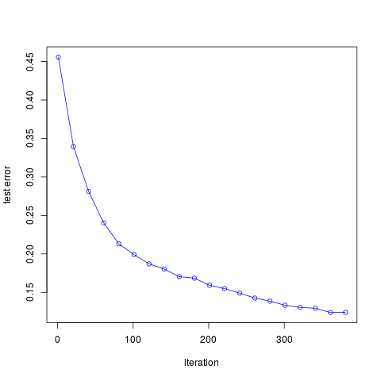

#  boosting方法

| 原文   | [The Elements of Statistical Learning](../book/The Elements of Statistical Learning.pdf) |
| ---- | ---------------------------------------- |
| 翻译   | szcf-weiya                               |
| 时间   | 2017-02-06                               |
| 更新   | 2017-08-26, 2018-01-02                               |

!!! note "更新笔记"
    @2017.08.26 很早以前，略读了杨灿学长的[《统计学习那些事》](https://cosx.org/2011/12/stories-about-statistical-learning/)，但其实没什么感受，因为当时也没看到boosting，对lasso了解也不多。而当我早早完成boosting的翻译后，又一直搁着没有再次阅读学长的文章。杨灿学长用风趣的笔墨从lasso和boosting的发展来看统计学习的那些事，个人觉得对于了解统计大佬们开创这些“绝世武功”的历史进程是很有帮助的。杨灿学长的[《昔日因，今日意》](https://cosx.org/2014/04/lmmandme)和[《那些年，我们一起追的 EB》](https://cosx.org/2012/05/chase-after-eb/)，我也是非常喜欢的，相信看了这么有趣的标题，不去拜读都不行啊hhh:grinning:在今年北京R会议上还听了杨灿学长的汇报，报告的主题也是跟boosting有关，当时还激动地跟他互动了一下，提了几个问题 :raised_hand:。也是从那时候才知道，杨灿学长原来还是校友。

boosting是在最近20年内提出的最有力的学习方法。最初是为了分类问题而设计的，但是我们将在这章中看到，它也可以很好地扩展到回归问题上。boosting的动机是集合许多弱学习的结果来得到有用的“committee”。从这点看boosting与bagging以及其他的基于committee的方式（8.8节）类似。然而，我们应该看到这种联系最多是表面上的，boosting在根本上存在不同。

我们以最流行的被称为“AdaBoost.M1”的boosting算法开始，这归功于Freund and Schapire (1997)。考虑两个类别的分类问题，输入变量编码为$Y\in\\{-1,1\\}$。给定预报向量$X$，分类器$G(X)$在二值$\\{-1,1\\}$中取一个值得到一个预测。在训练样本上的误差率是

$$
\overline{err}=\frac{1}{N}\sum\limits_{i=1}^NI(y_i\neq G(x_i))
$$

在未来预测值上的期望误差率为$E_{XY}I(Y\neq G(X))$

弱分类器是误差率仅仅比随机猜测要好一点的分类器。boosting的目的是依次对反复修改的数据引用弱分类器算法，因此得到弱分类器序列$G_m(x),m=1,2,\ldots,M$ 根据它们得到的预测再通过一个加权来得到最终的预测

$$
G(x)=\mathrm {sign}(\sum\limits_{m=1}^M\alpha_mG_m(x))\qquad (10.1)
$$

这里$\alpha_1,\alpha_2,\ldots,\alpha_M$通过boosting算法进行计算，它们对每个单独的$G_m(x)$的贡献度赋予权重。它们的作用是赋予分类器序列中更精确的分类器更大的影响力。图10.1显示了AdaBoost过程的概要图。

> 图10.1. AdaBoost的概要图。分类器在加权的数据集上进行训练，接着结合起来产生最终的预测。

在每步boosting的数据修改时，对每个训练观测$(x_i,y_i),i=1,2,\ldots,N$赋予权重$w_1,w_2,\ldots,w_N$。初始化所有的权重设为$w_i=1/N$，使得第一步以通常的方式对数据进行训练分类器。对每个接下来的迭代$m=2,3,\ldots,M$，单独修改观测的权重，然后将分类算法重新应用到加权观测值上。在第$m$步，上一步中被分类器$G_{m-1}(x)$的误分类的观测值增大了权重，而正确分类的观测值权重降低了。因此当迭代继续，很难正确分类的观测受到越来越大的影响。每个相继的分类器因此被强制集中在上一步误分类的训练数据上。

算法10.1显示了AdaBoost.M1算法的详细细节。当前的分类器$G_m(x)$由第2(a)行的加权观测值得到。在第2(b)行计算加权误差率。第2(c)行计算赋予$G_m(x)$的权重$\alpha_m$来得到最终的分类器$G(x)$(第3行)。每个观测的个体权重在第2(d)行进行更新。在导出序列中下一个分类器$G_{m+1}(x)$时，被分类器$G(x)$错误分类的观测值的权重被因子$exp(\alpha_m)$进行缩放以提高它们的相对影响。

在Firedman et al.(2000) 的工作中，AdaBoost.M1算法也称作“离散 AdaBoost”，因为基分类器$G_m(x)$返回一个离散的类别标签。如果基分类器返回实值预测（如映射到[-1,1]的概率），AdaBoost可以合适地修改（见Firedman et al. (2000) 的“Real AdaBoost”）

AdaBoost显著提高非常弱的分类器的效果的能力展现在图10.2中。特征$X_1,\ldots,X_{10}$是标准独立高斯分布，目标$Y$定义如下
$$
Y=
\left\{
\begin{array}{ll}
1&\text{if } \sum_{j=1}^{10}X_j^2>\chi_{10}^2(0.5)\\
-1 & \text{otherwise}
\end{array}
\right.
\qquad (10.2)
$$
这里$\chi_{10}^2(0.5)=9.34$是自由度为10的卡方随机变量的中位数（10个标准的高斯分布的平方和）。有2000个训练情形，每个类别大概有1000个情形，以及10000个测试观测值。这里的弱分类器仅仅是一个“stump”：含两个终止结点的分类树。仅仅对训练数据应用分类器会得到非常差的测试集误差率（45.8%），与50%的随机猜测相差不多。然而，当不断进行boosting迭代，误差率将稳定下降，直到400次迭代之后达到5.8%。因此，对这一简单的非常弱的分类器进行boosting，其预测误差率可以几乎降低四分之一。它也比单个的大规模分类树（误差率为24.7%）表现得要好。自从它的提出，有很多理论来解释AdaBoost能成功得到正确分类器。很多工作集中在用分类树作为“基学习者(base learner)”G(x)，改善经常是非常显著的。事实上，Breiman(NIPS Workshop，1996)将树的AdaBoost作为“世界上最好的现成分类器”(best off-the-shelf classifier in
the world)。这对于数据挖掘方面的应用尤其如此，本章的后面将更全面地讨论。

> 图10.2. （10.2）的模拟数据：对stumps进行boosting的测试误差率作为迭代次数的函数。图中也显示了单个stump和244个结点的分类树的测试误差率。

!!! note "weiya注"
    下面是用Julia语言实现的模拟
    
    得到结果如下所示
    
    可以发现，随着迭代次数的增加，误差率不断下降，与图10.2的结果是一致的。
    此外，还有一个[R语言实现的版本](https://github.com/szcf-weiya/ESL-CN/tree/master/code/boosting)，但是运行速度要比Julia的慢很多。

## 本章概要

下面是本章的概要：

- 我们展示AdaBoost对基学习器拟合加性模型，优化一个新的指数损失函数。这个损失函数与（负）二项分布对数概率（见10.2-10.4节）非常相似
- 指数损失函数的受欢迎的最小化证明是类别概率odds的对数（10.5节）
- 我们描述对于回归与分类的损失函数比平方误差或者指数损失更加稳定（10.6节）
- 有人认为决策树是boosting用于数据挖掘应用理想的基础学习者。（10.7和10.9节）
- 我们发展一类梯度增强模型（GBMs）,用于提升具有任何损失函数的树。（10.10节）
- 强调“慢学习”的重要性，并且通过对每个新加进模型的项进行收缩而实现（10.12节），以及随机化（10.12.2节）。
- 描述拟合模型的解释工具（10.13节）
