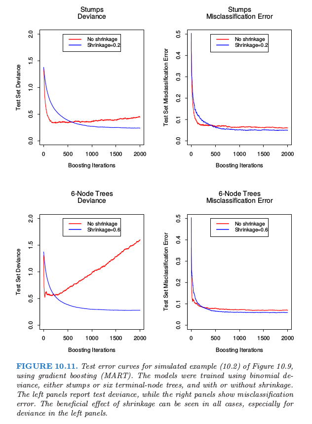

# 正则化

| 原文   | [The Elements of Statistical Learning](../book/The Elements of Statistical Learning.pdf) |
| ---- | ---------------------------------------- |
| 翻译   | szcf-weiya                               |
| 时间   | 2017-10-09                           |

除了候选树的大小$J$，梯度boosting的另一个元参数(meta-parameter)是boosting的迭代次数$M$。每一次迭代通常会降低训练风险$L(f_M)$，所以对于充分大的$M$，误差可以达到任意小。然而，对训练数据拟合得太好会导致过拟合，它会降低预测未来数据的效果。因此，存在一个最小话未来预测风险的最优$M^\*$，它依赖于具体应用。估计$M^\*$的一个方便方式是检测在验证样本上关于$M$的函数的预测风险。最小化风险的$M$值作为$M^\*$的一个估计。这类似于经常用在神经网络中的早停(early stopping)策略（11.4节）。

## 收缩

控制$M$的值并不是唯一正则化的策略。与岭回归和神经网络一样，也可以应用收缩策略（见3.4.1节和11.5节）。boosting中收缩最简单的实现方式是使用因子$0<\nu<1$来收缩每棵树的贡献。也就是，算法10.3的第2(d)行用下式代替

$$
f_m(x)=f_{m-1}(x)+\nu\cdot \sum\limits_{j=1}^J\gamma_{jm}I(x\in R_{jm})\qquad (10.41)
$$

参数$\nu$可以看成是控制boosting过程的学习速率。较小的$\nu$（更多的收缩）会导致同样大小的迭代次数$M$下更大的训练风险。因此，$\nu$和$M$都控制了训练数据的预测风险。然而，这些参数并不单独作用。对于同样的训练风险较小的$\nu$会导致较大的$M$，所以它们之间存在权衡。

经验上，(Friedman, 2001)已经发现较小的$\nu$会得到更好的测试误差，并且需要更大的$M$与之对应。事实上，最好的策略是将$\nu$设得很小($\nu<0.1$)，然后通过早停(early stopping)来选择$M$。这会给回归和概率估计带来重大的改善（与没有收缩时相比，$\nu=1$）。通过（10.20）式改善对应的误分类风险虽然很小，但是仍然显著。这个改善的代价是计算上的：较小的$\nu$得到较大的$M$，并且计算量与后者成比例。然而，将在下面看到，许多迭代的计算即使是在非常大的数据集上也是可行的。这部分也是因为在每一步生成的树是没有剪枝的。

图10.11显示了图10.2的模拟例子(10.2)的测试误差曲线。梯度boosted模型(MART)通过采用二项偏差来训练，分stump和6个终止结点树的情况讨论，以及分有无收缩进行讨论。收缩的好处是很显然的，特别是当跟踪二项偏差时。有了收缩，每个测试误差曲线达到较低的值，并且在许多迭代中保持不变。

16.2.1节将boosting的向前逐步收缩和为了正则化模型参数使用的$L_1$惩罚(lasso)联系起来。我们认为$L_1$惩罚可能会比用在一些方法（比如支持向量机）中的$L_2$惩罚要更好。

## 子采样

我们在8.7节看到bootstrap averaging (bagging) 通过averaging提高了噪声分类器的表现效果。第15章详细讨论了通过平均实现的降低方差的机制。我们也可以在gradient boosting中采用这一方法，同时提高了效果和计算效率。
