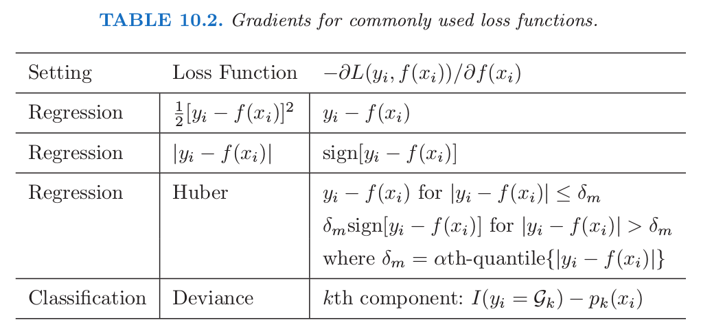
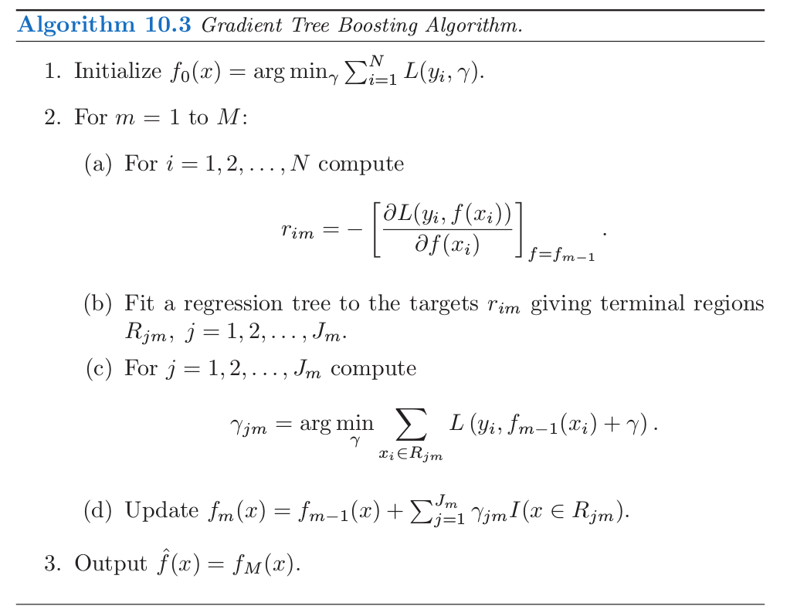

# 10.10 Gradient Boosting的数值优化

| 原文   | [The Elements of Statistical Learning](../book/The Elements of Statistical Learning.pdf) |
| ---- | ---------------------------------------- |
| 翻译   | szcf-weiya                               |
| 时间   | 2017-08-27                               |
| 更新   | 2019-08-30 09:39:19                               |
| 状态 | Done|

!!! note "Recall"
    $$
    \hat\Theta_m = \text{arg }\underset{\Theta_m}{\text{min}}\sum\limits_{i=1}^NL(y_i,f_{m-1}(x_i)+T(x_i;\Theta_m))\tag{10.29}\label{10.29}
    $$

采用任意可导损失准则的 \eqref{10.29} 的快速近似算法可以类比数值优化导出．在训练数据上用 $f(x)$ 来预测 $y$ 的损失为

$$
L(f) = \sum\limits_{i=1}^NL(y_i, f(x_i))\tag{10.33}\label{10.33}
$$

目标是最小化关于 $f$ 的函数 $L(f)$，其中 $f(x)$ 限定为树的和 \eqref{10.28}，

!!! note "Recall"
    $$
    f_M(x)=\sum\limits_{m=1}^MT(x;\Theta_m)\tag{10.28}\label{10.28}
    $$

忽略这个限定，最小化 \eqref{10.33} 可以看成数值优化

$$
\hat{\mathbf f} = \text{arg }\underset{\mathbf f}{\min}L(\mathbf f)\tag{10.34}\label{10.34}
$$

其中参数 $\mathbf f\in \IR^N$ 是在 $N$ 个数据点 $x_i$ 的近似的函数值 $f(x_i)$：

$$
\mathbf f=\{f(x_1),f(x_2),\ldots,f(x_N)\}^T
$$

数值优化过程是将 \eqref{10.34} 看成向量的和来求解

$$
\mathbf f_M=\sum\limits_{m=1}^M\mathbf h_m,\qquad \mathbf h_m\in \IR^N
$$

其中 $\mathbf f_0=\mathbf h_0$ 是初始化的猜测，接下来每个 $\mathbf f_m$ 基于当前的参数向量 $\mathbf f_{m-1}$（此前已经更新的和）导出．数值优化方法的区别在于它们采用不同的方法来计算每个增长向量 $\mathbf h_m$．

## 最速下降

**最速下降 (steepest descent)** 选择 $\mathbf h_m=-\rho_m \mathbf g_m$，其中 $\rho_m$ 为标量值，$\mathbf g_m\in \IR^N$ 是在 $\mathbf f=\mathbf f_{m-1}$ 取值的 $L(\mathbf f)$ 的梯度．$\mathbf g_m$ 的组分为

$$
g_{im}=\Big[\frac{\partial L(y_i, f(x_i))}{\partial f(x_i)} \Big]_{f(x_i)=f_{m-1}(x_i)}\tag{10.35}\label{10.35}
$$

**步长 (step length)** $\rho_m$ 是下式的解
$$
\rho_m = \text{arg }\underset{\rho}{\text{min}}L(\mathbf f_{m-1}-\rho \mathbf g_m)\tag{10.36}\label{10.36}
$$
当前的解则更新为

$$
\mathbf f_m = \mathbf f_{m-1}-\rho_m\mathbf g_m
$$

这个过程一直重复直到下一次迭代．最速下降可以看成是非常贪婪的策略，因为 $-\mathbf g_m$ 是 $\IR^N$ 空间中 $L(\mathbf f)$ 在 $\mathbf f= \mathbf f_{m-1}$ 处最速下降的局部方向．

## Gradient Boosting

**Forward stagewise boosting**（算法 10.2）也是非常贪婪的策略．每一步中，在给定当前模型 $f_{m-1}$ 以及其拟合值 $f_{m-1}(x_i)$ 下，得到的解是在最大程度上降低 \eqref{10.29} 的树．

因此，树的预测值 $T(x_i;\Theta_m)$ 与负梯度 \eqref{10.35} 的组分类似．本质区别在于树的组分 $\mathbf t_m=\\{T(x_1;\Theta_m),\ldots,T(x_N;\Theta_m)\\}$ 不是独立的．它们限定为终止结点个数为 $J_m$ 的树的预测值，然而负梯度是没有任何限制的最速下降方向．

!!! note "Recall"
    $$
    \hat \gamma_{jm}=\text{arg }\underset{\gamma_{jm}}{\text{min}}\sum\limits_{x_i\in R_{jm}}L(y_i,f_{m-1}(x_i)+\gamma_{jm})\tag{10.30}\label{10.30}
    $$

向前逐步方法中 \eqref{10.30} 的解类似于在最速下降方向对 \eqref{10.36} 进行 **线搜索(line search)**．区别在于 \eqref{10.30} 中对  $\mathbf t_m$ 的组分进行单独的线搜索，这里的组分是对应每个单独的终止结点 $\\{T(x_i;\Theta_m)\\}\_{x_i\in R_{jm}}$，换句话说，就是对每个终止结点应用一次线搜索．

如果在训练数据上最小化损失 \eqref{10.33} 是唯一的目标，则最速下降是更好的策略．梯度 \eqref{10.35} 对于任意可导的损失函数 $L(y,f(x))$ 是很容易计算的，然而对于 [10.6 节](10.6-Loss-Functions-and-Robustness/index.html)中讨论的鲁棒的准则来求解 \eqref{10.29} 是很困难的．很不幸的是梯度 \eqref{10.35} 仅仅在训练数据点 $x_i$ 处有定义，然而最终的目标是将 $f_M(x)$ 一般化到新数据，而不是仅仅是出现在训练集中的数据．

解决这个困境的一种可能方案是在第 $m$ 次迭代中构造 $T(x;\Theta_m)$，其预测值 $\mathbf t_m$ 与负梯度尽可能接近．采用平方误差来衡量近似程度，则有

$$
\hat\Theta_m = \text{arg }\underset{\Theta}{\text{min}}\sum\limits_{i=1}^N(-g_{im}-T(x_i;\Theta))^2\tag{10.37}\label{10.37}
$$

也就是，用最小二乘对负梯度值 \eqref{10.35} 进行拟合．如 [10.9 节](10.9-Boosting-Trees/index.html)提到的，对于最小二乘决策树生长(induction)存在快速算法．尽管 \eqref{10.37} 的解 $\hat R_{jm}$ 会与求解 \eqref{10.29} 得到的 $R_{jm}$ 不同，但一般而言它们已经足够近似来实现同样的目的．在任何情形下，向前逐步 boosting 过程，自上而下决策树生长(induction)，都是近似过程．当构造完树 \eqref{10.37}，对应的每个区域的常数值由 \eqref{10.30} 给出．

表 10.2 总结了通常使用的损失函数的梯度．对于平方误差损失，负梯度恰恰是普通的残差 $-g_{im}=y_i-f_{m-1}(x_i)$，所以 \eqref{10.37} 等价于标准的最小二乘 boosting．在绝对值损失下，负梯度为残差的符号，所以在每次迭代，\eqref{10.37} 利用最小二乘对当前的残差的符号进行拟合．对于 Huber M-回归，负梯度是这两者的综合（详见表 10.2）．

对于分类，损失函数是多项偏差

$$
\begin{align*}
L(y,p(x))&=-\sum\limits_{k=1}^KI(y=\cal G_k)\log p_k(x)\\
&=-\sum\limits_{k=1}^KI(y={\cal G_k})f_k(x)+\log \left(\sum\limits_{\ell=1}^Ke^{f_\ell(x)}\right)
\end{align*}
$$

并且在每次迭代过程中构造 $K$ 个最小二乘树．每个树 $T_{km}$ 是对各自负梯度向量 $g_{km}$ 的拟合，

$$
\begin{align}
-g_{ikm} &= \Big[\frac{\partial L(y_i, f_1(x_i),\ldots, f_K(x_i))}{\partial f_k(x_i)}\Big]_{\mathbf f(x_i)=\mathbf f_{m-1}(x_i)}\notag\\
&=I(y_i={\cal G_k})-p_k(x_i)\tag{10.38}\label{10.38}
\end{align}
$$

其中 $p_k(x)$ 由 \eqref{10.21} 给出．尽管在每次迭代时，构造 $K$ 个独立的树，但是它们通过式 \eqref{10.21} 关联起来．

!!! note "weiya 注：Recall"
    $$
    p_k(x) = \frac{e^{f_k(x)}}{\sum_{\ell=1}^Ke^{f_\ell(x)}}\tag{10.21}\label{10.21}
    $$

对于二值分类($K=2$)，仅仅需要一棵树．

!!! note "weiya注"
    对于二值分类，多项式偏差简单化为逻辑斯蒂损失函数
    考虑
    $$
    z = logit(p) = log\frac{p}{1-p}
    $$
    我们有$p=\frac{1}{1+e^{-z}}$，则二项分布似然函数为
    $$
    f=p^y(1-p)^{1-y},\; y=0,1
    $$
    其负对数似然为
    $$
    L(p, y) = -log(f)=-(y\mathrm{log}p+(1-y)\mathrm{log}(1-p))
    $$
    也称为logit损失函数．
    logit损失函数的负梯度为
    $$
    -\frac{y-p}{p(1-p)}
    $$

<!--
将上述几种损失函数及其梯度用如下的Julia程序表达出来．

-->

!!! info
    笔记[损失函数的梯度总结及Julia实现](../notes/boosting/summary-loss-function/index.html)用Julia表达了表10.2中的各个损失函数及其梯度．

## Gradient Boosting 的实现

上图中的算法 10.3 展示了用于回归的 **gradient tree-boosting** 的通用算法．特定的算法可以通过插入不同的损失准则 $L(y, f(x))$ 得到．算法第一行初始化为最优的常数模型，也就是单终止结点的树．第 $2(a)$ 行的负梯度计算的组分被称为广义残差或 **伪残差(pseudo residuals)**，$r$．通常使用的损失函数的梯度已经总结在表 10.2 中．

用于分类的算法是类似的．第 $2(a)$-$(d)$ 行每次迭代时重复 $K$ 次，每次对每个类用 \eqref{10.38} 计算负梯度．第 3 行的结果是 $K$ 个不同的树的展开 $f_{kM}(x), k=1,2,\ldots, K$．这通过 \eqref{10.21} 得到概率或者像 \eqref{10.20} 一样做分类．

!!! note "weiya 注：Recall"
    $$
    G(x)={\cal G_k}\;\text{where }k=\mathrm{arg}\;\underset{\ell}{\mathrm{max}}p_\ell(x)\tag{10.20}\label{10.20}
    $$

细节在[练习 10.9](https://github.com/szcf-weiya/ESL-CN/issues/76)中给出，两个基本的调整参数为迭代次数 $M$ 和每个组分树的大小 $J_m,m=1,2\ldots,M$.

这个算法原始实现称为 MART，指的是“**多重可加回归树(multiple additive regression trees)**”．这章中很多图是用 MART 得到的．这里描述的**gradient boosting** 在 `R` 语言的 `gbm` 包中有实现(Ridgeway, 1999[^1], “Gradient Boosted Models”)，可以免费使用．[10.14.2 节](10.14-Illustrations/index.html)中用了`gbm`包，在[第 16 章](16.1-Introduction/index.html)和[第 15 章](15.1-Introduction/index.html)有详细介绍．另外，还有个 boosting 算法的 `R` 语言实现是 `mboost`(Hothorn and Bühlmann, 2006[^2])．有个 gradient boosting/MART 的商业实现称为 TreeNet (Salford Systems, Inc.)

[^1]: Ridgeway, G. (1999). The state of boosting, Computing Science and Statistics 31: 172–181.
[^2]: Hothorn, T. and B¨uhlmann, P. (2006). Model-based boosting in high dimensions, Bioinformatics 22(22): 2828–2829.