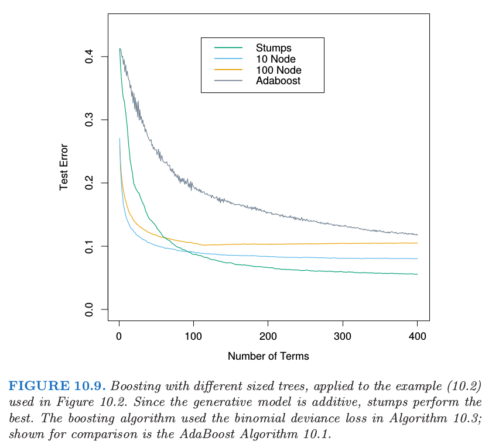
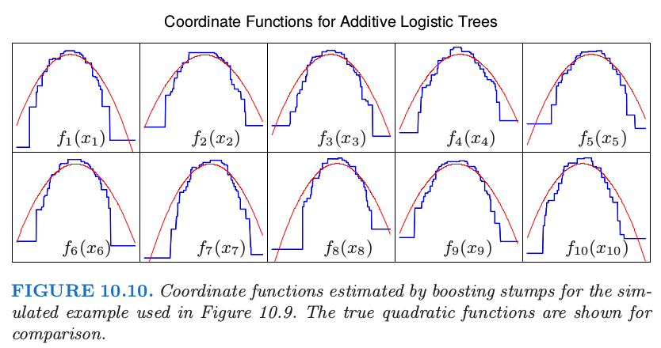

# 10.11 大小合适的boosting树

| 原文   | [The Elements of Statistical Learning](../book/The Elements of Statistical Learning.pdf) |
| ---- | ---------------------------------------- |
| 翻译   | szcf-weiya                               |
| 时间   | 2017-10-07 & 2017-10-08  &   2017-10-09                           |
| 更新   | 2018-03-01                               |
| 状态 | Done|

曾经，boosting被认为是一种将模型结合起来(combing models)的技巧，在这里模型是树．同样地，生成树的算法可看成是产生用于boosting进行结合的模型的**原型(primitive)**．这种情形下，在生成树的时候以通常的方式分别估计每棵树的最优大小（9.2节）．首先诱导出非常大（过大的）的一棵树，接着应用自下而上的过程剪枝得到估计的最优终止结点个数的树．这种方式隐含地假设了每棵树是式(10.28)中的最后一棵．

!!! note "Recall"
    $$
    f_M(x)=\sum\limits_{m=1}^MT(x;\Theta_m)\tag{10.28}
    $$, 详见10.9节．

除了真正的最后一棵树，这显然是个很差的假设．结果导致树都趋向于很大，特别是前几步迭代中．这显著降低了模型的效果，并且增大了计算量．

避免这个问题最简单的策略是将所有树限制为相同的大小， $J_m=J\forall m$．在每次迭代中，得到$J$个终止结点的回归树．因此$J$成为了整个boosting过程的**元参数(meta-parameter)**，根据手头上的数据来调整该参数以期最大化估计的效果．

可以考虑下式的**目标函数(target function)**的性质来得到$J$的有用值

$$
\eta = \mathrm{arg }\;\underset{f}{\mathrm{min}} E_{XY}L(Y, f(X))\tag{10.39}
$$

这里期望值是对$(X,Y)$的总体联合分布而言．目标函数$\eta(x)$是在未来数据上有最小预测风险的函数．这是我们试图近似的函数．

$\eta(X)$一个相关的性质是坐标变量$X^T=(X_1,X_2,\ldots, X_p)$间交叉项的阶．这个可以通过它的ANOVA展开式得到

$$
\eta(X)=\sum\limits_{j}\eta_j(X_j)+\sum\limits_{jk}\eta_{jk}(X_j,X_k)+\sum\limits_{jkl}\eta_{jkl}(X_j,X_k, X_l)+\cdots\tag{10.40}
$$

式子(10.40)中的第一项是只有一个预测变量$X_j$的函数和．这些函数$\eta_j(X_j)$是在所采用的误差损失准则下联合起来最能近似$\eta(X)$的项．每一个$\eta_j(X_j)$称为$X_j$的主影响．式中第二项是那些加入到主影响中将$\eta(X)$拟合得最好的含两个变量的函数．这些函数被称为每个变量对$(X_j,X_k)$的二阶交叉项．式中第三项表示三阶交叉项，以此类推．对于许多实际的问题，低阶交叉影响占主要地位．如果模型得到强烈的高阶交叉影响，比如大型的决策树，则可能正确性不好．

基于树的近似的交叉性阶数被树的大小$J$所限制．也就是，不存在大于$J-1$阶数的交叉项．因为(10.28)的boosted模型关于树是可加的，这个限制对于它也适用．$J=2$时（单个分割点的“decision stump”），则只能得到仅主影响的boosted模型，其中不允许有交叉项．当$J=3$时，可以允许有含两个变量的交叉项，以此类推．这表明选择的$J$值应该反映$\eta(x)$占优势的交叉项的阶数．当然这在一般情形下是未知的，但是在大部分情况下往往很低．

图10.9说明了交叉项阶数（$J$的选择）在仿真例子(10.2)上的影响．生成函数是可加的（二次单项式的和），所以$J>2$的boosting模型产生多余的方差，也因此更高的测试误差．图10.10比较了用真实函数构造的boosted stump的坐标函数．

尽管在很多应用中，$J=2$是不够的，但也不太可能要求$J>10$．经验表明$4\le J\le 8$在boosting的情况下会取得很好的效果，这个范围内的具体取值对结果的影响并不敏感．我们可以通过尝试不同的值，然后选择一个在验证样本上低风险的$J$值．然而，使用$J\simeq 6$并不能得到显著的改善．
