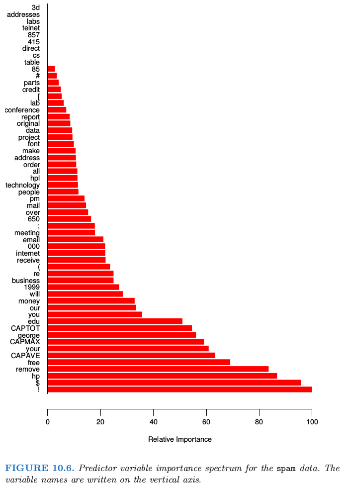

# 10.13 解释性

| 原文   | [The Elements of Statistical Learning](../book/The Elements of Statistical Learning.pdf#page=386) |
| ---- | ---------------------------------------- |
| 翻译   | szcf-weiya                               |
| 时间   | 2017-10-09, 2018-12-28                           |
|状态| Done

单个决策树有着很高的解释性。整个模型可以用简单的二维图象（二叉树）完整地表示，其中二叉树也很容易可视化。树的线性组合 (10.28) 丢失了这条重要的特性，所以必须考虑用不同的方式来解释。

## 预测变量的相对重要性

在数据挖掘应用中，输入的预测变量与响应变量的相关程度很少是相等的。通常只有一小部分会对响应变量有显著的影响，而绝大部分的变量是不相关的，并且可以简单地不用包含进模型。研究每个输入变量在预测响应变量时的相关重要度或者贡献是很有用的。

对于单个决策树 $T$，Breiman et al. (1984)[^1] 提出

$$
{\cal I}_\ell^2(T) = \sum_{t=1}^{J-1}\hat\iota^2_tI(v(t)=\ell)\tag{10.42}
$$

来作为每个预测变量 $X_\ell$ 相关性的度量。这个求和是对于树的 $J-1$ 个中间结点进行的。在每个这样的结点 $t$，其中一个输入变量 $X_{v(t)}$ 将与这个结点相关的区域分成两个子区域；每一个子区域用单独的常值拟合响应变量。输入变量的选择要使得在整个区域上的常值拟合在平方误差损失下有最大的“改善” $\hat\iota_t^2$。变量 $X_\ell$ 的 **平方相对重要度 (squared relative importance)** 是在所有的结点中，选择其作为分离变量时“改善”的平方之和。

[^1]: Breiman, L., Friedman, J., Olshen, R. and Stone, C. (1984). Classification and Regression Trees, Wadsworth, New York.

这个重要度度量可以很简单地推广到可加树的展开 (10.28)；简单地对树进行平均

$$
{\cal I}_\ell^2 = \frac 1M \sum_{m=1}^M {\cal I}_\ell^2(T_m)\tag{10.43}
$$

考虑到平均的标准化影响，这个度量会比单个树对应的度量 (10.42) 更稳定。而且，由于收缩效应 （[10.12.1 节](10.12-Regularization/index.html)），重要变量被与之高相关的其他变量掩盖掉 (mask) 也不再是个问题。注意到 (10.42) 和 (10.43) 对应平方相关度；真正的相关度是其平方根。因为这些度量是相对的，习惯性对最相关的变量赋值 100 并且相应地缩放其他变量相关度。图 10.6 展示了在预测 `spam` 和 `email` 时 57 个输入变量的相关重要度。

对于 $K$ 分类问题，有 $K$ 个单独的模型 $f_k(x),k=1,2,\ldots,K$，每一个由树的和构成

$$
f_k(x)=\sum_{m=1}^MT_{km}(x)\tag{10.44}
$$

在这个情形中，(10.43) 推广为

$$
{\cal I}_{\ell k}^2=\frac 1M\sum_{m=1}^M{\cal I}^2(T_{km})\,.\tag{10.45}
$$

这里 $\calI_{\ell k}$ 是 $X_\ell$ 将类别 $k$ 从其他类别分离出来的相对重要度。$X_\ell$ 整体重要度通过对所有的类别进行平均得到

$$
\calI_{\ell}^2 =\frac 1K\sum_{k=1}^K{\cal I}_{\ell k}^2\tag{10.46}
$$

图 10.23 和 10.24 图示了这些平均的以及单独的相关重要度的用法。

## 偏相依性图

当确定出最相关的变量，下一步则是理解 $f(X)$ 在他们联合值上近似时依赖性的本质。$f(X)$ 的图象渲染作为其参数的函数提供了其对输入变量的联合值的依赖性的全面总结。

不幸的是，任何可视化都会受到低维视角的限制。我们可以简单地通过各种不同的方式呈现出函数的一个或两个参数，无论是连续还是离散（又或者混合的）；这本书充满了这样的图象。维度稍微高点的函数可以通过给定除一个或两个参数以外的参数值，画出 **网格 (trellis)** 图 (Becker et al., 1996[^2]).

[^2]: Becker, R., Cleveland, W. and Shyu, M. (1996). The visual design and control of trellis display, Journal of Computational and Graphical Statistics 5: 123–155.

!!! note "原书脚注：trellis of plots"  
    R 中的 `lattice`.

对于超过两个或三个变量，可视化对应高维度参数的函数变得更困难了。有时采用的一个有用的替代方法是用一系列图，每张图展示了近似的 $f(X)$ 在所选的小的输入变量集上的 **偏相依性 (partial dependence)**。尽管这样一系列的图很少对这个近似进行全面的描述，但是它经常能够给出有用的线索，特别是当 $f(x)$ 被低阶的交叉项 (10.40) 控制时。

考虑输入预测变量 $X^T=(X_1,X_2,\ldots,X_p)$ 大小为 $\ell < p$ 的子向量 $X_{\cal S}$，其中 $S\subset\{1,2,\ldots,p\}$。令 $\cal C$ 是其补集，即 ${\cal S}\cup {\cal C} = \{1,2,\ldots,p\}$。一般的函数 $f(X)$ 原则上会依赖所有的输入变量：$f(X)=f(X_{\cal S}, X_{\cal C})$。定义 $f(X)$ 在 $X_{\cal S}$ 上的平均或者 **偏 (partial)** 相依性为

$$
f_S(X_S)=\E_{X_{\cal C}}f(X_{\cal S}, X_{\cal C})\tag{10.47}
$$

这是 $f$ 的 **边缘平均 (marginal average)**，当 $X_{\cal S}$ 中的变量与 $X_{\cal C}$ 中的变量没有很强的相关性时，这可以看成所选的子集在 $f(X)$ 上影响的一个有用的描述。

偏相依函数可以用来解释任何“黑箱”学习方法的结果。它们可以通过下式估计，

$$
\bar f_{\cal S}(X_{\cal S}) = \frac 1N\sum_{i=1}^Nf(X_{\cal S},x_{iC})\tag{10.48}
$$

其中 $\\{x_{1\calC}, x_{2\calC},\ldots,x_{N\calC}\\}$ 是 $X_{\calC}$ 出现在训练数据中的值。对于每个联合值 $X_{\calS}$，当需要计算 $\bar f_{\calS}(X_{\calS})$ 时，要求一次数据传递。即使对于中等大小的数据集，这可以变成计算密集型。幸运的是，对于决策树，可以不引用数据而快速的计算 $\bar f_\calS(X_\calS)$（[练习 10.11](https://github.com/szcf-weiya/ESL-CN/issues/168)）。

一个很重要需要注意的点是，(10.47) 的偏相依性函数是考虑完其他变量 $X_{\calC}$ 在 $f(X)$ 上的（平均）影响之后 $X_\calS$ 再在 $f(X)$ 上的影响。它们 **不是** $X_{\cal S}$ 忽略掉 $X_\calC$ 的影响后直接对 $f(X)$ 的影响。后者由条件期望给出

$$
\tilde f_\calS(X_\calS) = \E(f(X_\calS, X_\calC)\mid X_\calS)\tag{10.49}
$$

并且这是仅用关于 $X_\calS$ 的函数得到的对 $f(X)$ 的最优最小二乘近似。$\tilde f_\calS(X_\calS)$ 和 $\bar f_\calS(X_\calS)$ 仅仅当 $X_\calS$ 和 $X_\calC$ 独立时才相等，但这种情形是非常不可能的。举个例子，如果所选变量子集的影响恰好是 **纯可加的 (purely additive)**，

$$
f(X)=h_1(X_\calS) + h_2(X_\calC)\tag{10.50}
$$

则 (10.47) 在忽略一个可加常数意义下，能得到 $h_1(X_\calS)$。如果影响是 **纯可乘的 (purely multiplicative)**,

$$
f(X)=h_1(X_\calS)\cdot h_2(X_\calC)\tag{10.51}
$$

则 (10.47) 在忽略一个可乘常因子意义下，能得到 $h_1(X_\calS)$。另一方面，两种情形下 (10.49) 都不会得到 $h_1(X_\calS)$。事实上，当 $f(X)$ 根本没有依赖性时，(10.49) 可以在变量子集上产生强影响。

查看 boosted-tree (10.28) 在所选变量子集上的偏相依性的图可以帮助提供它性质的一个定量描述。例子在 [10.8 节](10.8-Spam-Data/index.html)和 [10.14 节]()中有呈现。由于计算机图象以及人类感知的限制，子集 $X_\calS$ 的大小必须很小（$\ell\approx 1,2,3$）。显然这里有许多这样的子集，但是只有那些从很少的强相关性变量中选出的子集才是更有信息量的。另外，那些在 $f(X)$ 上的影响近似是可加的 (10.50) 或可乘的 (10.51) 会变得更有启示作用。

对于 $K$ 分类，有 $K$ 个单独的模型 (10.44)，每个类别有一个。每一个模型通过

$$
f_k(X) = \log p_k(X) -\frac 1K \sum_{l=1}^K\log p_l(X)\tag{10.52}
$$

将其与各自的概率 (10.21) 联系起来。因此每个 $f_k(X)$ 是在对数尺度下，是其概率的单调递增函数。每个 $f_k(X)$ (10.44) 在其最相关的变量 (10.45) 的偏相依性图可以帮助揭示 **对数几率 (log-odds)** 是怎么表现出类别依赖于其对应的输入变量。

