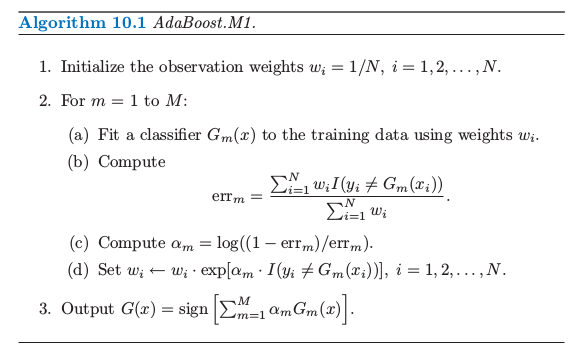
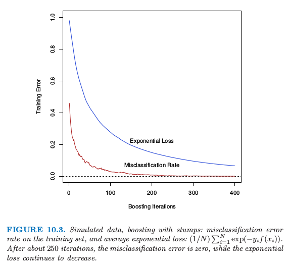
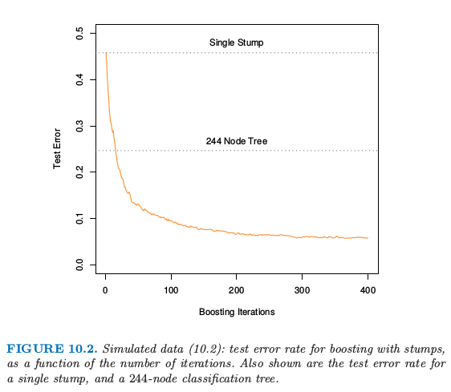

# 10.4 指数损失和AdaBoost

| 原文   | [The Elements of Statistical Learning](../book/The Elements of Statistical Learning.pdf) |
| ---- | ---------------------------------------- |
| 翻译   | szcf-weiya                               |
| 时间   | 2017-02-06                               |
| 更新   | 2018-02-28, 2018-05-17@xinyu-intel                               |
| 状态 | Done|

我们现在证明AdaBoost.M1算法（算法10.1）等价于使用下列损失函数的向前逐步加法建模
$$
L(y,f(x))=\exp(-yf(x))\qquad (10.8)
$$
这个准则的合理性将在下一节中讨论

<!--
!!! note "weiya注：Recall"
    

-->

AdaBoost基函数是单个分类器$G_m(x)\in \\{-1,1\\}$。采用指数损失函数，需要在每一步求解下面优化问题得到需要加入到模型的分类器$G_m$和对应的系数$\beta_m$。
$$
(\beta_m,G_m)=\mathrm{arg}\;\underset{\beta,G}{\mathrm {min}}\sum\limits_{i=1}^N\exp[-y_i(f_{m-1}(x_i)+\beta G(x_i))]
$$
上式可以写成
$$
(\beta_m,G_m)=\mathrm{arg}\;\underset{\beta, G}{\mathrm{min}}\sum\limits_{i=1}^Nw_i^{(m)}\exp(-\beta y_iG(x_i))\qquad (10.9)
$$
其中，$w^{(m)}\_i=\exp(-y\_if_{m-1}(x))$。因为每个$w^{(m)}\_i$既不依赖$\beta$也不依赖$G(x)$，可以看成是应用到每个观测上的权重。权重取决于$f_{m-1}(x_i)$，因此个体的权重值随着迭代次数$m$而变化。

(10.9)式的解可以通过两步得到。首先，对于任意$\beta > 0$，(10.9)式$G_m(x)$的解为
$$
G_m=\mathrm{arg}\;\underset{G}{\mathrm{min}}\sum\limits_{i=1}^Nw_i^{(m)}I(y_i\neq G(x_i))\qquad (10.10)
$$
这是使得在预测$y$时加权误差率最小化的分类器。这个可以通过将（10.9）的准则表达成下式看出来
$$
e^{-\beta}\sum\limits_{y_i=G(x_i)}w_i^{(m)}+e^\beta\sum\limits_{y_i\neq G(x_i)}w_i^{(m)}
$$

进一步，这个也可以写成
$$
(e^{\beta}-e^{-\beta})\sum\limits_{i=1}^Nw_i^{(m)}I(y_i\neq G(x_i)) + e^{-\beta}\sum\limits_{i=1}^Nw_i^{(m)}\qquad (10.11)
$$

!!! note "weiya注：求解$G_m$"
    因为此处$G_m(x)\in\\{-1,1\\}$，则当$y_i=G_i(x)$时，$y_iG_i(x)=1$，否则$y_iG_i(x)=-1$。从式(10.11)显然可以看出(10.10)是$G_m(x)$的解。

将$G_m$代入到（10.9)，可以求解$\beta$
$$
\beta_m=\frac{1}{2}\log\frac{1-\err_m}{\err_m}\qquad （10.12）
$$
其中$\err_m$为最小化的加权误差率
$$
\err_m=\frac{\sum_{i=1}^N w_i^{(m)}I(y_i\neq G_m(x_i))}{\sum_{i=1}^Nw_i^{(m)}}\qquad (10.13)
$$

!!! note "weiya注：求解$\beta_m$"
    求解关于$\beta$的函数的最小值，于是对(10.11)关于$\beta$求导并令导数等于0。

由近似过程更新
$$
f_m(x)=f_{m-1}(x)+\beta_mG_m(x)
$$
导出下一次迭代的权重为
$$
w_i^{(m+1)}=w_i^{(m)}\cdot e^{-\beta_my_iG_m(x_i)}\qquad (10.14)
$$
使用$-y_iG_m(x_i)=2\cdot I(y_i\neq G_m(x_i))-1$的事实，（10.14）式变成
$$
w_i^{(m+1)}=w_i^{(m)}\cdot e^{\alpha_mI(y_i\neq G_m(x_i))}\cdot e^{-\beta_m}\qquad (10.15)
$$
其中$\alpha_m=2\beta_m$在AdaBoost.M1算法（算法10.1）中第2(c)行定义的常数。(10.15)式的因子$e^{-\beta_m}$对所有的权重都乘以同样的值，所以没有影响。因此(10.15)等价于算法10.1中的第2(d)行。

我们可以把AdaBoost.M1算法的第2(a)行看成近似求解(10.11)最小化问题的方法，从而得到(10.10)式。因此我们将AdaBoost.M1总结为通过向前逐步加法建模方式来最小化指数损失函数。

> 图10.3. stump的增强的模拟数据：训练集上的误分类误差率，以及平均指数损失：$(1/N)\sum_{i=1}^Nexp(-y_if(x_i))$。经过大约250次迭代之后，误分类误差率为0，而指数损失继续下降。

图10.3显示了图10.2中的模拟数据问题(10.2)的训练集误分类错误率和平均指数损失。训练集误分类错误率在大概250次迭代时下降为0且保持不变。但是指数损失保持下降。注意到在图10.2中测试集误分类误差率在250次迭代之后继续改善。显然AdaBoost不再优化训练集的误分类误差；指数损失对与估计类别概率的变化更加敏感。

!!! question
    如何理解最后一句话，原文“ Clearly Adaboost is not optimizing trainingset misclassification error; the exponential loss is more sensitive to changes in the estimated class probabilitie.”

<!--

> 图10.2. （10.2）的模拟数据：对stumps进行boosting的测试误差率作为迭代次数的函数。图中也显示了单个stump和244个结点的分类树的测试误差率。
-->

