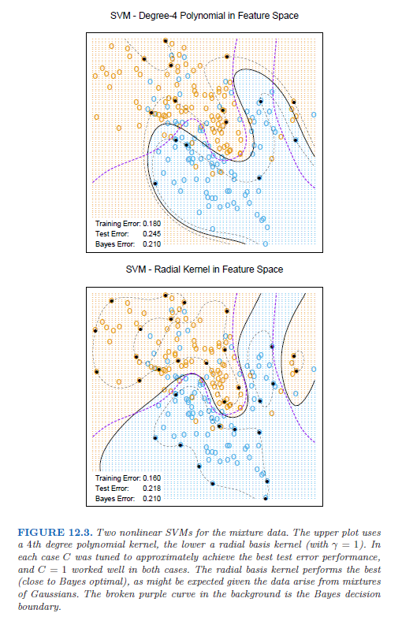
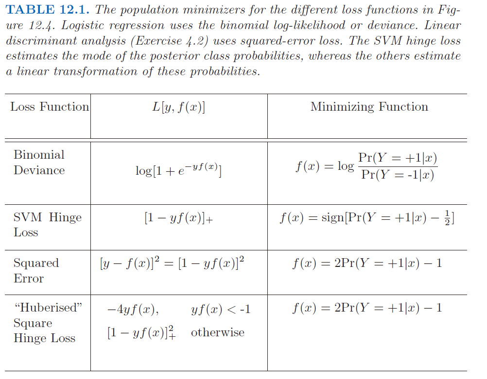

# 支持向量机和核

| 原文   | [The Elements of Statistical Learning](../book/The Elements of Statistical Learning.pdf) |
| ---- | ---------------------------------------- |
| 翻译   | szcf-weiya                               |
| 时间   | 2016-12-19:2016-12-20                   |
| 更新|2017.12.12 |

至今所描述的支持向量机是在输入特征空间中寻找线性边界。通过其他的线性方法，我们可以用基展开的方式来增大特征空间，从而让这一过程更灵活，如多项式或者样条（第5章）。一般地，在增长的空间的线性边界能够达到更好的训练类别分割，从而转换为原始空间中的非线性边界。一旦基函数$h_m(x),m=1,\ldots,M$被选定，则该过程和之前一样。我们采用输入特征$h(x_i)=(h_1(x_i),h_2(x_i),\ldots,h_M(x_i)),i=1,\ldots,N$来拟合SV分类器，并且得到（非线性）函数$\hat f(x)=h(x)^T\hat\beta+\hat\beta_0$。分类器和之前一样为$\hat G(x)=sign(\hat f(x))$.

支持向量机分类器是这个想法的拓展，其中增长空间的维数允许非常大，有时甚至可以是无限维的。似乎计算会变得难以承受。而且似乎当有了充分多的基函数，数据会变得可分，而且会发生过拟合。我们首先介绍SVM怎样处理这些问题。接着我们将看到实际中SVM分类器是采用特定的准则和正则化形式来求解函数拟合问题，而且这是包含第5章中光滑样条的更大类别的问题的一部分。读者可能希望参照5.8节，它提供了背景材料以及与接下来的两节会有一定的重复。

## 用于分类的SVM

我们可以以一种特殊的方式来表示优化问题(12.9)和它的解，这种方式只涉及通过内积来涉及输入特征。我们对这个变换后的特征向量$h(x_i)$直接进行这样的操作。则我们将看到对于特定选择的$h$，这些内积可以很方便地进行计算。

(12.13)的lagrange对偶函数有如下形式：

$$
L_D=\sum\limits_{i=1}^N\alpha_i-\frac{1}{2}\sum\limits_{i=1}^N\sum\limits_{i'=1}^N\alpha_i\alpha_{i'}y_iy_{i'}\langle h(x_i), h(x_{i'})\rangle\qquad (12.19)
$$

从(12.10)中我们可以看到解函数$f(x)$可以写成

$$
f(x)=h(x)^T\beta+\beta_0=\sum\limits_{i=1}^N\alpha_iy_i\langle h(x),h(x_i) \rangle+\beta_0\qquad (12.20)
$$

和之前一样，给定$\alpha_i$，当$0<\alpha_i<C$时，$\beta_0$可以通过对任意（或所有）$x_i$来求解$y_if(x_i)=1$

所以(12.19)和(12.20)仅仅通过内积涉及$h(x)$。实际上，我们根本不需要明确变换关系$h(x)$，而仅仅要求知道在转换后的空间中计算内积的核函数

$$
K(x,x')=\langle h(x), h(x') \rangle\qquad (12.21)
$$

$K$应该是一个对称的(半)正定函数：见5.8.1节。

在SVM中有三种流行的$K$可以选择

- $d$阶多项式：$K(x,x')=(1+\langle x,x' \rangle)^d$
- 径向基: $K(x, x')=exp(-\gamma \Vert x-x'\Vert^2)$\qquad (12.22)
- 神经网络：$K(x,x')=tanh(\kappa_1\langle x,x' \rangle+\kappa_2)$

考虑到含有两个输入变量$X_1$和$X_2$的特征空间，以及2阶的多项式。则

$$
\begin{array}{ll}
K(x,x')&=(1+\langle X,X' \rangle)^2\\
&=(1+X_1X_1'+X_2X_2')^2\\
&=1+2X_1X_1'+2X_2X_2'+(X_1X_1')^2+(X_2X_2')^2+2X_1X_1'X_2X_2'\quad (12.23)
\end{array}
$$

则$M=6$，而且如果我们选择$h_1(X)=1,h_2(X)=\sqrt{2}X_1,h_3(X)=\sqrt{2}X_2,h_4(X)=X_1^2,h_5(X)=X_2^2$，以及$h_6(X)=\sqrt{2}X_1X_2$，则$K(X,X')=\langle h(X),h(X')\rangle$

从$(12.20)$我们可以看出该解可以写成

$$
\hat f(x)=\sum\limits_{i=1}^N\hat \alpha_iy_iK(x,x_i)+\hat\beta_0\qquad (12.24)
$$

在增广的特征空间中，参数$C$的角色更加清晰，因为在这里经常会存在完美的分割。较大的$C$会抑制任何正的$\xi_i$，并且在原始特征空间中过拟合的弯弯曲曲的边界；较小的$C$值会鼓励较小的$\Vert\beta\Vert$，反过来会导致$f(x)$以及边界更加地光滑。图12.3显示了应用到第2章中的混合模型的两个支持向量机。两种情形下的正则化参数都是为了实现更好的测试误差。对该例子而言，径向基得到类似贝叶斯最优边界；与图2.5进行比较。

在支持向量的早期研究中，有断言称，支持向量机的核性质是唯一的，并且允许对维数灾难进行巧妙地处理。

这些断言都不是正确的，我们将在下一节详细讨论这些问题。

## SVM作为惩罚的方法

对于$f(x)=h(x)^T\beta+\beta_0$，考虑下列的优化问题

$$
\underset{\beta_0,\beta}{min}\sum\limits_{i=1}^N[1-y_if(x_i)]_++\frac{2}{\lambda}\Vert\beta\Vert^2\qquad (12.25)
$$

其中下标$+$表示正的部分。上式是“损失+惩罚”的形式，这在函数估计中是个很熟悉的范例。可以很简单地证明当$\lambda=1/C$时，(12.25)的解与(12.8)的解一致。

对“hinge”损失函数$L(y,f)=[1-yf]_+$的检验证明对于二类别分类是很合理的。图12.4将之与逻辑斯蒂回归的对数似然进行比较，以及平方误差损失和其中的方差。（负）对数似然或者二项偏差与SVM损失有类似的尾分布，其中对margin中的点赋予0惩罚，对在错误一侧的边赋予线性惩罚。另一方面，平方误差给出了平方惩罚，在各自margin中的点对模型也有很强的影响。平方hinge损失$L(y,f)=[1-yf]_+^2$类似平方损失，除了对于各自margin中的点为0。在左尾中平方增长，而且对错误分类的观测的hinge或者偏差更加稳健。最近Rosset and Zhu (2007)提出平方hinge损失的“Huberized”版本，在$yf=-1$处将其平滑转换为了线性损失。

我们可以用在总体水平上估计的形式来特征化损失函数。我们考虑最小化$EL(Y,f(x)$。表12.1总结了这些结果。然而hinge损失估计了分类器$G(x)$本身，而其他的都估计类别后验概率的某个变换。“Huberized”平方hinge损失有着与逻辑斯蒂回归相同的吸引人的性质（光滑的损失函数，估计概率），以及SVM的hinge损失（支撑点）。

形式(12.25)将SVM看成回归损失估计问题，其中线性展开$f(x)=\beta_0+h(x)^T\beta$的系数向0收缩（除了常值）。如果$h(x)$表示有相同的序结构（比如按粗糙程度排序）的分层核，如果在向量$h$中有更粗糙的元素$h_j$有更小的范数，则均一化收缩是有意义的。

所有表12.1中的损失函数，除了平方误差，都称之为“margin maximizing loss-functions”（Rosset et al., 2004b）。这意味着如果数据是可分的，则当$\lambda\rightarrow 0$时，$\hat\beta_\lambda$的极限定义为最优分离超平面。

!!! note "原作者注："
    对于可分数据的逻辑斯蒂回归，$\hat\beta_\lambda$分散，但是$\hat\beta_\lambda/\Vert\hat\beta_\lambda\Vert$收敛到最优分离超平面。

## 函数估计和重生核

TODO

## SVM和维数灾难

## SVM分类器的路径算法

## 用于回归的支持向量机

## 回归和核

## 讨论
