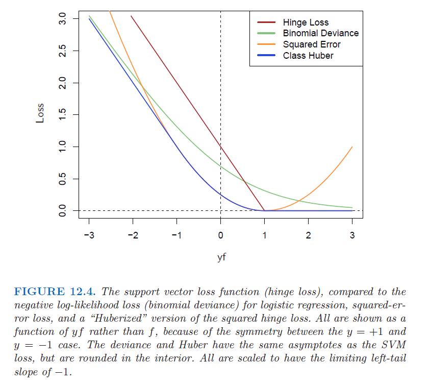
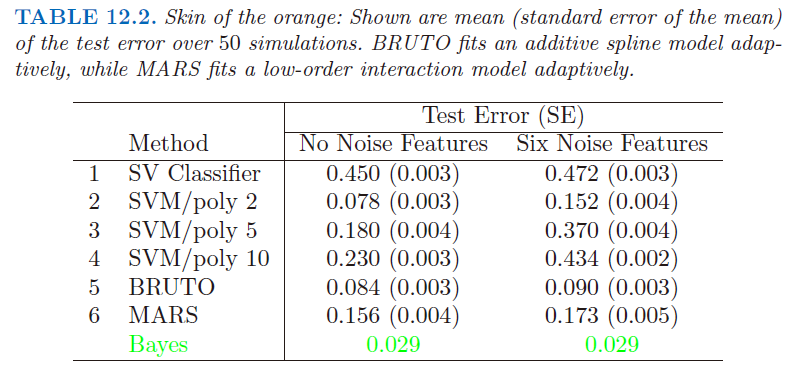

# 12.3 支持向量机和核

| 原文   | [The Elements of Statistical Learning](../book/The Elements of Statistical Learning.pdf) |
| ---- | ---------------------------------------- |
| 翻译   | szcf-weiya                               |
| 时间   | 2016-12-19:2016-12-20                   |
| 更新 |2017.12.12; 2017.12.18; 2018.02.12; 2018.02.13 |
| 状态 |In Progress|

至今所描述的支持向量机是在输入特征空间中寻找线性边界。和其他的线性方法一样，我们可以用基展开的方式来增大特征空间，从而让这一过程更灵活，如多项式或者样条（第5章）。一般地，在增长的空间的线性边界能够达到更好的训练类别分割的效果，进而转换为原始空间中的非线性边界。一旦选定基函数$h_m(x),m=1,\ldots,M$，则该过程和之前一样。我们采用输入特征$h(x_i)=(h_1(x_i),h_2(x_i),\ldots,h_M(x_i)),i=1,\ldots,N$拟合SV分类器，并且得到（非线性）函数$\hat f(x)=h(x)^T\hat\beta+\hat\beta_0$。分类器和之前一样，为$\hat G(x)=\sign(\hat f(x))$。

支持向量机(support vector machine)分类器是这个想法的拓展，其中增长空间的维数允许非常大，有时甚至可以是无限维的。计算似乎会变得难以承受。而且似乎当有了充分多的基函数，数据会变得可分，同时也会发生过拟合。我们首先介绍SVM怎样处理这些问题。接着我们将看到实际中SVM分类器是采用特定的准则和正则化形式来解决函数拟合问题，而且这是包含第5章的光滑样条的更大类别的问题的一部分。读者可能希望参照[5.8节](https://esl.hohoweiya.xyz/05%20Basis%20Expansions%20and%20Regularization/5.8-Regularization-and-Reproducing-Kernel-Hibert-Spaces/index.html)，它提供了背景材料并且与接下来的两节会有一定的重复。

## 用于分类的SVM

!!! note "Recall"
    $$
    L_P=\frac{1}{2}\Vert\beta\Vert^2+C\sum\limits_{i=1}^N\xi_i-\sum\limits_{i=1}^N\alpha_i[y_i(x_i^T\beta+\beta_0)-(1-\xi_i)]-\sum\limits_{i=1}^{N}\mu_i\xi_i\qquad (12.9)
    $$

我们可以用一种特殊的方式来表示优化问题(12.9)和它的解，这种方式只涉及通过内积来涉及输入特征。我们对这个变换后的特征向量$h(x_i)$直接进行这样的操作。则我们将看到对于特定选择的$h$，这些内积可以很方便地进行计算。

(12.13)的lagrange对偶函数有如下形式：

$$
L_D=\sum\limits_{i=1}^N\alpha_i-\frac{1}{2}\sum\limits_{i=1}^N\sum\limits_{i'=1}^N\alpha_i\alpha_{i'}y_iy_{i'}\langle h(x_i), h(x_{i'})\rangle\qquad (12.19)
$$

从(12.10)中我们看到解函数$f(x)$可以写成

$$
f(x)=h(x)^T\beta+\beta_0=\sum\limits_{i=1}^N\alpha_iy_i\langle h(x),h(x_i) \rangle+\beta_0\qquad (12.20)
$$

和之前一样，给定$\alpha_i$，当$0 < \alpha_i < C$时，$\beta_0$可以通过对任意（或所有）$x_i$来求解$y_if(x_i)=1$来确定。

所以(12.19)和(12.20)仅仅通过内积涉及$h(x)$。实际上，我们根本不需要明确变换关系$h(x)$，而仅仅要求知道在转换后的空间中计算内积的核函数

$$
K(x,x')=\langle h(x), h(x') \rangle\qquad (12.21)
$$

$K$应该是一个对称的(半)正定函数：见5.8.1节。

在SVM中有三种流行的$K$可以选择

$$
\begin{array}{rl}
d\text{阶多项式：} & K(x,x')=(1+\langle x,x' \rangle)^d\\
\text{径向基：} & K(x, x')=exp(-\gamma \Vert x-x'\Vert^2)\qquad (12.22)\\
\text{神经网络：} & K(x,x')=tanh(\kappa_1\langle x,x' \rangle+\kappa_2)\\
\end{array}
$$

考虑含有两个输入变量$X_1$和$X_2$的特征空间，以及2阶的多项式。则

$$
\begin{array}{ll}
K(x,x')&=(1+\langle X,X' \rangle)^2\\
&=(1+X_1X_1'+X_2X_2')^2\\
&=1+2X_1X_1'+2X_2X_2'+(X_1X_1')^2+(X_2X_2')^2+2X_1X_1'X_2X_2'\quad (12.23)
\end{array}
$$

则$M=6$，而且如果我们选择$h_1(X)=1,h_2(X)=\sqrt{2}X_1,h_3(X)=\sqrt{2}X_2,h_4(X)=X_1^2,h_5(X)=X_2^2$，以及$h_6(X)=\sqrt{2}X_1X_2$，则$K(X,X')=\langle h(X),h(X')\rangle$。

从$(12.20)$我们可以看出该解可以写成

$$
\hat f(x)=\sum\limits_{i=1}^N\hat \alpha_iy_iK(x,x_i)+\hat\beta_0\qquad (12.24)
$$

在增广的特征空间中，参数$C$的角色更加清晰，因为在这里经常会存在完美的分割。较大的$C$会抑制任何正的$\xi_i$，并且得到在原始特征空间中过拟合的弯弯曲曲的边界；较小的$C$值会鼓励较小的$\Vert\beta\Vert$，反过来会导致$f(x)$以及边界更加地光滑。图12.3显示了应用到第2章中的混合模型的两个支持向量机。两种情形下的正则化参数都是为了实现更好的测试误差。对该例子而言，径向基得到类似贝叶斯最优边界；与图2.5进行比较。

在支持向量的早期研究中，有断言称，支持向量机的核性质是唯一的，并且允许对维数灾难进行巧妙地处理。

这些断言都不是正确的，我们将在下一节详细讨论这些问题。

## SVM作为惩罚的方法

对于$f(x)=h(x)^T\beta+\beta_0$，考虑下列的优化问题

$$
\underset{\beta_0,\beta}{min}\sum\limits_{i=1}^N[1-y_if(x_i)]_++\frac{\lambda}{2}\Vert\beta\Vert^2\qquad (12.25)
$$

其中下标“$+$”表示正的部分。上式是“损失+惩罚”的形式，这在函数估计中是个很熟悉的范例。可以很简单地证明当$\lambda=1/C$时，(12.25)的解与(12.8)的解一致。

对“hinge”损失函数$L(y,f)=[1-yf]\_+$的检验表明，它用于二类别分类是很合理的。图12.4将之与逻辑斯蒂回归的对数似然进行比较，以及平方误差损失和其中的方差。（负）对数似然或者二项偏差和SVM损失有着类似的尾分布，其中对margin中的点赋予0惩罚，对在错误一侧的边赋予线性惩罚。另一方面，平方误差给出了平方惩罚，在各自margin中的点对模型也有很强的影响。squared hinge损失$L(y,f)=[1-yf]_+^2$类似平方损失，除了对于各自margin中的点惩罚为0。在左尾中平方增长，而且对错误分类的观测的hinge或者偏差更加稳健。最近Rosset and Zhu (2007)[^1]提出squared hinge损失的“Huberized”版本，在$yf=-1$处将其平滑转换为了线性损失。

我们可以用在总体水平上用估计量来区分这些损失函数。我们考虑最小化$\E L(Y,f(x)$。

表12.1总结了这些结果。然而hinge损失估计了分类器$G(x)$本身，而其他的都估计类别后验概率的某个变换。“Huberized” square hinge损失有着与逻辑斯蒂回归相同的吸引人的性质（光滑的损失函数，估计概率），以及SVM的hinge损失（支撑点）。

形式(12.25)将SVM看成正则函数估计问题，其中线性展开$f(x)=\beta_0+h(x)^T\beta$的系数向0收缩（除了常值）。如果$h(x)$表示有相同的序结构（比如按粗糙程度排序）的分层核，如果在向量$h$中有更粗糙的元素$h_j$有更小的范数，则均一化收缩是有意义的。

除了平方误差，表12.1中所有的损失函数，都称之为“margin maximizing loss-functions”（Rosset et al., 2004b[^2]）。这意味着如果数据是可分的，则当$\lambda\rightarrow 0$时，$\hat\beta_\lambda$的极限定义为最优分离超平面。

!!! note "原作者注："
    对于可分数据的逻辑斯蒂回归，$\hat\beta_\lambda$分散，但是$\hat\beta_\lambda/\Vert\hat\beta_\lambda\Vert$收敛到最优分离超平面。

## 函数估计和重生核

这里我们用重生核希尔伯特空间的函数估计来描述SVM，其中有许多的核性质。这里讨论的内容在[5.8节](https://esl.hohoweiya.xyz/05%20Basis%20Expansions%20and%20Regularization/5.8-Regularization-and-Reproducing-Kernel-Hibert-Spaces/index.html)有详细讨论。这里给出支持向量分类器的另一个视角，并且帮助理清它如何实现。

假设基$h$来自与正定核$K$的（可能是有限的）特征展开，

$$
K(x, x')=\sum\limits_{m=1}^{\infty}\phi_m(x)\phi_m(x')\delta_m\qquad (12.26)
$$

并且$h_m(x)=\sqrt{\delta_m}\phi_m(x)$。则当$\theta_m=\sqrt{\delta_m}\beta_m$，我们可以把(12.25)写成

$$
\underset{\beta_0, \theta}{\min}\sum\limits_{i=1}^N\Big[
    1-y_i(\beta_0+\sum\limits_{m=1}^{\infty}\theta_m\phi_m(x_i))
    \Big]_+ + \frac{\lambda}{2}\sum\limits_{m=1}^{\infty}\frac{\theta_m^2}{\delta_m}
    \qquad (12.27)
$$

!!! note "Recall"
    $$
    \underset{\{c_j\}_1^\infty}{\min}\Big[\sum\limits_{i=1}^NL(y_i, \sum\limits_{j=1}^\infty c_j\phi_j(x_i))+\lambda \sum\limits_{j=1}^\infty c_j^2/\gamma_j\Big]\qquad (5.49)
    $$
    $$
    \underset{\alpha_0,\aalpha}{\min}\Big\{
    \sum\limits_{i=1}^N[1-y_if(x_i)]_+ + \frac{\lambda}{2}\aalpha^T\K\aalpha
    \Big\}\qquad (5.67)
    $$

现在(12.27)与5.8节中的(5.49)形式相同，并且重生希尔伯特空间的理论保证了形如下面的有限维的解

$$
f(x)=\beta_0+\sum\limits_{i=1}^N\alpha_iK(x, x_i)\qquad (12.28)
$$

特别地，我们看到存在等价的优化准则[5.8.2节的式(5.67)；也可以参见Wahba et al. (2000)]

$$
\underset{\beta_0, \alpha}{\min}\sum\limits_{i=1}^N(1-y_if(x_i))_++\frac{\lambda}{2}\alpha^T\K\alpha\qquad (12.29)
$$

其中$\K$是所有成对训练特征的核的赋值（练习12.2）。

这些模型非常一般，举个例子，包含第5和第9章中讨论的整个光滑样条族，可加和交叉样条模型，更多细节参见Wahba (1990)和Hastie and Tibshirani (1990)。它们可以更一般地表示为

$$
\underset{f\in{\cal H}}{\min}\sum\limits_{i=1}^N[1-y_if(x_i)]_+ + \lambda J(f)\qquad (12.30)
$$

其中$\cal H$是函数的结构空间(the structured space of functions)，并且$J(f)$是在该空间上合适的正则器。举个例子，假设$\cal H$是可加函数$f(x)=\sum_{j=1}^pf_j(x_j)$，并且$J(f)=\sum_j\int\\{f^{(2)}\_j(x_j)\\}^2dx_j$。则(12.30)的解为可加三次样条，并且有核表示$K(x,x')=\sum_{j=1}^pK_j(x_j,x_j')$。每个$K_j$是关于$x_j$的合适的单变量光滑样条的核(Wahba, 1990)。

反过来，这个讨论也表明，举个例子，任意(12.22)中提到的核都可以和凸损失函数一起使用，并且将会得到形如(12.28)的有限维表示。图12.5采用和图12.3同样的核函数，除了采用二项对数似然作为损失函数。因此拟合函数是log-odds的估计

$$
\begin{align}
\hat f(x) &=\LOG \frac{\hat\pr (Y=+1\mid x)}{\hat\pr (Y=-1\mid x)}\\
&=\hat\beta_0+\sum\limits_{i=1}^N\hat\alpha_iK(x,x_i)\qquad (12.31)
\end{align}
$$

或者反过来，我们得到类别概率的估计

$$
\hat\pr(Y=+1\mid x)=\frac{1}{1+e^{-\hat\beta_0-\sum_{i=1}^N\hat\alpha_iK(x,x_i}}\qquad (12.32)
$$

这些拟合的模型在形状和表现效果上都非常相似。5.8节给出了例子以及更多的细节。

对于SVM也是一样，$N$个$\alpha_i$中的一部分可以为0（非支持点）。在图12.3的两个例子中，这些比例分布为42%和45%。这是准则(12.25)的第一部分分段线性的本质。（在训练数据上）类别重叠越少，这个比例越大。降低$\lambda$一般会降低重叠（允许更灵活的$f$）。较少的支持点意味着$\hat f(x)$可以更快地进行赋值，这在查找时很重要。当然，过分降低重叠会导致泛化能力太差。

## SVM和维数灾难

在这一节，我们提出问题，SVMs是否存在维数灾难。注意到在展开式(12.23)中，我们不允许在幂和乘积的空间中有完全一般的内积。举个例子，所有形如$2X_jX_j'$赋予相同的权重，并且核不能自动更新来集中到子空间中。如果特征的数量$p$很大，但是类别分类仅仅发生在$X_1$和$X_2$张成的子空间，这个核不会简单地被找到其结构并且需要在很多维度下搜寻。必须将子空间的信息考虑进核中；也就是，忽略除了前两个的输入。如果有信息能够得到先验，大多数统计学习会变得很简单。自适应方法的主要目标是发现类似的结构。

我们用一个例子来支持上面的陈述。我们在两个类别中产生100个观测值。第一类有4个标准正态独立特征$X_1,X_2,X_3,X_4$。第二类也有四个标准正态独立特征，但是条件为$9\le \sum X_j^2\le 16$。这是个相对简单的问题。作为第二个更难的问题，我们用6个标准高斯噪声特征来增广特征。因此第二类完全包围了第一类，类似在四维子空间中外皮包围着橘子。该问题的贝叶斯误差率为0.029（不考虑维数）。我们产生1000个测试观测量来比较不同的过程。在有无噪声特征的情况下，平均测试误差在50个模拟中得到，如表12.2所示。

表中第一行在原特征空间中使用支持向量分类器。第2到第4行表示使用2，5和10维多项式核的支持向量机。对于所有的支持向量过程，我们选择代价参数$C$来最小化测试误差，使得对这个方法尽可能公平。第5行采用可加模型的BRUTO算法（Hastie and Tibshirani (1990)），通过最小二乘对$(-1,+1)$响应变量拟合可加样条模型。第6行采用MARS（多变量自适应回归样条）允许任意阶的交叉影响，在第9章中有介绍；同样地，其与SVM/poly 10进行比较。BRUTO和MARS算法均有能力忽略冗余变量。第5和第6行并不采用测试误差来选择光滑参数。

在原始特征空间中，超平面不能分离类别，而且支持向量分类器（第一行）表现很差。多项式支持向量机在测试误差率方面取得显著改善，但同时也被6个噪声特征严重影响。这对核的选择非常敏感：二阶多项式核（第2行）表现最好，因为真实的判别边界就是二阶多项式。然而，高阶多项式（第3和第4行）表现很差。BRUTO表现得很好，因为其边界是可加的。BRUTO和MARS自适应得很好：因为噪声的存在，所以它们的表现不会退化太大。

## SVM分类器的路径算法

TODO

## 用于回归的支持向量机

在这一节，我们将要展示SVMs可以适用于定量响应变量的回归问题，其中采用继承SVM分类器的某些性质的方式。我们首先讨论线性回归模型

$$
f(x)=x^T\beta+\beta_0\qquad (12.35)
$$

接下来处理非线性的推广情形。为了估计$\beta$，我们考虑下式的最小化

$$
H(\beta, \beta_0) = \sum\limits_{i=1}^N V(y_i-f(x_i)) + \frac{\lambda}{2}\Vert \beta\Vert^2\qquad (12.36)
$$

其中

$$
V_{\epsilon}(r)=
\left\{
\begin{array}{ll}
0 & \text{if}\; \vert r\vert < \epsilon\\
\vert r\vert -\epsilon, &\text{otherwise}
\end{array}
\right.
\qquad (12.37)
$$

这是一种“$\epsilon$-insensitive”的误差度量，它忽略了大小小于$\epsilon$的误差（图12.8的左图）。这一点类似支持向量机在分类问题中的设定，处于判别边界正确一侧的点以及远离边界的点在优化过程中都被忽略了。在回归中，这些“low error”的点是残差较小的点。

将这个误差度量与统计中鲁棒回归中采用的误差度量比较是很有趣的。图12.8的右图展示了鲁棒回归中误差度量的最受欢迎的形式(Huber (1964))：

$$
V_{H}(r)=
\left\{
\begin{array}{ll}
r^2/2 & \text{if}\; \vert r\vert \le c\\
c\vert r\vert -c^2/2, &\vert r\vert > c
\end{array}
\right.
\qquad (12.38)
$$

当绝对残差大于预先给定的某个常值$c$时，函数将观测的贡献从二次降至一次。这使得拟合对离群点更加不敏感。支持向量误差衡量(12.37)也有线性尾(tail)（大于$\epsilon$），但是除此之外，它压缩了小偏差情形下观测点的贡献。

如果$\hat\beta,\; \hat\beta_0$是$H$的最小值点，则解函数有如下形式

$$
\begin{align}
\hat\beta & = \sum\limits_{i=1}^N(\hat\alpha_i^*-\hat\alpha_i)x_i & (12.39)\\
\hat f(x) & = \sum\limits_{i=1}^N(\hat\alpha_i^*-\hat\alpha_i)\langle x, x_i\rangle+\beta_0 & (12.40)
\end{align}
$$

其中$\hat\alpha_i,\; \hat\alpha_i^*$是正的，且是下列的二次规划问题的解

$$
\underset{\alpha_i,\alpha_i^*}{\min}\epsilon \sum\limits_{i=1}^N(\alpha_i^*+\alpha_i)-\sum\limits_{i=1}^Ny_i(\hat\alpha_i^*-\alpha_i)+\frac 12(\alpha_i^*-\alpha_i)(\alpha_{i'}^*-\alpha_{i'})\langle x_i, x_{i'}\rangle
$$

约束条件如下

$$
\begin{align}
0\le \alpha_i,\alpha_i^*\le \frac{1}{\lambda}\\
\sum\limits_{i=1}^N(\alpha_i^*-\alpha_i)=0\\
\alpha_i\alpha_i^*=0
\end{align}
\qquad (12.41)
$$

考虑到这些约束的本质，一般仅仅有部分的解$(\hat \alpha_i^*-\hat\alpha_i)$非零， 并且对应的数据称为支持向量。和分类问题中的设定一样，解仅仅通过内积$\langle x_i, x_{i'}\rangle$。因此我们可以通过定义合适的内积将这个方法推广到高维空间，举个例子，采用(12.22)中定义的其中一个。

注意到参数$\epsilon$和$\lambda$与准则(12.36)有关。它们似乎扮演不同的角色，$\epsilon$是损失函数$V_{\epsilon}$的参数，和$c$是$V_H$的参数一样。注意到$V_{\epsilon}$和$V_H$都依赖$y$的尺度，以及$r$。如果我们对响应变量进行缩放（也因此需要用$V_H(r/\sigma)$和$V_\epsilon(r/\sigma)$），则我们可能考虑采用预先设定的$c$和$\epsilon$（对于高斯情形，取$c=1.345$能达到$95\%$的有效度）。$\lambda$是更传统的正则参数，并且可以通过交叉验证来估计。

## 回归和核

正如12.3.3节讨论的一样，这个核性质

## 讨论

[^1]: Rosset, S. and Zhu, J. (2007). Piecewise linear regularized solution paths, Annals of Statistics 35(3): 1012–1030.
[^2]: Rosset, S., Zhu, J. and Hastie, T. (2004b). Margin maximizing loss functions, in S. Thrun, L. Saul and B. Schölkopf (eds), Advances in Neural Information Processing Systems 16, MIT Press, Cambridge, MA.