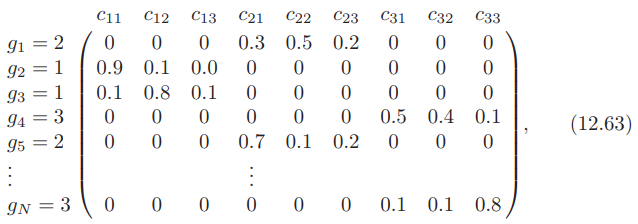
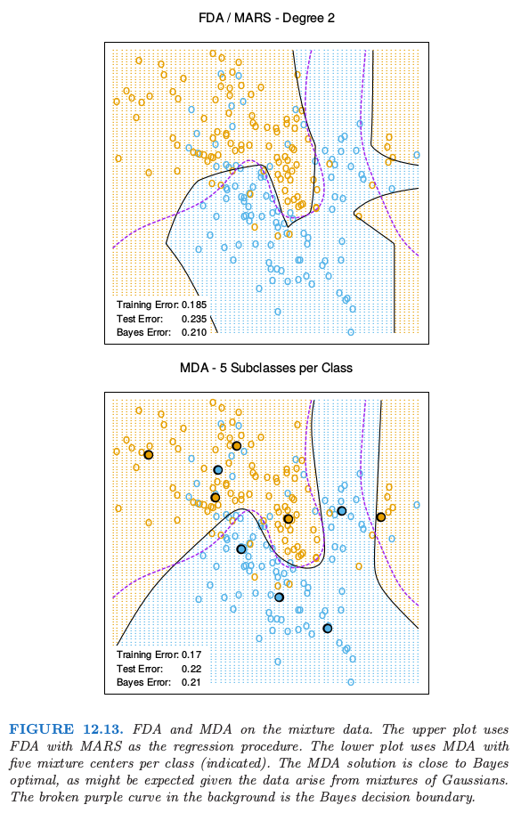
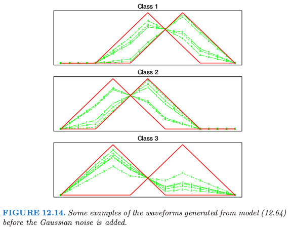
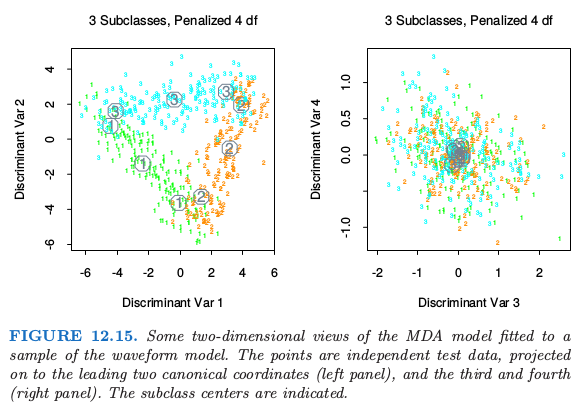

# 12.7 混合判别分析

| 原文   | [The Elements of Statistical Learning](../book/The Elements of Statistical Learning.pdf#page=468) |
| ---- | ---------------------------------------- |
| 翻译   | szcf-weiya                               |
| 时间   | 2018-08-08                   |
|状态 |Done|

线性判别分析可以看成是 **原型 (prototype)** 分类器．每个类别都由其形心表示，并且使用某种合适的度量，将其分到最近的形心处．在许多情形下，单个原型不足以表示不均匀的类别，而混合模型是更合适的．在这节中，我们回顾高斯混合模型，并且展示怎么从之前讨论的 FDA 和 PDA 中推广得到．第 $k$ 类别的高斯混合模型密度为

$$
P(X\mid G=k)=\sum\limits_{r=1}^{R_k}\pi_{kr}\phi(X;\mu_{kr},\mathbf\Sigma),\tag{12.59}
$$

其中 **混合比例 (mixing proportions)** $\pi_{kr}$ 的和为 $1$．第 $k$ 类有 $R_k$ 个原型，并且在我们的情形中，始终采用相等的协方差作为度量．对每个类别给定这样一个模型，类别后验概率由下式给出

$$
P(G=k\mid X=x)=\frac{\sum_{r=1}^{R_k}\pi_{kr}\phi(X;\mu_{kr},\mathbf \Sigma)\Pi_k}{\sum_{\ell=1}^K\sum_{r=1}^{R_\ell}\pi_{\ell r}\phi(X;\mu_{\ell r},\mathbf \Sigma)\Pi_\ell}\tag{12.60}
$$

其中 $\Pi_k$ 表示类别的先验概率．

我们在第 8 章看到两个组分的特殊情形的计算．如 LDA 中一样，我们通过极大似然估计参数，采用如下基于 $P(G,X)$ 的联合对数似然：

$$
\sum\limits_{k=1}^K\sum\limits_{g_i=k}\log\Big[\sum\limits_{r=1}^{R_k}\pi_{kr}\phi(x_i;\mu_{kr},\mathbf \Sigma)\Pi_k\Big]\tag{12.61}
$$

如果直接处理对数中的和，会变成很复杂的优化问题．计算混合分布的极大似然估计的经典的、自然的方法是 EM 算法 (Dempster et al., 1977[^1])，它具有良好的收敛性质．EM 在下面两步间轮换：

- **E-step**：给定当前的参数，对类别 $k$ 的每个观测 ($g_i=k$) 计算其子类 $c_{kr}$ 的 responsibility：
$$
W(c_{kr}\mid x_i, g_i)=\frac{\pi_{kr}\phi(x_i;\mu_{kr},\mathbf \Sigma)}{\sum\limits_{\ell=1}^{R_k}\pi_{k\ell}\phi(x_i;\mu_{k\ell},\mathbf \Sigma)}.\tag{12.62}
$$
- **M-step**: 采用 E-step 的权重，计算每个类别中每个高斯组分的参数的加权 MLE．

[^1]: Dempster, A., Laird, N. and Rubin, D. (1977). Maximum likelihood from incomplete data via the EM algorithm (with discussion), Journal of the Royal Statistical Society Series B 39: 1–38.

在 E-step，算法将类别 $k$ 中的观测的单位权重赋给属于该类的不同子类．如果观测点离某个子类的形心很近，且离其它形心很远，则它会收到该更近的子类更大的权重．另一方面，如果观测点在两个子类中间则它会得到两个子类近似相等的权重．

在 M-step，类别 $k$ 的观测使用 $R_k$ 次，来估计 $R_k$ 个组分密度中每一个的参数，对于每个组分有不同的权重．EM 算法在第 8 章中有详细介绍．算法要求初始化，这可能有影响，因为混合模型一般都是多种模型．我们的软件（后面计算上的考虑一节中有提到）允许多种策略；这里我们描述默认的策略．用户提供每个类中子类的个数 $R_k$．在类别 $k$ 中，用多重随机起始点的 $k$ 均值聚类模型对数据进行拟合．根据元素为 $0$ 和 $1$ 的初始权重矩阵，将观测值划分到 $R_k$ 个不相交的群中．

我们对始终相等的组分协方差矩阵 $\mathbf\Sigma$ 的假设带来额外的简化；我们可以像 LDA 中一样在混合形式中结合秩的约束．为了理解这一点，回顾下 LDA 的一些事实（[4.3.3 节](../04-Linear-Methods-for-Classification/4.3-Linear-Discriminant-Analysis/index.html)）．rank-$L$ 的 LDA 拟合等价于高斯模型的极大似然拟合，其中每个类别中不同的均值向量约束到 $\IR^p$ 的 rank-$L$ 子空间（[练习 4.8](https://github.com/szcf-weiya/ESL-CN/issues/143)）．

!!! info "weiya 注：Ex. 4.8"
    结合作者的原论文，目前看懂其中一种情形的证明，详见 [Issue 143: Ex. 4.8](https://github.com/szcf-weiya/ESL-CN/issues/143)．

我们可以在混合模型中继承这条性质，并且在满足所有 $\sum_kR_k$ 个形心上的秩的约束的条件（$\mathrm{rank}\\{\mu_{k\ell}\\}=L$）下最大化对数似然 $(12.61)$．

又一次可以用 EM 算法，并且 M-step 事实上是加权版本的 LDA，其中有 $R=\sum_{k=1}^KR_k$ 个“类别”．而且，我们可以采用之前一样的最优得分来解决加权 LDA 问题，使得我们在这一步可以使用 FDA 或者 PDA．可以预料，除了“类别”数可以增加，第 $k$ 类中的观测数也会类似增加 $R_k$ 倍．事实证明如果线性算子用于最优得分回归，则不是这种情形．增广的响应变量矩阵 $\mathbf Y$ 变成 **模糊的 (blurred)** 响应矩阵 $\mathbf Z$，直觉上令人愉快．举个例子，假设有 $K=3$ 个类别，并且每个类中有 $R_k=3$ 个子类．则 $\mathbf Z$ 可能是

其中类别 $k$ 行的元素对应 $W(c_{kr}\mid x,g_i)$．

剩下的步骤是一样的：

这些简单的改进大大增加了模型的灵活性：

- LDA，FDA 或者 PDA 中的降维那一步被类别数限制；特别地，对于 $K=2$ 个类别，不可能有降维．MDA 用子类代替了类别，并且允许从这些子类形心张成的子空间的低维视角中观测数据．这个子空间经常是用于判别时重要的一个．
- 通过在 M-step 使用 FDA 或者 PDA，我们可以适应更具体的情形．举个例子，我们可以对数字模拟信号及图像拟合 MDA 模型，其中要求光滑的约束．

图 12.13 在混合例子中比较了 FDA 和 MDA．

## 例子：波形数据

现在我们在一个流行的模拟数据中说明这些想法，这个模拟数据取自 Breiman et al. (1984, pages 49–55)[^2]，并且用在了 Hastie and Tibshirani (1996b)[^3] 和其它地方．这是有着 21 个变量的三类别问题，并且被认为是复杂的模型识别问题．预测变量由下式定义

$$
\begin{align}
X_j &= Uh_1(j) + (1-U)h_2(j)+\epsilon_j\qquad \text{Class 1,}\notag\\
X_j &= Uh_1(j) + (1-U)h_3(j)+\epsilon_j\qquad \text{Class 2,}\notag\\
X_j &= Uh_2(j) + (1-U)h_3(j)+\epsilon_j\qquad \text{Class 3,}\notag\\
\end{align}
\tag{12.64}
$$

其中 $j=1,2,\ldots,21$，$U$ 是 $(0,1)$ 上的均匀分布，$\epsilon_j$ 是标准的正态分布，并且 $h_\ell$ 是平移的三角波形：$h_1(j)=\max (6-\vert j-11\vert,0)$，$h_2(j)=h_1(j-4)$ 以及 $h_3(j)=h_1(j+4)$．图 12.14 展示了每个类的一些波形的例子．

[^2]: Breiman, L. and Ihaka, R. (1984). Nonlinear discriminant analysis via scaling and ACE, Technical report, University of California, Berkeley.
[^3]: Hastie, T. and Tibshirani, R. (1996b). Discriminant analysis by Gaussian mixtures, Journal of the Royal Statistical Society Series B. 58: 155–176.

表 12.4 展示了 MDA 应用到波形数据上的结果，以及本章和其他章的一些其它方法．每个训练样本有 300 个观测，并且使用的优先级相等，所以每个类大概有 100 个观测．我们采用大小为 500 的测试样本．这两个 MDA 模型在表头有描述．

图 12.15 展示了在测试数据上取值的带惩罚的 MDA 模型的第一个典则变量．如我们可能猜测的一样，类别看上去位于三角形的三边．这是因为 $h_j(i)$ 用 21 维空间中的三个点来表示，因此构成了三角形的顶点，并且每个类别用成对顶点的凸组合来表示，因此位于一条边上．也清楚地看出所有的信息都在前两个维度中；前两个维度解释的方差的比例是 $99.8\%$，所以在这里截断解不会有损失．这个问题的贝叶斯风险已经估计大约为 0.14 (Breiman et al., 1984[^2])．MDA 接近最优的比例，这个结果也不是很惊奇，因为 MDA 模型的结构类似生成模型．

