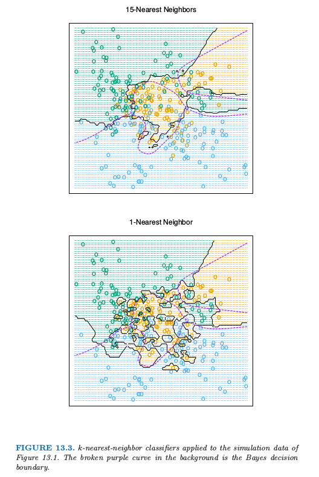
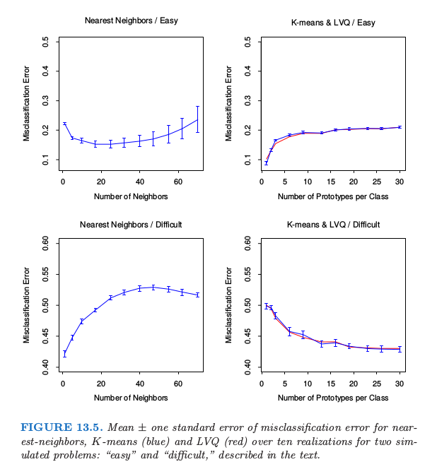
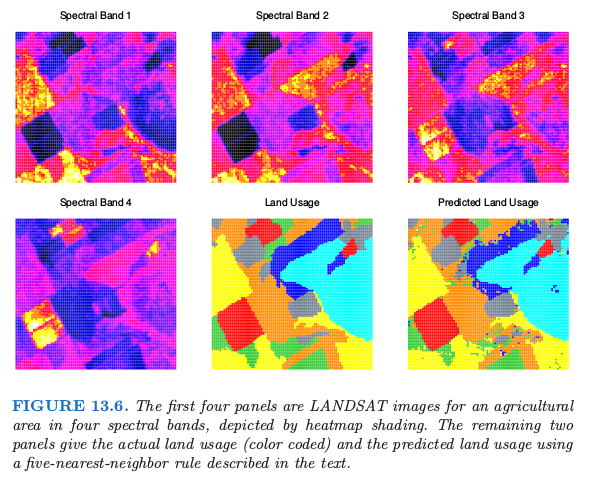
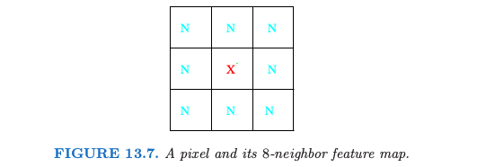
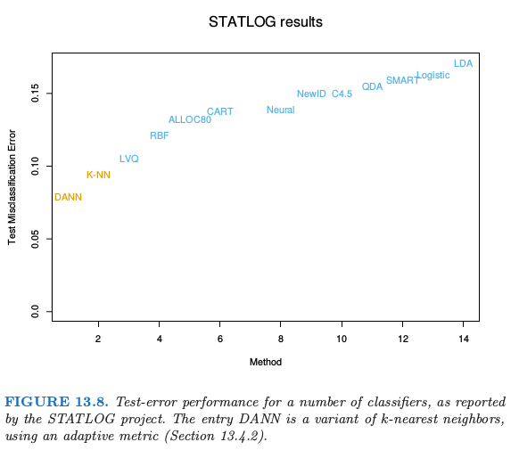
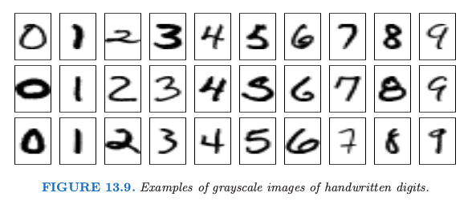
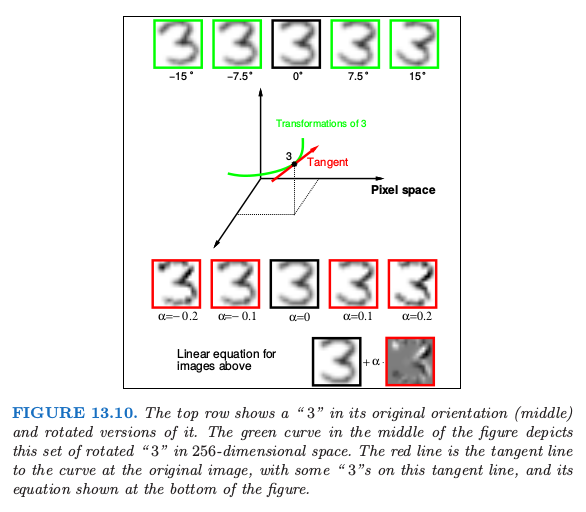
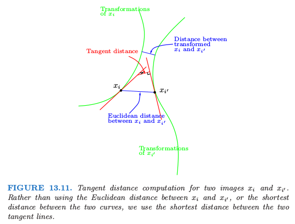

# 13.3 k最近邻分类器

| 原文   | [The Elements of Statistical Learning](../book/The Elements of Statistical Learning.pdf) |
| ---- | ---------------------------------------- |
| 翻译   | szcf-weiya                               |
| 时间   | 2017-08-28&2018-01-26                               |
|状态 | In Progress|

这些分类器是基于存储的(memory-based)，并且不需要拟合模型。给定查询点$x_0$，找到$k$个距离$x_0$最近的训练点$x_{(r)}, r=1,\ldots,k$，接着在这$k$个最近邻中采用多数服从少数的方法进行分类。Ties are broken at random。为了简便起见，假设所有的特征是实值的，我们在特征空间中采用欧氏距离

$$
d_{(i)} = \Vert x_{(i)} - x_0\Vert \qquad (13.1)
$$

一般地，首先对每个特征进行标准化使得均值为0方差为1，因为它们可能是在不同的尺度下的测量值。在第14章中，我们讨论适用与定性变量和有序变量的距离度量，以及对于混合数据怎样将它们结合起来。自适应的距离度量将在下一节中讨论。

尽管k最近邻很简单，但是在大量的分类问题中取得了成功，包括手写字体，卫星图象以及EKG模式。当每个类别有许多可能的原型时，并且判别边界非常不规则，通常会取得成功。图13.3的上图显示了对3个类别的模拟例子应用15最近邻分类器的结果。这个判别边界比下半图的1-最近邻分类器要光滑。最近邻和原型方法有着紧密的联系，在1-最近邻分类中，每个训练点就是一个原型。

图13.4显示了两个类别的混合问题中，训练误差、测试误差以及10折交叉验证误差关于邻居大小的函数图象。因为10折CV误差是10个数据的平均，因此我们可以估计标准误差。

因为最近邻仅仅用到离查询点近的训练点，1-最近邻的偏差通常很低，但是方差很高。Cover and Hart(1967)[^1]证明了一个很著名的结果，1-最近邻分类器的误差率渐近地不会高于两倍的贝叶斯误差率。证明的大致思想如下（采用平方误差损失）。假设查询点刚好与其中一个训练点重合，则偏差为0。如果特征空间的维数固定，且训练数据密集地充满空间。则贝叶斯误差恰恰是Bernoulli随机变量的方差，而1-最近邻的误差是Bernoulli随机变量方差的两倍，对训练和查询目标各自贡献了一份。

对于误分类损失，我们下面给出更多的细节。令$k^\*$为$x$点处的优势类别，而$p_k(x)$是类别$k$的真实条件概率。则

$$
\text{Bayes error} = 1-p_{k^*}(x)\qquad (13.2)
$$

$$
\begin{array}{ll}
\text{1-nearest-neighbor error}&=\sum\limits_{k=1}^Kp_k(x)(1-p_k(x))\qquad (13.3)\\
&\ge 1-p_{k^*}(x)\qquad (13.4)
\end{array}
$$

渐进的1-最近邻误差率是一个随机规则；我们以概率$p_k(x),k=1,\ldots,K$随机选择类别和测试点。对于$K=2$，1-最近邻误差率为$2p_{k^\*}(x)(1-p_{k^\*}(x))\le 2(1-p_{k^\*}(x))$(两倍的贝叶斯误差率)。更一般地，可以证明

$$
\sum\limits_{k=1}^Kp_k(x)(1-p_k(x))\le 2(1-p_{k*}(x))-\frac{K}{K-1}(1-p_{k^*}(x))^2\qquad (13.5)
$$

可以导出更多这种形式的结果；Ripley(1996)[^2]总结了其中的一些。

这个结果可以提供在给定问题中最优的效果的大致思路。举个例子，如果1-最近邻有$10\%$的误差率，则渐近情况下贝叶斯误差率至少为$5%$。这里是渐近情形，它假设最近邻的偏差为0。在实际问题中，偏差可能很大。本章后面讨论的自适应最近邻试图减去这种偏差的影响。对于简单的最近邻，在给定的问题中，偏差和方差可以决定最优的最近邻个数。在下面的例子中会解释。

## 例子： 比较研究

我们在两个模拟问题中比较了最近邻，k均值和LVQ分类器。有10个独立的特征$X_j$，每个都是[0,1]上的均匀分布。两类别的0-1目标变量由下式子定义：

$$
\begin{align}
Y&=I(X_1\ge \frac 12);\qquad\text{problem 1: easy}\\
Y&=I(\sign\{\prod\limits_{j=1}^3(X_j-\frac 12)\}>0);\qquad \text{problem 2: difficult}
\end{align}
\qquad (13.6)
$$

因此在第一个问题中，两个类别被超平面$X_1=\frac 12$分离开；在第二个问题中，两个类别被前三个特征定义的超立体形成了跳棋盘(checkerboard)。这两个问题的贝叶斯误差率都是0。有100个训练观测和100个测试观测。

图13.5展示了最近邻、K均值和LVQ当调整参数变化的10次实现中的误分类误差的均值和标准误差。我们看到K均值和LVQ给出了几乎相近的结果。在调整参数的最优选择下，K均值和LVQ在第一个问题上都比最近邻要好，并且在第二个问题上它们表现很相似。注意到每个调整参数的最优值在不同情形是不同的。举个例子，在第一个问题中，25最近邻比1最近邻好70%，而在第二个例子中1最近邻比25最近邻好18%。这些结果强调了采用客观的、基于数据的方法的重要性，比如用交叉验证来估计调整参数的最优值（见图13.4和第7章）。

## 例子： k-最近邻和图象分类

TODO

## 不变量和切线距离

TODO

[^1]: Cover, T. and Hart, P. (1967). Nearest neighbor pattern classification, IEEE Transactions on Information Theory IT-11: 21–27.
[^2]: Ripley, B. D. (1996). Pattern Recognition and Neural Networks, Cambridge University Press.
