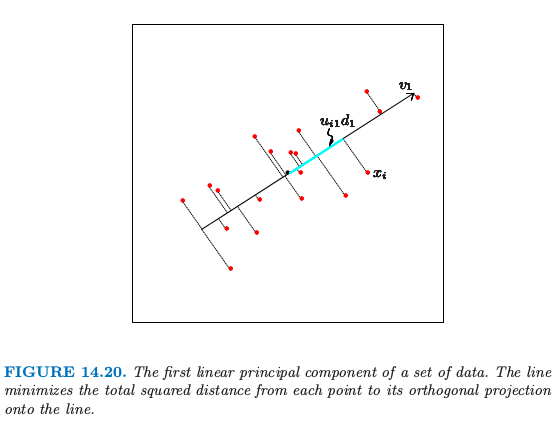
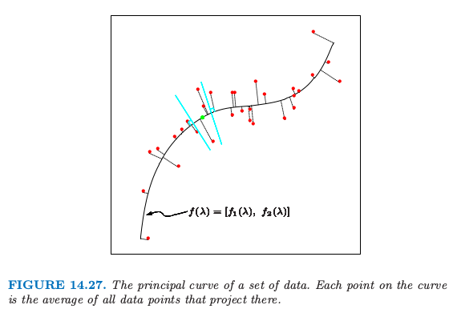
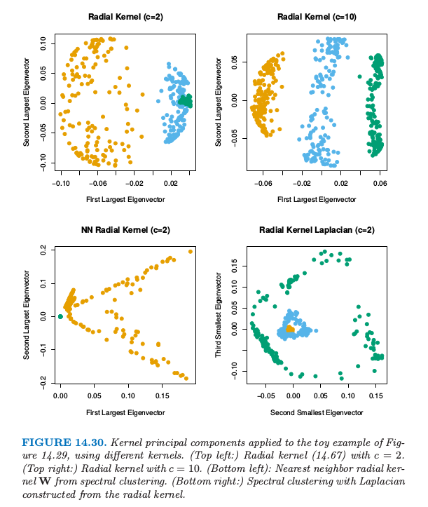

# 14.5 主成分，主曲线和主曲面

| 原文   | [The Elements of Statistical Learning](../book/The Elements of Statistical Learning.pdf) |
| ---- | ---------------------------------------- |
| 翻译   | szcf-weiya                               |
| 时间   | 2016-11-01:2016-10-21                    |
|更新|2018-01-18|

!!! note "更新笔记"
    @2018-01-18 完成第一小节（不包含例子），并完成[Ex. 14.7](https://github.com/szcf-weiya/ESL-CN/issues/45)

主成分已经在3.4.1节中讨论了，主成分阐释了岭回归的收缩机理。主成分是数据的投影序列，是互相不相关的且按照方差大小排序的序列。在下一节我们将要把主成分表示成N个点$x_i\in R^p$的多重线性逼近流形(nonlinear approximating manifolds)。接着在14.5.2节讨论非线性正则化。最近提出的关于多重非线性逼近流形的方法将在14.9节讨论。

## 主成分

$R^p$中数据的主成分给出了这些数据在秩$q\le p$下最好的线性逼近。

记观测值为$x_1,x_2,\ldots,x_N$，然后考虑用秩为$q$的线性模型来表示它们

$$
f(\lambda)=\mu+\mathbf V_q\lambda\qquad (14.49)
$$

其中，$\mu$是$R^p$中的位置向量，$\mathbf V_q$是有$q$个正交单位列向量的$p\times q$的矩阵，$\lambda$是一个$q$维的系数向量。这是一个秩为$q$的仿射超平面的系数表示。图14.20和图14.21分别展示了$q=1$和$q=2$的情形。对数据进行最小二乘拟合这个模型等价最小化重构误差(reconstruction error)

$$
\underset{\mu,\{\lambda_i\},\mathbf V_q}{min}\sum\limits_{i=1}^N\Vert x_i-\mu-\mathbf V_q\lambda_i\Vert^2\qquad (14.50)
$$

我们可以对上式关于$\mu$和$\lambda_i$（练习14.7）求微分得到

$$
\begin{array}{lll}
\hat\mu&=&\bar x\qquad(14.51)\\
\hat\lambda_i&=&\mathbf V_q^T(x_i-\bar x)\qquad (14.52)
\end{array}
$$

!!! note "weiya注: Ex. 14.7"
    (14.51)和(14.52)的解并不是唯一的，只要满足
    $$
    \mathbf V_q^T\sum\limits_{i=1}^N\lambda_i=N(\bar x-\mu)
    $$
    具体解题过程参见[Issue: Ex. 14.7](https://github.com/szcf-weiya/ESL-CN/issues/45)

这促使我们去寻找正交矩阵$\mathbf V_q$:

$$
\underset{\mathbf V_q}\sum\limits_{i=1}^N\Vert (x_i-\bar x)-\mathbf V_q\mathbf V_q^T(x_i-\bar x)\Vert\qquad (14.53)
$$

为了方便，我们假设$\bar x=0$（否则我们只需要简单地对数据进行中心化$\tilde x_i=x_i-\bar x$）。$p\times p$矩阵$\mathbf H_q=\mathbf V_q\mathbf V_q^T$是投影矩阵(projection matrix)，并且将每个点$x_i$投影到它的秩为$q$的重构$\mathbf H_qx_i$上，这是$x_i$在由$\mathbf V_q$的列张成的子空间上的正交投影。(14.53)的解可以按如下形式表示。将(中心化的)观测放进$N\times p$的矩阵$\mathbf X$的行中。构造$X$的奇异值分解：

$$
\mathbf{X=UDV^T}\qquad (14.54)
$$

这是数值分析中标准的分解，并且对该分解有很多的算法（比如，Golub and Van Loan, 1983[^1]）。这里$\mathbf U$是$N\times p$的正交矩阵($\mathbf{U^TU}=\mathbf I_p$)，它的列向量$\mathbf u_j$称为左奇异向量，$\mathbf V$是$p\times p$的正交矩阵($\mathbf V^T\mathbf V=\mathbf I_p$)，其中的列向量$\mathbf v_j$称之为右奇异向量。对每个秩$q$，(14.53)的解$\mathbf V_q$包含$\mathbf V$的前$q$列。$\mathbf UD$的列称为$X$的主成分（见3.5.1节）。(14.52)中$N$个最优的$\hat\lambda_i$由前$q$个主成分给出（$N\times q$的矩阵$\mathbf U_q\mathbf D_q$的$N$行）。

$R^2$中的一维主成分分析显示在图14.20中。

对于每个数据点$x_i$，在直线上有个最近的点，由$u_{i1}d_1v_1$给出。这里$v_1$是该直线的方向，并且$\hat \lambda_i=u_{i1}d_1$衡量了沿着直线离原点的距离。类似地，图14.21展示了拟合half-sphere数据的二维主成分曲面（左图）。右图显示了数据在前两个主成分上的投影。这个投影是之前介绍的SOM方法的初始化的基础。这个过程在分离簇方面表现得非常成功。因为half-sphere是非线性的，非线性的投影会做得更好，这将是下一节的主题。

主成分还有许多其它的性质，举个例子，线性组合$\mathbf Xv_1$在所有特征的线性组合中有最大的方差；$\mathbf Xv_2$在满足$v_2$正交$v_1$的所有线性组合中有最高的方差，以此类推。

### 例子：手写数字

## 主成分曲线和曲面

##　谱聚类

## 核主成分

## 稀疏主成分

