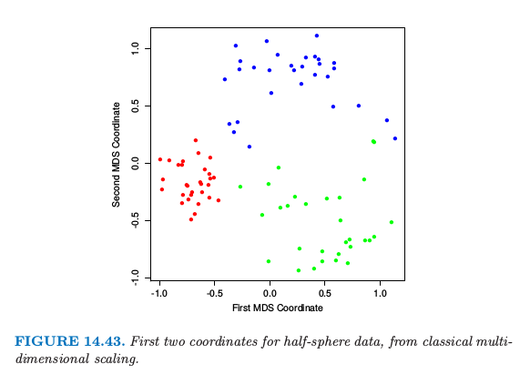

# 多维缩放

| 原文   | [The Elements of Statistical Learning](../book/The Elements of Statistical Learning.pdf) |
| ---- | ---------------------------------------- |
| 翻译   | szcf-weiya                               |
| 时间   | 2017-09-04                   |

自组织图和主曲线以及主曲面都是将$R^p$中的数据点映射到低维流形中。多维缩放(MDS)有着类似的目标，但是以一种不同的方法来解决这个问题。

我们从观测值$x_1, x_2,\ldots, x_N\in R^p$开始，令$d_{ij}$为观测$i$和$j$之间的距。通常我们选择欧式距离$d_{ij}=\Vert x_i-x_j\Vert$，但是也可能采用其它的距离。进一步，在有些应用中，我们可能甚至没有数据点$x_i$，但是仅仅有一些不相似性的测量$d_{ij}$（见14.3.10节）。举个例子，在一项酒的口感的试验中，$d_{ij}$可能是某个体对酒$i$和$j$口感的不同的一个度量，并且该个体对所有酒$i$和$j$都采用这样的度量。MDS仅仅要求不相似性$d_{ij}$，这与需要数据点$x_i$的SOM和主曲线、主曲面不同。

多维缩放寻找值$z_1,z_2,\ldots,z_N\in R^k$来使得被称为压力函数(stress function)最小化

$$
S_M(z_1,z_2,\ldots,z_N)=\sum\limits_{i\neq i'}(d_{ii'}-\Vert z_i-z_i'\Vert)^2\qquad (14.98)
$$

这被称为最小二乘缩放或者Kruskal-Shephard缩放。想法是寻找尽可能保持数据点成对距离的低维表示。注意到近似是关于距离而不是平方距离（这会导致计算有点复杂）。采用梯度下降法来进行最小化$S_M$。

最小二乘缩放的一个变体被称为Sammon mapping，它对下式进行最小化

$$
S_{Sm}(z_1,z_2,\ldots,z_N)=\sum\limits_{i\neq i'}\frac{(d_{ii'}-\Vert z_i-z_i'\Vert)^2}{d_{ii'}}\qquad (14.99)
$$

这里更重视保持小的成对距离。

在经典的缩放中，我们从相似性$s_{ii'}$开始：经常使用中心化后的内积$s_{ii'}=\langle x_i-\bar x,x_{i'}-\bar x\rangle$。则问题变成了在$z_1,z_2,\ldots,z_N\in R^k$上最小化下式

$$
S_C(z_1,z_2,\ldots, z_N)=\sum\limits_{i,i'}(s_{ii'}-\langle z_i-\bar z, z_{i'}-\bar z\rangle)^2\qquad (14.100)
$$

这是很吸引人的，因为有个关于特征向量的显式解：见练习14.11。如果我们有距离数据，而不是内积数据，如果是欧式距离，则可以将它们转换为中心化的内积，参见18章中的式(18.31)。如果事实上相似性为中心化的内积，则经典缩放正好与主成分相等，主成分本质上是线性降维技术。经典缩放不等同于最小二乘缩放；它们的损失函数不同，并且映射可以是非线性的。

最小二乘缩放和经典缩放都被称作度量缩放方法，在某种意义下，实际的非相似性或者相似性是近似的。Shephard-Kruskal 非度量缩放有效地使用秩。非度量缩放在$z_i$和任意的增函数$\theta$上最小化压力函数

$$
S_{NM}(z_1,z_2,\ldots, z_N)=\frac{\sum_{i\neq i'}[\Vert z_i-z_{i'}\Vert - \theta(d_{ii'})]^2}{\sum_{i\neq i'\Vert z_i-z_{i'}\Vert^2}}\qquad (14.101)
$$

当$\theta$固定，我们通过梯度下降在$z_i$上最小化。当$z_i$固定，采用保序回归(isotonic regression)来寻找对$\Vert z_i-z_{i'}\Vert$最好的单调近似$\theta(d_{ii'})$。一直迭代这些步骤直到解达到稳定。

像自组织图和主曲面一样，多维缩放是在低纬坐标系统中表示高纬数据。主曲面和SOM则更进一步，采用低纬的流形来近似原来的数据，在低纬的坐标系统中进行参量化。在主曲面和SOM中，原特征空间中相离比较近的点在流形上也映射在一起，但是特征空间中距离远的点也可能映射到一起。这在多维缩放中不太可能发生，因为它明确地试图保持所有的成对距离。

图14.43显示了对半球例子的经典缩放的前两个MDS坐标。簇之间的分类是很明显的，并且红色簇紧的特性也是显然的。

