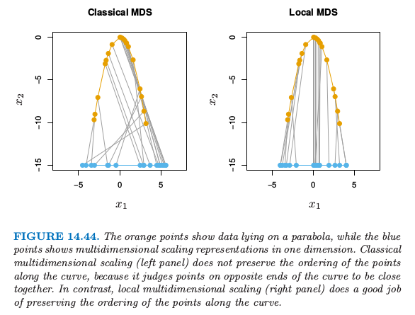

# 14.9 非线性降维和局部多维缩放

| 原文   | [The Elements of Statistical Learning](../book/The Elements of Statistical Learning.pdf) |
| ---- | ---------------------------------------- |
| 翻译   | szcf-weiya                               |
| 时间   | 2017-09-04                   |

最近提出了一些用于非线性降维的方法，类似主表面的思想。想法是数据接近一个嵌在高维空间中的固有的低维非线性流形。这些方法可以看成是“压扁”流形，因此将数据降低至表示流形中相对位置的低纬坐标系统中。在信噪比非常高的问题中非常有用（比如，物理系统），而且对于有低噪声的观测数据不是很有用。

基本的目标在图14.44的左图中进行了说明。数据落在有较大曲率的抛物线附近。经典的MDS不能保持沿着这条曲线的点的顺序，因为它会将处于曲线两端的点看成离得非常近。右图显示了局部多位缩放(local multi-dimensional scaling)的结果，我们将在下面讨论非线性多维缩放的三个方法中的一个。这些方法仅仅使用$p$维中点的坐标，不需要流形的其它信息。局部MDS能够很好地保持沿着曲线的点的顺序。

我们将简短地买欧式用作非线性降维和流形映射的三个新方法。

**等距特征映射算法(ISOMAP)**（Tenenbaum et al. 2000）构造了一个图来近似沿着流形的点之间的测地线距离。具体地，对每个数据点，我们找到其邻居——该点的某个小欧式距离范围内的点。我们构造任意两个邻居点间有条边的图。任意两点的测地线距离则用图中点的最短路径来近似。最终，经典缩放应用到图的距离上，来得到低纬映射。

**局部线性内嵌**(Roweis and Saul, 2000)采用非常的方式，试图保持高纬数据的局部仿射结构。每个数据点用邻居点的线性组合来近似。则低纬表示是寻找保持局部近似的最优方式得到的。

TODO细节

**局部MDS**（Chen and Buja, 2008） 采用最简单的、而且可以说是最直接的方式。定义$\cal N$为附近的两个点的对称集；具体地，如果点$i$在$i'$的$K$最近邻中，则点对$(i, i')$在$\cal N$中，反过来也是如此。于是我们构造了压力函数

$$
S_L(z_1,z_2,\ldots, z_N) = \sum\limits_{(i,i')\in \cal N}(d_{ii'}-\Vert z_i-z_{i'}\Vert)^2 + \sum\limits_{(i,i')\not\in \cal N}w\cdot (D-\Vert z_i-z_{i'}\Vert)^2\qquad (14.105)
$$

这里$D$是某个大的常数，$w$是权重。想法是不是邻居的点看成是距离非常远；这些数据对被赋予小权重$w$使得它们不会主导整个压力函数。为了简化表达式，取$w\sim 1/D$，并令$D\rightarrow \infty$。展开式(14.105)，得到

$$
S_L(z_1,z_2,\ldots, z_N)=\sum\limits_{(i, i')\in\cal N}(d_{ii'}-\Vert z_i-z_{i'})^2-\tau \sum\limits_{(i,i')\not \in \cal N}\Vert z_i-z_{i'}\Vert\qquad (14.106)
$$

其中$\tau =2wD$。式(14.106)试图保持数据的局部性质，而第二项促使非邻居对$(i, i')$的$z_i,z_{i'}$更远。局部MDS在固定邻居个数$K$以及调整参数$\tau$的情况下，在$z_i$上最小化压力函数(14.106)。

图14.44的右图显示了采用$k=2$个邻居和$\tau = 0.01$的局部MDS的结果。我们采用多个起始值的坐标下降来寻找(非凸)损失函数一个好的最小值。沿着曲线的点的顺序大部分都保持了。

图14.45显示了上面的LLE方法的一个有趣的应用。数据包含1965章图象，数字化为$20\times 28$的灰白图象。显示了LLE的前两个坐标结果，并且解释了摆放位置以及表情的一些变异。类似的图象通过局部MDS得到。

在Chen和Buja(2008)报告的实验中，局部MDS与ISOMAP和LLE相比表现得更好。他们也演示了局部MDS对于图象布局的有用应用。它们与这里讨论的一些方法有着紧密的联系，如谱聚类(14.5.3节)和核PCA(14.5.4节)。
