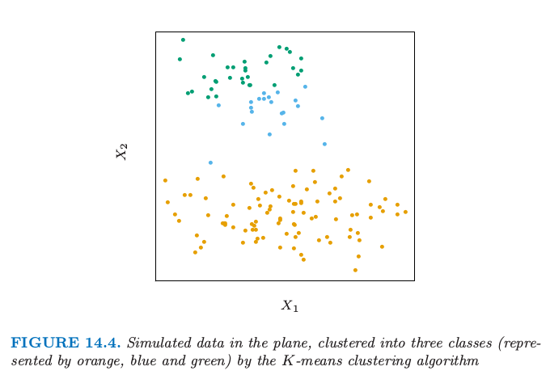
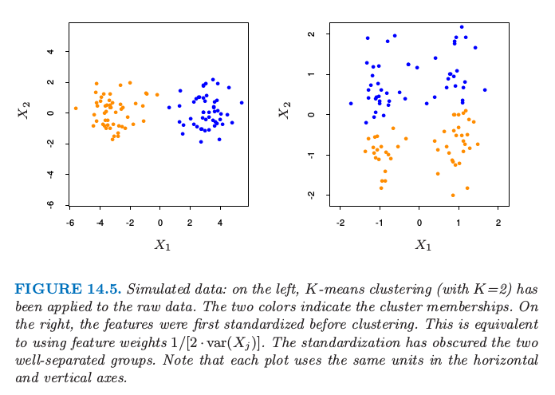
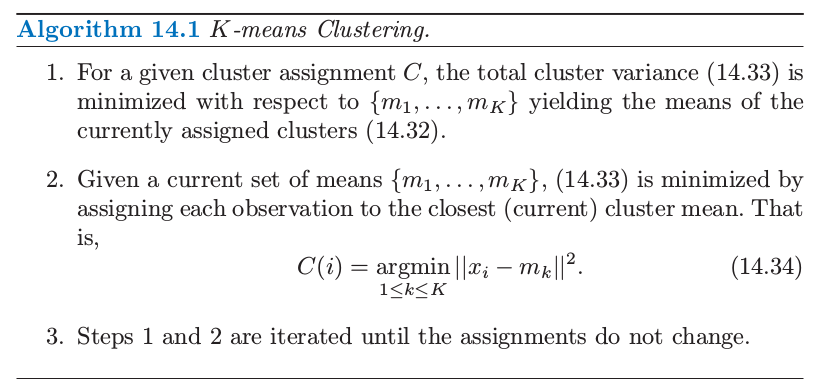
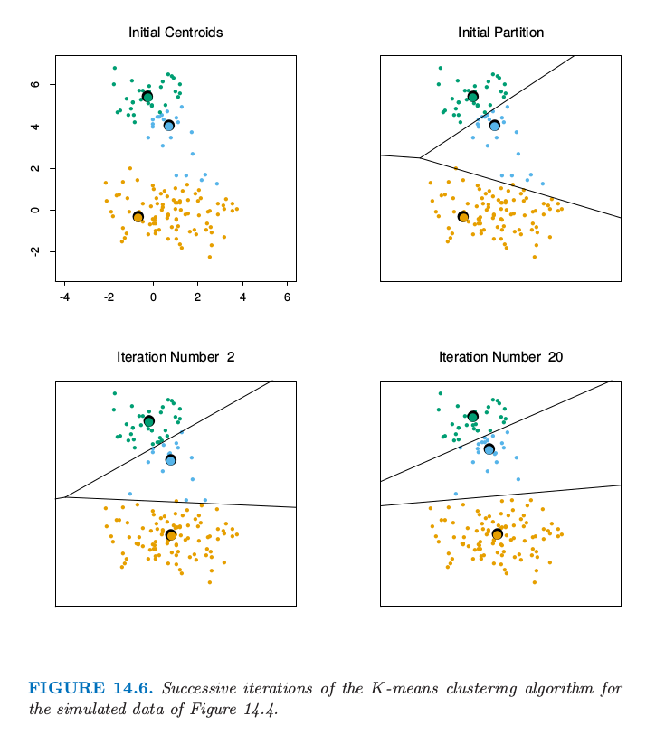
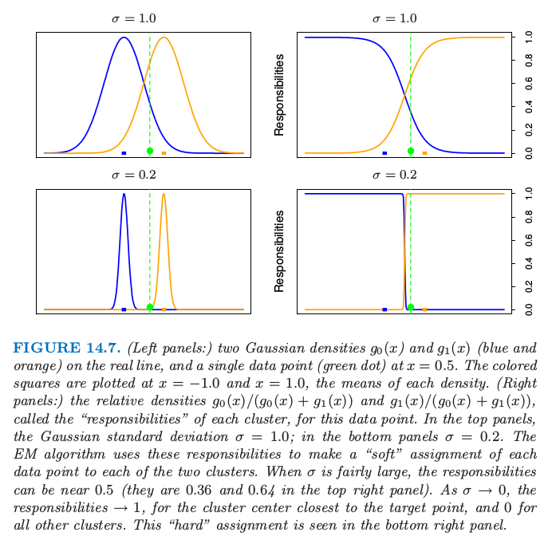
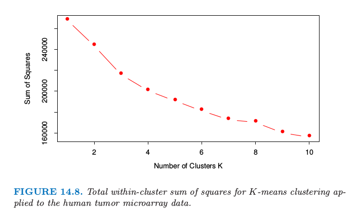
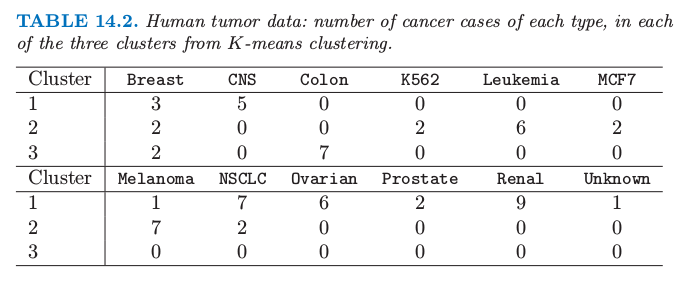
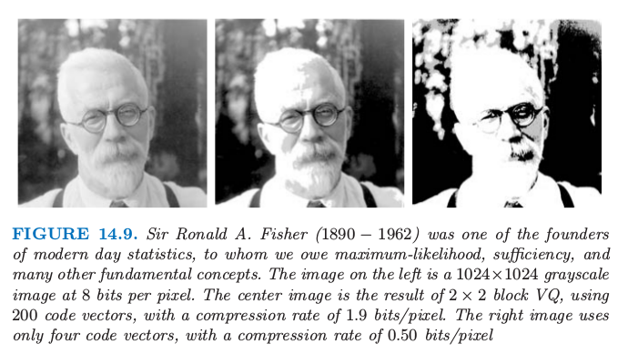

# 14.3 聚类分析

| 原文   | [The Elements of Statistical Learning](../book/The Elements of Statistical Learning.pdf) |
| ---- | ---------------------------------------- |
| 翻译   | szcf-weiya                               |
| 时间   | 2017-02-22:2017-02-23                    |
|更新|2017-12-31 & 2018-01-17|

<!--
!!! note "更新笔记"
    @2017-12-31 大三上学期学过多元统计分析，其中有一次实验是聚类分析．实验报告参见[**这里**](http://rmd.hohoweiya.xyz/3140105707hw5.pdf)（下载[**数据**](http://rmd.hohoweiya.xyz/avenormal.xls)）
-->
!!! note "更新笔记"
    @2018-01-17 解决两个练习题．[Ex. 14.1](https://github.com/szcf-weiya/ESL-CN/issues/42)和[Ex. 14.2](https://github.com/szcf-weiya/ESL-CN/issues/43)

聚类分析(cluster analysis)，也称作数据分离(data segmentation)，有各种不同的目标．所有的目标都与将点集(a collection of objects)分成子集或者簇有关，使得同一个簇中的点比不在同一个簇的点彼此更接近．一个点可以用一系列度量来描述，或者通过与其它点的关系．另外，目标有时是将簇排列成自然分层的形式．这涉及到依次将簇本身进行分类使得在每一层次，同一类中的簇比不在同类的簇彼此更相似．

!!! note "weiya 注：翻译"
    为了更好地表述，将上文中的object翻译成“点”．

聚类分析也用来构造描述型统计量来确定数据点是否包含不同的子群，每个群表示有着显著不同特点的点集．这一目标需要评估被分到各自簇中的点集间的差异程度．

!!! note "weiya注"
    这里谈到了两个目标：第一个提到了hierarchy，这与系统聚类相似；第二个提到用统计量衡量簇间的差异，如各种距离和相似系数．

聚类分析的所有目标的核心是度量要聚类的单个点间相似（或不相似）的程度．聚类方法试图基于点间相似性的定义来将其分类．相似性的定义只能从关注的主题得到．某种程度上，这个情形与确定预测问题（监督学习）中的损失或花费函数相似．在预测问题中，损失函数与错误的预测有关，而错误的预测取决于数据之外的考虑．

!!! note "weiya注"
    简而言之，聚类方法中相似性的定义就如同监督学习问题中损失函数一样重要．

图14.4 显示了通过流行的K-means算法将一些模拟数据聚成三簇．这种情况下其中的两个簇不是很好地分离开，所以“分割（segmentation）”比“聚类（clustering）”能将这部分过程描述得更精确．K-means聚类以猜三个聚类中心为开始．然后交替进行下面的步骤直到收敛：

- 对于每个数据点，确定（欧式空间）中最近的聚类中心．
- 每个聚类中心用与其最近的所有数据点的平均坐标来替换．

> 图14.4. 平面上的模拟数据，用K-means聚类算法聚成三类（分别用橘黄色，蓝色和绿色）．

我们将在后面更详细地描述K-means，包括怎样选取类别数目的问题（例子中是三个）．K-means聚类是从上到下（top-down）的过程，而其他我们描述的分类方式是从下往上（bottom-up）的过程．所有聚类技巧的根本是两个点之间距离或者相似性的度量．我们在描述各种不同的聚类算法之前首先讨论距离的度量．

## 接近矩阵(proximity matrices)

有时数据是直接用点对之间的接近（相似或亲近）来表示．这些可以是相似性(similarities)或者不相似性(dissimilarities)（不同或者不够近似）．举个例子，在社会科学实验中，参与者被要求去判断特定的物品与另一个之间的差异程度．不相似性进一步可以对这些判断进行平均来计算．这种类型的数据可以表示成$N\times N$的矩阵$\mathbf D$，其中$N$为物品数目的个数，并且每个元素$d_{ii'}$记录了第$i$个和第$i'$个物品之间的接近程度．这个矩阵接着作为聚类算法的输入．

大部分算法假定一个非负的不相似性矩阵，对角元素为0：$d_{ii}=0,i=1,2,\ldots,N$．如果原始数据以相似性表示的，则某合适的非负单调下降函数可以用来将它们转换为不相似性．另外，大部分算法假定不相似性矩阵是对称的，所以如果原始矩阵$\mathbf D$不是对称的，则必须用$(\mathbf{D+D^T})/2$来替换．在严格意义下主观判断的差异并不是距离（distances），因为三角不等式$d_{ii'}\le d_{ik}+d_{i'k}$对于所有的$k\in\{1,\ldots,N\}$不满足．因此，一些采用距离的算法不能用这些数据．

## 基于属性的不相似性

大部分情形下我们对变量$j=1,\ldots,p$（也称为属性）在$i=1,2,\ldots,N$上有测量值$x_{ij}$．因为大多数流行的聚类算法将不相似性矩阵作为输入，我们首先必须构造两个观测之间的成对不相似性．在大部分一般情形下，我们定义第$j$个属性上不相似性$d_j(x_{ij},x_{i'j})$，进一步定义
$$
D(x_i,x_{i'})=\sum\limits_{j=1}^pd_j(x_{ij},x_{i'j})\tag{14.20}
$$
作为第$i$和$i'$点的不相似性．至今为止最普遍的选择是平方距离
$$
d_j(x_{ij},d_{i'j})=(x_{ij}-x_{i'j})^2\tag{14.21}
$$
然而，其它的情形也是可能的，而且可以导出潜在的不同的结果．对于非定量的属性（如类别型数据），平方距离可能不合适．另外的，有时候需要对属性赋予不同的权重，而不是像在（14.20）中赋予相等的权重．

我们首先讨论关于属性类别的备选方案．

### 定量变量

这种类型的变量（或属性）的度量用连续实值来表示．将它们间的“误差”定义为关于它们绝对差异的单调增加的函数是很自然的

$$
d(x_i,x_{i'})=l(\vert x_i-x_{i'}\vert)
$$

除了平方误差损失$(x_i-x_{i'})^2$，普遍的选择是单位（绝对误差）．前者更加关注大的差异．另外，聚类可以基于相关系数

$$
\rho(x_i,x_{i'})=\frac{\sum_j(x_{ij}-\bar x_i)(x_{i'j}-\bar x_{i'})}{\sqrt{\sum_j(x_{ij}-\bar x_i)^2\sum_j(x_{i'j}-\bar x_{i'})^2}}\tag{14.22}
$$

其中$\bar x_i=\sum_jx_{ij}/p$．注意到这是在变量上平均，不是在观测上．如果输入已经标准化了，则$\sum_j(x_{ij}-x_{i'j})^2\propto 2(1-\rho(x_i,x_{i'}))$．因此基于协方差（相似性）的分类与基于平方距离（不相似性）是等价的．

### 有序变量

这种类型的变量经常表示成邻接整数，而且实现值也看成有序集．举些例子，如学业成绩(A,B,C,D,F)，偏好程度（can't stand, dislike, OK, like, terrific）．排名数据是一类特别的有序数据．有序变量的误差度量一般通过将它们$M$个原始值（按照原始值规定的顺序）替换为下式来定义
$$
\frac{i-1/2}{M},i=1,\ldots,M\tag{14.23}
$$

于是它们接着可以看成这个尺度下的定量变量．

### 类别变量

对于无序的类别（也称作名义(nomial)）变量，成对数据的差异程度必须明确地表示出来．如果变量假设有$M$个不同的值，可以排列成对称的$M\times M$矩阵，元素$L_{rr'}=L_{r'r},L_{rr}=0,L_{rr'}\ge 0$．最普遍的选择对于所有$r\neq r'$取$L_{rr'}=1$，而不同的损失可以用来突出某些错误．

## 样品的不相似性(object dissimilarity)

接着我们定义将$p$个单属性不相似性$d_j(x_{ij},d_{i'j}),j=1,2,\ldots,p$结合成一个单独的衡量整个不相似性的$D(x_i,x_{i'})$，$D(x_i,x_{i'})$是两个有着各自属性值的点或观测$(x_i,x_{i'})$之间的不相似性．这几乎总是通过加权平均（凸组合）的方式实现
$$
D(x_i,x_{i'})=\sum\limits_{j=1}^pw_j\cdot d_j(x_{ij},x_{i'j});\; \sum\limits_{j=1}^p=1\tag{14.24}
$$
这里$w_j$是为了确定点间的整个不相似性对第$j$个属性赋值的权重，权重表示了这个变量的相对影响．权重的选择取决于具体的问题．

重要的是意识到，对每个变量的设定相同的权重$w_j$（如，$w_j=1\;\forall j$）不一定对所有变量有相同的影响．第$j$个属性$X_j$在点的不相似性$D(x_i,x_{i'})$（14.24）上的影响取决于它的相对贡献，这个相对贡献是对数据集中所有的数据对的平均样品不相似性$\bar D$而言
$$
\bar D=\frac{1}{N^2}\sum_{i=1}^N\sum\limits_{i'=1}^ND(x_i,x_{i'})=\sum\limits_{j=1}^pw_j\cdot \bar d_j
$$
其中，
$$
\bar d_j=\frac{1}{N^2}\sum\limits_{i=1}^N\sum\limits_{i'=1}^Nd_j(x_{ij},x_{i'j})\tag{14.25}
$$
是第$j$个属性的平均不相似性．因此，第$j$个变量的相对影响为$w_j\cdot \bar d_j$，并且令$w_j\sim 1/\bar d_j$会让所有的属性在表征样品间整个不相似性中有相等的影响．举个例子，$p$个定量变量以及对每个坐标使用平方误差距离，接着（14.24）成为以定量变量为坐标轴的$R^p$空间中成对点的（加权）欧氏距离
$$
D_I(x_i,x_{i'})=\sum\limits_{j=1}^pw_j\cdot (x_{ij}-x_{i'j})^2\tag{14.26}
$$

这种情形下（14.25）变成
$$
\bar d_j=\frac{1}{N^2}\sum\limits_{i=1}^N\sum\limits_{i'=1}^N(x_{ij}-x_{x'j})^2=2\cdot var_j\tag{14.27}
$$
其中$var_j$为$Var(X_j)$的样本估计．因此，每个这样变量的相对重要性与其在数据集上的方差成比例．一般地，对所有属性令$w_j=1/\bar d_j$会导致它们中的每一个在成对物体$(x_i,x_{i'})$上的整体不相似性上有相等的影响．尽管这看起来或许合理，并且通常推荐这样做，但是会产生严重的不良后果．如果目标是将数据分割成相似样品的类，所有属性或许不会对样品之间的不相似性的（取决于问题）概念贡献相等．一些属性值的差异可能会在某问题领域反映更大的实际的样品不相似性．

如果目标是发现数据的自然分类，一些属性或许比其他属性表现出更多的分类趋势．在分离类别时，越相关的变量越应该赋予更高的影响来定义object dissimilarity．这种情况下给所有属性相等的影响会趋于隐藏掉这个类别，使得分类算法不能发现它们．图14.5展示了一个例子．

> 图14.5. 模拟数据：左图对原始数据应用K-means（K=2）分类．两种颜色表示类别的成员．右图，聚类之前对特征进行第一次标准化．这等价于使用特征权重$1/[2\cdot var(X_j)]$．标准化模糊了两个能完美分离的类．注意到每张图的横纵坐标使用相同的单位长度．

尽管选择单个属性不相似性$d_j(x_{ij},d_{x_{i'j}})$和它们的权重$w_j$的简单的通用方法会令人愉快，但是在每个单个问题中，没有替代仔细思考的方式．确定一个合适的不相似性的度量远比选择聚类算法来得重要．该问题的这个方面在聚类领域比算法本身强调得少，因为它取决于特定的领域域知识，并且不适合一般性的研究．

最后，观测值经常在一个或多个属性中有缺失值．将缺失值合并到不相似性的计算（14.24）中的最普遍方法是在计算观测$x_i$和$x_{i'}$之间的不相似性时，省略掉至少有一个缺失值的观测对$x_{ij},x_{i'j}$．这个方法在两个观测都没有共同测量值的情况中是不适用的．这种情况下，两个观测都会从分析中删掉．或者，可以使用每个属性未缺失值的平均值或中位数来插补缺失值．对于类别型变量，如果两个物体在相同变量上具有缺失值的情况下将两个对象视为相似是合理的，则可以将缺失值仅仅考虑成另一个类别值．

## 聚类算法

聚类分析的目标是将观测进行分类使得分到同一类中的成对非相似性趋向于比在不同类中小．聚类算法可以分成三种不同的类别：组合算法(combinatorial algorithms)，混合模型(mixture modeling)，以及模式寻找(mode seeking)．

组合算法直接对观测数据进行处理，而不直接引用潜在的概率模型．混合模型假设数据是从某概率密度函数对应的总体中抽取的独立同分布的样本．密度函数用参数化模型表征，该参数化模型为各组分密度函数的混合；每个组分密度表示其中的一类．这个模型接着利用极大似然或者对应的贝叶斯方式来拟合．模式寻找（bump hunters）采用非参数观点，试图直接估计不同的概率密度函数的模式．与每个单独的模式最接近的观测定义为单个簇．

混合模型在6.8节中有讨论．在9.3和14.2.5节中讨论的PRIM算法是模式寻找（或“bump hunters”）的例子．我们接下来讨论组合算法．

## 组合算法

最受欢迎的聚类算法不考虑描述数据的概率模型而直接将每个观测划分为一类或一簇．每个观测用整数$i\in\\{1,\cdots,N\\}$来唯一标号．假定预先确定的类别个数$K < N$，并且每个编号为$k\in\\{1,\ldots,K\\}$．每个观测仅仅分配到一个类中．这些分配可以表示为多对一映射，或者编码器$k = C(i)$，将第$i$个观测分配到第$k$个类．基于每个观测对的不相似性$d(x_i,x_{i'})$来寻找特定的编码器$\{C^\*(i)\}$来实现要求的目标（细节在下面）．一般地，编码器$C(i)$通过给出每个观测$i$的值（类别分配）来显示描述．因此，过程的“参数”是$N$个观测中每个的类别分配．调整这些来最小化表征聚类目标没有达到的程度的“损失”函数．

一种方式是直接确定数学上的损失函数并且试图通过一些组合优化算法来最小化．因为目标是将离得近的点分到同一类，一个自然的损失（或“能量”）函数会是
$$
W(C)=\frac{1}{2}\sum\limits_{k=1}^K\sum\limits_{C(i)=k}\sum\limits_{C(i')=k}d(x_i,x_{i'})\tag{14.28}
$$
这个准则表征了分配到同一类的观测与另一个接近的程度．有时也被称作“类内”点散（point scatter），因为
$$
T=\frac{1}{2}\sum\limits_{i=1}^N\sum\limits_{i'=1}^Nd_{ii'}=\frac{1}{2}\sum\limits_{k=1}^K\sum\limits_{C(i)=k}\Big(\sum\limits_{C(i')=k}d_{ii'}+\sum\limits_{C(i')\neq k}d_{ii'}\Big)
$$
或者
$$
T=W(C)+B(C)
$$
其中$d_{ii'}=d(x_i,x_{i'})$．$T$是总点散，给定数据后为常数，与类别分配是独立的．下面的$B(C)$值是类间点散．
$$
B(C)=\frac{1}{2}\sum\limits_{k=1}\sum\limits_{C(i)=k}\sum\limits_{C(i')\neq k}d_{ii'}\tag{14.29}
$$
当观测分到远离的不同类中时这个值趋向于大．因此有
$$
W(C)=T-B(C)
$$
并且最小化$W(C)$等价于最大化$B(C)$

通过组合优化的聚类分析原则上是直接的．简单地在$N$个点分到$K$个类中的所有可能分配上最小化$W$或等价地最大化$B$．不幸的是，这种穷举法的优化仅仅在非常小的数据集中才适用．不同的分配个数为（Jain and Dubes，1988[^1]）
$$
S(N,K)=\frac{1}{K!}\sum\limits_{k=1}^K(-1)^{K-k}\binom{K}{k}k^N\tag{14.30}
$$
举个例子，$S(10,4)=34,105$是可行的．但是$S(N,K)$随着变量值的增大迅速增大．$S(19,4)\simeq 10^{10}$,并且大多数聚类问题涉及比$N=19$更大的数据集．基于这个原因，实用的聚类算法只能验证所有可能编码$k=C(i)$情形的非常小的一部分．目标是识别处可能包含最优解的小的子集，或者至少好的次优的划分．

这些可行的策略是基于迭代贪婪下降．给定初始划分．每一步迭代，以某种方式来改变类别划分，这种方式使得某准则的值比上一步的值有所改善的．这个类别的聚类算法区别于在每一步迭代修改类别分配的方式．当这种方式不能再改善，算法以当前的分配为其解而终止．因为在任一步的迭代中的类别分配是对上一步类别分配的扰动，只有所有可能分配（14.30）的非常小的一部分被检查．然而，这些算法收敛到局部最优，与全局最优相比可能是高度次优的．

## K-means

K-means算法是最流行的迭代下降聚类方法之一．适用于所有变量都为定量的情形，且选择下式的平方欧式距离作为其不相似性的度量
$$
d(x_i,x_{i'})=\sum\limits_{j=1}^p(x_{ij}-x_{i'j})^2=\Vert x_i-x_{i'}\Vert^2
$$
注意到加权欧式距离可以通过重新定义$x_{ij}$来实现（练习14.1）

!!! note "weiya注: Ex. 14.1 "
    这个可以很容易计算．原问题及解答参见[Issues 42: Ex. 14.1](https://github.com/szcf-weiya/ESL-CN/issues/42)

类间点散（14.28）可以写成
$$
\begin{align}
W(C)&=\frac{1}{2}\sum\limits_{k=1}^K\sum\limits_{C(i)=k}\sum\limits_{C(i')=k}\Vert x_i-x_{i'}\Vert^2\\
&=\sum\limits_{k=1}^KN_k\sum\limits_{C(i)=k}\Vert x_i-\bar x_k\Vert^2\qquad \tag{14.31}
\end{align}
$$
其中$\bar x_k=(\bar x_{1k},\ldots,\bar x_{pk})$是与第$k$个类的均值向量，并且$N_k=\sum_{i=1}^NI(C(i)=k)$．

!!! note "weiya注"
    式(14.31)并不成立，以两个点为例，
    $$
    (x_1-x_2)^2=(x_1-\mu+\mu-x_2)^2\neq (x_1-\mu)^2+(x_2-\mu)^2
    $$．

因此，通过以某种方式将$N$个观测分配到$K$个类中来最小化该准则，该方式为最小化每个类中观测点与类别中心（用该类中的点定义）的不相似性的平均值．

求解下列问题的迭代下降算法
$$
C^*=\underset{C}{min}\sum\limits_{k=1}^KN_k\sum\limits_{C(i)=k}\Vert x_i-\bar x_k\Vert^2
$$
可以通过注意到任意观测集$S$有下式而得到．
$$
\bar x_S=\underset{m}{\text{argmin}}\;\sum\limits_{i\in S}\Vert x_i-m\Vert^2\tag{14.32}
$$
因此我们可以通过求解扩大的优化问题而得到$C^*$
$$
\underset{C,\{m_k\}_1^K}{min}\;\sum\limits_{k=1}^KN_k\sum\limits_{C(i)=k}\Vert x_i-m_k\Vert^2\tag{14.33}
$$
这个可以通过算法14.1给出的交替优化过程得以最小化．

每个步骤1和步骤2都降低准则（14.33）的值，所以收敛性是保证的．然而，结果可能会表现处次优局部最小值．Hartigan and Wong (1979)[^3]的算法进一步研究，并且保证了单个的一个观测从一个类转换到另一个类不会降低目标值．另外，应该用许多初始值的许多随机选择来开始算法，然后选择有最小目标函数的解．

图14.6显示了图14.4的模拟数据的一些K-means迭代过程．重心用O来描述．直线显示了点的划分，每个部分都是离重心最近的点的集合．这个划分也称为Voronoi曲面细分．20次迭代之后收敛．

> 图14.6. 对于图14.4的模拟数据的K-means聚类算法的逐次迭代

## 高斯混合作为Soft K-means聚类

K-means 聚类算法与估计特定的高斯混合模型的EM算法有关．（6.8节和8.5.1节）EM算法的步骤E对每个数据点基于在每个混合部分中的相对密度来赋予“responsibilities”，而步骤M基于当前的responsibilities重新计算各组分的密度参数．假设明确了我们有$K$个混合组分，每个是有着标量协方差矩阵$\sigma^2\mathbf I$的高斯密度．则在每个混合组分的相对密度是关于数据点到混合中心欧氏距离的单调函数．因此在这一步中EM是K-means聚类的soft，使得点以概率（而不是确定性的）分配到聚类中心．因为方差$\sigma\rightarrow 0$，这些概率变成0和1，两种方法也就一致．细节在练习14.2中给出．

!!! note "weiya注: Ex. 14.2"
    Ex. 14.2讨论了$k$个高斯组分的混合模型，而算法8.1针对的是两组分的高斯混合模型，但主要思想是一致的．具体解题过程参见[Issues 43: Ex. 14.2](https://github.com/szcf-weiya/ESL-CN/issues/43)

图14.7说明了实线上两个聚类的结果．

> 图14.7. (左：)实线为两个高斯密度$g_0(x)$和$g_1(x)$（蓝色和橘黄色），以及$x=0.5$处的单个数据点（绿色圆点）．带颜色的方块画在$x=-1.0$和$x=1.0$处，每个密度的均值．（右：）对于数据点来说，相对密度$g_0(x)/(g_0(x)+g_1(x))$和$g_1(x)/(g_0(x)+g_1(x))$称作每个聚类的“responsibilities”．上面一排的两张图，高斯标准误差为$\sigma=1.0$在下面的两张图中$\sigma=0.2$．EM算法用这些responsibilities来对每个数据点做“soft”分配到两个簇中．当$\sigma$相对大，responsibilities可以接近0.5，（右上图中为0.36和0.64）．当$\sigma\rightarrow 0$时，responsibilities接近1，表示聚类中心离目标点很近，0代表是其它的聚类．“hard”版本的分配如右下图所示．

##　例子：人类肿瘤微阵列数据

我们对第１章描述的人类肿瘤微阵列数据应用Ｋ-means聚类．这是一个高维聚类的例子．数据为$6830\times 64$的实值矩阵，每个元素表示基因（行）和样本（列）的表达测量值．这里我们对样本进行聚类，每个都是长度为6830的向量，对应6830个基因的表达值．每个样本有像breast(乳腺癌)，melanoma等标签；聚类时，我们不会用这些标签，但是会验证哪个标签落入到哪个簇中．

我们对从1到10的$K$应用K-means聚类，而且对每次聚类计算总类间平方和，如图14.8所示．一般地我们在平方和曲线中寻找一个结点来定位最优簇的个数（见14.3.11）．这里没有显然的指示：为了说明我们选择$K=3$给出如表14.2所示的三个类．

> 图14.8. 对人类种类微阵列数据应用K-means聚类的总簇间平方和．

> 表14.2. 人类肿瘤数据：每种类型的癌症在由K-means聚类得到的三个类中的个数

我们看到这个过程在聚集同样类型的癌症是很成功的．事实上，在第2类中的两个乳腺癌后来发现是误诊的，而是转移的黑素瘤．然而，K-means聚类在这个应用中有缺点．其中一个是，它没有给出癌症中物体的线性顺序：我们仅仅以字母顺序列出来．第二，当聚类的数目$K$改变，簇中的成员以任意方式变化．也就是，如4个类，这些类不需要嵌套在上面的三个类中．基于这个原因，系统聚类可能在这个应用中更好．

## 向量量化

K-means聚类算法代表了在图像和信号压缩的明显无关的区域中的关键工具，特别在向量量化(vector quantization)或者VQ（Gersho and Gray，1992[^2]）中．图14.9（本例由Maya Gupta准备）的左图像是著名的统计学家Sir Ronald Fisher的电子相片．它包含$1024\times 1024$个像素，每个像素是从0到255的灰度值，因此每个像素需要8位的存储．整张图像占据1M的存储空间．中间图像是左边图像的VQ压缩版本，需要0.239的存储（质量上有一些损失）．右图压缩得更厉害，仅需要0.0625的存储空间（质量上有较大的损失）．

> 图14.9. Sir Ronald A.Fisher(1890-1962)是现代统计学的创始人之一，极大似然法，充分性和许多其他基本概念都是归功于他．左边的图像是1024$\times$1024的灰度图像，每个像素为8位．中间图像是$2\times 2$VQ块的结果，采用200个编码向量，达到1.9bits/pixel的压缩率．右图像仅采用4个编码向量，压缩率为0.50bits/pixel．

这里的VQ版本实现过程是首先将图像分成小块，这里是$2\times 2$的小块的像素．$512\times 512$个4数目的块被视为$R^4$中的向量．在这个空间内运用K-means聚类算法（这种情形下也称为Lloyd算法）．图14.9的中间图像采用$K=200$，而右边图像采用$K=4$．$512\times 512$个像素块中的每一个用它最近的类别中心近似，称为codeword．聚类过程称为编码（encoding），中心的集合称为码本（codebook）．

为了表示近似的图像，我们需要提供对每个块用码本中唯一的量来近似它的空间．每一块需要$log_2(K)$位空间．我们也需要提供码本本身的存储空间，是一个$K\times4$的实值（一般忽略不计）．总的来说，压缩图像的空间为原图像的$log_2(K)/(4\cdot 8)$倍（$K=200$时为0.239，$K=4$时为0.063）．通常表示成单位为bits/pixel的比率：$log_2(K)/4$，分别是1.91和0.50．从重心构造出近似的图像的过程称为解码（decoding）．

为什么我们期望VQ会有效果？原因是日常的图像比如照片，许多块看起来一样．这种情形下许多几乎是纯白的块，类似的不同阴影的纯灰度块．这些仅仅需要一个块来表示它们，以及指向这个快的多个指针．

我们描述的是被称作损失压缩，因为我们的图像是原图的退化版本．这种退化或者失真（distortion）通常用均值平方误差来衡量．这种情形下，$K=200$时$D=0.89$，$K=4$时$D=16.95$．更一般地，比率/失真曲线会用来衡量这种权衡．也可以使用块聚类来实现小损失（lossless）的压缩，并且仍然利用重复的模式．如果需要对原图像进行小损失的压缩，最好的选择是4.48bits/pixel．

我们在上面断言，码本中确定$K$个码字中的每一个需要$log_2(K)$位空间．这采用了固定长度编码，如果一些码字在图像中比其他的出现更频繁，这是无效的．采用Shannon编码理论，我们知道一般地可变长度的编码会更好，并且比率会变成$-\sum_{k=1}^Kp_\ell log_2(p_\ell)/4$．分子中的项是图像中codeword的分布$p_\ell$的熵．采用可变长度编码我们的比例会分别降至1.42和0.39．最后，已经发展出很多VQ的推广：举个例子，树结构的VQ以自上而下、2-均值算法来寻找重心，如第14.3.12节所述．这允许压缩的逐步加细．更多细节或许可以在Gersho and Gray(1992)[^2]的工作中找到．

## K-medoids

TODO

## 实际问题

TODO

## 系统聚类

TODO

[^1]: Jain, A. and Dubes, R. (1988). Algorithms for Clustering Data, Prentice- Hall, Englewood Cliffs, N.J.
[^2]: Gersho, A. and Gray, R. (1992). Vector Quantization and Signal Compression, Kluwer Academic Publishers, Boston, MA.
[^3]: Hartigan, J. A. and Wong, M. A. (1979). [(Algorithm AS 136] A k-means clustering algorithm (AS R39: 81v30 p355-356), Applied Statistics 28: 100–108.
