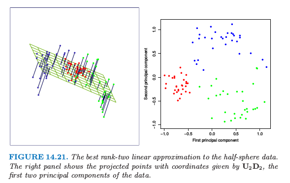
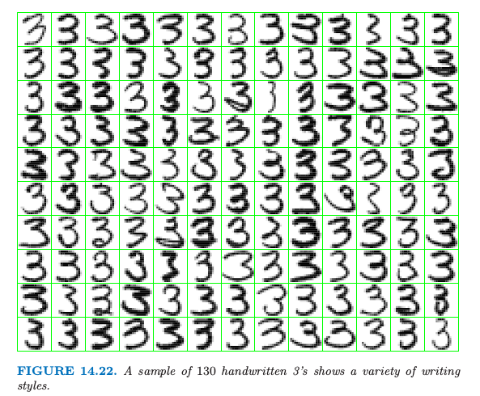
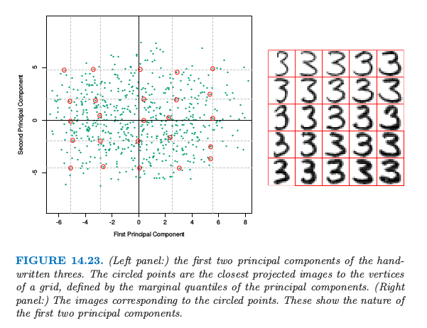
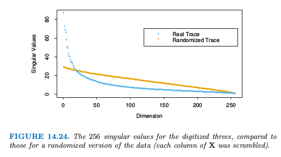
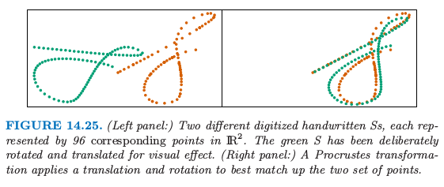
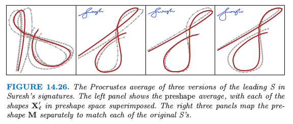
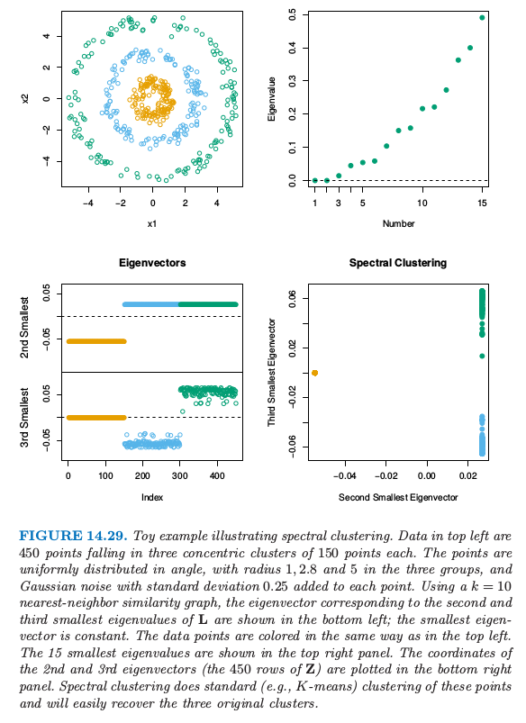
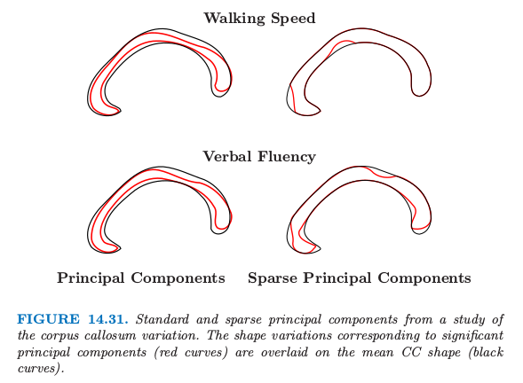
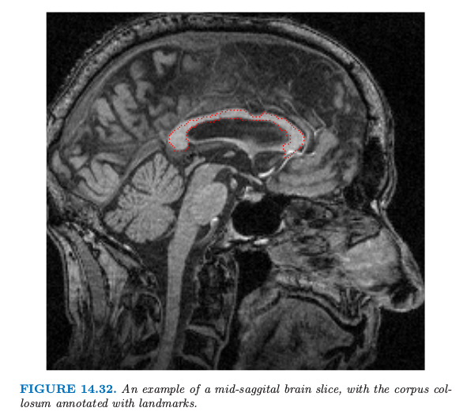

# 14.5 主成分，主曲线和主曲面

| 原文   | [The Elements of Statistical Learning](../book/The Elements of Statistical Learning.pdf) |
| ---- | ---------------------------------------- |
| 翻译   | szcf-weiya                               |
| 时间   | 2016-11-01:2016-10-21                    |
|更新|2018-01-18&2018-01-19&2018-04-17|

!!! note "更新笔记"
    @2018-01-18 完成第一小节（不包含例子），并完成[Ex. 14.7](https://github.com/szcf-weiya/ESL-CN/issues/45)
    @2018-01-19 完成主曲线（面）和谱聚类。

主成分已经在 [3.4.1 节](../03-Linear-Methods-for-Regression/3.4-Shrinkage-Methods/index.html)中讨论了，主成分阐释了岭回归的收缩机理。主成分是数据的投影序列，是互相不相关的且按照方差大小排序的序列。在下一节我们将要把主成分表示成 $N$ 个点 $x_i\in R^p$ 的多重**线性逼近流形 (nonlinear approximating manifolds)**。接着在    14.5.2 节讨论非线性正则化。最近提出的关于多重非线性逼近流形的方法将在 [14.9 节](14.9-Nonlinear-Dimension-Reduction-and-Local-Multidimensional-Scaling/index.html)讨论。

## 主成分

$\IR^p$ 中数据的主成分给出了这些数据在秩 $q\le p$ 下最好的线性逼近。

记观测值为 $x_1,x_2,\ldots,x_N$，然后考虑用秩为$q$的线性模型来表示它们

$$
f(\lambda)=\mu+\mathbf V_q\lambda\qquad (14.49)
$$

其中，$\mu$ 是 $\IR^p $中的位置向量，$\mathbf V_q$ 是有 $q$ 个正交单位列向量的 $p\times q$ 的矩阵，$\lambda$ 是一个 $q$ 维的系数向量。这是一个秩为 $q$ 的仿射超平面的系数表示。图 14.20 和图 14.21 分别展示了$q=1$ 和 $q=2$ 的情形。对数据进行最小二乘拟合这个模型等价最小化**重构误差 (reconstruction error)**

$$
\underset{\mu,\{\lambda_i\},\mathbf V_q}{\min}\sum\limits_{i=1}^N\Vert x_i-\mu-\mathbf V_q\lambda_i\Vert^2\qquad (14.50)
$$

我们可以对上式关于 $\mu$ 和 $\lambda_i$（[练习 14.7](https://github.com/szcf-weiya/ESL-CN/issues/45)）求微分得到

$$
\begin{array}{lll}
\hat\mu&=&\bar x\qquad(14.51)\\
\hat\lambda_i&=&\mathbf V_q^T(x_i-\bar x)\qquad (14.52)
\end{array}
$$

!!! note "weiya注: Ex. 14.7"
    (14.51) 和 (14.52) 的解并不是唯一的，只要满足
    $$
    \mathbf V_q^T\sum\limits_{i=1}^N\lambda_i=N(\bar x-\mu)
    $$
    具体解题过程参见 [Issue: Ex. 14.7](https://github.com/szcf-weiya/ESL-CN/issues/45)

这促使我们去寻找正交矩阵 $\mathbf V_q$:

$$
\underset{\mathbf V_q}{\min}\sum\limits_{i=1}^N\Vert (x_i-\bar x)-\mathbf V_q\mathbf V_q^T(x_i-\bar x)\Vert\qquad (14.53)
$$

为了方便，我们假设 $\bar x=0$（否则我们只需要简单地对数据进行中心化 $\tilde x_i=x_i-\bar x$）。$p\times p$ 矩阵 $\mathbf H_q=\mathbf V_q\mathbf V_q^T$ 是**投影矩阵 (projection matrix)**，并且将每个点 $x_i$ 投影到它的秩为 $q$ 的重构 $\mathbf H_qx_i$ 上，这是 $x_i$ 在由 $\mathbf V_q$ 的列张成的子空间上的正交投影。

!!! note "weiya 注：投影矩阵"
    投影是从一个向量空间到其自身的线性变换，并且投影矩阵满足$\mathbf P^2=\mathbf P$。
    首先，根据$\mathbf H_qx_i=\mathbf V_q\mathbf V^T_qx_i$可以得出投影点是在$\mathbf V_q$的列所张成的子空间中；其次，对于该子空间中任一点$y_i$，其在原空间的坐标为$\mathbf V_qy_i$，计算
    $$
    \begin{align}
    (x_i-\mathbf Px_i)\cdot \mathbf V_qy_i&=(\mathbf I-\mathbf P)x_i\cdot \mathbf V_qy_i\\
    &=x_i^T(\mathbf I-\mathbf P)^T\mathbf V_qy_i\\
    &=x_i^T\mathbf O_{p\times q}y_i\\
    &=0
    \end{align}
    $$
    故为正交投影。

(14.53) 的解可以按如下形式表示。将（中心化的）观测值放进 $N\times p$ 的矩阵 $\mathbf X$ 的行中。构造 $X$ 的奇异值分解：

$$
\mathbf{X=UDV^T}\qquad (14.54)
$$

这是数值分析中标准的分解，并且对该分解有很多的算法（比如，Golub and Van Loan, 1983[^1]）。这里 $\mathbf U$ 是$N\times p$ 的正交矩阵 ($\mathbf{U^TU}=\mathbf I_p$)，它的列向量 $\mathbf u_j$ 称为左奇异向量，$\mathbf V$ 是$p\times p$ 的正交矩阵 ($\mathbf V^T\mathbf V=\mathbf I_p$)，其中的列向量 $\mathbf v_j$ 称之为右奇异向量。对每个秩 $q$，(14.53) 的解 $\mathbf V_q$ 包含 $\mathbf V$ 的前 $q$ 列。$\mathbf{UD}$ 的列称为 $X$ 的主成分（见3.5.1节）。(14.52) 中 $N$ 个最优的 $\hat\lambda_i$ 由前 $q$ 个主成分给出（$N\times q$ 的矩阵 $\mathbf U_q\mathbf D_q$的$N$ 个行向量）。

图 14.20 展示了 $R^2$ 中的一维主成分分析。

对于每个数据点 $x_i$，在直线上有个离它最近的点，由 $u_{i1}d_1v_1$ 给出。这里 $v_1$ 是该直线的方向，并且 $\hat \lambda_i=u_{i1}d_1$ 衡量了沿着直线离原点的距离。类似地，图 14.21 展示了拟合 half-sphere 数据的二维主成分曲面（左图）。右图显示了数据在前两个主成分上的投影。这个投影是之前介绍的 SOM 方法的初始化的基础。这个过程在分离簇方面表现得非常成功。因为 half-sphere 是非线性的，非线性的投影会做得更好，这将是下一节的主题。

主成分还有许多其它的性质，举个例子，线性组合 $\mathbf Xv_1$ 在特征的所有线性组合中有最大的方差；$\mathbf Xv_2$ 在满足$v_2$ 正交 $v_1$ 的所有线性组合中有最大的方差，以此类推。

### 例子：手写数字

主成分是降低和压缩维度的有效工具。我们用第一章中描述的手写数字的例子来说明这个特点。图14.22显示了从658个‘3’中抽取的130个‘3’的样本，每一个都是数字化的$16\times 16$的灰度图象。我们看到书写风格、字体粗细以及字体方向上有显著差异。我们将这些图象看成是$R^{256}$中的点$x_i$，并且通过SVD(14.54)来计算它们的主成分。

图14.23显示了这些数据的前两个主成分。

对于前两个主成分$u_{i1}d_1$和$u_{i2}d_2$，我们计算5%, 25%, 50%, 75%, 95%分位数，并且用它们去定义叠加在图中的长方形网格。圆点表明靠近网格的顶点的图象，而距离主要用这些投影点的坐标来衡量，但也给正交子空间中的组分一些权重。右图显示了对应这些圆点的图象。这帮助我们观察前两个主成分的本质。我们看到$v_1$（水平方向）主要与手写‘3’的下尾有关，而$v_2$（垂直方向）与字体粗细有关。用(14.49)的参数化模型表示，这两个组分的模型有如下形式

<!--
$$
\begin{align}
\hat f(\lambda)&=\bar x+\lambda_1b_1+\lambda_2v_2\\
&=\includegraphics[height=5.6ex]{../img/14/s1.png}+\lambda_1\cdot
\includegraphics[height=5.6ex]{../img/14/s2.png}+\lambda_2\cdot
\includegraphics[height=5.6ex]{../img/14/s3.png}
\end{align}
$$
-->

这里我们以图象形式展示了前两个主成分的方向，$v_1$和$v_2$。尽管有256个可能的主成分，但大约50个主成分解释了90%的方差，12个主成分解释了63%的方差。

图14.24比较了奇异值和相等大小的不相关数据的奇异值，后者通过对$\mathbf X$的每一列进行随机扰动得到。

!!! note "weiya注：奇异值"
    在SVD分解中，$\mathbf{D}$为$p\times p$的对角矩阵，对角元$d_1\ge d_2 \ge \cdots \ge d_p \ge 0$称作$\mathbf{X}$的奇异值。如果一个或多个$d_j=0$,则$\mathbf{X}$为奇异的。

在数字图象中的像素点本质上是相关的，而且因为所有这些图象都是同一个数字，因此相关性甚至更强。（疑问：前者指像素点的相关，但后者似乎是不同点的相关，两者的联系？）相对小的主成分子集是表示高维数据的极好的低维特征。

### 例子：Procrustes转换和形状平均

图14.25在同一张图中展示了两个集合的点，橘黄色和绿色。在这里例子中，这些点表示手写'S'的两个数字化版本，这是从"Suresh"签名中提取的。图14.26展示了整个签名（第三和第四幅图）。这些签名是采用touch-screen设备（超市中很常见的设备）动态采集的。每个$S$有$N=96$个点来表示，记为$N\times 2$的矩阵$\mathbf X_1$和$\mathbf X_2$。这些点之间存在对应关系，$\mathbf X_1$和$\mathbf X_2$的第$i$行表示沿着两个'S'的同一位置。用形态测量(morphometrics)的术语说就是这些点表示两个物体的landmarks。怎样寻找这样一个landmark一般是很困难的，而且因情况而异。在这里，我们采用沿着每个签名的速度信号的dynamic time warping(Hastie et al., 1992[^2])，但是在这里不展开讨论。

右图中，我们已经对绿色点已经采用了平移(translation)和旋转(rotation)的方式来尽可能与橘黄色点匹配——这称之为Procrustes变换（如，Mardia et al., 1979[^3]）。

!!! note "weiya注：Procrustes变换"
    普罗库鲁斯提斯(Procrustes)是希腊神话中非洲的一个土匪，他经常用一个铁床来折磨别人，把抓来的人绑在铁床上，然后根据铁床的长度来裁剪他们的身体长度：那些身材短的人被拉长，那些身材长的人被砍掉多余的部分。

考虑下面的问题：

$$
\underset{\mu, \mathbf R}{min}\Vert \mathbf X_2-(\mathbf X_1\mathbf R+\boldsymbol 1\mu^T)\Vert_F\qquad (14.56)
$$

其中$\mathbf X_1$和$\mathbf X_2$都是对应点的$N\times p$矩阵，$\mathbf R$是标准正交$p\times p$的矩阵，$\mu$是$p$维的位置向量。

!!! note "原书注：$\mathbf R$"
    为了简化问题，只考虑包含反射和旋转的正交矩阵（$O(p)$群）；尽管这里不可能有反射，这些方法可以进一步限制为只允许旋转（$SO(p)$群）。

这里$\Vert \mathbf X\Vert_F^2=trace(\mathbf X^T\mathbf X)$是Frobenius矩阵范数的平方。

令$\bar x_1$和$\bar x_2$是矩阵的列均值向量，$\tilde{\mathbf X}_1$和$\tilde{\mathbf X}_2$是这些矩阵减去均值得到的。考虑SVD分解$\tilde {\mathbf X}_1^T\tilde{\mathbf X}_2=\mathbf U\mathbf D\mathbf V^T$。则(14.56)的解由下式给出(练习14.8)

$$
\begin{align}
\hat{\mathbf R}&=\mathbf U\mathbf V^T\\
\hat\mu&=\bar x_2-\hat{\mathbf R}\bar x_1
\end{align}
\qquad （14.57)
$$

并且这个最小距离被称为Procrustes距离。从该解的形式来看，我们可以将每个矩阵在其列中心点处进行中心化，接着完全忽略掉位置向量。下文假设是这种情形。

带尺度的Procrustes距离解决了更一般的问题

$$
\underset{\beta,\mathbf R}{min}\Vert \mathbf X_2-\beta\mathbf X_1\mathbf R\Vert_F\qquad (14.58)
$$

其中$\beta>0$是正的标量值。$\mathbf R$的解和前面一样，$\hat\beta=trace(D)/\Vert \mathbf X_1\Vert_F^2$

与Procrustes距离有关的是$L$个形状的Procrustes平均，它解决了下面的问题

$$
\underset{\{\mathbf R_\ell\}_1^L,M}{min}\sum\limits_{\ell=1}^L\Vert \mathbf X_\ell \mathbf R_\ell -\mathbf M\Vert_F^2\qquad (14.59)
$$

也就是，在所有的形状中寻找Procrustes距离平方最近的形状$\mathbf X$。这可以通过简单的算法实现：

0. 初始化$\mathbf M=\mathbf X_1$（举个例子）
1. 固定$\mathbf M$，求解$L$个Procrustes旋转问题，得到$\mathbf X_\ell'\leftarrow \mathbf X\hat{\mathbf R_\ell}$
2. 令$\mathbf M\leftarrow \frac 1L\sum\limits_{\ell=1}^L\mathbf X_\ell'$

重复步骤2和3准则直至(14.59)收敛。

图14.26显示了三个形状的简单例子。注意到我们仅仅希望得到旋转的一个解；另外，我们加上约束，使得$\mathbf M$是上三角形式，来强制解是唯一的。我们可以很简单地把缩放合并到定义(14.59)；见练习14.9。

更一般地，我们可以通过下式来定义一系列形状的affine-invariant平均：

$$
\underset{\{\mathbf A_\ell\}_1^L,\mathbf M}\sum\limits_{\ell=1}^L\Vert\mathbf X_\ell\mathbf A_\ell-\mathbf M\Vert_F^2\qquad (14.60)
$$

其中$\mathbf A_\ell$是任意$p\times p$的非奇异矩阵。这里我们要求标准化，使得$\mathbf M^T\mathbf M=\mathbf I$，来避免平凡解。这个解是吸引人的，并且可以不用迭代便可以计算（练习14.10）：

1. 令$\mathbf H_\ell=\mathbf X_\ell(\mathbf X_\ell^T\mathbf X_\ell)^{-1}\mathbf X_\ell^T$为由$\mathbf X_\ell$定义的秩为$p$的投影矩阵
2. $\mathbf M$是$N\times p$的矩阵，其由$\bar{\mathbf H}=\frac{1}{L}\sum\limits_{\ell=1}^L\mathbf H_\ell$的最大$p$个特征向量所构成

## 主曲线和主曲面

主曲线推广了主成分直线，它提供了对$\mathbf R^p$中一系列点的一维光滑曲线的近似。主曲线更一般化，它给出了二维或更高维的流形近似。

我们首先定义随机变量$X\in R^p$的主曲线，并接着讨论有限数据的情形。令$f(\lambda)$为$R^p$中参数化的光滑曲线。因此$f(\lambda)$是有着$p$个坐标的向量函数，每个都是关于单参数$\lambda$的光滑函数。举个例子，可以选择参数$\lambda$为沿着曲线到固定原点的弧长。对于每个数据点$x$，令$\lambda_f(x)$为曲线上离$x$最近的点。如果满足

$$
f(\lambda) = E(X\mid \lambda_f(X)=\lambda)\qquad (14.61)
$$

则$f(\lambda)$称为随机向量$X$的分布的主曲线。这也就是说$f(\lambda)$是投影到曲线上的所有数据点的平均，这些点也称为有“责任”的点。这也称作 self-consistency性质。尽管在实际中，连续多元分布有无穷多个主曲线(Duchamp and Stuetzle, 1996[^4])，但是我们主要对光滑的主曲线感兴趣。图14.27显示了一个主曲线。

主点(Principal points)是与之相关的一个有趣的概念。考虑$k$个原型的集合，对于在分布的支撑集中的每个点$x$，选出最近的原型，也就是，为之负责的那个原型。这导出了对特征空间的划分，得到Voronoi区域。这$k$个点最小化了$X$到其原型的期望距离，它们称为该分布的主点。每个主点是self-consistent，因为它等于其Voronoi区域的$X$的均值。举个例子，当$k=1$，一个圆形正态分布的主点是均值向量；当$k=2$时，成对的点对称排列在通过均值向量的射线上。主点类似$K$-means聚类中的重心的分布。主曲线可以看成是$k=\infty$时的主点，但是限制为光滑曲线，用类似的方式，包含K-means聚类中心的SOM落在一个光滑流形上。

为了寻找某分布的主曲线$f(\lambda)$，我们考虑坐标函数$f(\lambda)=[f_1(\lambda),f_2(\lambda),\ldots, f_p(\lambda)]$，并且令$X^T=(X_1, X_2,\ldots, X_p)$。 考虑下面的轮换过程：

$$
\begin{align}
(a) & \hat f_j(\lambda)\leftarrow E(X_j\mid \lambda(X)=\lambda); \;j=1,2,\ldots, p\\
(b) & \hat \lambda_f(x)\leftarrow argmin_{\lambda'}\Vert x-\hat f(\lambda')\Vert^2
\end{align}
\qquad （14.62）
$$

第一个等式固定$\lambda$，并且加上self-consistentcy的要求(14.61)。第二个等式固定曲线，在曲线上寻找距离每个点最近的点。在有限的数据情形下，主曲线算法以线性主成分开始，迭代(14.62)中的两步直至收敛。散点图光滑器用于估计步骤(a)中的条件期望，这通过将每个$X_j$看成关于弧长$\hat \lambda(X)$的函数来光滑，而且(b)中的投影对于每个观测数据点来实现。证明一般情况下的收敛是很困难的，但是可以证明如果散点图光滑中采用线性最小二乘拟合，则该过程将会收敛至第一线性主成分，这等价寻找矩阵最大特征值的幂法。

主曲面与主曲线有着完全相同的形式，不过是在更高维度下的。使用最普遍的是二维主曲面，其坐标函数为

$$
f(\lambda_1,\lambda_2)=[f_1(\lambda_1,\lambda_2),\ldots, f_p(\lambda_1, \lambda_2)]
$$

上述步骤(a)中的估计通过二维曲面光滑器得到。维数大于2的主曲面很少用到，因为在高维光滑的可视化不是很吸引人。

图14.28展示了对half-sphere数据进行主曲面光滑的结果。图象是作为估计的非线性坐标$\hat \lambda_1(x_i), \hat \lambda_2(x_i)$函数的数据点。图中的类别划分是很显然的。

主曲面非常类似自组织图。如果我们采用核曲面光滑器来估计坐标函数$f_j(\lambda_1，\lambda_2)$，这与SOMs的batch版本(14.48)有着相同的形式。SOM的权重$w_k$恰恰是核的权重。然而，有一个区别，主曲面估计对每个数据点$x_i$估计单独的原型$f(\lambda_1(x_i),\lambda_2(x_i))$。结果是，SOM与主曲面仅仅当SOM原型的个数非常大时两者才一致。

两者之间还有一个区别。主曲面给出了关于坐标函数的整个流形的光滑参量化，而SOMs是离散的并且仅仅产生近似数据的那些估计的原型。主曲面的光滑参量化保持局部的距离：在图14.28中，红色聚类点比绿色或蓝色聚类点更紧凑。在简单的例子中，估计的坐标函数本身是可以知道的：见练习14.13。

##　谱聚类

像K-means这样传统的聚类方法采用spherical 或者elliptical度量来对数据点进行划分。因此当簇是非凸的时候，比如图14.29中左上角的同心圆。

谱聚类是标准聚类方法的推广，而且也是为这些情形所设计的。它与局部多维缩放技巧有着紧密的联系（14.9节）。

出发点是所有观测点对间的成对相似性为$s_{ii'}\ge 0$的$N\times N$矩阵。我们将这些观测用无向相似性图$G=\langle V, E \rangle$来表示。$N$个顶点$v_i$表示观测值，如果成对顶点的相似性为正值（或者超出某个阈值），则它们之间用一条边相连。边的权重为$s_{ii'}$。我们希望对这个图进行划分，使得不同类之间的边有较低的权重，而在类间有着较高的权重。在谱聚类中，思想是构造相似性图来表示观测点间的局部邻居关系。

更精确地，考虑$N$个点$x_i\in R^p$，令$d_{ii'}$为$x_i$和$x_{i'}$间的欧几里得距离。我们将radical-kernel gram 矩阵作为我们的相似性矩阵；也就是 $s_{ii'}=exp(-d_{ii'}^2/c)$，其中$c > 0$是缩放参数。

有许多方式来定义相似性矩阵，并且其与反映局部行为的相似性图有关。最流行的方式是mutual K-nearest-neighbor graph。定义${\cal{N}}\_K$为邻居点的对称子集；特别地，如果点$i$在$i'$的最近邻中，则点对$(i,i')$在${\cal{N}}\_K$中，反之亦然。接着我们连接所有的对称最近邻，然后给出边的权重$w_{ii'}=s_{ii'}$；否则边的权重为0。等价地，我们对不属于$\cal{N}_K$的点的成对相关性赋为0，然后画出这个修改版本的矩阵的图。

另外，全连接图包含所有的成对边，权重为$w_{ii'}=s_{ii'}$，局部行为通过缩放参数$c$来控制。

从相似图得到的边的矩阵$\mathbf W=\\{w_{ii'}\\}$称为邻接矩阵。结点$i$的度为$g_i=\sum_iw_{ii'}$，与该点相连的权重之和。令$\mathbf G$表示对角元为$g_i$的对角矩阵。

最后，graph laplacian定义为

$$
\mathbf{L=G-W}\qquad (14.63)
$$

这称为未标准化的graph lapacian，人们提出一系列标准化的版本——对laplacian关于结点的度进行标准化，举个例子，$\tilde{\mathbf L}=\mathbf I-\mathbf G^{-1}\mathbf W$。

谱聚类寻找对应$\mathbf L$最小的$m$个特征值（忽略平方的常值特征向量）的$m$个特征向量$\mathbf Z_{N\times m}$。采用如K-means的标准方法，我们可以将$\mathbf Z$的行聚类得到原始数据点的聚类。

图14.49展示了一个例子。左上图显示了在3个圆形类别中的450个模拟数据点。K-means聚类很明显对于簇外的点不容易进行分类。我们采用10最近邻相似图的谱聚类，并且右下图展示了对应graph laplacian的第二和第三最小特征值的特征向量。这两个特征向量找出了是哪个簇，并且特征向量矩阵$\mathbf Y$的行的散点图清晰地将簇分隔开。对变换后的点应用K-means聚类的过程同样能得到三个类。

为什么谱聚类有效？对于任意向量$\hat{\mathbf f}$，我们有

$$
\begin{align}
\mathbf f^T\mathbf L\mathbf f&=\sum\limits_{i=1}^Ng_if_i^2-\sum\limits_{i=1}^N\sum\limits_{i'=1}^Nf_if_{i'}w_{ii'}\\
& = \frac{1}{2}\sum\limits_{i=1}^N\sum\limits_{i'=1}^Nw_{ii'}(f_i-f_{i'})^2\qquad (14.64)
\end{align}
$$
公式(14.64)表明如果有较大邻接的数据对的坐标$f_i$和$f_{i'}$很接近，则$\mathbf f^T\mathbf L\mathbf f$将达到较小的值。

因为对于任意的图$\boldsymbol 1^T\mathbf L\boldsymbol 1=0$，常值向量是特征值为0的平凡解。如果图是连接的，这是唯一的0特征向量,这个结论并不是很显然（练习14.21）。推广这个结论，可以很简单地证明对于有$m$个连接组分的图，可以重新排列结点使得$\mathbf L$是成块对角的，其中每个块是连接的组分。于是$\mathbf L$有$m$个特征值为0的特征向量，并且特征值为0的特征空间由连接组分的指示向量张成。实际上，连接有强有弱，则零特征值也可以用较小的特征值代替。

谱聚类是寻找非凸簇的一种很有趣的方法。当采用标准化后的graph laplacian定义，有另外一种方式来看这种方法。定义$\mathbf P=\mathbf G^{-1}\mathbf W$，我们考虑在图上以转移概率矩阵$\mathbf P$进行随机游走。则谱聚类得到随机游走中类与类之间不发生转移的点集。

在实际中应用谱聚类时必须要处理一系列的问题。我们必须选择相似图的类型——比如，全连接或者最近邻，以及相关的参数比如最近邻的个数$k$或者核的缩放参数$c$。我们也必须选择从$\mathbf L$中提取的特征向量的个数，以及最后和所有聚类方法一样，选择簇的个数。在图14.29这一简单例子中，我们得到$k\in [5, 200]$中良好的结果，值为200的对应全连接图。当$k < 5$，结果变坏。观测图14.29的右上图，我们看到最小的三个特征值与剩余部分没有强烈的分离。因此选择多少个特征向量并不清楚。

## 核主成分

## 稀疏主成分

[^1]: Golub, G. and Van Loan, C. (1983). Matrix Computations, Johns Hopkins University Press, Baltimore.
[^2]: Hastie, T., Kishon, E., Clark, M. and Fan, J. (1992). A model for signature verification, Technical report, AT&T Bell Laboratories. http://www-stat.stanford.edu/∼hastie/Papers/signature.pdf .
[^3]: Mardia, K., Kent, J. and Bibby, J. (1979). Multivariate Analysis, Academic Press.
[^4]: Duchamp, T. and Stuetzle, W. (1996). Extremal properties of principal curves in the plane, Annals of Statistics 24: 1511–1520.
