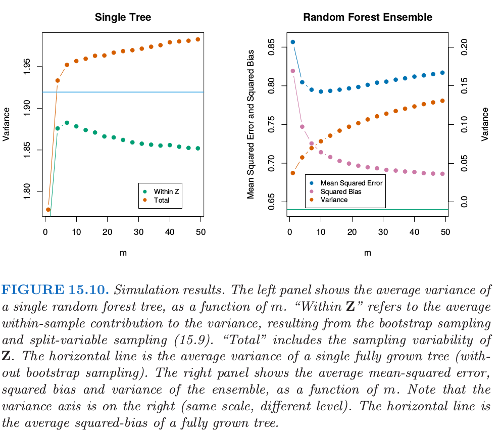
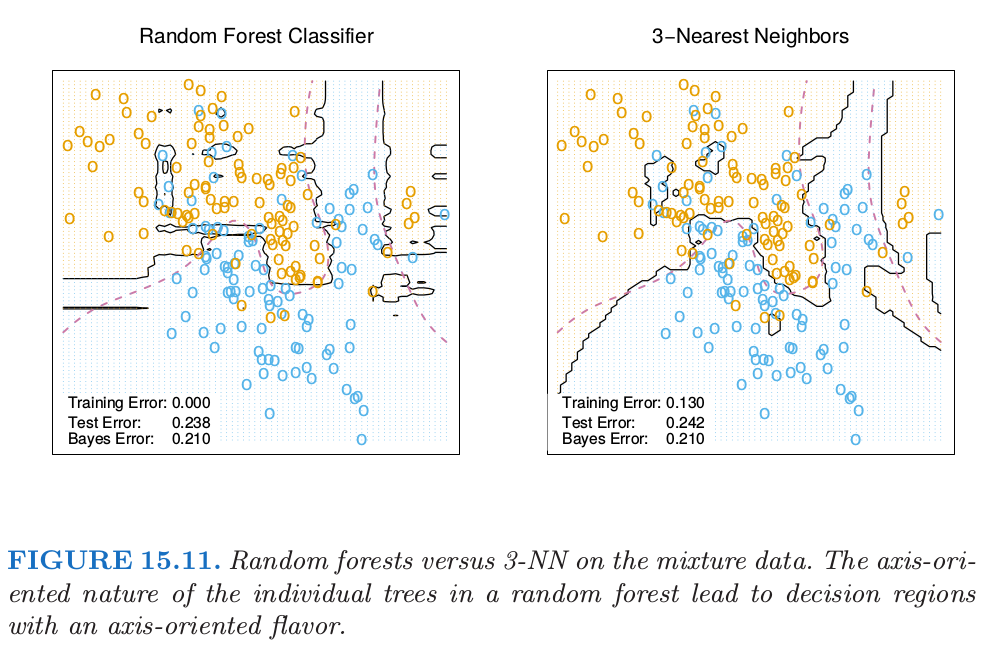

# 随机森林的分析

| 原文   | [The Elements of Statistical Learning](../book/The Elements of Statistical Learning.pdf) |
| ---- | ---------------------------------------- |
| 翻译   | szcf-weiya                               |
| 时间   | 2018-01-03                              |

这一节我们分析随机森林应用的额外随机化的机制。为了讨论，我们集中在回归和平方误差损失，因为这会得到主要结论，而0-1损失下的偏差和方差都会更复杂（见7.3.1节）。另外，甚至在分类问题的情形中，我们可以将随机森林的平均看成是类别后验概率的估计，因为偏差和方差都是合适的描述器。

## 方差和去相关性的影响

随机森林回归估计量的极限形式$B\rightarrow \infty$是

$$
\hat f_{rf}(x)=\mathrm E_{\Theta\mid Z}T(x;\Theta(Z))\qquad (15.4)
$$

其中我们已经显式地表达了对训练数据$Z$的依赖性。这里我们考虑在单个目标点$x$的估计。从(15.1)式我们可以看到

$$
\mathrm{Var}\hat f_{rf}(x)=\rho(x)\sigma^2(x)\qquad (15.5)
$$

!!! note "Recall"
    $$
    \rho\sigma^2+\frac{1-\rho}{B}\sigma^2 \qquad (15.1)
    $$

这里

- $\rho(x)$是任意一对参与平均的树的的采样相关性:
$$
\rho(x)=\mathrm{corr}[T(x;\Theta_1(Z)),T(x;\Theta_2(Z))]\qquad (15.6)
$$
其中$\Theta_1(Z)$和$\Theta_2(Z)$是随机抽取的一对随机森林树，这些树是根据$Z^\*$（$Z^\*$是随机抽取$Z$得到的自助样本）生成的。
- $\sigma^2(x)$是任意随机抽出的单棵树的采样方差
$$
\sigma^2(x)=Var T(x;\Theta(Z))\qquad (15.7)
$$

!!! note "weiya注"
    这里给我的直观感觉是给定$x$，随机变量$\Theta_1,\Theta_2\sim f(\Theta)$，$f(\Theta)$为采样分布，考虑$\Theta$的方差$\sigma^2(x)$和$\Theta_1$与$\Theta_2$的相关系数$\rho(x)$。

很容易将$\rho(x)$与在给定随机森林树集中的拟合树的平均相关系数混淆；后者是，将拟合树看成$N$维向量，然后在训练样本数据的条件下，计算这些向量的平均成对相关系数。但$\rho(x)$不是这样，它不直接与平均过程有关，并且$\rho(x)$中依赖的$x$提醒我们这个区别。更准确地说，$\rho(x)$是在$x$处取值的成对随机森林树的理论相关系数，首先从总体中重复抽取训练样本$Z$，然后抽取一对随机森林树计算得到$\rho(x)$。用统计的术语说，这是由$\mathbf Z$和$\Theta$的采样分布导出的。

!!! note "weiya注"
    这里说“重复抽取训练样本$Z$”，相当于也将训练样本看成是随机变量，而随机森林是在$\mathbf Z$的条件下得到的。

更准确地，式(15.6)和(15.7)中计算的平均波动的都是

- 在$\mathbf Z$的条件下：因为自助采样和在每个分割点的特征采样，以及
- $\mathbf Z$自身的采样波动的结果

实际上，在$x$处拟合的成对树的条件协方差为0，因为自助采样和特征采样都是独立同分布的，见练习15.5。

!!! note "weiya注： Ex. 15.5"
    证明成对随机森林树在点$x$的采样相关性由下式给出
    $$
    \rho(x)=\frac{Var_{\mathbf Z}[E_{\Theta\mid\mathbf Z}T(x;\Theta(\mathbf Z))]}{Var_{\mathbf Z}[E_{\Theta\mid\mathbf Z}T(x;\Theta(\mathbf Z))]+E_{\mathbf Z}Var_{\Theta\mid \mathbf Z}[T(x;\Theta(\mathbf Z))]}\qquad (15.12)
    $$
    证明过程如下：
    $$
    \begin{align}
    \rho &=\mathrm{corr}[T(x;\Theta_1(Z)),T(x;\Theta_2(Z))]\\
    &=\frac{Cov(T(x;\Theta_1(Z)), T(x;\Theta_2(Z)) )}{\sqrt{Var(T(x;\Theta_1(Z)))Var(T(x;\Theta_2(Z)))}}\\
    &=\frac{E[Cov_{\Theta_i\mid Z}(T(x;\Theta_1(Z)), T(x;\Theta_2(Z)))]+Cov[E_{\Theta_1\mid Z}T(x;\Theta_1(Z)), E_{\Theta_2\mid Z}T(x;\Theta_2(Z))]}{\sqrt{E[Var_{\Theta_1\mid Z}T(x;\Theta_1(Z))]+Var[E_{\Theta_1\mid Z}T(x;\Theta_1(Z))]}\sqrt{E[Var_{\Theta_2\mid Z}T(x;\Theta_2(Z))]+Var[E_{\Theta_2\mid Z}T(x;\Theta_2(Z))]}}
    \end{align}
    $$
    因为$T(x;\Theta_i(Z))$的自助采样和特征采样分别是独立同分布的，则$Cov_{\Theta_i\mid Z}[T(x;\Theta_1(Z)),T(x;\Theta_2(Z))]=0$且
    $$
    \begin{align}
    E_{\Theta_1\mid Z}T(x;\Theta_1(Z)&=E_{\Theta_2\mid Z}T(x;\Theta_2(Z))\\
    Var_{\Theta_1\mid Z}T(x;\Theta_1(Z))&=Var_{\Theta_2\mid Z}T(x;\Theta_2(Z))
    \end{align}
    $$
    则
    $$
    \begin{align}
    \rho &=\frac{Var_{\mathbf Z}[E_{\Theta\mid\mathbf Z}T(x;\Theta(\mathbf Z))]}{Var_{\mathbf Z}[E_{\Theta\mid\mathbf Z}T(x;\Theta(\mathbf Z))]+E_{\mathbf Z}Var_{\Theta\mid \mathbf Z}[T(x;\Theta(\mathbf Z))]}
    \end{align}
    $$
    证毕。

<!--
$$
\begin{align}
\rho &=\mathrm{corr}[T(x;\Theta_1(Z)),T(x;\Theta_2(Z))]\\
&=\frac{Cov(T(x;\Theta_1(Z)), T(x;\Theta_2(Z)) )}{\sqrt{Var(T(x;\Theta_1(Z)))Var(T(x;\Theta_2(Z)))}}\\
&=\frac{E[Cov(T(x;\Theta_1(Z)), T(x;\Theta_2(Z))\mid Z)]+Cov[E(T(x;\Theta_1(Z))\mid Z), E(T(x;\Theta_2(Z))\mid Z)]}{\sqrt{E[Var(T(x;\Theta_1(Z))\mid Z)]+Var[E(T(x;\Theta_1(Z)))]}\sqrt{E[Var(T(x;\Theta_2(Z))\mid Z)]+Var[E(T(x;\Theta_2(Z)))]}}
\end{align}
$$
~~暂时不能给出严谨的证明:disappointed:~~
但有个类比的想法。记得在线性回归中，对于(复)相关系数$R$，我们有
$$
\begin{align}
R^2&=\frac{ESS}{TSS}\\
&=\frac{(\hat Y-\bar y\boldsymbol 1_n)'(\hat Y-\bar y\boldsymbol 1_n)}{(Y-\bar y\boldsymbol 1_n)'(Y-\bar y\boldsymbol 1_n)}\\
&=\frac{Var(\hat Y)}{Var(Y)}\\
&=\frac{Var(E(Y\mid X))}{Var(Y)}
\end{align}
$$
上式中$\hat Y$其实是$E(Y\mid X)$的一个估计。这与我们所要证的会不会有所关联呢？其实对应起来看，我有点怀疑(15.2)的左边应该为$\rho^2(x)$，而非$\rho(x)$。
-->

接下来的论证基于下面的模拟模型

$$
Y=\frac{1}{\sqrt{50}}\sum\limits_{j=1}^{50}X_j+\epsilon\qquad (15.8)
$$

其中所有$X_j$和$\epsilon$都是独立高斯分布。我们用500个大小为100的训练集，以及600个测试点的单个测试集。因为回归树关于$\mathbf Z$是非线性的，我们在下面看到的模式将会取决于模型的结构而有些不同。

图15.9展示了当$m$降低时成对树间的相关性(15.6)也降低：如果不同训练集$\mathbf Z$的成对树不使用同样的分割变量，则在$x$处的预测很可能不相似。

在图15.10的左边，我们考虑单棵树预测的方差，$VarT(x;\Theta(\mathbf Z))$（在我们模拟的模型中随机抽取的600个预测点$x$上平均）。

这是总的方差，而且可以采用条件方差公式分解成两部分（见练习15.5）：

$$
\begin{align}
Var_{\Theta,\mathbf Z}T(x;\Theta(\mathbf Z))&=&Var_{\mathbf Z}E_{\mathbf \Theta\mid \mathbf Z}T(x;\Theta(\mathbf Z))&+E_{\mathbf Z}Var_{\Theta\mid \mathbf Z}T(x;\Theta(\mathbf Z))\\
Total\; Variance&=&Var_{\mathbf Z}\hat f_{rf}(x)&+\text{within-}\mathbf Z\; Variance
\end{align}
\qquad (15.9)
$$

!!! note "weiya注： 条件方差公式"
    概率论中，全方差率(law of total variance)或条件方差公式(conditional variance formulas)表明，若$X$与$Y$为同一个概率空间的随机变量，且$Y$的方差有限，则
    $$
    Var(Y)=E(Var(Y\mid X))+Var(E(Y\mid X))
    $$
    证明如下：
    $$
    \begin{align}
    Var(Y)&=E(Y^2)-(EY)^2\\
    &=E(E(Y^2\mid X))-[E(E(Y\mid X))]^2\\
    &=E(Var(Y\mid X)+(E(Y\mid X))^2) - [E(E(Y\mid X))]^2\\
    & = E(Var(Y\mid X)) + Var(E(Y\mid X))
    \end{align}
    $$
    参考[Law_of_total_variance](https://en.wikipedia.org/wiki/Law_of_total_variance)

第二项是$\mathbf Z$间方差——随机化的结果，会随着$m$降低而增大。第一项实际上是随机森林集（显示在图15.19的右边）中的采样方差，会随着$m$降低而降低。单棵树的方差在$m$的大部分取值范围内不会有明显的改变，因此根据式(15.5)，随机森林集的方差显著比树的方差要低。

## 偏差

和bagging中一样，随机森林的偏差与任意单棵采样后的树$T(x;\Theta(\mathbf Z))$一样：

$$
\begin{align}
Bias(x) &= \mu(x)-E_{\mathbf Z}\hat f_{rf}(x)\\
&=\mu(x)-E_{\mathbf Z}E_{\Theta\mid \mathbf Z}T(x;\Theta(\mathbf Z))\qquad (15.10)
\end{align}
$$

因为随机化和减小的样本空间的约束，这一般比由$\mathbf Z$生成的未剪枝的树的偏差的绝对值要大。因此通过bagging或随机森林对预测带来的改善仅仅是方差降低的结果。

偏差的所有讨论都依赖于未知的真实函数。图15.10的右图展示了我们可加模拟模型的平方偏差（通过500次实现估计得到）。尽管对于不同的模型，偏差曲线的形状(shape)和变化率(rate)可能不同，但是一般的趋势是当$m$降低时，偏差增大。图中展示的是均方误差，并且我们在$m$的选择中看到了经典的偏差-方差的权衡。对所有的$m$，随机森林的平方偏差比单棵树的平方偏差（水平线）要大。

这些模式表现出与岭回归的相似性(3.4.1节)。当大量的变量有着相似大小的系数，岭回归会非常有用，岭回归将它们的系数收缩到0，并且将那些强相关的变量收缩到一起。尽管训练样本的大小可能不允许所有的变量都出现在模型中，但是通过岭回归正则化能使模型稳定并且允许所有的变量都有它们的影响（尽管被削弱了）。$m$较小的随机森林表现出相似的平均。每个相关的变量都会成为主分割变量，并且随机森林树集的平均降低了任一单个变量的贡献。因为模拟例子(15.8)是基于关于所有变量的线性模型，岭回归达到了更低的均方误差（大约为0.45，当$df(\lambda_{opt})\approx 29$）。

## 自适应最近邻

随机森林分类器与$k$最近邻分类器（13.3节）有许多相同的地方；实际上前者是后者的加权版本。因为每棵树生长到最大时，对于特定的$\Theta^\*$，$T(x;\Theta^\*(\mathbf Z))$是其中一个训练样本的响应变量的值。生成树算法任意从中选择最有信息量的预测量，寻找到该观测的最优路径。平均的过程是对训练响应变量赋予权重，这最终对预测值进行投票。因此通过随机森林的投票机制，那些靠近目标点的观测赋予了权重——一个等价核——这些结合在一起形成了分类边界。

图15.11展示了3-最近邻和随机森林在混合数据中的判别边界的相似性。

