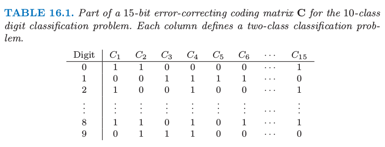

# 16.1 导言

| 原文   | [The Elements of Statistical Learning](../book/The Elements of Statistical Learning.pdf) |
| ---- | ---------------------------------------- |
| 翻译   | szcf-weiya                               |
| 时间   | 2017-01-29                               |

集成学习的思想是通过结合一系列简单基础模型的优点来建立一个预测模型。我们已经看到有很多这类的例子。

8.7节的bagging和第15章的随机森林都是分类的集成学习的方法，其中树的每个committee对预测的类别都有一个投票。第10章中的boosting一开始也是以一种committee的方法提出来的，尽管不同于随机森林，weak learners的committee随着时间不断进化，并且成员进行带有权重的投票。stacking（8.8节）是结合一系列拟合模型长处的新方式。事实上，可以将任何字典方法用充当weak learners的基函数特殊化为集成学习的方法，比如回归样条。

非参回归的贝叶斯方法也可以看成是集成学习的方法：一系列数目比较多的候选模型被关于它们参数设定的后验分布平均（比如，Neal和Zhang，2006）

集成学习可以分成两个任务：从训练集中建立基本学习的总体，然后结合它们形成复合预测。这章中我们进一步讨论boosting技术；它通过在weak learners的高维空间中指导一个正规化和监督的搜索来建立集成模型。

关于集成学习的一个很早的例子是使用error-correcting output codes (Dietterich and Bakiri, 1995, ECOC)对多个类别进行分类。考虑10个类别的数字分类问题，编码矩阵$\mathbf{C}$由表16.1给出

> 表16.1 对于10个类别的数字分类问题的15位error-correcting output codes矩阵 $\mathbf C$ 的部分。每一列定义了一个两个类别的分类问题。

注意到编码矩阵的第$\ell$列 $\mathbf C_\ell$定义了一个两个类别的变量可以将所有的原始类别合并成两个大类。这个方法按照下列步骤进行：

1. 对每个由编码矩阵的列定义的$L=15$个两类别的学习问题，单独进行学习分类器。
2. 在每一个测试点$x$上，$\hat p_\ell (x)$第 $\ell $个响应的预测概率。
3. 定义$\delta_k(x)=\sum_{\ell=1}^L\vert C_{k\ell}-\hat p_\ell(x)\vert$,是第$k$个类别的判别函数，其中$C_{k\ell}$是表16.1第$k$行和第$\ell$列的值。

$\mathbf C$的每一行是表示该类的二进制编码。行有更多的二进制位数是必要的，而且冗余的“error-correcting”位数在一些不精确的情形下是允许的，而且可以提高模型的效果。事实上，上面的全编码矩阵$\mathbf C$在任意两列中有一个最小的Hamming距离7。注意到甚至响应指示变量编码（4.2节）是多余的，因为10个类别仅仅需要$[log_210=4]$位来实现唯一表示。Dietterich和Bakiri在1995年证明了当分类数作为基分类器会使得不同的多类别问题有显著性提高。

James和Hastie（1998）分析ECOC方法，而且证明了随机编码分配和最优结构化error-correcting编码。他们也提出这种编码的好处在于降低方差（和bagging和随机森林一样），因为不同的编码问题会引出不同的树，另外上面解码步骤（3）跟平均(averaging)有相似的影响。

!!! "weiya 注："
	Hamming距离为两个向量不匹配的值的个数。
