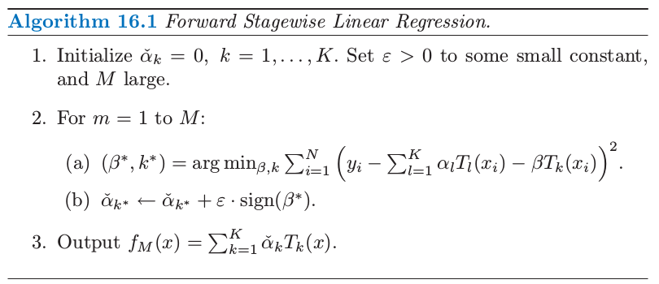
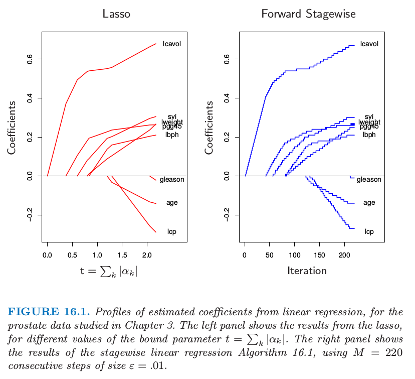

# boosting和正则化路径

| 原文   | [The Elements of Statistical Learning](../book/The Elements of Statistical Learning.pdf) |
| ---- | ---------------------------------------- |
| 翻译   | szcf-weiya                               |
| 时间   | 2017-03-09                               |

在这本书第一版的第10.12.2节中，我们表明了由梯度加速算法产生的模型序列与在高维特征空间中拟合的正则模型是相似的。这最初是通过观测到boosted的线性模型和lasso之间（第3.4.2节）有着紧密联系得到的。我们和其他人一起研究这些联系，并且在这里放上我们对这个领域当前的思考。我们从最初的动机开始，这更自然地适合于本章的集成学习。

!!! note "weiya注"
    上述中的作者当然是指Hastie，Tibshirani和Friedman他们咯:joy:

## 惩罚回归

梯度加速的收缩策略(10.41)的成功直觉上可以通过类比含有很大的基展开的惩罚线性回归得到。考虑所有可能的$J$个终止结点的回归树$\cal T=\{T_k\}$的字典作为$R^p$的基函数，这在训练数据上可以实现。线性模型为
$$
f(x)=\sum\limits_{k=1}^K\alpha_kT_k(x)\qquad (16.1)
$$

其中$K=card(\cal T)$。假设系数通过最小二乘进行估计。因为这些树的个数可能比最大训练集大很多，所以需要一些正则化。令$\hat\alpha(\lambda)$使得

$$
\underset{\alpha}{min}\{\sum\limits_{i=1}^N(y_i-\sum\limits_{k=1}^K\alpha_kT_k(x_i))^2+\lambda\cdot J(\alpha)\}\qquad (16.2)
$$

$J(\alpha)$是关于系数的函数，并且一般惩罚较大的值。比如

$$
\begin{align}
J(\alpha) &=\sum\limits_{k=1}^K\vert \alpha_k\vert^2\qquad \text{岭回归}\qquad (16.3)\\
J(\alpha) &=\sum\limits_{k=1}^K\vert\alpha_K\vert\qquad\text{lasso}\qquad (16.4)
\end{align}
$$

这些都在3.4节介绍了。正如这里讨论的那样，从中等大的$\lambda$到较大的$\lambda$的lasso问题的解是趋向于稀疏的；许多$\hat\alpha_k(\lambda)=0$。也就是，只有所有候选树的一小部分会选进模型(16.1)。这似乎是合理的，因为似乎只有所有候选树的一小部分对近似任意特定的目标函数是恰当的。然而，对于不同的目标值，相关的子集也会不一样。那些没有设为0的系数被lasso收缩了，因为它们的绝对值比对应最小二乘值要小：$\vert\hat\alpha_k(\lambda)\vert<\vert\hat\alpha_k(0)\vert$。当$\lambda$增大时，系数都进行了收缩，每一个最终都变为0。

由于非常多的基函数$T_k$，直接求解含有lasso惩罚(16.4)的(16.2)是不可能的。然而，存在可行的向前逐步策略，对lasso的效果有非常近的近似，并且与增强和向前逐步算法10.2非常相似。算法16.1给出了细节。尽管是用树的基函数$T_k$表示的，算法也可以用来任意基函数的集合中。第1行所有系数初始化为0；这对应了(16.2)式的$\lambda=\infty$. 每个接下来的步骤中，第2(a)行选择对当前残差拟合得最好的树$T_{k^\*}$。其对应的系数$\check{\alpha}\_{k^\*}$接着在第2(b)步增长或减小一个无穷小量，而所有其他的系数$\check{\alpha}_{k\neq k\^*}$都保持不变。原则上，这个过程可以一直迭代到所有的残差为0，或者$\beta^\*=0$。第二种情况会发生在$K<N$的情形下，并且在那时候，参数值表示最小二乘的解。这对应了(16.2)式的$\lambda=0$。

对算法16.1迭代$M<\infty$次后，许多系数会变成0，也就是，它们不会再增长。其他的系数的绝对值会趋向于比对应的最小二乘解来得小，$\vert \check{\alpha}_k(M)\vert<\vert \hat{\alpha}_k(0)\vert$。因此，这个$M$次迭代的解定性地来看，表现得像是lasso，其中$M$与$\lambda$成反比。

图16.1展示了一个例子，采用第3章研究的前列腺数据。这里，不是采用树$T_k(X)$作为基函数，而是采用原始变量$X_k$本身；也就是，多元线性回归模型。左图展示了在不同的参数上界$t=\sum_k\vert \alpha_k\vert$情形下，lasso估计的系数的曲线。右图则显示了算法16.1逐步的结果，其中$M=250，\epsilon=0.01$。[图16.1的左右图分别与图3.10和图3.19的右图一样。]两幅图的相似性令人震惊。

在一些情形下，相似性不仅仅是定量的。举个例子，如果所有的基函数$T_k$互不相关，则当$\epsilon\downarrow 0, M\uparrow $，使得$Mt\rightarrow t$，算法16.1得到在参数$t=\sum+k\vert \alpha_k\vert$时的lasso一样的解（对于沿着路径的所有解也是一样的）。当然，基于树的回归因子不是不相关的。然而，当系数$\hat\alpha_k(\lambda)$都是$\lambda$的单调函数时，解的集合也是一样的。当变量间的相关性较低时，经常是这种情形。当$\hat\alpha_k(\lambda)$不是关于$\lambda$的单调函数，则解的集合不是相同的。算法16.1解的集合正则参数的值没有lasso改变得快。

Efron et al. (2004)[^1]通过在$\epsilon$极限的情形下特征化解的路径，精确地描述了这种联系。他们证明对于lasso和向前逐步法，系数的路径都是分段线性函数。这能够帮助提出高效的算法，使得整个路径仅以单个最小二乘拟合相同的花费来计算。这个最小角回归算法在3.8.1节有更多的细节描述。

Hastie et al. (2007)[^2]证明了这个无穷小量向前逐步算法($FS_0$)拟合了lasso的单调版本，在给定系数路径的角长度(arc length)的增长下，最优化了每一步的损失函数（参见16.2.3节和3.8.1节）。对于$\epsilon>0$的情形角长度为$M\epsilon$，也因此与步数成比例。

带收缩(10.41)的boosting树算法（算法10.3）非常近似算法16.1，其中学习速率参数$\nu$对应$\epsilon$。对于平方误差损失，唯一的区别在于每一次迭代时最优树的选取是通过标准的自上而下的贪婪生成树的算法。对于其他的损失函数，比如AdaBoost的指数损失和二项误差，Rosset et al. (2004a)[^3]展示了类似我们这里的结果。因此，可以将带收缩的boosting树看成在所有可能树（$J$个终止结点）上的单调ill-posed回归的形式，其中将lasso的惩罚作为正则化项。我们将在16.2.3节继续讨论这个话题。

无收缩的选择(式子(10.41)中$\nu=1$)类似向前逐步回归，并且其更aggressive的最优子集选择，其中对于非零系数的个数加上惩罚$J(\alpha)=\sum_k\vert \alpha_k\vert^0$。对于少量的主要变量，最优子集方法经常取得很好的效果。但是在有较多强变量的情形下，众所周知，最优子集选择非常greedy（Copas, 1983[^4]），与其他不太aggressive的算法，如lasso或岭回归相比，经常得到很差的结果。当采用boosting的收缩得到重大的改善是这种方式的又一个说明。

## "Bet on Sparsity"原则

TODO

## 正则化路径，过拟合和边缘

TODO

[^1]: Efron, B., Hastie, T., Johnstone, I. and Tibshirani, R. (2004). Least angle regression (with discussion), Annals of Statistics 32(2): 407–499.
[^2]: Hastie, T., Taylor, J., Tibshirani, R. and Walther, G. (2007). Forward stagewise regression and the monotone lasso, Electronic Journal of Statistics 1: 1–29.
[^3]: Rosset, S., Zhu, J. and Hastie, T. (2004a). Boosting as a regularized path to a maximum margin classifier, Journal of Machine Learning Research 5: 941–973.
[^4]: Copas, J. B. (1983). Regression, prediction and shrinkage (with discussion), Journal of the Royal Statistical Society, Series B, Methodological 45: 311–354.
