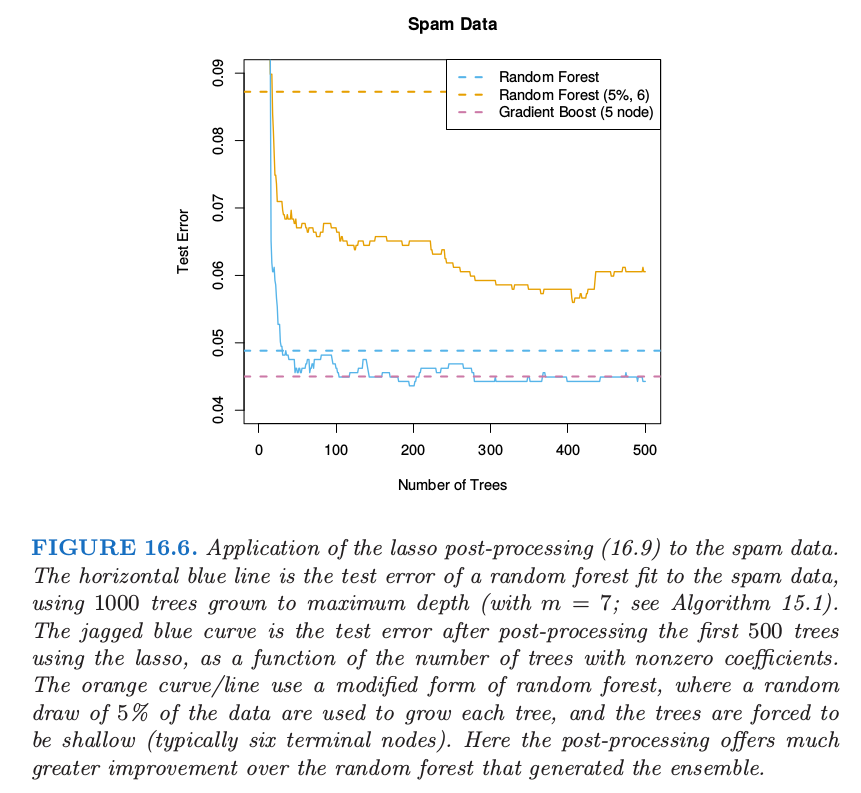

# 16.3 学习集成

| 原文   | [The Elements of Statistical Learning](../book/The Elements of Statistical Learning.pdf) |
| ---- | ---------------------------------------- |
| 翻译   | szcf-weiya                               |
| 时间   | 2017-09-25                               |

前面章节的知识可以用来产生更高效的集成模型。我们继续考虑下面形式的函数

$$
f(x)=\alpha_0+\sum\limits_{T_k\in \cal T}\alpha_kT_k(x)\qquad (16.8)
$$

其中$\cal T$是基函数的字典，一般是树。对于gradient boosting和随机森林，$\vert\cal T\vert$非常大，而且最后的模型一般会涉及上千棵树。

Friedman and Popescu (2003)提出混合的方式，它将这个过程分解为下面两步：

- 从训练集中导出有限的基函数字典集$\cal T_L=\{T_1(x), T_2(x),\ldots, T_M(x)\}$;
- 通过在字典集中拟合lasso路径来构造$f_\lambda(x)$函数族。
$$
\alpha(\lambda)=arg\;\underset{\alpha}{min}\sum\limits_{i=1}^NL[y_i, \alpha_0+\sum\limits_{m=1}^M\alpha_mT_m(x_i)]+\lambda\sum\limits_{m=1}^M\vert \alpha_m\vert\qquad (16.9)
$$

在这种简单的形式里面，将$\cal T_L$看成是由梯度boosting算法或者随机森林算法得到的树的集合，该模型可以看成是post-processing boosting或者是随机森林的某种方式。通过对这些树进行lasso路径拟合，一般我们会得到更加简化的集合，它会大大减少未来预测的计算量和存储量。在下一节，我们将讨论这种方法的变种，进而降低$\cal T_L$的相关性，并且提高lasso post processor的表现。

作为初步的说明，我们将这个过程应用到对spam数据集成的随机森林上。

图16.6 展示了lasso post-processing对随机森林（蓝色曲线）有了较大程度的改善，并且将森林降至了40棵树，而不是原来的1000棵。这个post-processed表现与gradient boosting 相当。橘黄色曲线展示了修改版的随机森林，它是为了更大程度上降低树之间的相关性。这里训练样本$5\%$的子样本（无放回）用来生成每棵树，并且每棵树限制得很低（大约6个终止结点）。这种情形下post-processing有更显著的改善，而且训练花费大概降低了100倍。然而，这个post-processed模型的表现有点比蓝色曲线差。

## 学习一个好的集成

并非所有的集成采用post-processing都表现得很好。采用基函数，我们想要一个能够覆盖所需要的空间的集合，为了实现有效性，其post-processor与其它的显著不同。

Friedman and Popescu (2003)从数字正交（numerical quadrature）和重要性采样中获得启发。他们将未知的函数看成如下的积分

$$
f(x)=\int\beta(\gamma)b(x;\lambda)d\lambda\qquad (16.10)
$$

其中$\gamma\in Gamma$标记了$b(x;\lambda)$。举个例子，如果基函数为树，则$\gamma$标记了分离变量，分离点以及终止结点里面的值。数字正交（numerical quadrature）意味着寻找$M$个赋值点$\gamma_m\in\Gamma$的集合，以及对应的权重$\alpha_m$使得$f_M(x)=\alpha_0+\sum\limits_{m=1}^M\alpha_mb(x;\gamma_m)$在$x$的定义域内近似$f(x)$。重要度采样意味着随机对$\gamma$采样，但是对于空间$\Gamma$的相关区域赋予更大的权重。Friedman and Popescu (2003)建议采用损失函数(16.9)来衡量相关性（的缺失）：

$$
Q(\lambda)=\underset{c_0,c_1}\sum\limits_{i=1}^NL(y_i, c_0+c_1b(x_i;\gamma))\qquad (16.11)
$$

上式在训练数据上取值。

如果选择了单个的基函数（比如，一棵树），则会有全局最小点$\gamma^\*=\text{arg min}_{\gamma\in \Gamma}Q(\lambda)$。在选择$\gamma$的时候引进随机性必然会得到次优值，$Q(\lambda)\ge Q(\lambda^\*)$。他们提出采样模式$\cal S$的特征长度$\sigma$的自然度量，

$$
\sigma=E_{\cal S}[Q(\lambda)-Q(\lambda^\*)]\qquad (16.12)
$$

- $\sigma$太窄意味着许多$b(x;\gamma_m)$很接近或者近似为$b(x;\gamma^\*)$；
- $\sigma$太宽意味着$b(x;\gamma_m)$过于分散，但是可能包含其他许多无关的情形。

Friedman and Popescu (2003)提出采用sub-sampling作为引入随机性的机制，得到了他们的集成生成算法16.2。

$S_m(\lambda)$指的是大小为$N\cdot \eta (\eta\in [0, 1])$的训练观测值的子样本，一般是无放回采样。 他们的模拟建议取$\eta\le 1/2$，并且对于大$N$取$\eta\in 1/\sqrt{N}$。降低$\eta$会提高随机性，也因此提高宽度$\sigma$。参数$\nu\in[0, 1]$对随机过程引入*memory*；$\nu$越大，越能避免$b(x;\gamma)$与之前找到的一致。一系列熟悉的随机化模式是算法16.2的特殊情形：

- Bagging
- Random forest
- Gradient boosting
- Stochastic gradient boosting

TODO
