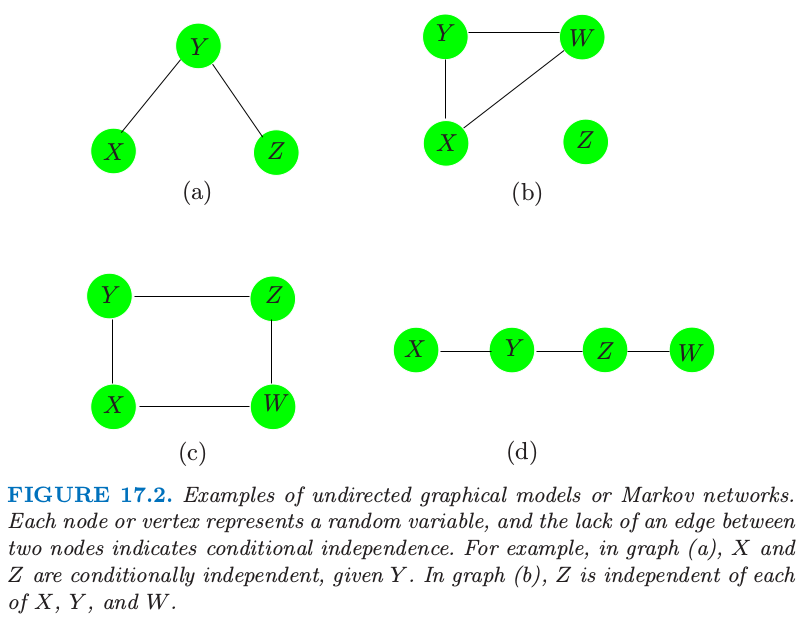
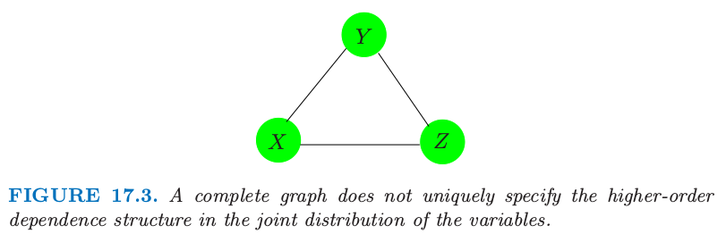

# 17.2 马尔科夫图及其性质

| 原文   | [The Elements of Statistical Learning](../book/The Elements of Statistical Learning.pdf) |
| ---- | ---------------------------------------- |
| 翻译   | szcf-weiya                               |
| 时间   | 2017-02-24:2017-02-24                    |
| 更新 |2018-06-11|
|状态|Done|

这部分我们讨论图作为随机变量集的联合分布的模型的基本性质。我们将下面两部分的讨论放在后面的章节中，其中一部分是 (a) 从数据对边的参数的估计和参量化，另一部分是 (b) 估计图的拓扑结构。

图 17.2 显示了无向图的四个例子。图 $\cal G$ 包含数据对 $(V,E)$，其中 $V$ 是顶点的集合，$E$ 为边的集合（用顶点对定义）。对于两个结点 $X$ 和 $Y$，如果存在一条边将它们连起来，则这两个结点称为 **邻接 (adjacent)**，记做 $X\sim Y$。路径 (path) $X_1,X_2,\ldots, X_n$ 是相连的顶点集，也就是 $X_{i-1}\sim X_i,i=2,\ldots,n$。**完全图 (complete graph)** 是每个顶点对都被一条边相连的图。**子图 (subgraph)** $U\in V$是顶点集及其边的子集。举个例子，图 17.2(a) 的 $(X,Y,Z)$ 形成路径但不是完全图。

> 图 17.2. 无向图模型或者马尔科夫网络的例子。每个结点或顶点表示一个随机变量，两个结点之间缺失边表示条件独立。举个例子，在图 (a) 中，在给定 $Y$ 的情况下，$X$ 和 $Z$ 是独立的。在图 (b) 中，$Z$ 与 $X,Y,W$ 中的每一个都是独立的。

假设我们有图 $\cal G$，它的顶点集合 $V$ 表示联合分布为 $P$ 的随机变量的顶点集 $V$。在马尔科夫图 $\cal G$ 中，某条边的缺失表示在给定其他结点的变量，对应的随机变量是条件独立的。这用下面的记号来表示：
$$
\text{No edge joining X and Y}\Leftrightarrow X\bot Y\mid \text{rest}\qquad (17.1)
$$
其中 “rest” 表示图中所有的其他结点。举个例子，在图 17.2 (a) 中 $X\bot Z\mid Y$。这也称作 $\cal G$ 的 **逐对马尔科夫独立 (pairwise Markov independencies)**。

如果 $A,B$ 和 $C$ 为子图，且若 $A$ 和 $B$ 的任一路径都交于 $C$ 中的结点，则称 $C$ 分离 (separate) $A$ 和 $B$。举个例子，$Y$ 分离图 17.2 (a) 和 (d) 的 $X$ 和 $Z$，并且 $Z$ 分离 (d) 中的 $Y$ 和 $W$。图 17.2 (b) 的 $Z$ 与 $X,Y,W$ 不相连，则我们称这两个集合被空集分离。在图 17.2 (c) 中，$C=\{X,Z\}$ 分离 $Y$ 和 $W$。

分离集有良好的性质，它们将图分解成条件独立的部分。特别地，在含有 $A,B$ 和 $C$ 子图的图 $\cal G$，
$$
\text{if C separates A and B then }A\bot B\mid C\qquad (17.2)
$$
这称作 $\cal G$ 的 **全局马尔科夫性质 (global Markov properties)**。事实上，图的 **逐对马尔科夫性质 (pairwise Markov properties)** 和 **整体马尔科夫性质 (global Markov properties)** 是等价的（对于有正分布的图）。也就是，**相关概率分布 (associated probability distribution)** 满足逐对马尔科夫独立性和全局马尔科夫假设的图的集合是相同的。这个结果对于从简单成对性质中推断整体独立关系是很有用的。举个例子在图 17.2 (d) 中 $X\bot Z\mid\\{Y,W\\}$，因为这是一个马尔科夫图，且 $X$ 和 $Z$ 之间没有连接。但是$Y$ 也将 $X$ 从 $Z$ 和 $W$ 中分离，因此由整体马尔科夫假设我们得出 $X\bot Z\mid Y$ 和 $X\bot W\mid Y$。类似地，我们有 $Y\bot W\mid Z$。

!!! note "weiya注"
		pairwise markov properties: 寻找缺失边，在给定其他结点的情况下，缺失边的两个顶点相互独立；

		global markov properties: 寻找分离集，在给定分离集的情况下，被分离的子图相互独立。

全局马尔科夫性质允许我们将图分解成更小的易控制的片段，因此在计算和解释性上有本质上的简化。基于这个目的，我们将图分解成 **团 (clique)**。团是一个完全子图——所有顶点都与其他点邻接的顶点集；如果一个团，没有其他顶点可以加进去仍保持是一个团的称为最大团。图 17.2 的最大团为

- (a) {X,Y},{Y,Z}
- (b) {X,Y,W},{Z}
- (c) {X,Y},{Y,Z},{Z,W},{X,W}
- (d) {X,Y},{Y,Z},{Z,W}

尽管接下来应用到连续和离散的分布，但是大部分的发展是针对后者的。马尔科夫图 $\cal G$ 上的概率密度函数 $f$ 可以表示成
$$
f(x)=\frac{1}{Z}\prod\limits_{C\in\cal C}\psi_C(x_C)\qquad (17.3)
$$

其中 $\cal C$ 为最大团的集合，并且正函数 $\psi_C(\cdot)$ 称为 **团势 (clique potentials)**。这些不是一般的密度函数，

!!! note "作者注："
	如果团是分离的，则势可以是密度，但一般不是这种情形。

而是表示 $X_C$ 中依赖性的 **亲和力 (affinities)**，这通过给特定的实例 $x_C$ 打更高的分实现。下值

$$
Z=\sum\limits_{x\in \cal X}\prod\limits_{C\in \cal C}\psi_C(x_C)\qquad (17.4)
$$

是标准化常数，也称作 **分割 (partition)** 函数。另外，式 (17.3) 表明图的独立性由乘积中的团定义。这个结果对于有着正分布的马尔科夫网络 $\cal G$ 成立，也称作 Hammersley-Cliffodinyrd 定理（Hammersley and Clifford, 1971[^1]; Clifford, 1990[^2]）。

!!! note "weiya 注"
	给出取值为 $x_i$ 的随机变量 $X_i$ 的集合，**势函数 (potential function)** 为 $H(x_1,x_2,\ldots)$，**分割函数 (partition function)** 定义如下
	$$
	Z(\beta)=\sum\limits_{x_i}exp(-\beta H(x_1,x_2,\ldots))
	$$

很多图的估计和计算的方法首先将图分解成最大团。相关的量在单个团中进行计算，接着在整个图上进行累加。一个突出的例子是根据联合分布计算边缘和低阶概率的 join tree（或 junction tree）算法。可以在 Pearl (1986)[^3]，Lauritzen and Spiegelhalter (1988)[^4]，Pearl (1988)[^5]，Shenoy and Shafer (1988)[^6]，Jensen et al. (1990)[^7]，或者 Koller and Friedman (2007)[^8] 中找到具体细节。

图模型不总是唯一确定联合概率分布的高阶依赖结构。考虑图17.3的3结点完全图。它可以表示下面任一分布的依赖性结构
$$
\begin{align}
f^{(2)}(x,y,z)&=\frac{1}{Z}\psi(x,y)\psi(x,z)\psi(y,z)\\
f^{(3)}(x,y,z)&=\frac{1}{Z}\psi(x,y,z)
\end{align}
\qquad (17.5)
$$
第一个仅仅明确了二阶依赖性（并且可以用更少的参数表示）。离散数据的图模型是 loglinear models for multiway contingency tables 的一种特殊情形（如，Bishop et al., 1975[^9]）；这种情形下 $f^{(2)}$ 被称作“无二阶交叉”模型。

> 图 17.3. 没有唯一地指定变量的联合分布中的高阶依赖性结构的完全图。

本章的剩余部分我们关注 **成对马尔科夫图 (pairwise Markov graphs)** (Koller and Friedman, 2007[^8])。

对于每条边都有势能函数（如上面 $f^{(2)}$ 的成对变量），且用至多二阶的交叉项来表示。这些在参数上是很简洁的，更容易处理，并且给出由图结构表示的最小复杂性。连续和离散数据的模型都仅仅是成对边缘分布的函数，分布是指在边集合中表示的变量的成对边缘分布。

[^1]: Hammersley, J. M. and Clifford, P. (1971). Markov field on finite graphs and lattices, unpublished.
[^2]: Clifford, P. (1990). Markov random fields in statistics, in G. R. Grimmett and D. J. A. Welsh (eds), Disorder in Physical Systems. A Volume in Honour of John M. Hammersley, Clarendon Press, Oxford, pp. 19–32.
[^3]: Pearl, J. (1986). On evidential reasoning in a hierarchy of hypotheses, Artificial Intelligence 28: 9–15.
[^4]: Lauritzen, S. and Spiegelhalter, D. (1988). Local computations with proba- bilities on graphical structures and their application to expert systems, J. Royal Statistical Society B. 50: 157–224.
[^5]: Pearl, J. (1988). Probabilistic reasoning in intelligent systems: networks of plausible inference, Morgan Kaufmann, San Francisco, CA.
[^6]: Shenoy, P. and Shafer, G. (1988). An axiomatic framework for Bayesian and belief-function propagation, AAAI Workshop on Uncertainty in AI, North-Holland, pp. 307–314.
[^7]: Jensen, F. V., Lauritzen, S. and Olesen, K. G. (1990). Bayesian updating in recursive graphical models by local computation, Computational Statistics Quarterly 4: 269–282.
[^8]: Koller, D. and Friedman, N. (2007). Structured Probabilistic Models, Stan- ford Bookstore Custom Publishing. (Unpublished Draft).
[^9]: Bishop, Y., Fienberg, S. and Holland, P. (1975). Discrete Multivariate Analysis, MIT Press, Cambridge, MA. [下载](../references/Discrete-Multivariate-Analysis.pdf)