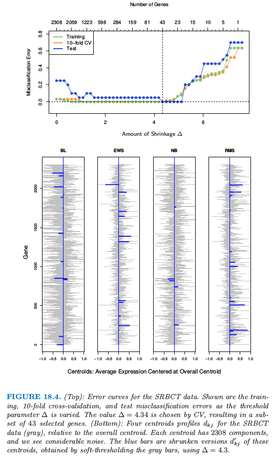

# 对角线性判别分析和最近的收缩重心

| 原文   | [The Elements of Statistical Learning](../book/The Elements of Statistical Learning.pdf) |
| ---- | ---------------------------------------- |
| 翻译   | szcf-weiya                               |
| 时间   | 2017-03-14:2017-03-14                    |

基因表达阵列是生物中一项重要的新的技术，并且在第1章和第14章有讨论。我们下一个例子的数据构造了2308个基因（列）和63个样本（行）的矩阵，从一系列微阵列实验中得到。每个表达值是对数比率$log(R/G)$。 $R$为目标样本中基因特异性RNA的数目，目标样本混合到微阵列上特定（基因特异性）的位点，而$G$是参考样本中对应的RNA数目。从在孩子上发现的小、圆蓝色细胞肿瘤(SRBCT)得到样本，并且分成4个主要的类别：BL (Burkitt lymphoma), EWS (Ewing’s sarcoma), NB (neuroblastoma), 和RMS (rhabdomyosarcoma)。另外有包含20个观测的额外数据集。我们将不再讨论其背景。

因为$p>>N$，我们不可以对数据采用全线性判别分析(LDA)；需要一些种类的正则化。我们这里描述的方法类似在第4.3.1节中描述的方法，但是为了达到特征选择有更重要的改动。正则的最简单的形式假设特征在每一类中独立，也就是，类间协方差阵是对角阵。尽管事实上特征很少在一个类别中独立，当$p>>N$时，我们没有充足的数据来估计它们的依赖性。独立性的假设很大成都上降低了模型中参数的个数，并且经常导出更有效和更有解释性的分类器。

因此我们考虑对角协方差LDA准则来对类别分类。类别$k$的判别得分[p110的式(4.12)]是
$$
\delta_k(x^*)=-\sum\limits_{j=1}^p\frac{(x_j^*-\bar x_{kj})^2}{s_j^2}+2log\pi_k\qquad (18.2)
$$

这里$x*=(x_1^*,x_2^*,\ldots,x_p^*)^T$是测试观测的表达值的向量，$s_j$为第$j$个基因的混合类间标准误差，并且$\bar x_{kj}=\sum_{i\in C_k}x_{ij}/N_k$是类别$k$中基因$j$的 $N_k$的值的平均，其中$C_k$是类别$k$的索引集。我们称$\tilde x_k=(\bar x_{k1},\bar x_{k2},\ldots,\bar x_{kp})^T$为类别$k$的重心。(18.2)的第一部分是$x^*$到第$k$个类别重心的（负）标准平方距离。第二部分是基于类别先验概率$\pi_k$的矫正，其中$\sum_{k=1}^K\pi_k=1$。分类规则于是为

$$
C(x^*)=\ell\text{ if } \delta_{\ell}(x^*)=max_k\delta_k(x^*)\qquad (18.3)
$$

我们看到对角LDA分类器经过合适的标准化后等价于最近重心分类器。这也是朴素贝叶斯分类器的一个特殊情形，正如在第6.6.3节中描述的那样。假设每个类别的特征有相同方差的独立高斯分布。

对角LDA分类器通常在高维设定中很有效。在Bickel和Levina(2004)等人的工作中称为独立规则，理论上证明经常在高维问题中比标准线性回归表现要好。这里对角LDA分类器对20个测试样本产生5个误分类误差率。这种对角LDA分类器的缺点是使用所有的特征 （基因），因此对于解释不是很方便的。进一步正则化，我们可以做得更好——不管是关于测试误差和解释性。

我们想以某种自动删除对类别预测不再起作用的方式来正则化。我们可以在整个均值上收缩每个类的均值，这对每个特征进行分别处理。这个结果是最近重心分类器的正则化版本，或者等价为对角协方差形式的LDA的正则化版本。我们称这个过程为最近收缩重心(NSC)。

收缩过程按如下定义。令
$$
d_{kj}=\frac{\bar x_{kj}-\bar x_j}{m_k(s_j+s_0)}\qquad (18.4)
$$

其中$\bar x_j$是基因$j$的整体均值，$m_k^2=1/N_k-1/N$，且$s_0$是一个小的正值，一般取为$s_j$的中值。这个常值防止$d_{kj}$太大，这个值从接近0的表达式中得到。常值类间方差$\sigma^2$，则分子中差$\bar x_{kj}-\bar x_j$的方差为$m_k^2\sigma^2$，因此便有了如分母中的标准化。如图，我们采用软阈值将$d_{kj}$收缩到0
$$
d_{kj}'=sign(d_{kj})(\vert d_{kj}\vert-\Delta)_+\qquad (18.5)
$$

这里$\Delta$是需要确定的参数；我们在例子中采取10折交叉验证（见图18.4的上图）。每个$d_{kj}$减少$\Delta$的绝对值的量，比起如果值小于0则设为0。图18.2显示了软阈值函数；同样的阈值用在第5.9节的小波系数中。另一种方式是采用硬阈值
$$
d_{kj}'=d_{kj}\cdot I(\vert d_{kj}\vert\ge \Delta)\qquad (18.6)
$$

> 软阈值函数$sign(x)(\vert x\vert-\Delta)_+$用橘黄色显示，并且图中也画出了$45^o$的直线。

我们倾向于软阈值，因为这是一个更光滑的处理并且一般表现得更好。$\bar x_{kj}$的收缩版本接着通过反解(18.4)的转换得到

$$
\bar x_{kj}'=\bar x_j'+m_k(s_j+s_0)d_{kj}'\qquad (18.7)
$$

我们用收缩重心$\bar x_{kj}'$代替判别得分（18.2）的原始$x_{kj}$。估计（18.7）可以认为是类别均值的lasso风格（练习18.2）。

注意到只有对于至少一个类有一个非零$d'_{kj}$的基因在分类规则中起作用，因此大量的主要基因经常被丢弃。这个例子中，除了43个基因其他的都被丢弃了，剩下了表征一个小的可解释的基因的集。图8.13在热图中表示出这些基因。

图18.4（上图）演示了收缩的影响。没有收缩时我们在测试数据上有5/20的误差，并且在训练和CV数据上有一些误差。当$\Delta$在相当宽的区域中，收缩重心达到零测试误差。图18.4的下图显示了SRBCT数据（灰色）的四个重心，这是相对整体重心来说。蓝色条状是这些重心的收缩版本，通过取$\Delta=4.3$对灰色条状进行软阈值得到的。判别分数(18.2)可以用来构造类别概率估计：
$$
\hat p_k(x^*)=\frac{e^{\frac{1}{2}\delta_k(x^*)}}{\sum_{\ell=1}^Ke^{\frac{1}{2}\delta_\ell(x^*)}}\qquad (18.8)
$$
这些可以用来对类别排序，或者决定不需要对整个样本分类。

> 图18.4. （上）：SRBCT数据的误差曲线。图中显示了训练，10折交叉验证和测试误分类率随着阈值参数$\Delta$变化的曲线。通过CV选择的值$\Delta=4.34$，得到43个所选基因的一个子集。（下）：SRBCT数据（灰色）的四个重心轨迹$d_{kj}$，这是相对于整体重心来说。每个重心有2308个组分，并且我们看到相当大的噪声。蓝色的条状是这些重心的收缩版本$d_{kj}'$，这是通过对灰色的条状软阈值得到的，采用$\Delta=4.3$。

注意到特征选择的其它形式可以用在这种设定中，包括硬阈值。Fan和Fan（2008）理论上证明了高维问题中对角线性判别分析的特征选择。
